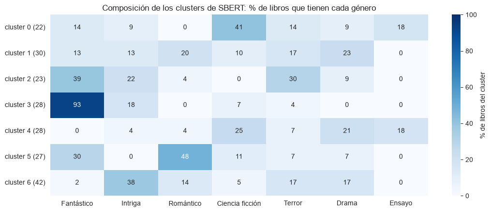

# TP2 — Embeddings y búsqueda semántica

**Procesamiento de Lenguaje Natural · TUIA · UNR** · Josías Calabozo · Sharo Giuntoli · Ismael Darruiz · Sebastián Di Carlo

> **Borrador del 2026-10-04.** Antes de entregar: revisar `queries.json` y el párrafo de uso de IA, y pasar a PDF (máximo 3 páginas).

## 1. Qué hicimos

Representamos las sinopsis de los 200 libros del TP1 ("Los más comentados" de Lectulandia) con cinco modelos y medimos cuál recupera mejor los libros relevantes para consultas en lenguaje natural:

| Modelo | Tipo | Entrada |
|---|---|---|
| TF-IDF | Línea de base léxica | Texto limpio (minúsculas, sin puntuación ni stopwords) |
| Word2Vec propio | Promedio de vectores de palabra, entrenado con el corpus | Texto limpio |
| SBW (`SBW-vectors-300-min5`) | Promedio de vectores de palabra pre-entrenados | Texto limpio, conservando mayúsculas |
| SBERT (`distiluse-base-multilingual-cased-v1`) | Modelo de oración | Texto crudo |
| E5 (`multilingual-e5-small`) | Modelo de oración, entrenado para búsqueda | Texto crudo, con prefijos `query:` y `passage:` |

**Evaluación:** 13 consultas con sus libros relevantes (`queries.json`), escritas leyendo las sinopsis **antes** de correr cualquier ranking. Son de tres tipos: de trama, temáticas y sin palabras en común con sus libros relevantes (una de estas, en inglés). Medimos **precision@5** contra el piso de azar, que en cada consulta es `relevantes / 200`.

## 2. Resultados

| | Azar | TF-IDF | W2V propio | SBW | SBERT | E5 |
|---|---|---|---|---|---|---|
| **Promedio (13 consultas)** | 0,027 | 0,385 | 0,277 | 0,338 | **0,400** | **0,400** |
| De trama (5) | 0,02 | **0,40** | 0,32 | 0,24 | 0,36 | 0,36 |
| Temáticas (5) | 0,04 | **0,60** | 0,40 | 0,48 | 0,44 | **0,60** |
| Sin palabras en común (3) | 0,02 | 0,00 | 0,00 | 0,27 | **0,40** | 0,13 |

## 3. ¿Cuánto mejor que TF-IDF? ¿Dónde gana y dónde no?

**En promedio, los modelos de oración empatan con TF-IDF.** La diferencia (0,400 contra 0,385) equivale a un solo libro acertado en 65 posiciones evaluadas. Consulta por consulta, SBERT y E5 le ganan a TF-IDF en 5, empatan en 4 y pierden en 4.

**La diferencia está en el tipo de consulta:**

- **Sin palabras en común, ganan los modelos semánticos.** TF-IDF saca 0 por construcción: si ninguna palabra coincide, el coseno es 0 con todos los libros. SBERT llega a 0,40. Con la consulta en inglés, *"a creepy mansion haunted by ghosts"*, SBERT encuentra *El misterio de Salem's Lot* y *El cuento número trece*: el modelo multilingüe ubica la consulta cerca de sinopsis en español que dicen lo mismo.
- **Cuando la consulta comparte vocabulario con sus libros, TF-IDF es muy fuerte.** En "una historia de amor prohibido o imposible" saca 1,0, porque varias sinopsis dicen literalmente "amor prohibido".
- **TF-IDF gana también con nombres propios y palabras raras.** Encontró en el puesto 1 la otra edición de cada uno de los cinco libros repetidos del corpus, aunque las dos sinopsis de *1984* casi no comparten texto: le alcanzó con *Winston*, *Smith* y *Partido*.

## 4. Qué mide y qué no mide precision@5

- **Mide** si los primeros cinco resultados son relevantes, que es lo que ve un usuario.
- **No mide el orden** dentro de esos cinco.
- **No mide los relevantes que quedan afuera (recall).** Con 9 relevantes, un modelo puede sacar 1,0 aunque deje 4 sin encontrar.
- **Su máximo depende de cuántos relevantes tiene la consulta:** con 2, no puede superar 0,4.
- **Con 13 consultas es muy sensible:** cada acierto mueve el promedio 0,015, así que las diferencias de pocos centésimos entre modelos son ruido.
- **Los juicios de relevancia son nuestros** y tienen casos límite. En "una pandemia diezma a la población mundial", SBERT y E5 ponen primero *Cadáver exquisito*, que excluimos porque el virus ataca a los animales y no a las personas. No cambiamos ese criterio después de ver los resultados.
- **El piso de azar es lo que da sentido a los números:** 0,40 es 15 veces el azar. Si una consulta tuviera la mitad del corpus como relevante, el mismo 0,40 apenas lo superaría.

## 5. Un caso donde la búsqueda falló

**Consulta:** "novelas sobre el amor por los libros y la lectura" (7 relevantes, como *La sombra del viento* y *La ladrona de libros*).

- **Resultado:** SBERT y E5 devuelven **solo novelas románticas** (*Como agua para chocolate*, *Yo antes de ti*, *After*). Su primer relevante aparece en el puesto 6 y en el 8. TF-IDF, en cambio, acierta 2 gracias a "libros".
- **Hipótesis:** el modelo de oración representa la consulta completa, y su significado dominante es "amor". En "el amor por los libros" el amor no es romántico, pero el corpus tiene muchas novelas románticas y esa región del espacio gana. Además, en las sinopsis relevantes el tema de los libros aparece mezclado con intriga e historia, y no domina el embedding.
- **Qué haríamos:** reformular sin la palabra ambigua ("novelas sobre bibliotecas, librerías y lectores") o combinar el ranking léxico con el semántico.

**Otro caso, en el que fallan todos:** "un crimen misterioso en un lugar aislado del que nadie puede salir". E5 devuelve historias de encierro (*El instituto*, *Maze Runner*). Las sinopsis relevantes nunca dicen "aislado": dicen "el tren" detenido por la nieve, "un islote" o "una abadía", y la relación con el aislamiento la hace el lector.

## 6. ¿Qué modelo elegiríamos para producción?

**E5 (`multilingual-e5-small`), combinado con TF-IDF.**

- **Rendimiento:** empata con SBERT en el promedio, y **casi no trunca**: su límite de 512 tokens corta 3 sinopsis, contra 178 de 200 (89 %) en `distiluse`. Con sinopsis más largas, esa diferencia pesaría más.
- **Costo:** corre en CPU, es chico (384 dimensiones) y los 200 embeddings se calculan en menos de un minuto. No hay costo por consulta.
- **Privacidad y dependencia de terceros:** se ejecuta localmente. Las consultas no salen a un servicio externo, y el modelo se descarga una sola vez y se puede guardar con el proyecto.
- **Reproducibilidad:** los pesos son abiertos y fijos. Con la misma versión, los vectores son siempre los mismos, a diferencia de una API que puede cambiar el modelo sin aviso.
- **Por qué combinarlo con TF-IDF:** los dos fallan en casos distintos. TF-IDF resuelve nombres propios y vocabulario literal, y E5 las paráfrasis. Por eso conviene combinar los dos rankings (búsqueda híbrida).

Descartamos los promedios de palabras. El **Word2Vec propio** no aprende significado con 200 sinopsis: los vecinos de "guerra" son *kaladin* o *radiantes*, palabras de un solo libro. Con **SBW**, todo se parece a todo: dos libros al azar tienen una similitud de 0,87 ± 0,04.

## 7. Parte avanzada: clustering

**Pregunta:** ¿el espacio de embeddings reconstruye la taxonomía de géneros sin haberla visto?

**Método:** K-Means con K = 7 sobre los vectores de cada modelo. Como el problema es multi-etiqueta, comparamos contra un **género de referencia** por libro: el más frecuente del corpus entre los suyos, sin contar "Novela". La comparación se hace sobre los 168 libros de los 7 géneros de referencia que tienen al menos 8 libros. Medimos ARI y V-measure, y el piso con clusters asignados al azar.

| | Azar | TF-IDF | W2V propio | SBW | SBERT | E5 |
|---|---|---|---|---|---|---|
| ARI | 0,001 | 0,036 | 0,063 | 0,065 | **0,200** | 0,172 |
| V-measure | 0,063 | 0,114 | 0,167 | 0,195 | **0,299** | 0,267 |
| Pares de una misma saga en el mismo cluster | 15–19 % | 54 % | 89 % | 83 % | 57 % | 77 % |

- **Los modelos de oración reconstruyen mejor los géneros, pero ninguno lo logra.** Un ARI de 0,20 es una coincidencia apenas parcial.
- **Solo un cluster coincide con un género** (figura 1): el de fantasía épica, con 93 % de Fantástico (*Juego de tronos*, *El último deseo*, *La comunidad del anillo*). En los demás, el género más frecuente no llega al 50 %: Romántico 48 %, Ciencia ficción 41 %, Intriga 38 %.
- **Los clusters agrupan por tema más que por etiqueta.** Uno junta ensayos políticos con distopías y dramas históricos, porque comparten temas como el poder, el Estado y la violencia.
- **Los promedios de palabras agrupan por saga:** comparten nombres propios y vocabulario (*Feyre*, *Katniss*, *alomancia*). SBERT agrupa más por género. Para un recomendador de "más libros como este", con SBW o con el Word2Vec propio el resultado sería casi siempre la misma saga.
- **La multi-etiqueta penaliza a un clustering duro.** K-Means asigna un solo grupo por libro, y la etiqueta de referencia también elige un solo género. Un libro fantástico y romántico que cae en el cluster de romance cuenta como error, aunque el agrupamiento tenga sentido. Además, con otra regla para elegir el género de referencia, los números cambiarían.

*Figura 1. Composición de los clusters de SBERT: porcentaje de los libros de cada cluster que tiene cada género de referencia. Un libro suma en todos sus géneros.*

## 8. Otros hallazgos

- **Truncado silencioso:** `distiluse` no avisa que corta el texto. Hay que tokenizar cada sinopsis para saberlo, y en las truncadas no ve, en promedio, el 39 % final.
- **El corpus de entrenamiento se nota:** en SBW, los vecinos de "familia" son familias biológicas (*Bochicidae*, *Eburia*), por los textos de especies con que se entrenó.
- **Espacios concentrados:** con E5, dos libros cualesquiera tienen una similitud de entre 0,75 y 0,89. El orden relativo sirve, pero el valor absoluto no se puede usar como umbral de relevancia.
- **Los géneros vienen en orden alfabético** en el corpus: "el primer género" no es el principal, y no lo usamos como etiqueta.

## 9. Limitaciones

- **Pocas consultas:** 13 consultas dan una evaluación ruidosa. Más consultas, y juicios de relevancia hechos por más de una persona, harían las comparaciones más confiables.

## 10. Uso de asistentes de IA

> ⚠️ **Para que el grupo lo revise y lo complete antes de entregar.**

Usamos un asistente de IA para armar el código del notebook, redactar un primer borrador de `queries.json` (decidiendo la relevancia a partir de la lectura de las sinopsis y antes de correr los rankings) y redactar un primer borrador de las interpretaciones y de este informe. El grupo revisó las consultas, los juicios de relevancia, los resultados y las conclusiones, y es responsable de su contenido.
