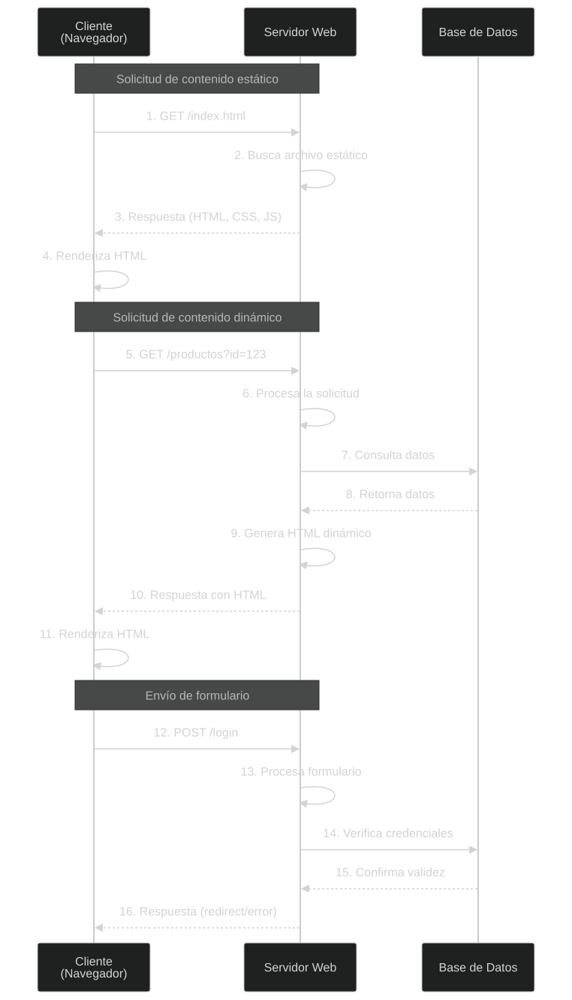

# Resumen · Unidad 1: Extracción y Procesamiento de Texto

> **Fuentes:** apunte de la cátedra (Notion), consigna de la práctica de scraping (Lectulandia) y enunciado del TP2.
> **Cómo usarlo:** leé primero el mapa (§0) y las ideas fuerza de cada sección. Las tablas son para repasar rápido. Antes del parcial, recorré las **trampas** (§6) y las **preguntas de desarrollo** (§7).

---

## 0. Mapa de la unidad

```
 FUENTE              EXTRACCIÓN            PARSEO               LIMPIEZA Y              TOKENIZACIÓN        ANALÍTICA
 PDF, HTML,   ──►    texto plano    ──►    texto → datos  ──►   NORMALIZACIÓN     ──►   oraciones,    ──►   frecuencias,
 audio, imagen,      (o Markdown)          estructurados        minúsculas, acentos,    palabras,           n-gramas,
 DOCX, BD, web                                                  stopwords, ortografía   subpalabras         co-ocurrencia
                                                                        │
                                                                        └──► SEGMENTACIÓN (chunking) ──► Unidad 2: vectores
```

**Idea fuerza de toda la unidad:** cada paso es una **decisión con costo**. Se gana homogeneidad y se pierde información. No hay un preprocesamiento «correcto» universal: **decide la tarea** (y, como se ve en la Unidad 2, **el modelo**).

---

## 1. Extracción de texto

### 1.1 Qué es y qué no es

| | Extracción de **texto** | Extracción de **información** |
|---|---|---|
| Qué hace | Recupera y aísla **texto plano** de un contenedor | Obtiene **entidades, relaciones o eventos** estructurados |
| Entrada | PDF, HTML, audio, imágenes escaneadas… | Un texto **ya extraído** |
| Orden | Primero | Después |

Fuentes típicas: documentos (Word, PDF, TXT, RTF), páginas web, redes sociales (vía APIs con credenciales), correo, bases de datos, transcripciones de audio o video, y literatura digitalizada (PDF, EPUB, MOBI).

### 1.2 Codificación de caracteres

- **UTF-8** es de **longitud variable**: ASCII ocupa 1 byte, y el resto (tildes, ñ, ¿) ocupa 2 o más. Es la codificación por defecto en Python 3.
- **ISO-8859-1** (Latin-1) usa **1 byte fijo** por carácter y **sí** incluye las vocales acentuadas.
- Ejemplo del apunte, «¿Cómo estás?» (12 caracteres):

| Carácter | UTF-8 | ISO-8859-1 |
|---|---|---|
| ¿ | C2 BF (2 bytes) | BF (1 byte) |
| ó | C3 B3 (2 bytes) | F3 (1 byte) |
| á | C3 A1 (2 bytes) | E1 (1 byte) |
| **Total** | **15 bytes** | **12 bytes** |

- Abrir un archivo con la codificación equivocada da caracteres raros o un **`UnicodeDecodeError`**. Se corrige indicándola: `open(..., encoding='iso-8859-1')`.

> 📝 `latin-1` e `iso-8859-1` son **el mismo** encoding con dos nombres.

### 1.3 Formatos y herramientas

| Formato | Qué hay que saber | Herramientas |
|---|---|---|
| **TXT** | Texto sin formato; lo único que importa es la codificación | `open()` + `encoding` |
| **HTML** | Etiquetas (`<p>`, `<h1>`…`<h6>`, `<strong>`, `<em>`, `<pre>`, `<blockquote>`…); el texto suele estar en `<body>` | **BeautifulSoup** + **lxml**. Quitar todas las etiquetas también borra los cortes de `<p>` y `<br>` |
| **Markdown** | Texto con sintaxis de formato; es el estándar de GitHub | `markdown` o `mistune` (Markdown → HTML); `html2text` (HTML → texto plano) |
| **PDF digital** | Tiene capa de texto | **PyPDF2 / pypdf** (pypdf es el sucesor moderno), **pdfplumber** (tablas y estructura), **PyMuPDF** (muy rápido). Metadatos con `PdfReader` |
| **PDF escaneado** | Cada página es una **imagen**: no hay texto | **pdf2image** (requiere `poppler-utils`) → OCR |
| **Imagen** (JPG, PNG, BMP…) | Hace falta OCR | **pytesseract** (wrapper de Tesseract, junto con Pillow); **EasyOCR** si además se necesitan las **coordenadas** |
| **DOCX** | Formato basado en XML (Word 2007 en adelante) | **python-docx** |
| **Audio** | Reconocimiento del habla | **SpeechRecognition** (usa el servicio de Google); **Whisper** |
| **Video** | Primero hay que extraer la pista de audio | **ffmpeg**; **youtube-transcript-api** para transcripciones de YouTube |
| **Wikipedia** | Artículos por título e idioma | **wikipedia-api** |
| **Bases de datos** | SQL | **sqlite3** (incluida en Python), **psycopg2** (PostgreSQL), **PyMySQL** (MySQL), **SQLAlchemy** (ORM, varios motores) |
| **Tabulares** | Excel, CSV, Parquet | **pandas** |
| **JSON** | Local o desde una URL | **json** (+ **requests** para bajarlo) |

**Estructura de un PDF** (pregunta clásica de memoria):

1. **Cabecera**: la versión, por ejemplo `%PDF-1.7`.
2. **Cuerpo**: los objetos numerados (texto, imágenes, gráficos), organizados en árbol. El **catálogo** es la raíz, y de él cuelgan los objetos de página y los objetos de contenido (las instrucciones de dibujo).
3. **Tabla de referencias cruzadas** (*xref*): dónde está cada objeto, para acceder sin leer todo el archivo.
4. **Trailer**: dónde está la xref y cuál es el objeto raíz.
5. **EOF**: `%%EOF`.


**OCR:** nunca es 100 % preciso. Se mejora preprocesando la imagen (binarización, suavizado, eliminación de ruido) o entrenando con un conjunto de caracteres propio.

**Whisper:** es un **Transformer secuencia a secuencia multitarea**, entrenado con audios grandes y diversos. Hace reconocimiento multilingüe, traducción de voz, identificación del idioma y detección de actividad de voz. Las tareas se indican con **tokens especiales**, así que un solo modelo reemplaza varias etapas de un pipeline clásico.

### 1.4 Conversores de documentos: de extraer texto a reconstruir estructura

**Por qué existen:** un PDF **no guarda párrafos, guarda instrucciones de dibujo** («esta letra en esta coordenada»). `.extract_text()` pierde columnas, tablas y títulos. Un pipeline de NLP, y sobre todo uno para un LLM o un RAG, necesita la **estructura** (títulos, listas, tablas, orden de lectura). Por eso el formato intermedio típico de la ingestión es **Markdown**.

| Herramienta | Rol | Cuándo | Qué implica |
|---|---|---|---|
| **MarkItDown** (Microsoft) | Wrapper liviano a Markdown | Muchos formatos, prototipos, scripts | Instalación chica; para un OCR decente pide un LLM o Azure |
| **Docling** | Parser estructurado local | Tablas, orden de lectura, exportar a Markdown o JSON, sin nube | Más pesado (descarga modelos); corre en CPU |
| **Marker** | Calidad en PDF difíciles | Multicolumna, fórmulas, escaneos, papers | Casi necesita GPU; los pesos del modelo tienen licencia restrictiva |
| **MinerU** | Documentos complejos | Escaneos, fórmulas a LaTeX, tablas a HTML | Pesado; el backend `pipeline` corre en CPU y el modo VLM pide GPU |

> 🎯 **Criterio en una frase:** MarkItDown para entrar; Docling para estructura local; MinerU para papers y escaneos; Marker cuando la calidad del PDF importa y hay GPU.
>
> ⚠️ No son intercambiables, y **convertir a Markdown no elimina la necesidad de limpiar y segmentar**.

### 1.5 Web scraping

**Definición:** extraer información de sitios web, convirtiendo HTML en un formato estructurado (CSV, JSON, XML).

**Flujo cliente-servidor:**

- **Contenido estático:** el servidor devuelve un archivo que ya existe.
- **Contenido dinámico:** el servidor consulta una base de datos y genera el HTML.
- **Formularios:** el cliente envía datos por **POST**, y el servidor los valida y responde con una redirección o un error.



| Herramienta | Qué hace | Ejecuta JavaScript |
|---|---|---|
| **requests** | Hace pedidos HTTP y baja el HTML inicial | ❌ |
| **BeautifulSoup** | **Parsea** HTML (`find_all`, selectores CSS con `select`) | ❌ (no hace pedidos) |
| **Scrapy** | Framework de crawling | ❌ |
| **Selenium / Playwright** | Automatizan un **navegador real** | ✅ |
| **mechanize** | Navegación programática con formularios (el apunte la menciona para logins) | ❌ |

**Login con `requests`:** un objeto **`Session`** conserva las **cookies** entre pedidos (el ID de sesión). Así, después del POST de login, el GET a la página protegida sale autenticado. Algunos sitios piden además tokens **CSRF** o cabeceras especiales, y si el login usa JavaScript hace falta Playwright o Selenium.

**Ética y legalidad:** respetar los **términos de servicio** y el archivo **`robots.txt`**. Es una actividad legalmente «gris» en algunas jurisdicciones, y los sitios pueden bloquear o limitar a los scrapers.

**Práctica de Lectulandia (TP1):**

- **Playwright navega** (Chromium, puede correr sin ventana): abre la categoría, pagina y visita cada ficha. **BeautifulSoup interpreta** el HTML que Playwright le entrega.
- Pasos: abrir la categoría → recorrer las páginas → obtener el HTML → analizarlo con BeautifulSoup → extraer las URL de las fichas → visitar cada ficha → extraer metadatos y sinopsis → limpiar y validar → **eliminar duplicados** → guardar el CSV.
- Requisitos: pausa entre páginas, manejo de errores sin cortar la ejecución, guardado **incremental**, sin duplicados (por `url_libro`) y campos ausentes representados siempre igual. **Prohibido descargar los libros**: solo metadatos y sinopsis públicas.

### 1.6 Parseo de texto

**Definición:** analizar una cadena para **extraer, interpretar o estructurar** su contenido según reglas, patrones o gramáticas. Pasa de datos no estructurados a listas, diccionarios, objetos o tablas.

- **Entrada:** logs, CSV, JSON, XML, respuestas de APIs, lo que escribe un usuario.
- **Proceso:** delimitadores, expresiones regulares o estructuras sintácticas.
- **Salida:** tokens, números, fechas, árboles de sintaxis.
- **Usos:** validar formatos, extraer datos, convertir entre formatos, analizar sintaxis.

| Herramienta | Cuándo |
|---|---|
| `split()` | Formato fijo y predecible. **Frágil** si el formato cambia |
| `re` | Patrones flexibles: emails, teléfonos, fechas |
| **`parse`** | «`format()` al revés»: `parse("{:d}-{:d}-{:d} {:d}:{:d}", "07-23-2023 16:30")` |
| BeautifulSoup | HTML |

> 💡 **Parsear es decidir qué es mensaje y qué es ruido**, sin borrar las señales expresivas (mayúsculas sostenidas, repeticiones, signos enfáticos, emojis). Si una parte del corpus llega «sucia» o con señales borradas, las conclusiones se sesgan.

---

## 2. Procesamiento de texto

### 2.1 Limpieza y normalización

| Técnica | Qué hace | Cómo | ⚠️ Qué se pierde / cuándo no |
|---|---|---|---|
| **Minúsculas** | Unifica «Casa» y «casa» | `lower()`; `casefold()` para comparar | Entidades con nombre (`Madrid` y `madrid`) |
| **Puntuación** | Reduce el tamaño de los datos | Regex `[^\w\s]` | Los límites de oración. Los LLM trabajan con el texto completo |
| **Acentos** | Búsquedas insensibles a acentos («cafe» = «café»); homogeneiza fuentes | `unicodedata.normalize('NFKD')` + filtrar los caracteres combinantes | Distinciones como `si` y `sí`, o `el` y `él` |
| **Stopwords** | Saca palabras muy frecuentes y poco informativas; reduce dimensión y ruido | NLTK `stopwords.words('spanish')` + `casefold()` | **Negaciones, intensificadores y moduladores** («no», «muy», «apenas»). Conviene una lista **personalizada** |
| **Estandarización** | Formato uniforme: abreviaturas, jerga | Diccionario de reemplazos (`lookup_dict`) | — |
| **Corrección ortográfica** | Evita que los errores generen «palabras» distintas | TextBlob (bueno en **inglés**); **pyspellchecker** y **autocorrect** (`Speller`) para español | Hacerla **después** de resolver las abreviaturas («pq» → «porque») |
| **Emojis** | Ruido o **señal emocional**, según la tarea | Eliminar, **convertir a texto** o **tratar como tokens**. Librerías: `emoji`, `emot`, `demoji` (esta última en inglés) | En análisis de sentimiento suelen ser señal |

**Normalización Unicode, en detalle:** caracteres que se ven iguales pueden **no serlo**: `"Ç" == "Ç"` da `False` (Ç precompuesta frente a C + cedilla combinante). La forma **NFKD** descompone la letra y su acento, y después se descartan los combinantes.

> 💡 **Del TP2:** cada decisión de preprocesamiento es una **pérdida de información deliberada**. Pasar a minúsculas pierde entidades; sacar acentos pierde «sí» contra «si»; sacar puntuación pierde límites de oración; sacar stopwords pierde negaciones. Y además, **el preprocesamiento pertenece al modelo, no al corpus**: la limpieza que sirve para TF-IDF **destruye** información que usa un modelo de oración (ver Unidad 2).

### 2.2 Tokenización

- Divide el texto en **unidades mínimas significativas**: **oraciones**, **palabras** o **subpalabras** (útiles con morfología rica, errores o neologismos).
- Es un paso **obligatorio** en cualquier análisis. Herramientas: NLTK (`word_tokenize`, `sent_tokenize`), spaCy, TextBlob.
- **Tokenizar no elimina nada: segmenta.** Define **qué cuenta como evidencia** para el modelo. Un mismo texto tokenizado de dos formas son, para el modelo, dos realidades distintas.
- Decisiones del español: la puntuación, los emojis, las tildes, las contracciones («del», «al») y los clíticos («dámelo»).

### 2.3 Stemming y lematización

| | **Stemming** (derivación) | **Lematización** |
|---|---|---|
| Qué hace | Recorta sufijos para llegar a una raíz | Reduce la palabra a su **lema** (forma de diccionario) |
| Cómo | Reglas heurísticas (**Porter**, **Snowball**), sin diccionario | **Diccionarios** y análisis **morfológico**; usa el **contexto** y la **categoría gramatical** |
| Resultado | Puede **no ser una palabra** real | **Siempre** es una palabra válida |
| Costo | Rápido y barato | Más lento |
| Matices | **Aplana** matices | Los conserva mejor (se puede guardar el grado: comparativo, superlativo) |
| Herramienta del apunte | NLTK `SnowballStemmer('spanish')` | **spaCy** con `es_core_news_sm` |
| Ejemplo | «corriendo», «corre» → «corr» | «hojas» → «hoja»; «buenísimo» → «bueno» |
| Conviene para | Búsqueda y recuperación de información | Tareas donde importa la precisión o la interpretabilidad |

---

## 3. Analítica de texto

| Análisis | Qué mide | Herramienta |
|---|---|---|
| **Frecuencia** | Cuántas veces aparece cada palabra: da idea del tema | NLTK `FreqDist` |
| **Estructura** | Cantidad y largo de las oraciones: estilo simple o complejo | `sent_tokenize` |
| **Nube de palabras** | Visualización de las frecuencias | `wordcloud` |
| **n-gramas** | Secuencias **contiguas** de n palabras | `nltk.util.ngrams`; `ngram_range` en sklearn |
| **Co-ocurrencia** | Qué palabras aparecen **juntas** en un ámbito acotado | `CountVectorizer` → matriz de co-ocurrencia |
| **Correlación** | Si la presencia de una se asocia a la de otra, **considerando también la ausencia** | Pearson (`pandas.corr()`), información mutua |

**n-gramas:** en «El gato come pescado», los bigramas son «El gato», «gato come» y «come pescado» (las ventanas se **solapan**: n palabras dan n − 1 bigramas). Sirven para **predecir la palabra siguiente** a partir de las n − 1 anteriores (un modelo de bigramas usa 1 palabra de contexto, uno de trigramas usa 2), y también en corrección ortográfica y traducción. Su límite: si una secuencia no apareció en el corpus, el modelo no predice nada (en el ejemplo del apunte, «de la» → `[]`).

**Co-ocurrencia: el «ámbito acotado»** se define de dos maneras:

- **Ventana de palabras:** por ejemplo, ±5 palabras.
- **Límite estructural:** la misma oración, párrafo o tweet, sin importar la distancia.

Acotar el ámbito permite capturar relaciones reales: «inteligencia» y «artificial», «tasas» e «interés».

**Co-ocurrencia contra correlación:** la co-ocurrencia es un **prerrequisito** de la correlación, pero dos palabras pueden co-ocurrir **por azar**. La correlación mira el patrón de **presencia y ausencia** en **todos** los documentos y evalúa si es estadísticamente consistente.

> 📝 **Fe de erratas:** el apunte dice que una correlación alta indica que el otro término «tiende a no aparecer (correlación nula)». Eso es una correlación **negativa**; la nula es la **ausencia** de relación lineal (Pearson = 0).

---

## 4. Segmentación de texto (*chunking*)

**Qué es:** dividir el texto en fragmentos manejables (*chunks*). Es clave para la **búsqueda semántica** y los **agentes o RAG**, que arman su contexto con fragmentos, y porque los modelos de embeddings tienen un **límite de tokens**.


| Estrategia | Cómo | Herramientas |
|---|---|---|
| **Tamaño fijo** | N caracteres o tokens, con solapamiento opcional. La más común, barata y sin librerías de NLP | `CharacterTextSplitter` (LangChain), con separador o regex |
| **Por oraciones** | Respeta los límites de oración | Partir por «.» (ingenuo), NLTK `sent_tokenize`, **spaCy**, **stanza**, **pySBD** (22 idiomas, muy bueno en español) |
| **Recursiva** | Jerarquía de separadores `["\n\n", "\n", " ", ""]` hasta llegar al tamaño buscado | `RecursiveCharacterTextSplitter` |
| **Especializada** | Respeta la estructura de **Markdown** (títulos, listas, código) o **LaTeX** (secciones, ecuaciones) | `MarkdownTextSplitter`, `LatexTextSplitter` |
| **Semántica** | Agrupa oraciones por **similitud de embeddings** y corta donde cambia el tema | **chonkie** `SemanticChunker` (`threshold`, `chunk_size`, `similarity_window`; `threshold='auto'`) |

**Parámetros:**

- **`chunk_size`**: tamaño **máximo**. Los chunks tienen **≤** `chunk_size`, **no** exactamente ese tamaño.
- **`chunk_overlap`**: cuánto del final de un chunk se repite al inicio del siguiente, para **preservar contexto** y no cortar ideas. Si es muy chico, los chunks pueden quedar sin sentido; si es muy grande, se inflan y repiten información. El solapamiento **no siempre es exacto**: depende de dónde encuentre el splitter un separador.

**Cómo elegir el tamaño:**

1. **Preprocesar** primero (sacar HTML y ruido).
2. Considerar la naturaleza del contenido (textos cortos o largos) y el **modelo de embeddings** y su límite de tokens.
3. Probar un **rango**: chunks chicos (128–256 tokens) dan información granular; chunks grandes (512–1024) retienen más contexto.
4. Buscar el equilibrio entre **contexto y precisión**, y evaluarlo.

---

## 5. Chuleta de herramientas

| Herramienta | Para qué |
|---|---|
| BeautifulSoup + lxml | Parsear HTML |
| requests (`Session`) | Pedidos HTTP; mantener el login con cookies |
| Playwright / Selenium | Automatizar un navegador (páginas con JavaScript) |
| Scrapy | Framework de crawling |
| markdown / mistune / html2text | Markdown → HTML → texto plano |
| PyPDF2 / pypdf / PyMuPDF | Texto de PDF digital |
| pdfplumber | PDF con tablas y estructura |
| pdf2image (+ poppler) | PDF → imágenes |
| pytesseract (Tesseract) / EasyOCR | OCR (EasyOCR da además las coordenadas) |
| python-docx | Word (.docx) |
| MarkItDown / Docling / Marker / MinerU | Conversión de documentos a Markdown estructurado |
| SpeechRecognition / Whisper / ffmpeg | Audio a texto; extraer el audio de un video |
| youtube-transcript-api / wikipedia-api | Transcripciones de YouTube; artículos de Wikipedia |
| sqlite3 / psycopg2 / PyMySQL / SQLAlchemy | Bases de datos |
| pandas / json | Datos tabulares; JSON |
| re / parse | Parseo con regex; parseo de formatos fijos |
| unicodedata | Normalización Unicode, quitar acentos |
| NLTK | Stopwords, tokenización, `SnowballStemmer`, `FreqDist`, n-gramas, `sent_tokenize` |
| spaCy / stanza / pySBD | Lematización; segmentación en oraciones |
| TextBlob / pyspellchecker / autocorrect | Corrección ortográfica (TextBlob: inglés) |
| emoji / emot / demoji | Emojis a texto |
| wordcloud | Nube de palabras |
| LangChain text splitters / chonkie | Chunking (fijo, recursivo, Markdown o LaTeX; semántico) |

---

## 6. Trampas típicas de parcial

1. **Extracción de texto ≠ extracción de información.**
2. **ISO-8859-1 sí tiene tildes.** La diferencia de bytes se debe a que UTF-8 es de longitud variable.
3. **Un PDF escaneado no tiene texto:** cambiar la codificación o usar otro lector de PDF no sirve. Hace falta OCR.
4. **BeautifulSoup no ejecuta JavaScript ni hace pedidos**, y `requests` tampoco ejecuta JS.
5. **Convertir a Markdown no reemplaza** la limpieza ni la segmentación.
6. **Tokenizar no elimina nada:** segmenta.
7. **Quitar stopwords no siempre ayuda:** en sentimiento, «no», «muy» y «sin» cambian el sentido.
8. **Primero las abreviaturas, después el corrector ortográfico.**
9. **El stem puede no ser una palabra; el lema sí.** La lematización usa contexto y diccionario.
10. **Co-ocurrencia no es correlación:** la correlación considera también la ausencia y descarta el azar.
11. **Los chunks tienen como máximo `chunk_size`,** no exactamente ese tamaño.
12. **El overlap es intencional** (preserva contexto) y no siempre exacto.
13. **Los n-gramas se solapan:** 4 palabras dan 3 bigramas.

---

## 7. Preguntas de desarrollo para practicar

1. **Tres fuentes distintas** (PDF digital con tablas, PDF escaneado, fotos): qué herramienta usarías en cada caso y por qué. → capa de texto frente a imagen; pdfplumber o Docling; pdf2image + OCR; EasyOCR si importa la posición.
2. **Stemming contra lematización**: funcionamiento, costo, calidad, cuándo conviene cada uno, con ejemplos.
3. **Pipeline de preprocesamiento para análisis de sentimiento**: qué aplicás y qué evitás (stopwords con negaciones, emojis como señal, abreviaturas antes de corregir).
4. **Por qué los conversores generan Markdown** y en qué se diferencian MarkItDown, Docling, MinerU y Marker.
5. **Scraping de un sitio con login y contenido generado con JavaScript**: qué herramientas usás y qué cuidados éticos y técnicos tomás.
6. **Estrategias de chunking** y cómo elegir `chunk_size` y `chunk_overlap` para un RAG.
7. **Co-ocurrencia contra correlación de palabras**, con un ejemplo.

---

## 8. Glosario

- **Chunk:** fragmento de texto producido por la segmentación.
- **Co-ocurrencia:** aparición conjunta de palabras en un ámbito acotado (una ventana o una unidad estructural).
- **Encoding:** correspondencia entre caracteres y bytes (UTF-8, ISO-8859-1).
- **Lema:** forma de diccionario de una palabra («hoja» para «hojas»).
- **n-grama:** secuencia contigua de n tokens.
- **NFKD:** forma de normalización Unicode que descompone los caracteres (letra + acento combinante).
- **OCR:** *Optical Character Recognition*, reconocimiento de texto en imágenes.
- **Parseo:** análisis de una cadena para extraer o estructurar su contenido.
- **RAG:** *Retrieval-Augmented Generation*: se recuperan fragmentos relevantes para dárselos como contexto a un LLM.
- **robots.txt:** archivo con el que un sitio indica qué pueden recorrer los crawlers.
- **Stem:** raíz que resulta del stemming; puede no ser una palabra.
- **Stopwords:** palabras muy frecuentes y de poco contenido léxico (artículos, preposiciones…).
- **Token:** unidad mínima en la que se segmenta un texto.
