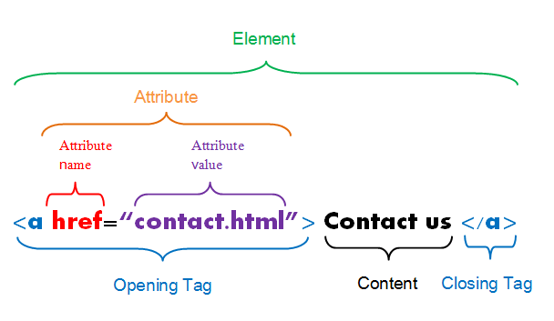
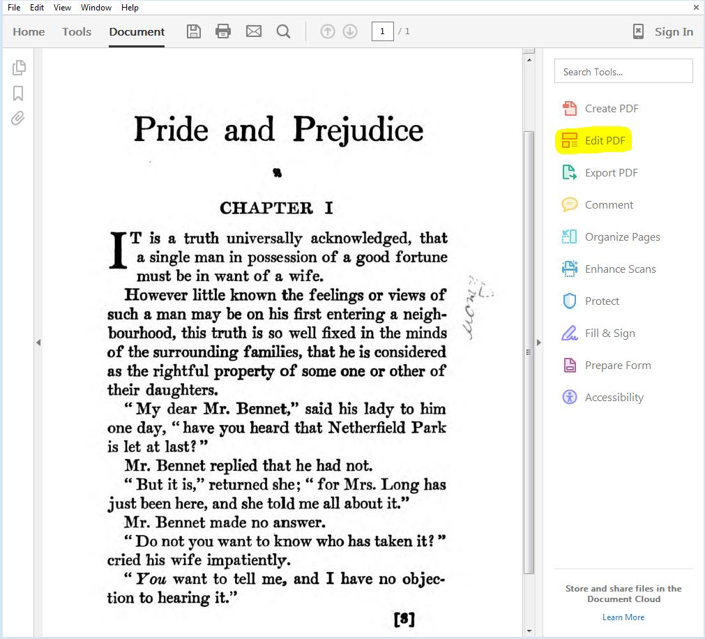
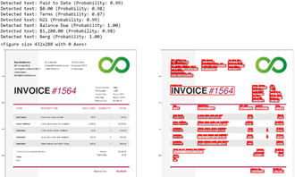
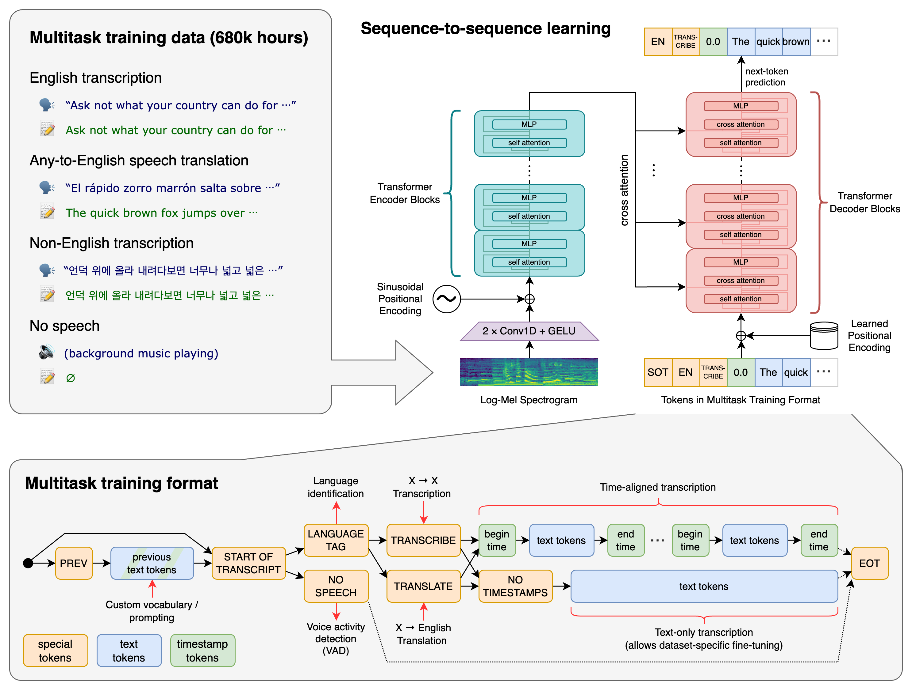
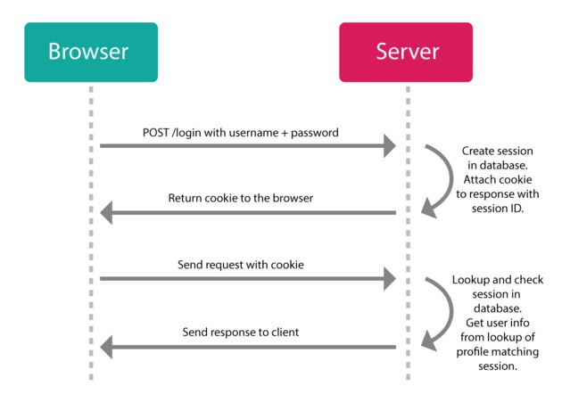
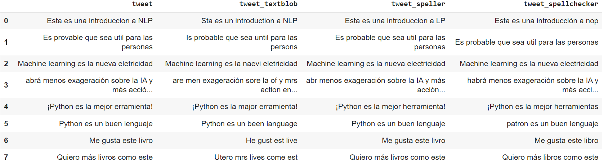
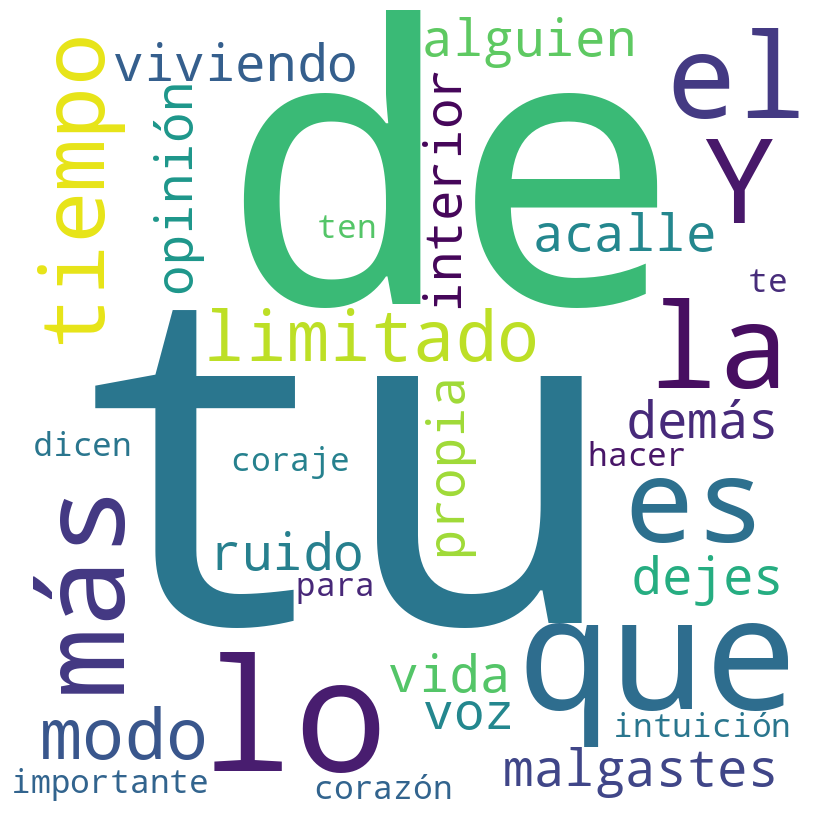
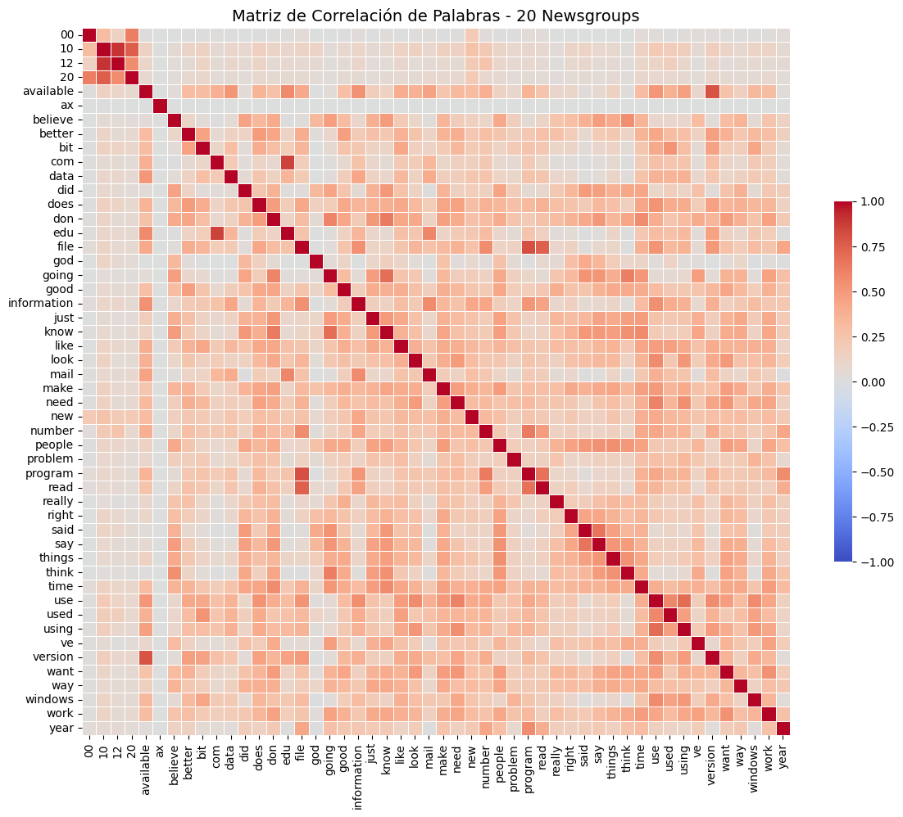
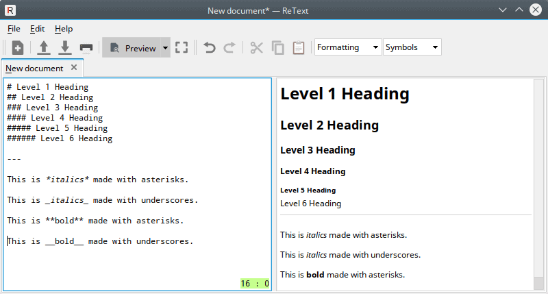
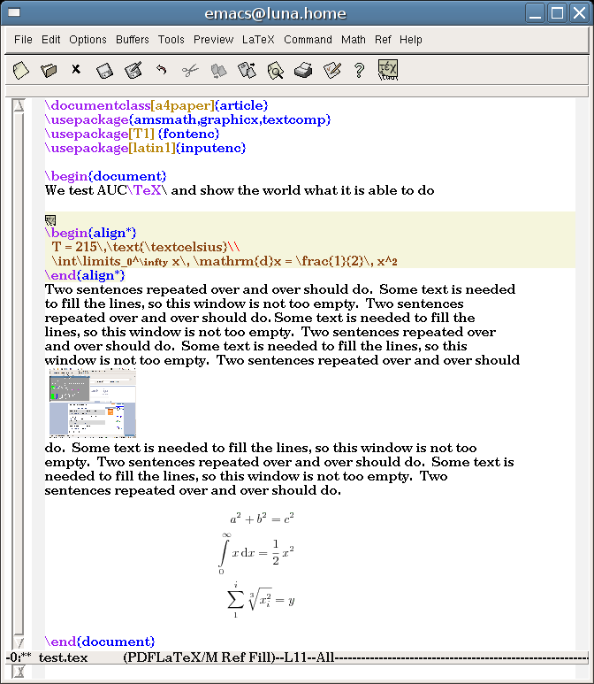

# Unidad 1 - Extracción y Procesamiento de Texto


> Fuente: [https://gentle-cress-e61.notion.site/Unidad-1-Extracci-n-y-Procesamiento-de-Texto-25f15e55f7ac4e1096376b060df1837f](https://gentle-cress-e61.notion.site/Unidad-1-Extracci-n-y-Procesamiento-de-Texto-25f15e55f7ac4e1096376b060df1837f)

**UNR - TUIA - Procesamiento de Lenguaje Natural**

Docente teoría: Juan Pablo Manson - [jpmanson@gmail.com](mailto:jpmanson@gmail.com) - [LinkedIN](https://www.linkedin.com/in/juanpablomanson/)

**Cuaderno práctico de la unidad:**

🔗 [Google Colab](https://colab.research.google.com/drive/1buXE-8N1XL4CqPfTqWkaSmG1Bm2oHjeM?usp=sharing)

## 1. Extracción de texto

La extracción de texto (Text Extraction) es el proceso de recuperar y aislar texto plano a partir de diversos contenedores o formatos de almacenamiento (PDFs, páginas web, archivos HTML, audio transcrito o documentos escaneados). Es fundamental no confundirla con la extracción de información ([Information Extraction](https://en.wikipedia.org/wiki/Information_extraction)), que busca extraer entidades, relaciones o eventos estructurados a partir de un texto ya extraído.

El texto puede ser extraído de una variedad de fuentes, dependiendo del objetivo del análisis. Estos son ejemplos de fuentes típicas de las que se puede extraer texto:

- **Documentos de Texto**: Esto incluye documentos de Word, PDFs, archivos de texto plano (.txt), RTF, y otros formatos de documentos, donde el foco es el texto, más allá que puedan contener otros elementos incrustados.
- **Páginas Web**: El texto puede ser extraído de páginas web utilizando técnicas de web scraping. Esto puede incluir blogs, artículos de noticias, foros de discusión, wikipedia y más.
- **Redes Sociales**: Las plataformas de redes sociales como Twitter, Facebook, Instagram, y LinkedIn son fuentes ricas de texto. Los comentarios, publicaciones, y mensajes pueden ser extraídos y analizados. Generalmente, se utilizan APIs y se requiere de tokens o credenciales para acceder a los datos.
- **Correo Electrónico**: Los correos electrónicos son otra fuente común de texto. Esto puede incluir el cuerpo del correo electrónico, así como los asuntos y los encabezados.
- **Bases de Datos**: Las bases de datos que contienen campos de texto, como descripciones de productos o registros de servicio al cliente, pueden ser una fuente útil de texto.
- **Transcripciones**: Las transcripciones de audio o video, como las de entrevistas, podcasts, o videos de YouTube, pueden ser extraídas para análisis de texto.
- **Literatura**: Los libros, artículos de revistas, y otros tipos de literatura pueden ser digitalizados y el texto puede ser extraído para análisis. Algunos formatos pueden ser PDF, epub, mobi, y otros.

En este capítulo, veremos ejemplos prácticos de extracción de texto. Las técnicas y librerías a utilizar, dependerán de la fuente de los datos.

### Formatos y fuentes de texto

En el mundo de la informática, existe una variedad muy grande de tipos de archivos que son capaces de almacenar texto. Alguna compañías, han conseguido imponer algunos formatos propios, que se utilizan mucho más que otros, y algunos son populares por ser abiertos y de fácil manipulación. En esta sección veremos algunos de los más utilizados. Los formatos pueden ser estructurados, semi-estructurados y no estructurados, y pueden estar comprimidos o encriptados, o pueden leerse como “texto plano” desde casi cualquier lenguaje de computación.

También existen muchas herramientas que son capaces de convertir entre formatos de archivos, o extraer información de los mismos. En esta sección, nos concentraremos en formatos de texto populares.

**Formato** **TXT**

Este es el formato de archivo de texto más básico. Los archivos TXT solo contienen texto sin formato y no admiten ningún tipo de formato de texto, como negrita, cursiva, colores, etc.

Este es un ejemplo básico de cómo leer un archivo de texto en Python:

```python
# Abre el archivo en modo de lectura ('r')
with open('archivo.txt', 'r') as archivo:
    # Lee todo el contenido del archivo
    contenido = archivo.read()

# Imprime el contenido del archivo
print(contenido)
```

Este código abrirá un archivo llamado 'archivo.txt' en el mismo directorio que nuestro script de Python. Luego, leerá todo el contenido del archivo y lo almacenará en la variable **`contenido`**. Finalmente, imprimirá el contenido del archivo en la consola.

El ejemplo anterior asume que el archivo de texto está codificado en UTF-8, que es la codificación predeterminada en Python 3. Si el archivo está en una [codificación diferente, como ISO-8859-1 o Latin-1](https://es.wikipedia.org/wiki/Codificaci%C3%B3n_de_caracteres), deberíamos especificar la codificación al abrir el archivo. Aquí vemos cómo hacerlo:

```python
# Abre el archivo en modo de lectura ('r') con la codificación ISO-8859-1
with open('archivo.txt', 'r', encoding='iso-8859-1') as archivo:
    # Lee todo el contenido del archivo
    contenido = archivo.read()

# Imprime el contenido del archivo
print(contenido)
```

En este código, el argumento **`encoding='iso-8859-1'`** le dice a Python que el archivo está codificado en ISO-8859-1. Si el archivo estuviera codificado en Latin-1, usaríamos **`encoding='latin-1'`** en su lugar.

> 💡 Es importante notar que si intentamos leer un archivo con una codificación incorrecta, Python puede lanzar un **`UnicodeDecodeError`**. Por lo tanto, es importante conocer la codificación del archivo que estamos intentando leer.

Para comprender mejor la diferencia entre diferentes encodings, veamos como se codifica la cadena de caracteres “Cómo estás” en **`utf-8`**:

| **Posición** | **Carácter** | **Valor UTF-8 (Decimal)** | **Hexadecimal** |
|---|---|---|---|
| **1** | ¿ | 194, 191 | C2, BF |
| **2** | C | 67 | 43 |
| **3** | ó | 195, 179 | C3, B3 |
| **4** | m | 109 | 6D |
| **5** | o | 111 | 6F |
| **6** | (espacio) | 32 | 20 |
| **7** | e | 101 | 65 |
| **8** | s | 115 | 73 |
| **9** | t | 116 | 74 |
| **10** | á | 195, 161 | C3, A1 |
| **11** | s | 115 | 73 |
| **12** | ? | 63 | 3F |

La cadena en esa codificación posee una longitud de 15 bytes. Veamos el caso de que la codificación sea **`iso-8859-1`****:**

| **Posición** | **Carácter** | **Valor ISO-8859-1 (Decimal)** | **Hexadecimal** |
|---|---|---|---|
| **1** | ¿ | 191 | BF |
| **2** | C | 67 | 43 |
| **3** | ó | 243 | F3 |
| **4** | m | 109 | 6D |
| **5** | o | 111 | 6F |
| **6** | (espacio) | 32 | 20 |
| **7** | e | 101 | 65 |
| **8** | s | 115 | 73 |
| **9** | t | 116 | 74 |
| **10** | á | 225 | E1 |
| **11** | s | 115 | 73 |
| **12** | ? | 63 | 3F |

En este último caso, la longitud de la cadena es de 12 bytes. Cómo podemos ver, algunos caracteres requieren más de un byte para codificarse, y además su codificación puede cambiar según el tipo de [encoding](https://es.wikipedia.org/wiki/Codificaci%C3%B3n_de_caracteres). Por ese motivo, según el encoding del archivo que tengamos, su longitud y la tabla de decodificación a utilizar puede ser diferente.   

**Formato HTML**

HTML, que significa Lenguaje de Marcado de Hipertexto (HyperText Markup Language en inglés), es el lenguaje estándar para crear páginas web. HTML utiliza "etiquetas" o "tags" para definir los elementos que componen una página web, como párrafos, encabezados, enlaces, imágenes, listas, tablas, etc. La estructura básica de un documento HTML es la siguiente:

```html
<!DOCTYPE html>
<html>
	<head>
	  <title>Este es el título de la página</title>
	</head>
	<body>
	  <p>Este es un párrafo en el cuerpo de la página.</p>
	  Esto es un <a href="https://codepen.io/">vínculo</a>
	</body>
</html>
```

🔗 CodePen: [Basic HTML](https://codepen.io/jpmanson/pen/jEOLpma)

Generalmente nuestro texto estará incluido en la sección `<body>` de nuestro HTML, pero hasta llegar al mismo, deberemos navegar por estructuras cuyo nivel de complejidad, dependerá de cada página. 

Cuando se habla de “elemento” en HTML, nos referimos a esta estructura:



Estos son algunos ejemplos de etiquetas HTML (ags) que se utilizan para dar formato al texto:

1. **`<p>`**: Define un párrafo de texto. Por ejemplo: **`<p>Este es un párrafo.</p>`**
2. **`<h1>`** a **`<h6>`**: Definen los encabezados (títulos). **`<h1>`** es el encabezado de mayor nivel (el más grande y más importante), y **`<h6>`** es el de menor nivel. Por ejemplo: **`<h1>Este es un encabezado de nivel 1</h1>`**
3. **`<strong>`**: Hace que el texto sea negrita. Por ejemplo: **`<strong>Este texto es negrita.</strong>`**
4. **`<em>`**: Hace que el texto sea cursiva. Por ejemplo: **`<em>Este texto es cursiva.</em>`**
5. **`<u>`**: Subraya el texto. Por ejemplo: **`<u>Este texto está subrayado.</u>`**
6. **`<s>`**: Tacha el texto. Por ejemplo: **`<s>Este texto está tachado.</s>`**
7. **`<pre>`**: Define texto preformateado. Mantiene tanto los espacios en blanco como los saltos de línea. Por ejemplo: **`<pre>Este texto es preformateado.</pre>`**
8. **`<blockquote>`**: Define una cita en bloque. Por ejemplo: **`<blockquote>Esta es una cita en bloque.</blockquote>`**

Estas son solo algunas de las muchas etiquetas HTML que se pueden utilizar para dar formato al texto en una página web. Para aprender más sobre HTML, podemos consultar el tutorial que ofrece [**Mozilla Developer Network**](https://developer.mozilla.org/es/docs/Web/HTML).

Para leer un archivo HTML y quitar los tags de formateo, podemos usar la librería**`BeautifulSoup`** en combinación con **`lxml`**. Aquí vemos un ejemplo:

```python
from bs4 import BeautifulSoup

# Abre el archivo en modo de lectura ('r')
with open('archivo.html', 'r') as archivo:
    # Lee todo el contenido del archivo
    contenido_html = archivo.read()

# Crea un objeto BeautifulSoup
soup = BeautifulSoup(contenido_html, 'lxml')

# Usa el método .text para obtener solo el texto, sin las etiquetas HTML
texto_plano = soup.text

# Imprime el texto plano
print(texto_plano)
```

Este código abrirá un archivo llamado 'archivo.html', leerá todo su contenido y luego utilizará BeautifulSoup para parsear el HTML y extraer solo el texto, quitando todas las etiquetas HTML.

Necesitaremos instalar las librerías **`beautifulsoup4`** y **`lxml`** para usar este código, lo cual podemos hacer con los comandos **`pip install beautifulsoup4`** y **`pip install lxml`**.

> 💡 Debemos tener en cuenta que este código eliminará todas las etiquetas HTML, incluyendo aquellas que podrían ser importantes para el formato del texto, como **`<p>`** para los párrafos o **`<br>`** para los saltos de línea. Si necesitamos preservar ciertos elementos de formato, tendríamos que modificar el código para manejar esos casos específicos.

**Formato MarkDown (.md)**

Los archivos de Markdown son archivos de texto con una sintaxis especial para formatear el texto. Este formato es popular en el mundo del desarrollo de software, ya que es el predeterminado para documentar código fuente en Github. Podríamos leer un archivo de Markdown en Python de la misma manera que leeríamos cualquier otro archivo de texto.

Si queremos convertir el texto de Markdown a HTML o a texto plano, podemos usar una librería como **`markdown`** o **`mistune`**. Aquí vemos un ejemplo utilizando la librería **`markdown`**:

```python
import markdown as md

# Abre el archivo en modo de lectura ('r')
with open('archivo.md', 'r') as archivo:
    # Lee todo el contenido del archivo
    texto_markdown = archivo.read()

# Convierte el texto de Markdown a HTML
html = md.markdown(texto_markdown)

# Imprime el HTML
print(html)
```

Este código convertirá el texto de Markdown a HTML antes de imprimirlo. Necesitaremos instalar la librería **`markdown`** para usar este código, lo cual podemos hacer con el comando **`pip install markdown`**.

Si queremos leer un archivo de Markdown y convertirlo a texto plano, quitando todo el formateo, podríamos usar una librería como **`html2text`**. Primero, convertiremos el Markdown a HTML (como en el ejemplo anterior) y luego convertiremos ese HTML a texto plano. Aquí vemos el ejemplo:

```python
import markdown
import html2text

# Abre el archivo en modo de lectura ('r')
with open('archivo.md', 'r') as archivo:
    # Lee todo el contenido del archivo
    texto_markdown = archivo.read()

# Convierte el texto de Markdown a HTML
html = markdown.markdown(texto_markdown)

# Crea un objeto de conversión html2text
h = html2text.HTML2Text()

# Ignora los enlaces en la conversión
h.ignore_links = True

# Convierte el HTML a texto plano
texto_plano = h.handle(html)

# Imprime el texto plano
print(texto_plano)
```

Este código convertirá el texto de Markdown a HTML, y luego convertirá ese HTML a texto plano, ignorando los enlaces. Necesitaremos instalar las librerías **`markdown`** y **`html2text`** para usar este código (**`pip install markdown`** y **`pip install html2text`****)**.

**Formato PDF**

El formato de archivo PDF (Portable Document Format) fue desarrollado por Adobe Systems. Es un formato de archivo universal que preserva las fuentes, las imágenes, los gráficos y el diseño de cualquier documento fuente, independientemente de la aplicación y la plataforma utilizadas para crearlo.

La estructura de un archivo PDF es bastante compleja y consta de las siguientes partes principales:

1. **Cabecera**: Indica la versión del PDF. Por ejemplo, **`%PDF-1.7`** indica que el archivo es un PDF versión 1.7.
2. **Cuerpo**: Contiene todos los objetos que componen el contenido del documento. Esto incluye el texto, las imágenes, los gráficos y más. Cada objeto se numerará con un número de objeto único.
3. **Tabla de referencias cruzadas (Cross-Reference Table)**: Esta tabla contiene información sobre la ubicación de cada objeto en el archivo. Esto permite que los lectores de PDF accedan rápidamente a los objetos sin tener que leer todo el archivo.
4. **Trailer**: Proporciona información sobre el archivo PDF en su conjunto, como la ubicación de la tabla de referencias cruzadas y el objeto raíz del documento.
5. **EOF (End of File)**: Una línea que simplemente contiene **`%%EOF`** para indicar el final del archivo.


Dentro del cuerpo del documento, los objetos pueden organizarse en una estructura de árbol que incluye:

- **Objeto de catálogo**: El nodo raíz del árbol, que referencia a otros objetos como páginas y metadatos del documento.
- **Objetos de página**: Representan páginas individuales en el documento. Contienen referencias a los contenidos de la página (texto, gráficos, imágenes) y a los recursos utilizados (fuentes, colores).
- **Objetos de contenido**: Contienen las instrucciones para dibujar el texto, las imágenes y los gráficos en la página.
- **Otros objetos**: Incluyen metadatos, anotaciones (como comentarios y marcadores), fuentes, patrones de color, etc.

Es importante destacar que los archivos PDF pueden ser bastante complejos, con características como formularios interactivos, capas, anotaciones 3D entre otras cosas. Además, los archivos PDF pueden estar encriptados para proteger su contenido.

Para extraer texto de un archivo PDF en Python, podemos usar la librería **`PyPDF2`**. Veamos un ejemplo

```python
import PyPDF2

# Abre el archivo en modo binario de lectura ('rb')
with open('archivo.pdf', 'rb') as archivo:
    # Crea un objeto PdfFileReader
    lector = PyPDF2.PdfReader(archivo)

    # Inicializa una cadena vacía para almacenar el texto
    texto = ''

    # Itera sobre todas las páginas del PDF
    for i in range(len(lector.pages)):
        # Obtiene la página
        pagina = lector.pages[i]

        # Extrae el texto de la página y lo añade a la cadena de texto
        texto += pagina.extract_text ()

# Imprime el texto extraído
print(texto)
```

Este código abrirá un archivo llamado 'archivo.pdf', leerá todas sus páginas y extraerá el texto de cada página.

Necesitaremos instalar la librería **`PyPDF2`** para usar este código, lo cual podemos hacer con el comando **`pip install PyPDF2`**.

> 💡 Debemos tener en cuenta que **`PyPDF2`** puede no ser capaz de extraer texto de todos los archivos PDF, especialmente si el texto está almacenado como imágenes. En esos casos, podríamos necesitar otras herramientas o librerías, como **`pdf2image`**

Otra opción, es utilizar la librería pdfplumber ([jsvine/pdfplumber](https://github.com/jsvine/pdfplumber)):

```python
# !pip install pdfplumber
import pdfplumber

# Get the filename of the uploaded PDF
filename = 'ejemplo.pdf'

# Open the PDF file
with pdfplumber.open(filename) as pdf:
    # Extract text from each page
    for page in pdf.pages:
        text = page.extract_text()
        print(text)
```

**PDFs con texto en las imágenes**

Puede suceder que el PDF sea un documento creado a partir de imágenes escaneadas, y el texto plano no esté disponible. En ese caso podríamos extraer las páginas como imágenes y luego utilizar una herramienta OCR.

Para convertir un PDF escaneado en imágenes, podemos usar la librería **`pdf2image`** en Python. Aquí vemos un ejemplo de cómo hacerlo. Primero instalamos los paquetes necesarios:

```python
!pip install pdf2image
!apt-get install -y poppler-utils
```

Luego ejecutamos este código:

```python
from pdf2image import convert_from_path

# Ruta al archivo PDF
archivo_pdf = 'archivo.pdf'

# Convierte el PDF en una lista de imágenes
imagenes = convert_from_path(archivo_pdf)

# Guarda las imágenes
for i, imagen in enumerate(imagenes):
    imagen.save('pagina{}.png'.format(i), 'PNG')
```

Este código abrirá un archivo llamado 'archivo.pdf' y convertirá cada página del PDF en una imagen PNG.

Necesitaremos instalar la librería **`pdf2image`** para usar este código, lo cual podemos hacer con el comando **`pip install pdf2image`**.

Debemos tener en cuenta que **`pdf2image`** requiere tener instalado el software **`poppler-utils`** en el sistema. En sistemas basados en Linux Debian, se puede instalar con el comando **`sudo apt-get install -y poppler-utils`**.

> 💡 Una vez que tenemos las imágenes, podemos usar una librería de [OCR (Reconocimiento Óptico de Caracteres)](https://es.wikipedia.org/wiki/Reconocimiento_%C3%B3ptico_de_caracteres) como **`pytesseract`** para extraer texto de las imágenes.

También es posible extraer metadatos o propiedades del documento PDF. Podríamos hacerlo del siguiente modo:

```python
from PyPDF2 import PdfReader

reader = PdfReader(path)

meta = reader.metadata
print("Total Pages: ", len(reader.pages))

# All of the following could be None!
print("Author: ", meta.author)
print("Creator: ", meta.creator)
print("Producer: ", meta.producer)
print("Subject: ", meta.subject)
print("Title: ", meta.title)
```

Existe muchas alternativas para trabajar con documentos PDF y extraer información desde Python. Aquí se listan algunas de ellas. Según el caso, puede sernos más útil alguna en particular:

- pypdf (estándar moderno, sucesor de PyPDF2) — [https://github.com/py-pdf/pypdf](https://github.com/py-pdf/pypdf)
- pdfplumber (ideal para tablas y estructura) — [https://github.com/jsvine/pdfplumber](https://github.com/jsvine/pdfplumber)
- PyMuPDF (extremadamente rápido y versátil) — [https://github.com/pymupdf/PyMuPDF](https://github.com/pymupdf/PyMuPDF)
- Pytesseract (wrapper para OCR) — [https://github.com/madmaze/pytesseract](https://github.com/madmaze/pytesseract)

**Texto en imágenes (Mapas de bits)**

Muchas veces el texto que necesitamos, se encuentra contenido en una imagen o mapa de bits, por ejemplo en un archivo JPG, PNG, GIF o BMP.



Para poder obtener el texto en estos casos, necesitaremos de una herramienta de tipo OCR (Optical Character Recognition). Para convertir una imagen a texto en Python, podemos usar la librería **`pytesseract`**, que es un wrapper (envoltorio) para Tesseract OCR. Aquí vemos un ejemplo de cómo hacerlo:

```python
# Primero instalamos los paquetes necesarios
# !pip install pytesseract
# !apt install tesseract-ocr

from PIL import Image
import pytesseract

# Ruta a la imagen
archivo_imagen = 'imagen.png'

# Abre la imagen
imagen = Image.open(archivo_imagen)

# Usa pytesseract para convertir la imagen en texto
# Podemos especificar los idiomas posibles del documento:
texto = pytesseract.image_to_string(imagen, lang="eng+spa+fra")

# Imprime el texto extraído
print(texto)
```

Este código abrirá un archivo llamado 'imagen.png' y usará **`pytesseract`** para extraer el texto de la imagen.

Necesitaremos instalar las librerías**`Pillow`** y **`pytesseract`** para usar este código, lo cual puedes hacer con los comandos **`pip install Pillow`** y **`pip install pytesseract`**.

> 💡 Tengamos en cuenta que el OCR puede no ser 100% preciso, especialmente con imágenes que pueden tener ruido o distorsiones. Podemos mejorar la precisión del OCR utilizando técnicas de preprocesamiento de imágenes, como la binarización, el suavizado y la eliminación de ruido. También es posible entrenar el reconocimiento de un conjunto de caracteres personalizado, si tenemos el dataset adecuado para hacerlo. 

En muchos casos es importante extraer el texto, pero también conocer su posición dentro de la imagen. Para eso podremos utilizar [EasyOCR](https://github.com/JaidedAI/EasyOCR), que es una librería de Python que facilita la extracción de texto de imágenes junto con sus coordenadas. 



Aquí vemos un ejemplo de cómo extraer texto de una imagen:

```python
import easyocr

# Crea un lector OCR en español
lector = easyocr.Reader(['es'])

# Ruta a la imagen
archivo_imagen = 'imagen.png'

# Usa EasyOCR para convertir la imagen en texto
resultado = lector.readtext(archivo_imagen)

# El resultado es una lista de tuplas, donde cada tupla representa un bloque de texto.
# La primera posición de la tupla es la ubicación del bloque de texto en la imagen,
# y la segunda posición es el texto en sí.

# Imprime el texto extraído
for ubicacion, texto, _ in resultado:
    print(f"Texto: {texto}, Ubicación: {ubicacion}")
```

Este código abrirá un archivo llamado 'imagen.png' y usará [EasyOCR](https://github.com/JaidedAI/EasyOCR) para extraer el texto de la imagen.

Necesitaremos instalar la librería **`easyocr`** para usar este código, lo cual podemos hacer con el comando **`pip install easyocr`**.

**Texto desde MS Word**

El formato DOCX es el formato de archivo predeterminado para los documentos creados en Microsoft Word 2007 y versiones posteriores. Es un formato de archivo basado en XML que contiene texto, objetos, estilos y otros componentes que se encuentran en un documento de Word.

En Python, podemos usar la librería **`python-docx`** para leer y escribir archivos DOCX. Aquí vemos un ejemplo de cómo usar **`python-docx`** para extraer texto de un archivo DOCX:

```python
from docx import Document

# Abre el archivo DOCX
doc = Document('documento.docx')

# Extrae el texto de cada párrafo en el documento
for parrafo in doc.paragraphs:
    print(parrafo.text)
```

Este código abrirá un archivo llamado 'documento.docx' y imprimirá el texto de cada párrafo en el documento.

Necesitarás instalar la librería **`python-docx`** para usar este código, lo cual podemos hacer con el comando **`pip install python-docx`**.

**Conversores de documentos**

En las secciones anteriores vimos cómo extraer texto de un formato a la vez: `open()` para TXT, BeautifulSoup para HTML, PyPDF2/pdfplumber para PDF, `python-docx` para Word. Ese enfoque funciona cuando el archivo es simple y nos alcanza un string.

En la práctica, un pipeline de NLP —y sobre todo uno que alimente un LLM o un RAG— suele necesitar otra cosa: reconstruir la *estructura* del documento (títulos, listas, tablas, orden de lectura) y volcarla a un formato intermedio. Hoy ese formato, casi siempre, es Markdown. Por eso Markdown no es solo “el formato de GitHub”: es el destino típico de la ingestión.

La diferencia con `.extract_text()` es concreta. Un PDF no guarda párrafos; guarda instrucciones de dibujo (poner esta letra en esta coordenada). Extraer texto plano pierde columnas, tablas y headings. Un conversor intenta reconstruir esa estructura.

No hace falta aprender cuatro APIs. Hace falta un criterio para elegir. Estas herramientas cubren el espectro actual (estado 2026):

| **Herramienta** | **Rol** | **Cuándo usarla** | **Qué implica** |
|---|---|---|---|
| [**MarkItDown**](https://github.com/microsoft/markitdown) | Wrapper liviano a Markdown | Muchos formatos (PDF, Office, HTML, imágenes, audio). Prototipos y scripts | Instalación chica. El OCR decente pide un LLM o Azure (pago) |
| [**Docling**](https://github.com/docling-project/docling) | Parser estructurado, local | Tablas, reading order, exportar Markdown o JSON, sin nube | Más pesado: baja modelos de layout/OCR. Corre en CPU; el modo VLM es opcional |
| [**Marker**](https://github.com/datalab-to/marker) | Calidad en PDF difícil | Multicolumna, fórmulas, scans, papers | GPU casi necesaria para el modo bueno. Código Apache 2.0; los pesos del modelo tienen licencia restrictiva |
| [**MinerU**](https://github.com/opendatalab/MinerU) | Parser de documentos complejos | Scans, multicolumna, fórmulas, tablas que cruzan páginas | Pesado (modelos). El backend pipeline corre en CPU; el modo VLM pide GPU. OCR en muchos idiomas |

**Criterio en una frase:** MarkItDown para entrar; Docling para estructura local; MinerU para papers y scans (OCR, fórmulas, tablas); Marker cuando la calidad del PDF importa y hay GPU.

Un ejemplo mínimo con MarkItDown (la vía más simple para un prototipo):

```python
# pip install markitdown
from markitdown import MarkItDown

md = MarkItDown()
result = md.convert("informe.pdf")
print(result.text_content[:1000])
```

Docling, en cambio, no devuelve solo un string: construye un documento estructurado que después se puede exportar a Markdown o a JSON. Eso es lo que PyPDF2 no tiene:

```python
# pip install docling   # más pesado: descarga modelos la primera vez
from docling.document_converter import DocumentConverter

conv = DocumentConverter()
doc = conv.convert("informe.pdf").document
print(doc.export_to_markdown())
```

Marker apunta a calidad en PDFs difíciles (papers, fórmulas, scans). No es el default para un TP en notebook CPU: conviene correrlo por CLI, idealmente con GPU, y no instalarlo “por las dudas”:

```bash
marker_single informe.pdf
```

MinerU (OpenDataLab) está en el mismo problema —PDF difícil, tablas, fórmulas— pero con un perfil más “sistema”: backend `pipeline` que puede correr en CPU, OCR en muchos idiomas, fórmulas a LaTeX y tablas a HTML. El modo VLM es más preciso y pide GPU. CLI típico:

```bash
mineru -p informe.pdf -o salida
```

> 💡 **Estas herramientas no son intercambiables.** MarkItDown no “entiende” layout como Docling, MinerU o Marker. Docling no es el más preciso en papers densos. MinerU y Marker son pesados: no son el default para un práctico en Colab CPU (aunque MinerU tiene un backend pipeline que sí puede ir por CPU). Y convertir a Markdown *no* elimina la necesidad de limpiar y segmentar: el chunking de más adelante sigue aplicando.

**Texto desde imágenes o video**

Para transcribir texto a partir de un archivo de audio, debemos realizar reconocimiento del habla (Speech Recognition). Para eso podemos usar la librería **`SpeechRecognition`** en Python. Aquí vemos un ejemplo de cómo hacerlo:

```python
import speech_recognition as sr

# Crea un objeto Recognizer
r = sr.Recognizer()

# Abre el archivo de audio
with sr.AudioFile('audio.wav') as source:
    # Lee el archivo de audio
    audio_data = r.record(source)
    # Transcribe el audio a texto
    texto = r.recognize_google(audio_data)
    print(texto)
```

Este código abrirá un archivo de audio llamado 'audio.wav', lo leerá en un objeto **`AudioData`**, y luego usará el servicio de reconocimiento de voz de Google para transcribir el audio a texto.

Necesitaremos instalar la librería **`SpeechRecognition`** para usar este código, lo cual podemos hacer con el comando **`pip install SpeechRecognition`**.

Tengamos en cuenta que este código solo funciona con archivos de audio. Si tenemos un archivo de video del que quieres extraer el audio, necesitaremos usar una herramienta como **`ffmpeg`** para extraer la pista de audio del video antes de poder transcribirlo.

> 💡 Además, el reconocimiento de voz puede no ser 100% preciso, especialmente con audios que pueden tener ruido de fondo, acentos fuertes, o distorsiones. Podremos mejorar la precisión del reconocimiento de voz utilizando técnicas de preprocesamiento de audio, como la eliminación de ruido y la normalización de volumen.

Otra forma de extraer texto desde un audio, es con el [modelo Whisper](https://arxiv.org/abs/2212.04356). El mencionado, es un modelo de reconocimiento de voz de propósito general. Se entrenó en un conjunto de audios grande y diverso, y también es un modelo multitarea que puede realizar reconocimiento de voz multilingüe, traducción de voz e identificación de idiomas.



*Diagrama de bloques del modelo Whisper*

Un modelo de secuencia a secuencia de Transformer se entrena en varias tareas de procesamiento de voz, incluido el reconocimiento de voz multilingüe, la traducción de voz, la identificación del idioma hablado y la detección de actividad de voz. Estas tareas se representan conjuntamente como una secuencia de tokens que el decodificador predecirá, lo que permite que un solo modelo reemplace muchas etapas de una canalización de procesamiento de voz tradicional. El formato de entrenamiento multitarea utiliza un conjunto de tokens especiales que sirven como especificadores de tareas u objetivos de clasificación.

Aquí podremos ver un Colab con un ejemplo de cómo utilizar Whisper: [https://colab.research.google.com/github/openai/whisper/blob/master/notebooks/LibriSpeech.ipynb](https://colab.research.google.com/github/openai/whisper/blob/master/notebooks/LibriSpeech.ipynb) 

También es posible obtener las transcripciones de videos directamente desde YouTube. Para eso podemos utilizar la librería [**`youtube-transcript-api`**](https://github.com/jdepoix/youtube-transcript-api). Aquí vemos un ejemplo:

```python
from youtube_transcript_api import YouTubeTranscriptApi
transcript = YouTubeTranscriptApi.get_transcript(video_id)
```

Esto devolverá una lista de diccionarios que se verá como:

```python
[
    {
        'text': 'Hey there',
        'start': 7.58,
        'duration': 6.13
    },
    {
        'text': 'how are you',
        'start': 14.08,
        'duration': 7.58
    },
    # ...
]
```

**Texto desde Wikipedia**

También es posible extraer texto de Wikipedia usando Python, y es bastante sencillo gracias a varias librerías disponibles. Una de las más populares es **`wikipedia-api`****:**

```python
import wikipediaapi

# Configura el idioma de Wikipedia que deseas usar, en este caso, español ('es').
wiki_wiki = wikipediaapi.Wikipedia("TUIA-NLP/1.0 (contacto@alumno.unr.edu.ar)", 'es')

# Obtén la página que deseas.
page = wiki_wiki.page("Python_(lenguaje_de_programación)")

# Imprime el resumen de la página.
print("Resumen:", page.summary[:60])  # Los primeros 60 caracteres del resumen

# Si deseas obtener el contenido completo:
print("Contenido completo:", page.text[:60])  # Los primeros 60 caracteres del contenido completo
```

**Texto desde bases de datos**

Las bases de datos son una fuente común de datos para el procesamiento del lenguaje natural (NLP). Los datos almacenados en las bases de datos pueden incluir texto de diversas fuentes, como registros de clientes, transcripciones de llamadas de servicio al cliente, comentarios de productos, publicaciones en redes sociales, documentos y más.

Python tiene varias librerías que facilitan la interacción con las bases de datos para extraer datos. Algunas de las librerías más comunes incluyen:

1. **SQLite3**: SQLite es una base de datos relacional incorporada en Python. Puedes usar la librería **`sqlite3`** para interactuar con las bases de datos SQLite.
2. **Psycopg2**: Psycopg es el adaptador de base de datos PostgreSQL más popular para el lenguaje de programación Python. Te permite ejecutar comandos SQL en bases de datos PostgreSQL.
3. **PyMySQL**: PyMySQL es una interfaz para conectar a un servidor MySQL desde Python. Te permite ejecutar operaciones SQL en bases de datos MySQL.
4. **SQLAlchemy**: SQLAlchemy es un kit de herramientas SQL y un Object-Relational Mapping (ORM) que permite conectarse a múltiples motores de bases utilizando programación orientada a objetos.

Aquí tenemos un ejemplo de cómo puedes usar **`sqlite3`** para extraer datos de una base de datos SQLite:

```python
import sqlite3

# Conecta a la base de datos SQLite
conn = sqlite3.connect('database.db')

# Crea un objeto cursor
c = conn.cursor()

# Ejecuta una consulta SQL
c.execute('SELECT * FROM table_name')

# Obtiene los resultados de la consulta
results = c.fetchall()

# Imprime los resultados
for row in results:
    print(row)

# Cierra la conexión
conn.close()
```

Este código abrirá una conexión a una base de datos SQLite llamada 'database.db', ejecutará una consulta SQL para seleccionar todos los registros de una tabla llamada 'table_name', imprimirá los resultados de la consulta y luego cerrará la conexión.

> 💡 Debemos tener en cuenta que este es solo un ejemplo básico. La forma exacta en que interactuamos con una base de datos dependerá del tipo de base de datos y de la estructura de los datos almacenados en ella.

**Texto desde formatos tabulares**

Pandas puede ser una buena herramienta obtener texto desde formatos tabulares, como MS Excel, archivos CSV, Parquet u otros.

Aquí vemos un ejemplo para tomar datos desde un archivo Excel:

```python
import pandas as pd

# Lee el archivo de Excel
df = pd.read_excel('archivo.xlsx')

# Extrae el texto de una columna específica
texto = df['nombre_columna']

# Imprime el texto
print(texto)
```

O desde un CSV:

```python
import pandas as pd

# Lee el archivo CSV
df = pd.read_csv('archivo.csv')

# Extrae el texto de una columna específica
texto = df['nombre_columna']

# Imprime el texto
print(texto)
```

**Texto desde JSON**

Es común extraer texto dentro de un archivo JSON. Para leer un archivo JSON local en Python, podemos usar la librería **`json`**. Aquí vemos un ejemplo:

```python
import json

# Leer un archivo JSON local
with open('archivo.json', 'r') as f:
    data = json.load(f)

# Imprime los datos
print(data)
```

Para leer un archivo JSON de una página web, podemos usar la librería **`requests`** para descargar el archivo, y luego usar la librería **`json`** para analizar el contenido del archivo. Aquí vemos un ejemplo:

```python
import requests
import json

# Descarga el archivo JSON de la página web
response = requests.get('https://microsoftedge.github.io/Demos/json-dummy-data/64KB.json')

# Parsea el contenido JSON
data = json.loads(response.text)

# Imprime los datos
print(data)
```

Este código descargará un archivo JSON de la página web [https://microsoftedge.github.io/Demos/json-dummy-data/64KB.json](https://microsoftedge.github.io/Demos/json-dummy-data/64KB.json), y que luego podemos tratar en Python como una estructura de diccionario.

**Web Scraping**

El [web scraping](https://es.wikipedia.org/wiki/Web_scraping) es una técnica utilizada para extraer información de sitios web. Se realiza convirtiendo los datos que están en formato HTML en un formato estructurado como CSV, JSON o XML. Los web scrapers pueden navegar por múltiples páginas web y recoger una variedad de datos como textos, imágenes, tablas, enlaces, etc.

Para entender cómo funciona el scraping, debemos entender el flujo básico cliente/servidor en internet. El diagrama de la derecha, ilustra la comunicación fundamental entre un navegador web (cliente) y un servidor web, mostrando tres escenarios clave de interacción. Primero, cuando el cliente solicita contenido estático como una página HTML, el servidor simplemente busca y envía archivos existentes. Segundo, para contenido dinámico, el servidor procesa la solicitud consultando una base de datos y generando HTML personalizado antes de enviarlo al cliente. Tercero, durante el envío de formularios, el cliente transmite datos al servidor mediante el método POST, donde son procesados, verificados contra la base de datos y respondidos con una redirección o mensaje de error. Esta representación evidencia cómo el protocolo HTTP facilita la comunicación bidireccional, distinguiendo entre recursos estáticos predefinidos y contenido dinámico generado según parámetros específicos de cada solicitud.


Python es un lenguaje de programación popular para el web scraping y ofrece varias librerías para este propósito, como [BeautifulSoup](https://www.crummy.com/software/BeautifulSoup/), [scrapy/scrapy](https://github.com/scrapy/scrapy), [SeleniumHQ/selenium](https://github.com/SeleniumHQ/selenium), [microsoft/playwright](https://github.com/microsoft/playwright), entre otras.

Aquí vemos un ejemplo básico de cómo usar **`BeautifulSoup`** y **`requests`** para extraer texto de una página web:

```python
#!pip install beautifulsoup4

import requests
from bs4 import BeautifulSoup

url = "https://rock.com.ar/letras/Un-millon-de-anos-luz/"

response = requests.get(url)
soup = BeautifulSoup(response.text, 'html.parser')

# Localizamos el elemento que contiene la letra de la canción.
# Esto es muy dependiente de cada página y se debe realizar una
# exploración en cada caso.
letra_div = soup.find('section', {'class': 'entry-content'})

# Extraemos todos los párrafos dentro de ese elemento.
paragraphs = letra_div.find_all('p')

# Extraemos el texto de cada párrafo y lo juntamos en una sola cadena.
letra = '\n'.join(par.text for par in paragraphs)

print(letra)
```

Otra variante, es usando el método `select` de BeautifulSoup: 

```python
#!pip install beautifulsoup4

import requests
from bs4 import BeautifulSoup

# URL de la página de donde queremos extraer la letra de la canción
url = "https://rock.com.ar/letras/Un-millon-de-anos-luz/"

# Realizamos una petición GET a la página
response = requests.get(url)

# Parseamos el contenido HTML de la página utilizando BeautifulSoup
soup = BeautifulSoup(response.text, 'html.parser')

# Seleccionamos el contenido de la letra de la canción.
# Usamos el método select de BeautifulSoup para encontrar los elementos <p> dentro de la sección con la clase 'entry-content'
letra_section = soup.select('section.entry-content > p')

# Unimos todos los párrafos de la letra en un solo string, separando cada uno con un salto de línea
letra = '\n'.join(par.text for par in letra_section)

# Imprimimos la letra de la canción
print(letra)
```

Este código abrirá una conexión a la URL proporcionada, descargará el contenido HTML de la página, y luego utilizará BeautifulSoup para parsear el HTML y extraer el texto de todos los elementos **`<p>`** (párrafos) en la página.

Necesitaremos instalar las librerías **`beautifulsoup4`** y **`requests`** para usar este código, lo cual podemos hacer con los comandos **`pip install beautifulsoup4`** y **`pip install requests`**.

> 💡 Debemos tener en en cuenta que el web scraping debe realizarse de acuerdo con las políticas del sitio web (como los Términos de Servicio o el archivo [robots.txt](https://developers.google.com/search/docs/crawling-indexing/robots/intro?hl=es)), y que algunos sitios web pueden bloquear o limitar el acceso a los scrapers. Además, el web scraping puede ser una actividad legalmente “gris” en algunas jurisdicciones, por lo que siempre es una buena idea asegurarse de que estemos actuando de manera ética y legal.

En algunos casos se requiere realizar login en una página para luego poder extraer el contenido que buscamos. Para manejar el inicio de sesión y mantener la sesión en una página web utilizando la librería **`requests`** de Python, podemos usar un objeto **`Session`**. Un objeto **`Session`** persistirá ciertos parámetros a través de las solicitudes. Aquí vemos un ejemplo de cómo podríamos hacerlo:

```python
import requests
from bs4 import BeautifulSoup

# Crea una sesión
s = requests.Session()

# URL de la página de inicio de sesión
login_url = 'https://www.ejemplo.com/login'

# Parámetros de inicio de sesión
login_params = {
    'username': 'tu_usuario',
    'password': 'tu_password'
}

# Realiza una solicitud POST a la página de inicio de sesión
s.post(login_url, data=login_params)

# Ahora estás "logueado" y puedes hacer solicitudes a la página protegida
url = 'https://www.ejemplo.com/pagina_protegida'
response = s.get(url)

# Parsea el contenido de la página web con BeautifulSoup
soup = BeautifulSoup(response.content, 'html.parser')

# Extrae el texto de todos los párrafos (elementos <p>) de la página web
parrafos = soup.find_all('p')

for parrafo in parrafos:
    print(parrafo.get_text())
```

Este código abrirá una sesión, realizará una solicitud POST a la página de inicio de sesión con tus credenciales de inicio de sesión, y luego realizará una solicitud GET a la página protegida. Como estamos utilizando un objeto **`Session`**, las cookies de la sesión se mantendrán entre las solicitudes, por lo que seguiremos estando "logueados" cuando accedamos a la página protegida.



*Proceso típico de login donde se almacena el ID de sesión en una cookie. En nuestro caso, el “Browser” es Python, a través de su librería `requests`*

> 💡 Tengamos en cuenta que este es un ejemplo muy básico y que el proceso exacto para iniciar sesión puede variar dependiendo de cómo esté configurada la página web. Algunas páginas web pueden requerir información adicional para iniciar sesión, como tokens CSRF, cabeceras personalizadas, etc. También es posible que necesitemos utilizar una librería como [**`mechanize`**](https://github.com/python-mechanize/mechanize)[**,**](https://github.com/python-mechanize/mechanize) [**`playwright`**](https://github.com/microsoft/playwright) o [**`selenium`**](https://github.com/SeleniumHQ/selenium) si el sitio web utiliza JavaScript para manejar el inicio de sesión.

Ahora veamos otra alternativa de scraping, usando la librería [microsoft/playwright](https://github.com/microsoft/playwright):

```python
# Instalar dependencias en Colab
# !uv pip install --system playwright
# !playwright install 
# !playwright install-deps
# Install missing system dependencies for Playwright
# !apt-get update && apt-get install -y libatk1.0-0 libatk-bridge2.0-0 libgtk-3-0 libgdk-pixbuf2.0-0 libnss3 libxss1 libasound2

import sys

# Importar las bibliotecas necesarias
from playwright.async_api import async_playwright
import asyncio
from IPython.display import Image, display

# URL de la página que quieres leer
url = 'https://www.python.org'  # Puedes cambiar esto por la URL que desees

async def main():
    async with async_playwright() as p:
        # Configurar el navegador (chromium, firefox o webkit)
        # Using 'args' to disable the dev shm usage which can cause issues in Colab
        browser = await p.chromium.launch(headless=True, args=['--disable-dev-shm-usage'])

        # Crear un contexto y una página
        context = await browser.new_context()
        page = await context.new_page()

        try:
            print(f"Accediendo a {url}...")
            # Navegar a la URL
            await page.goto(url, wait_until="networkidle")

            # Obtener el título de la página
            titulo = await page.title()
            print(f"\nTítulo de la página: {titulo}")

            # Encontrar todos los párrafos
            parrafos = await page.query_selector_all('p')
            print(f"\nNúmero de párrafos encontrados: {len(parrafos)}")

            # Imprimir los primeros 3 párrafos
            for i, p in enumerate(parrafos[:3]):
                texto = await p.inner_text()
                print(f"\nPárrafo {i+1}:")
                print(texto)

            # Encontrar todos los enlaces
            enlaces = await page.query_selector_all('a')
            print(f"\nNúmero de enlaces encontrados: {len(enlaces)}")

            # Imprimir los primeros 5 enlaces
            for i, enlace in enumerate(enlaces[:5]):
                href = await enlace.get_attribute('href') or 'No tiene URL'
                texto = await enlace.inner_text()
                print(f"\nEnlace {i+1}: {href} - Texto: {texto}")

            # Opcional: Tomar una captura de pantalla
            screenshot_path = '/content/captura_playwright.png'
            await page.screenshot(path=screenshot_path)
            print(f"\nCaptura de pantalla guardada en: {screenshot_path}")

            # Para mostrar la imagen en Colab
            display(Image(screenshot_path))

        except Exception as e:
            print(f"Error: {e}")

        finally:
            # Cerrar el navegador
            await browser.close()
            print("\nNavegador cerrado.")

# Ejecutar la función asincrónica
await main()
```

### Parseo de texto

El parseo de texto (o "parsing" en inglés) es un proceso fundamental en programación y procesamiento de datos que consiste en analizar una cadena de texto (string) para extraer, interpretar o estructurar su contenido de manera significativa. Conceptualemente, implica descomponer el texto en componentes más pequeños basados en reglas predefinidas, patrones o gramáticas, con el objetivo de convertir datos no estructurados o semi-estructurados en formatos utilizables, como listas, diccionarios, objetos o bases de datos. Para comprender mejor de que se trata, veamos las partes fundamentales:

- **Entrada**: Generalmente una cadena de texto, que puede provenir de un archivo (como logs, CSV, JSON, XML), una respuesta API, un input del usuario o cualquier fuente de datos textuales.
- **Proceso**: Se aplican técnicas para identificar delimitadores (como comas, espacios o etiquetas), patrones (usando expresiones regulares) o estructuras sintácticas (como en lenguajes de programación o formatos estándar).
- **Salida**: Datos estructurados, como tokens (palabras o símbolos), valores numéricos, fechas, o estructuras complejas (e.g., un árbol de sintaxis en análisis lingüístico).
- **Propósitos comunes**: Validar formatos (e.g., emails), extraer información (e.g., números de teléfono de un texto), convertir datos (e.g., de string a JSON), o analizar sintaxis (e.g., en compiladores).

El parseo puede ser simple (usando métodos básicos de strings) o complejo (usando parsers especializados para lenguajes como HTML o SQL). En casos avanzados, puede involucrar manejo de errores, como texto malformado o ambiguo.

En Python, el parseo es facilitado por la librería estándar y módulos como `re` (para expresiones regulares), `json`, `csv` o incluso librerías externas como `BeautifulSoup` para HTML (aunque aquí nos enfocaremos en lo básico).

> 💡 
>
> Pensemos el **parseo** como el puente entre “texto que vino como vino” y “dato sobre el que podemos razonar sin engañarnos”. Tras extraer el texto, aún conviven restos de HTML, saltos y codificaciones raras, copias duplicadas, enlaces y menciones que no son el contenido en sí. Parsear es decidir, con criterio, qué constituye *mensaje* y qué es *ruido*: dejar el texto legible, homogéneo y bien segmentado, y a la vez anotar señales expresivas que no queremos perder (mayúsculas sostenidas, repeticiones, signos enfáticos, emojis). ¿Por qué importa? Porque todo análisis posterior —desde un conteo simple hasta un clasificador de sentimiento— asume que lo que entra es comparable entre reseñas; si una parte del corpus llega “sucia” o con señales borradas, las conclusiones se sesgan.  
>

Veamos un ejemplo sencillo:

```python
# Texto de ejemplo: una línea de un log simple
texto = "2023-10-01 14:30:45 ERROR: Archivo no encontrado en /ruta/archivo.txt"

# Parseo: Dividir por espacios
partes = texto.split()  # Por defecto, divide por espacios
print(partes)  # Salida: ['2023-10-01', '14:30:45', 'ERROR:', 'Archivo', 'no', 'encontrado', 'en', '/ruta/archivo.txt']

# Extracción conceptual: Fecha, hora, nivel de error, mensaje
fecha = partes[0]
hora = partes[1]
nivel = partes[2].rstrip(':')  # Quitamos los dos puntos
mensaje = ' '.join(partes[3:])  # Unimos el resto
print(f"Fecha: {fecha}, Hora: {hora}, Nivel: {nivel}, Mensaje: {mensaje}")
# Salida: Fecha: 2023-10-01, Hora: 14:30:45, Nivel: ERROR, Mensaje: Archivo no encontrado en /ruta/archivo.txt
```

Aquí, el parseo es básico y asume una estructura fija. Útil para textos predecibles, pero frágil si el formato cambia.

También podemos usar el módulo `re` para patrones más flexibles, como extraer emails o fechas:

```python
import re

# Texto de ejemplo: Un párrafo con emails y números de teléfono
texto = "Contacta a juan@example.com o llama al +1-123-456-7890. Otro email: maria.test@domain.org"

# Parseo: Extraer emails usando regex
patron_email = r'\b[A-Za-z0-9._%+-]+@[A-Za-z0-9.-]+\.[A-Za-z]{2,}\b'
emails = re.findall(patron_email, texto)
print(emails)  # Salida: ['juan@example.com', 'maria.test@domain.org']

# Parseo: Extraer números de teléfono (patrón simple para +1-XXX-XXX-XXXX)
patron_telefono = r'\+\d{1}-\d{3}-\d{3}-\d{4}'
telefonos = re.findall(patron_telefono, texto)
print(telefonos)  # Salida: ['+1-123-456-7890']
```

También en el “Web Scraping” que vimos anteriormente, se trata de ir parseando una página HTML, en busca de la información que nos interesa. Lo ideal sería contar con APIs para extraer información de una página web, pero eso no siempre es posible. Es por eso que debemos utilizar otras herramientas para poder obtener la información de interés. Por ejemplo, si queremos extraer las noticias de la página “[https://news.ycombinator.com/](https://news.ycombinator.com/)”, podríamos usar el siguiente código:

```python
import requests
from bs4 import BeautifulSoup

# Definimos la URL de la que deseamos extraer las noticias
url = "https://news.ycombinator.com/"

# Hacemos una solicitud a la página web
response = requests.get(url)

# Creamos un objeto BeautifulSoup con el contenido de la página
soup = BeautifulSoup(response.content, 'html.parser')

# Buscamos todas las noticias. 
# Para eso buscamos los elementos de tipo <td> en el HTML
# Los links se encuentran en una tabla
links = soup.find_all('td', class_='title')

# Iteramos sobre los enlaces encontrados e imprimimos el texto del enlace y su URL
news = []
for link in links:
  span_child = list(link.children)[0]
  # Solo usamos el <td> que nos interesa
  if 'titleline' in span_child.attrs['class']:
    a_link = list(span_child.children)[0]
    # Guardamos los links como una lista de diccionarios
    news.append(dict(title=a_link.text, url=a_link.attrs['href']))

print(news)
```

Antes vimos como podemos usar expresiones regulares para extraer el texto que nos interesa. Otra opción en Python, es utilizar la librería **`parse`** ([r1chardj0n3s/parse](https://github.com/r1chardj0n3s/parse)). Aquí vemos un ejemplo simple:

```python
from parse import parse

# Format: "Hello, {name}"
text = "Hello, John"
pattern = "Hello, {}"

# Use parse() to extract the name
result = parse(pattern, text)

# The extracted data is stored in the returned Result object
name = result[0]

print(name)  # Salida: John
```

En este ejemplo, el patrón **`"Hello, {}"`** coincide con el texto **`"Hello, John"`**, y el nombre **`"John"`** se extrae como resultado del análisis.

Aquí vemos un ejemplo más complejo que implica números y fechas:

```python
from parse import parse

# Format: "{month}-{day}-{year} {hour}:{minute}"
text = "07-23-2023 16:30"
pattern = "{:d}-{:d}-{:d} {:d}:{:d}"

# Use parse() to extract the date and time components
result = parse(pattern, text)

# The extracted data is stored in the returned Result object
month, day, year, hour, minute = result

print(month, day, year, hour, minute)  # Salida: 7 23 2023 16 30
```

En este ejemplo, el patrón **`"{:d}-{:d}-{:d} {:d}:{:d}"`** se utiliza para extraer los componentes de la fecha y la hora del texto **`"07-23-2023 16:30"`**.

También podemos asignar los resultados a variables:

```python
from parse import parse

cadena = "usuario=carlos;fecha=2023-02-20;total=358.90"

usuario, fecha, total = parse("usuario={};fecha={};total={}", cadena)

print(usuario)
# carlos

print(fecha)
# 2023-02-20

print(total)
# 358.90
```

De esta manera podemos extraer datos de cadenas con formatos fijos de una forma muy sencilla utilizando `parse`.

## 2. Procesamiento de texto

En la primera parte, exploramos diversas formas de extraer texto de diferentes fuentes, estableciendo así la base para nuestro viaje en el procesamiento del lenguaje natural (NLP). Ahora, en esta segunda parte, nos adentraremos en el procesamiento y preparación del texto.

El procesamiento del texto es un paso fundamental en cualquier tarea de NLP. Antes de que podamos alimentar nuestros datos de texto a un modelo de aprendizaje automático, necesitamos preparar y limpiar esos datos. Esto implica una serie de pasos que transforman el texto en una forma que los algoritmos pueden entender y aprender de manera efectiva.

En este capítulo, exploraremos varias técnicas esenciales de procesamiento de texto. Comenzaremos con la limpieza del texto, donde aprenderemos cómo eliminar texto innecesario, como los caracteres no deseados, las etiquetas HTML y los emojis. También, veremos técnicas más avanzadas, como la lematización y el stemming, que reducen las palabras a su raíz o base. Estas técnicas son vitales para entender el significado de las palabras en su contexto y para reducir la dimensionalidad de nuestros datos.

### Limpieza y normalización de texto

Para aplicar técnicas de procesamiento de lenguaje natural, es común que tengamos que limpiar el texto, despejar la parte que nos interesa, o incluso modificar el texto para estandarizarlo a la hora de ser analizado (por ejemplo eliminando símbolos o emojis, quitar tags HTML, “unquote”, “unscape”, etc.).

A continuación iremos viendo diferentes técnicas de limpieza o normalización:

**Conversión a minúsculas**

La forma más sencilla de convertir texto en minúsculas, es usar la función lower() predeterminada en Python.  
El método lower() convierte todos los caracteres en mayúsculas de una cadena a minúsculas y los devuelve. Pero veamos un ejemplo un poco más interesante, incluyendo Pandas:

```python
import pandas as pd

texto = ['Esta es una introducción a NLP', 'Es probable que sea útil para las personas',
'El aprendizaje automático es la nueva electricidad', 'Habrá menos exageración sobre la IA y más acción en adelante', 
'¡Python es la mejor herramienta!', 'Python es un buen lenguaje', 'Me gusta este libro', 'Quiero más libros como este']

df = pd.DataFrame({'tweet': texto})

# Aplicamos una función lambda sobre cada elemento
df['tweet'] = df['tweet'].apply(lambda x: x.lower())

# Otra opción es la siguiente
df['tweet'] = df['tweet'].str.lower()

# Mostramos la serie en minúsculas
df['tweet']
```

Y obtendremos:

```python
0                       esta es una introducción a nlp
1           es probable que sea útil para las personas
2    el aprendizaje automático es la nueva electric...
3    habrá menos exageración sobre la ia y más acci...
4                     ¡python es la mejor herramienta!
5                           python es un buen lenguaje
6                                  me gusta este libro
7                          quiero más libros como este
Name: tweet, dtype: object
```

**Eliminación de puntuación**

En algunas aplicaciones de NLP, la puntuación no agrega información adicional o valor, por lo que su eliminación reduce el tamaño de los datos y aumenta la eficiencia computacional.

Aquí vemos un ejemplo de cómo podemos eliminar la puntuación en Python utilizando el módulo **`re`** para expresiones regulares:

```python
import re
s = "I. like. This book!"
s1 = re.sub(r'[^\w\s]','',s)
print(s1)

# Imprime: I like This book
```

O usando Pandas:

```python
import pandas as pd

# Nuestro texto de trabajo
texto = ['Esta es una introducción a NLP', 'Es probable que sea útil para las personas',
'Machine learning es la nueva electricidad', 'Habrá menos exageración sobre la IA y más acción en adelante',
'¡Python es la mejor herramienta!', 'Python es un buen lenguaje', 'Me gusta este libro', 'Quiero más libros como este']

df = pd.DataFrame({'tweet': texto})

# Eliminación de puntuación
df['tweet'] = df['tweet'].str.replace(r'[^\w\s]', '', regex=True)
```

En este código, **`[^ \w\s]`** es una expresión regular que coincide con cualquier carácter que no sea una palabra o un espacio en blanco. La función **`replace()`** reemplaza estos caracteres con una cadena vacía, efectivamente eliminando la puntuación del texto.

> 💡 Recordemos que este es un paso de preprocesamiento común en NLP, pero no siempre es necesario o útil. Depende del contexto y del problema específico que estés tratando de resolver. En sistemas de tipo ChatGPT basados en LLM (Large Language Models), se suele trabajar con todo el texto original, incluyendo la puntuación.

**Eliminación de acentos**

La eliminación de acentos es una técnica común en el procesamiento de lenguaje natural (NLP). Al eliminar acentos, se pueden mejorar las búsquedas al hacerlas insensibles a los acentos. Por ejemplo, una búsqueda de "cafe" devolverá resultados para "café" y "cafe". En conjuntos de datos que provienen de múltiples fuentes o que han sido tipeados por diferentes personas, es posible que haya inconsistencias en la acentuación. La eliminación de acentos puede ayudar a homogeneizar el texto. Veamos un ejemplo de cómo podemos eliminar acentos y normalizar el texto:

```python
import unicodedata

def remove_accents(input_str):
    nfkd_form = unicodedata.normalize('NFKD', input_str) 
    return ''.join([c for c in nfkd_form if not unicodedata.combining(c)])

# Ejemplo de uso
text = "áéíóúüñçãõàèìòùâêîôû"
print(remove_accents(text))

# Resultado: aeiouuncaoaeiouaeiou
```

La función **`remove_accents`** toma una cadena de texto como entrada y devuelve la misma cadena pero sin acentos. La función se adapta para acentos en varios idiomas, incluidos español, francés, alemán, portugués, entre otros.

La idea es usar la función [**`normalize`**](https://docs.python.org/es/3/library/unicodedata.html#unicodedata.normalize)del módulo **`unicodedata`** para descomponer cada carácter en su forma canónica (NFKD), dado que caracteres que se ven iguales, en realidad no lo son: 

`In [1]: print("\u00C7", "\u0043\u0327")`

`Out[1]: Ç Ç`

`In [2]: "\u00C7" `**`==`**` "\u0043\u0327"`

`Out[2]: False`

`In [3]: "Ç" `**`==`**` "Ç"`

`Out[3]: False`

Una vez normalizado, se filtran todos los caracteres que son "combinantes" (es decir, acentos y otros modificadores) y se devuelve la cadena resultante.

> Más información sobre forma canónica: [https://towardsdatascience.com/what-on-earth-is-unicode-normalization-56c005c55ad0](https://towardsdatascience.com/what-on-earth-is-unicode-normalization-56c005c55ad0)

**Eliminación de palabras de parada (stopwords)**  
Las palabras de parada son palabras muy comunes que en determinados contextos no tienen significado, o tienen menos significado en comparación con otras palabras clave. Si eliminamos las palabras menos comunes, podemos centrarnos en las palabras clave más importantes. Por ejemplo, en un motor de búsqueda, si tu consulta de búsqueda es "Cómo desarrollar un chatbot usando Python", si el motor de búsqueda intenta encontrar páginas web que contengan las palabras ‘*cómo’*, ‘*desarrollar’*, ‘*chatbot’*, ‘*usando’ y ‘python’*, el motor de búsqueda encontrará muchas más páginas que contienen “cómo” y “desarrollar”, que páginas que realmente contienen información sobre el desarrollo de un chatbot, dado que las palabras “cómo” y “desarrollar” se usan muy comúnmente en el idioma español. Por lo tanto, si eliminamos tales palabras, el motor de búsqueda puede centrarse en recuperar páginas que contengan las palabras clave *desarrollar*, *chatbot* y *python*, que se acercarían más a las páginas que son de verdadero interés. De manera similar, también podemos eliminar otras palabras comunes y palabras raras. A continuación vemos un ejemplo de cómo podríamos implementar la eliminación de stopwords de forma sencilla:

```python
# Definimos la lista de stopwords en español
stopwords_es = [
    'de', 'la', 'que', 'el', 'en', 'y', 'a', 'los', 'del', 'se', 'las', 'por', 'un', 
    'para', 'con', 'no', 'una', 'su', 'al', 'lo', 'como', 'más', 'pero', 'sus', 'le', 
    'ya', 'o', 'este', 'sí', 'porque', 'esta', 'entre', 'cuando', 'muy', 'sin', 
    'sobre', 'también', 'me', 'hasta', 'hay', 'donde', 'quien', 'desde', 'todo', 
    'nos', 'durante', 'todos', 'uno', 'les', 'ni', 'contra', 'otros', 'ese', 'eso', 
    'ante', 'ellos', 'e', 'esto', 'mí', 'antes', 'algunos', 'qué', 'unos', 'yo', 
    'otro', 'otras', 'otra', 'él', 'tanto', 'esa', 'estos', 'mucho', 'quienes', 
    'nada', 'muchos', 'cual', 'poco', 'ella', 'estar', 'estas', 'algunas', 'algo', 
    'nosotros', 'mi', 'mis', 'tú', 'te', 'ti', 'tu', 'tus', 'ellas', 'nosotras', 
    'vosotros', 'vosotras', 'os', 'mío', 'mía', 'míos', 'mías', 'tuyo', 'tuya', 
    'tuyos', 'tuyas', 'suyo', 'suya', 'suyos', 'suyas', 'nuestro', 'nuestra', 
    'nuestros', 'nuestras', 'vuestro', 'vuestra', 'vuestros', 'vuestras', 'es'
]

# Función para eliminar stopwords de un texto
def eliminar_stopwords(texto):
    # Separamos el texto en palabras
    palabras = texto.split()
    # Filtramos las palabras para eliminar las stopwords
    palabras_filtradas = [palabra for palabra in palabras if palabra.lower() not in stopwords_es]
    # Unimos las palabras filtradas en una cadena y la retornamos
    return ' '.join(palabras_filtradas)

# Ejemplo de uso
texto_original = "La inteligencia artificial es una rama de la informática que se dedica a desarrollar sistemas que simulan procesos de inteligencia humana."
texto_sin_stopwords = eliminar_stopwords(texto_original)

print("Texto original:", texto_original)
print("Texto sin stopwords:", texto_sin_stopwords)

# Texto original: La inteligencia artificial es una rama de la informática que se dedica a desarrollar sistemas que simulan procesos de inteligencia humana.
# Texto sin stopwords: inteligencia artificial rama informática dedica desarrollar sistemas simulan procesos inteligencia humana.
```

Aquí tenemos otro ejemplo de cómo podríamos eliminar las palabras de parada en Python utilizando la librería `NLTK`

```python
import pandas as pd
import nltk
from nltk.corpus import stopwords
from nltk.tokenize import word_tokenize

# Descargar el conjunto de palabras de parada en español
nltk.download('stopwords')
nltk.download('punkt')

# Nuestro texto de trabajo
texto = ['Esta es una introducción a NLP', 'Es probable que sea útil para las personas',
'Machine learning es la nueva electricidad', 'Habrá menos exageración sobre la IA y más acción en adelante',
'¡Python es la mejor herramienta!', 'Python es un buen lenguaje', 'Me gusta este libro', 'Quiero más libros como este']

df = pd.DataFrame({'tweet': texto})

# Definir las palabras de parada en español
stop_words = set(stopwords.words('spanish'))

# Función para eliminar las palabras de parada de una frase
def remove_stopwords(text):
    word_tokens = word_tokenize(text)
    filtered_text = [word for word in word_tokens if word.casefold() not in stop_words]
    return " ".join(filtered_text)

# Aplicar la función a cada tweet
df['tweet'] = df['tweet'].apply(remove_stopwords)

print(df['tweet'])
```

Este código primero descarga el conjunto de palabras de parada en español de NLTK. Luego, define una función que elimina las palabras de parada de una frase. 

Al aplicar **`casefold()`** a cada palabra antes de verificar si está en el conjunto de palabras de parada, se asegura que la comparación no sea sensible a mayúsculas. Esto significa que incluso si la palabra en el texto está capitalizada o en mayúsculas, puede ser correctamente identificada y filtrada si es una palabra de parada.

Finalmente, luego de aplicar `remove_stopwords()` a cada tweet en el DataFrame, el resultado es el siguiente:

```python
0                        introducción NLP
1                  probable útil personas
2     Machine learning nueva electricidad
3    menos exageración IA acción adelante
4             ¡Python mejor herramienta !
5                    Python buen lenguaje
6                             gusta libro
7                           Quiero libros
```

> 💡 
>
> Para pensar:
>
> Hay palabras muy frecuentes que, **en ciertos contextos**, aportan poco a la diferenciación entre textos (“el”, “la”, “de”). Quitarlas puede **reducir la dimensionalidad y el ruido**, y permitir que destaquen los términos más informativos del dominio. Pero frecuencia no es sinónimo de irrelevancia. Por ejemplo, en análisis de sentimientos, reseñas donde la tarea suele rozar opinión y matiz, hay palabras “pequeñas” que cargan **gran poder semántico**: **negaciones** (“no”, “nada”, “sin”), **intensificadores** (“muy”, “poco”, “apenas”), **moduladores** (“casi”, “apenas”, “solo”). Tocarlas sin cuidado, es cambiar el sentido de las oraciones.  
>   
>

**Estandarización de texto**

La estandarización de texto es un proceso en el procesamiento del lenguaje natural, que convierte el texto en un formato uniforme para que sea más fácil de entender y procesar. Este proceso puede implicar la conversión de todas las letras a minúsculas, la eliminación de la puntuación, la corrección de errores ortográficos, la eliminación de palabras de parada, entre otros.

Aquí hay un ejemplo de cómo se puede hacer la estandarización de texto en Python utilizando el módulo **`re`** para eliminar la puntuación y un diccionario personalizado para reemplazar las abreviaturas con sus formas completas:

```python
import pandas as pd
import re

# Nuestro texto de trabajo
texto = ['Esta es una introducción a NLP', 'Es probable que sea útil para las personas',
'Machine learning es la nueva electricidad', 'Habrá menos exageración sobre la IA y más acción en adelante',
'¡Python es la mejor herramienta!', 'Python es un buen lenguaje', 'Me gusta este libro', 'Quiero más libros como este']

df = pd.DataFrame({'tweet': texto})

# Diccionario de búsqueda para la estandarización del texto
lookup_dict = {'nlp':'procesamiento del lenguaje natural', 'ia':'inteligencia artificial'}

# Función para la estandarización del texto
def text_std(input_text):
    words = input_text.split()
    new_words = []
    for word in words:
        word = re.sub(r'[^\w\s]', '', word) # Esta expresión regular conserva los caracteres acentuados
        if word.lower() in lookup_dict:
            word = lookup_dict[word.lower()]
        new_words.append(word)
    new_text = " ".join(new_words)
    return new_text

# Aplicar la función de estandarización al DataFrame
df['tweet'] = df['tweet'].apply(text_std)
```

En este código, primero creamos un diccionario de búsqueda **`lookup_dict`** que mapea las abreviaturas a sus formas completas. Luego, definimos una función **`text_std`** que divide cada texto en palabras, elimina cualquier carácter que no sea una letra o un espacio, reemplaza las abreviaturas con sus formas completas utilizando el diccionario de búsqueda, y finalmente une las palabras de nuevo en un texto. Finalmente, aplicamos esta función a cada texto en el DataFrame utilizando el método **`apply`**. Como resultado veremos que algunos textos han cambiado:

```text
Esta es una introducción a procesamiento del lenguaje natural
Habrá menos exageración sobre la inteligencia artificial y más acción en adelante
```

**Corrección de ortografía**

En general es alta probabilidad de que las personas usen palabras cortas y cometan errores tipográficos. Esto produce múltiples copias de palabras, que representan el mismo significado. Por ejemplo, "proccessing" y "processing" se tratan como palabras diferentes incluso si se usan en el mismo sentido.

Tengamos en cuenta que las abreviaturas deben manejarse antes de este paso, o de lo contrario, el corrector fallaría en ocasiones. Por ejemplo, "pq" se debería convertir a "porque" o "por qué" previamente.

Para la corrección ortográfica, es fundamental tener en cuenta el idioma. Existen diferentes librerías para realizar corrección, cuya efectividad puede variar. La librería **`TextBlob`** es excelente para la corrección de ortografía en inglés, pero no es tan efectiva para otros idiomas como el español. Para la corrección ortográfica en español, podemos considerar otras librerías como **`pyspellchecker`**o **`autocorrect`****,** que soportan múltiples idiomas.

A continuación, veremos un ejemplo usando las tres librerías:

```python
# Instalamos las librerías necesarias
!pip install autocorrect
!pip install pyspellchecker
!pip install textblob

import pandas as pd
from textblob import TextBlob
from autocorrect import Speller
from spellchecker import SpellChecker

# Configurar el corrector ortográfico para español
spell_1 = Speller(lang='es')

# Configurar el corrector ortográfico para español
spell_2 = SpellChecker(language='es')

# Nuestro texto de trabajo
texto = ['Esta es una introduccion a NLP', 'Es provable que sea util para las personas',
'Machine learning es la nueva eletricidad', 'abrá menos exageración sobre la IA y más acción en adelante',
'¡Python es la mejor erramienta!', 'Python es un buen lenguaje', 'Me gusta este livro', 'Quiero más livros como este']

df = pd.DataFrame({'tweet': texto})

# Aplicar la corrección ortográfica de TextBlob
df['tweet_textblob'] = df['tweet'].apply(lambda x: str(TextBlob(x).correct()))

# Aplicar la corrección ortográfica de Speller
df['tweet_speller'] = df['tweet'].apply(lambda x: ' '.join([spell_1(i) for i in x.split()]))

# Aplicar la corrección ortográfica de SpellChecker
df['tweet_spellchecker'] = df['tweet'].apply(lambda x: ' '.join([spell_2.correction(i) if spell_2.correction(i) is not None else i for i in x.split()]))

df
```

Al observar el dataframe resultante, podremos ver las correcciones según cada librería.



**Tokenización de texto**

La tokenización de texto se refiere a dividir el texto en unidades mínimas significativas. Existen dos tipos principales de tokenización: la tokenización de oraciones y la tokenización de palabras. La tokenización es un paso obligatorio en el preprocesamiento de texto para cualquier tipo de análisis. Existen muchas librerías para realizar la tokenización, como NLTK, SpaCy y TextBlob. Aquí vemos cómo se puede hacer la tokenización de palabras usando NLTK y TextBlob en Python:

```python
import nltk
nltk.download('punkt_tab')
from nltk.tokenize import word_tokenize
from textblob import TextBlob

# Nuestro texto de trabajo
texto = ['Esta es una introducción a NLP', 'Es probable que sea útil para las personas',
'Machine learning es la nueva electricidad', 'Habrá menos exageración sobre la IA y más acción en adelante',
'¡Python es la mejor herramienta!', 'Python es un buen lenguaje', 'Me gusta este libro', 'Quiero más libros como este']

# Aplicamos la tokenización de palabras a cada texto
tokenized_text = [word_tokenize(t) for t in texto]

# Imprimimos el resultado
print('Usando NLKT:')
for i, tokens in enumerate(tokenized_text):
    print(f"Texto {i+1}: {tokens}")

# Aplicamos la tokenización de palabras a cada texto
tokenized_text = [TextBlob(t).words for t in texto]

# Imprimimos el resultado
print('Usando TextBlob:')
for i, tokens in enumerate(tokenized_text):
    print(f"Texto {i+1}: {tokens}")
```

El resultado será:

```python
Usando NLKT:
Texto 1: ['Esta', 'es', 'una', 'introducción', 'a', 'NLP']
Texto 2: ['Es', 'probable', 'que', 'sea', 'útil', 'para', 'las', 'personas']
Texto 3: ['Machine', 'learning', 'es', 'la', 'nueva', 'electricidad']
Texto 4: ['Habrá', 'menos', 'exageración', 'sobre', 'la', 'IA', 'y', 'más', 'acción', 'en', 'adelante']
Texto 5: ['¡Python', 'es', 'la', 'mejor', 'herramienta', '!']
Texto 6: ['Python', 'es', 'un', 'buen', 'lenguaje']
Texto 7: ['Me', 'gusta', 'este', 'libro']
Texto 8: ['Quiero', 'más', 'libros', 'como', 'este']

Usando TextBlob:
Texto 1: ['Esta', 'es', 'una', 'introducción', 'a', 'NLP']
Texto 2: ['Es', 'probable', 'que', 'sea', 'útil', 'para', 'las', 'personas']
Texto 3: ['Machine', 'learning', 'es', 'la', 'nueva', 'electricidad']
Texto 4: ['Habrá', 'menos', 'exageración', 'sobre', 'la', 'IA', 'y', 'más', 'acción', 'en', 'adelante']
Texto 5: ['¡Python', 'es', 'la', 'mejor', 'herramienta']
Texto 6: ['Python', 'es', 'un', 'buen', 'lenguaje']
Texto 7: ['Me', 'gusta', 'este', 'libro']
Texto 8: ['Quiero', 'más', 'libros', 'como', 'este']
```

> 💡 
>
> Para pensar:
>
>  Antes de construir cualquier modelo, hay una pregunta sencilla pero decisiva: **¿cuál es la “unidad” de la que vamos a hablar?** Eso es, en esencia, la tokenización. No es un mero trámite técnico: es una elección conceptual. Cuando tokenizás, **delimitás los ladrillos del significado** con los que después vas a contar, comparar y modelar. Podés partir el texto en oraciones para estudiar la estructura del discurso; en palabras para capturar términos y coocurrencias; e incluso en **subpalabras** cuando la morfología o la variación (errores, neologismos, flexiones) vuelve frágil la noción de “palabra entera”. Cada decisión arrastra consecuencias: ¿la puntuación se queda o se va?, ¿los emojis cuentan como señal emocional o ruido?, ¿qué hacemos con tildes, mayúsculas, contracciones (“del”, “al”) y clíticos (“dámelo”) en español? Elegir la unidad es elegir **qué cuenta como evidencia**.
>
> Por eso, tokenizar **no elimina nada**; **segmenta**. Y al segmentar, definimos qué verá el modelo como piezas con las que armar sentido: el alcance de una negación, la repetición enfática (“bueeeno”), la presencia de signos de exclamación o caritas que, en reseñas, **sí** comunican actitud. Un mismo texto tokenizado de dos maneras distintas es, para un modelo, **dos realidades distintas**.

**Derivación (stemming)**

La derivación (Stemming) es el proceso de reducir las palabras a su base o raíz de la palabra. La raíz a la que se reduce una palabra no necesariamente tiene que ser una raíz morfológica válida de la palabra. 

La derivación es útil en la búsqueda de texto y la recuperación de información donde podemos querer buscar una palabra en varias formas (por ejemplo, singular, plural, verbos en diferentes tiempos). 

```python
import nltk
from nltk.stem import SnowballStemmer
from nltk.tokenize import word_tokenize

# Nuestro texto de trabajo
text = "El perro está corriendo por el parque buscando un pescado."

# Creamos el objeto de derivación
stemmer = SnowballStemmer("spanish")

# Aplicamos la derivación a cada palabra en el texto
stemmed_text = [stemmer.stem(word) for word in word_tokenize(text)]

# Imprimimos el resultado
print(stemmed_text)
```

Y el resultado será:

```python
['el', 'perr', 'esta', 'corr', 'por', 'el', 'parqu', 
'busc', 'un', 'pesc', '.']
```

**Lematización**

Esta técnica también reduce las palabras a su forma base, pero a diferencia del stemming, la lematización asegura que la palabra raíz pertenezca al idioma. En la lematización, el contexto de la palabra es esencial ya que se utiliza para determinar la parte de la oración a la que pertenece. Por lo tanto, aunque es más compleja y lenta que el stemming, la lematización da mejores resultados ya que utiliza un análisis más informado. Por ejemplo, "hojas" y "hoja" se reducirían a "hoja", que es una palabra válida en español.

En este caso vamos a usar la libraría **`spaCy`**. Dado que para realizar lematización debemos considerar el idioma, vamos a instalar un paquete para el lenguaje español:

```python
# En Colab usamos !
!python -m spacy download es_core_news_sm
```

Luego podemos realizar la lematización del siguiente modo:

```python
import es_core_news_sm

# Cargamos el modelo de lenguaje español
nlp = es_core_news_sm.load()

def lematizar_texto(texto):
    """Función para lematizar un texto en español."""
    doc = nlp(texto)
    lemmas = [tok.lemma_.lower() for tok in doc]
    return ' '.join(lemmas)

# Texto de ejemplo
text = "El perro está corriendo por el parque buscando un pescado."

# Lematizamos el texto de ejemplo y lo imprimimos
lematizado = lematizar_texto(text)
print(lematizado)

# La salida será:
# 'el perro estar correr por el parque buscar uno pescado .'
```

> 💡 
>
> El stemming utiliza principalmente algoritmos basados en reglas heurísticas (como Porter o Snowball) para recortar sufijos de palabras sin verificar si el resultado es una palabra real, lo que lo hace rápido pero menos preciso. 
>
> Es veloz y barato, pero puede producir raíces que no son palabras del idioma y, sobre todo, **aplana matices** (p. ej., *bueno, buenísimo, mejor* → *buen*).  
>   
> Estos métodos no requieren diccionarios y funcionan aplicando transformaciones secuenciales predefinidas. Por contraste, la lematización emplea diccionarios lingüísticos y análisis morfológico para reducir palabras a sus formas base reales (lemas), considerando vocabulario, contexto y estructura gramatical. 
>
> En el mismo ejemplo, la lematización reduce a lemas válidos (p. ej., *buenísimo → bueno*, *mejor → bueno*), y, si además conservo el **grado** (comparativo/superlativo), mantengo el matiz que el modelo necesita para puntuar correctamente.  
>   
> Este enfoque es más lento pero lingüísticamente preciso, ya que consulta recursos como WordNet o diccionarios morfológicos para garantizar que el resultado sea una palabra válida del idioma.

**Tratamiento de Emojis**

Los emojis y emoticons son muy comunes en los textos de las redes sociales y pueden proporcionar información valiosa sobre el tono y el sentimiento de un texto. Sin embargo, también pueden complicar el procesamiento del texto si no se manejan correctamente.

Aquí hay algunas estrategias comunes para manejar emojis y emoticonos en NLP:

1. **Eliminarlos**: Si los emojis y emoticonos no son relevantes para tu análisis, puedes optar por eliminarlos del texto. Esto puede simplificar el procesamiento del texto y permitirte centrarte en las palabras.
2. **Convertirlos a texto**: Otra opción es convertir los emojis y emoticonos a texto. Por ejemplo, el emoji 🙂 podría convertirse en la palabra "sonrisa". Esto puede ser útil si los emojis y emoticonos contienen información emocional que es relevante para tu análisis.
3. **Tratarlos como palabras**: También podemos optar por tratar los emojis y emoticonos como si fueran palabras. Esto puede ser útil si estás realizando un análisis de sentimientos y los emojis y emoticonos contienen información emocional importante.

Para manejar emojis y emoticonos en Python, podemos usar la librería **`emoji`**. Esta librería proporciona funciones para eliminar emojis, convertirlos a texto y más. Aquí vemos un ejemplo de cómo podríamos usarla:

```python
import emoji

text = "Me encanta programar en Python! 😊"

# Convertir emojis a texto
text = emoji.demojize(text)

print(text)
```

Este código convertirá el emoji 😊 en la cadena de texto **`:smiling_face_with_smiling_eyes:`**.

Otra opción es utilizar la librería **`emot`**, por ejemplo:

```python
# !pip install emot

import emot 

emot_obj = emot.core.emot() 

text = "Me encanta programar en Python! 😊 :)"

print(emot_obj.emoji(text))

print(emot_obj.emoticons(text))
```

Y el resultado será:

```python
{'value': ['😊'], 'location': [[32, 33]], 'mean': [':smiling_face_with_smiling_eyes:'], 'flag': True}
{'value': [':)'], 'location': [[34, 36]], 'mean': ['Happy face or smiley'], 'flag': True}
```

Una forma de traducir emojis a texto de forma sencilla (aunque funciona en inglés) es usar la librería demoji:

```python
# Instalamos la librería:
# !pip install demoji

import demoji

# Función para convertir emojis en palabras
def convert_emojis(text):
    return demoji.replace_with_desc(text, sep=" ")

# Texto de ejemplo
text = "Me encanta programar en Python! 😊 :)"

# Convertir emojis en palabras
text = convert_emojis(text)

print(text)
```

El resultado:

```python
Me encanta programar en Python!  smiling face with smiling eyes  :)
```

### Analítica de texto

Es posible también realizar análisis de texto. Por ejemplo:

- **Análisis de frecuencia de palabras**: Esto implica contar cuántas veces aparece cada palabra en un conjunto de datos de texto. Las palabras más frecuentes pueden dar una idea del tema del texto.
- **Análisis de la estructura del texto**: Contar las oraciones puede darnos una idea de la estructura del texto. Por ejemplo, si un texto tiene muchas oraciones cortas, podría indicar un estilo de escritura más simple o directo. Por otro lado, si un texto tiene muchas oraciones largas, podría indicar un estilo de escritura más complejo o detallado.
- **Análisis de n-gramas**: Un n-grama es una secuencia contigua de n palabras en un texto. Por ejemplo, en la frase "El gato come pescado", los 2-gramas serían "El gato", "gato come" y "come pescado". El análisis de n-gramas puede ayudar a entender el contexto en el que se utilizan las palabras.
- **Análisis de co-ocurrencia de palabras**: Esto implica identificar las palabras que tienden a aparecer juntas con más frecuencia de lo que se esperaría por casualidad.
- **Análisis de correlación de palabras**:  La correlación examina si existe una asociación significativa entre la presencia de un término y otro, considerando también su ausencia.

Veamos algunos ejemplos:

**Frecuencia**

```python
# Importamos las librerías necesarias
from nltk.tokenize import word_tokenize, sent_tokenize
from nltk.probability import FreqDist
import nltk
nltk.download('punkt')

text = 'Tu tiempo es limitado, de modo que no lo malgastes viviendo la vida de alguien más. No dejes que el ruido de la opinión de los demás acalle tu propia voz interior. Y, lo que es más importante, ten el coraje para hacer lo que te dicen tu corazón y tu intuición.'

# Tokenizamos el texto en palabras y en oraciones
words = word_tokenize(text)
sentences = sent_tokenize(text)

# Creamos un objeto FreqDist para las palabras y las oraciones
fdist_words = FreqDist(words)
fdist_sentences = FreqDist(sentences)

# Imprimimos las frecuencias
print('Frecuencia de palabras:', fdist_words)
print('Conteo de oraciones:', fdist_sentences)

dict(fdist_words)
```

**Nubes de palabras**

Una de las visualizaciones más frecuentes sobre un texto, es la nube de palabras:

```python
# Instalar la librería wordcloud
# !pip install wordcloud

from wordcloud import WordCloud
import matplotlib.pyplot as plt

# Tu texto
text = 'Tu tiempo es limitado, de modo que no lo malgastes viviendo la vida de alguien más... No dejes que el ruido de la opinión de los demás acalle tu propia voz interior. Y, lo que es más importante, ten el coraje para hacer lo que te dicen tu corazón y tu intuición.'

# Crear la nube de palabras
wordcloud = WordCloud(width = 800, height = 800, 
                background_color ='white', 
                stopwords = None, 
                min_font_size = 10).generate(text)

# Mostrar la imagen
plt.figure(figsize = (8, 8), facecolor = None) 
plt.imshow(wordcloud)
plt.axis("off")
plt.tight_layout(pad = 0)

plt.show()
```



  
**N-Gramas**

Los n-gramas son útiles en varias aplicaciones de NLP. Por ejemplo, pueden ser utilizados en la generación de texto, donde los n-gramas pueden ayudar a predecir la siguiente palabra en una oración basándose en las n-1 palabras anteriores. También se utilizan en la corrección ortográfica, la traducción automática, y en muchos otros campos.

```python
import nltk
from nltk.util import ngrams
nltk.download('punkt_tab')

# Tu texto
text = "Los bigramas son secuencias de dos palabras consecutivas, y los trigramas son secuencias de tres palabras consecutivas."

# Tokeniza el texto
tokens = nltk.word_tokenize(text)

# Genera los n-gramas
bigrams = list(ngrams(tokens, 2))
trigrams = list(ngrams(tokens, 3))

# Imprime los n-gramas
print("Bigrams:")
print(bigrams)
print("\nTrigrams:")
print(trigrams)
```

En el próximo ejemplo, veremos como podemos usar bigramas o trigramas para predecir palabras:

```python
import nltk
from nltk import word_tokenize, ngrams
from collections import defaultdict, Counter

nltk.download('punkt')

# Corpus expandido
corpus = """
El sol brilla en el cielo azul. Las nubes blancas flotan en el cielo.
El viento sopla suavemente entre los árboles. Los pájaros cantan en las ramas.
El río fluye tranquilo bajo el puente. Los peces nadan en el agua clara.
La luna ilumina la noche estrellada. Las estrellas brillan en el firmamento oscuro.
Los niños juegan en el parque verde. Las risas llenan el aire fresco.
La ciudad despierta con el amanecer. Los coches circulan por las calles concurridas.
El mar se extiende hasta el horizonte. Las olas rompen en la playa dorada.
Las montañas se alzan majestuosas en la distancia. La nieve cubre sus cumbres elevadas.
El bosque alberga una gran diversidad de vida. Los animales habitan en su denso follaje.
La primavera trae nuevos colores a la naturaleza. Las flores brotan en los jardines coloridos.
"""

# Tokenización y generación de n-gramas
tokens = word_tokenize(corpus.lower())
bigrams = list(ngrams(tokens, 2))
trigrams = list(ngrams(tokens, 3))

# Crear modelos de predicción usando diccionarios normales
bigram_model = {}
trigram_model = {}

# Función para actualizar el modelo de bigramas
def update_bigram_model(w1, w2):
    if w1 not in bigram_model:
        bigram_model[w1] = {}
    if w2 not in bigram_model[w1]:
        bigram_model[w1][w2] = 0
    bigram_model[w1][w2] += 1

# Función para actualizar el modelo de trigramas
def update_trigram_model(w1, w2, w3):
    if (w1, w2) not in trigram_model:
        trigram_model[(w1, w2)] = {}
    if w3 not in trigram_model[(w1, w2)]:
        trigram_model[(w1, w2)][w3] = 0
    trigram_model[(w1, w2)][w3] += 1

# Actualizar modelos
for w1, w2 in bigrams:
    update_bigram_model(w1, w2)

for w1, w2, w3 in trigrams:
    update_trigram_model(w1, w2, w3)

# Función para predecir la siguiente palabra
def predict_next_word(words, model):
    if len(words) == 1:
        if words[0] in bigram_model:
            predictions = Counter(bigram_model[words[0]])
        else:
            return []
    else:
        if tuple(words[-2:]) in trigram_model:
            predictions = Counter(trigram_model[tuple(words[-2:])])
        else:
            return []
    
    return predictions.most_common(3)

# Ejemplos de predicción
print("Predicciones para 'el':")
print(predict_next_word(['el'], bigram_model))

print("\nPredicciones para 'en el':")
print(predict_next_word(['en', 'el'], trigram_model))

print("\nPredicciones para 'las':")
print(predict_next_word(['las'], bigram_model))

print("\nPredicciones para 'de la':")
print(predict_next_word(['de', 'la'], trigram_model))

# Salida:

# Predicciones para 'el':
# [('cielo', 2), ('sol', 1), ('viento', 1)]

# Predicciones para 'en el':
# [('cielo', 2), ('agua', 1), ('firmamento', 1)]

# Predicciones para 'las':
# [('nubes', 1), ('ramas', 1), ('estrellas', 1)]

# Predicciones para 'de la':
# []
```

Este código implementa un modelo simple de predicción de palabras usando n-gramas. Realiza las siguientes tareas principales:

1. Procesa un texto en español, dividiéndolo en palabras y generando bigramas y trigramas.
2. Crea modelos de frecuencia para bigramas y trigramas usando diccionarios.
3. Implementa una función de predicción que, dada una o dos palabras, sugiere las tres palabras más probables que podrían seguir, basándose en las frecuencias observadas en el texto.
4. Demuestra el funcionamiento del modelo con ejemplos de predicción para diferentes entradas.

**Co-ocurrencia de palabras**

La co-ocurrencia de palabras es un concepto fundamental en el procesamiento del lenguaje natural que se refiere a la frecuencia con la que dos palabras o un conjunto de palabras aparecen juntas en un ámbito acotado. En otras palabras, si dos palabras aparecen frecuentemente juntas en el mismo contexto (por ejemplo, en la misma oración o en el mismo documento), se dice que co-ocurren. La co-ocurrencia puede ser medida de varias maneras, pero a menudo se representa como una matriz donde las filas y columnas representan palabras individuales y cada celda contiene la frecuencia de co-ocurrencia de un par de palabras. 

En la práctica de la analítica de texto, este ámbito acotado se define de dos maneras principales:

- **Ventana de palabras (Context Window):** Se establece una distancia numérica máxima. Por ejemplo, una ventana de "±5 palabras". Solo se considera que la palabra A y la palabra B co-ocurren si aparecen a una distancia de 5 palabras o menos la una de la otra.
- **Límites estructurales:** Se define que el ámbito es una unidad de texto específica, como una **oración**, un **párrafo** o un **tweet**. Si ambas palabras aparecen dentro de esa misma estructura (sin importar si están separadas por 2 o por 15 palabras), se anota la co-ocurrencia.

Al acotar el espacio, el algoritmo logra capturar **relaciones semánticas o sintácticas reales**. Es lo que permite descubrir que términos como "inteligencia" y "artificial", o "tasas" e "interés", tienen una conexión fuerte porque comparten ese pequeño espacio con más frecuencia de lo que indicaría el simple azar.

```python
import nltk
from sklearn.feature_extraction.text import CountVectorizer
import pandas as pd
import numpy as np

# Asegúrate de tener el paquete 'punkt' descargado
nltk.download('punkt')

# Tu texto
text = "Argentina es un país ubicado en el extremo sur de América del Sur. Buenos Aires es la capital de Argentina y es conocida por su arquitectura de estilo europeo. El país es famoso por su tango, un tipo de baile y música. Argentina es uno de los mayores productores de vino del mundo, especialmente conocido por su vino Malbec. El fútbol es el deporte más popular en Argentina y el país ha producido muchos jugadores de fútbol famosos. Argentina es también famosa por sus carnes de res de alta calidad. El país cuenta con una variedad de paisajes, desde las cumbres de los Andes hasta las vastas llanuras de la Pampa. El Parque Nacional Los Glaciares en Argentina es un sitio del Patrimonio Mundial de la UNESCO y es conocido por el impresionante Glaciar Perito Moreno. Argentina ha tenido una historia política tumultuosa en el siglo XX, pero ha mantenido una democracia estable en las últimas décadas. Argentina es un país con una rica cultura y una historia fascinante."

# Divide el texto en oraciones
sentences = nltk.sent_tokenize(text)

# Crea un objeto CountVectorizer
vectorizer = CountVectorizer()

# Ajusta y transforma cada oración
X = vectorizer.fit_transform(sentences)

# Crea una matriz de co-ocurrencia
Xc = (X.T * X) 

# Convierte la matriz de co-ocurrencia en un DataFrame de pandas
Xc.setdiag(0) # Poner la diagonal principal a cero para evitar contar la co-ocurrencia de una palabra consigo misma
co_occurrences = pd.DataFrame(Xc.todense(), index=vectorizer.get_feature_names_out(), columns=vectorizer.get_feature_names_out())

# Imprime la matriz de co-ocurrencia
print(co_occurrences)

# Filtrar las oraciones donde co-ocurren las palabras "Argentina" y "vino"
co_occurrence_sentences = [sentence for sentence in sentences if "Argentina" in sentence and "vino" in sentence]

# Imprimir las oraciones con co-ocurrencia
print("\nCo-ocurrencias de 'Argentina' y 'vino':")
for sentence in co_occurrence_sentences:
    print(sentence)
```

Y la salida será:

```text
aires  alta  américa  andes  argentina  arquitectura  baile  \
aires          0     0        0      0          1             1      0   
alta           0     0        0      0          1             0      0   
américa        0     0        0      0          1             0      0   
andes          0     0        0      0          0             0      0   
argentina      1     1        1      0          0             1      0   
...          ...   ...      ...    ...        ...           ...    ...   
variedad       0     0        0      1          0             0      0   
vastas         0     0        0      1          0             0      0   
vino           0     0        0      0          2             0      0   
xx             0     0        0      0          1             0      0   
últimas        0     0        0      0          1             0      0   

           buenos  calidad  capital  ...  ubicado  un  una  unesco  uno  \
aires           1        0        1  ...        0   0    0       0    0   
alta            0        1        0  ...        0   0    0       0    0   
américa         0        0        0  ...        1   1    0       0    0   
andes           0        0        0  ...        0   0    1       0    0   
argentina       1        1        1  ...        1   3    4       1    1   
...           ...      ...      ...  ...      ...  ..  ...     ...  ...   
variedad        0        0        0  ...        0   0    1       0    0   
vastas          0        0        0  ...        0   0    1       0    0   
vino            0        0        0  ...        0   0    0       0    2   
xx              0        0        0  ...        0   0    2       0    0   
últimas         0        0        0  ...        0   0    2       0    0   

           variedad  vastas  vino  xx  últimas  
aires             0       0     0   0        0  
alta              0       0     0   0        0  
américa           0       0     0   0        0  
andes             1       1     0   0        0  
argentina         0       0     2   1        1  
...             ...     ...   ...  ..      ...  
variedad          0       1     0   0        0  
vastas            1       0     0   0        0  
vino              0       0     0   0        0  
xx                0       0     0   0        1  
últimas           0       0     0   1        0  

[91 rows x 91 columns]

Co-ocurrencias de 'Argentina' y 'vino':
Argentina es uno de los mayores productores de vino del mundo, especialmente conocido por su vino Malbec.
```

**Correlación de palabras**

La correlación, es una medida estadística que evalúa la fuerza y dirección de la relación entre dos variables. En el contexto del análisis de texto, la correlación examina si existe una asociación significativa entre la presencia de un término y otro, considerando también su ausencia. Una correlación alta indica que cuando un término aparece, el otro tiende a aparecer también (correlación positiva) o a no aparecer (correlación nula), y este patrón es consistente a lo largo del corpus.

Un aspecto a mencionar, es que la co-ocurrencia es un prerrequisito para calcular la correlación, pero no todas las co-ocurrencias representan correlaciones significativas. Dos palabras pueden co-ocurrir por casualidad, mientras que la correlación indica una tendencia estadística que sugiere una posible relación semántica o funcional entre los términos. En la práctica, los investigadores suelen medir la correlación entre términos utilizando métricas como información mutua, coeficiente de Pearson, o pruebas estadísticas específicas para determinar si las co-ocurrencias observadas son estadísticamente significativas o simplemente producto del azar.

Veamos un ejemplo de como se podría realizar este tipo de análisis:

```python
# Importar librerías necesarias
import numpy as np
import pandas as pd
from sklearn.datasets import fetch_20newsgroups
from sklearn.feature_extraction.text import CountVectorizer
import matplotlib.pyplot as plt
import seaborn as sns

# Configurar el tamaño de las figuras
plt.figure(figsize=(10, 8))

# 1. Cargar el dataset 20 Newsgroups (usaremos una muestra para el ejemplo)
newsgroups = fetch_20newsgroups(subset='all', remove=('headers', 'footers', 'quotes'))
documents = newsgroups.data[:5000]  # Limitamos a 5000 documentos para mantenerlo manejable

# 2. Preprocesamiento: Crear una matriz de conteo de palabras
vectorizer = CountVectorizer(max_features=50,  # Limitamos a las 50 palabras más frecuentes
                            stop_words='english',  # Eliminamos palabras comunes
                            max_df=0.95,           # Ignoramos términos en >95% de documentos
                            min_df=2)              # Términos deben aparecer en al menos 2 documentos

# Transformar los documentos en una matriz de términos
word_matrix = vectorizer.fit_transform(documents)

# Convertir a DataFrame para análisis de correlación
word_df = pd.DataFrame(word_matrix.toarray(), columns=vectorizer.get_feature_names_out())

# 3. Calcular la matriz de correlación entre palabras
correlation_matrix = word_df.corr()

# 4. Visualizar la matriz de correlación con un heatmap
plt.figure(figsize=(12, 10))

sns.heatmap(correlation_matrix, 
            cmap='coolwarm', 
            center=0,
            vmin=-1,  # Establecer explícitamente el valor mínimo
            vmax=1,   # Establecer explícitamente el valor máximo
            square=True,
            linewidths=.5,
            cbar_kws={"shrink": .5})

plt.title('Matriz de Correlación de Palabras - 20 Newsgroups', fontsize=14)
plt.xticks(rotation=90)
plt.yticks(rotation=0)
plt.tight_layout()

# Mostrar el gráfico
plt.show()

# 5. Mostrar las 10 palabras con mayor correlación promedio
mean_correlations = correlation_matrix.mean().sort_values(ascending=False)
print("\n10 palabras con mayor correlación promedio:")
print(mean_correlations.head(10))

# 6. Ejemplo de correlaciones específicas entre dos palabras
word1, word2 = 'people', 'time'
if word1 in correlation_matrix.columns and word2 in correlation_matrix.columns:
    specific_corr = correlation_matrix.loc[word1, word2]
    print(f"\nCorrelación entre '{word1}' y '{word2}': {specific_corr:.3f}")
else:
    print(f"\nUna o ambas palabras ('{word1}', '{word2}') no están en el vocabulario.")
```

Esto generará un resultado como el siguiente:



En el ejemplo anterior, `CountVectorizer` realiza la preparación de los datos (transformando texto en números y calcula frecuencias), mientras que Pandas realiza el análisis estadístico (calculando correlaciones entre esos números). Pandas utiliza el coeficiente de correlación de Pearson, que mide la relación lineal entre dos variables (en este caso, la presencia de palabras), donde:

- 1 indica una correlación positiva perfecta
- 0 indica ausencia de correlación lineal

> 💡 
>
> La diferencia clave con la co-ocurrencia es que este método no solo cuenta cuándo dos palabras aparecen juntas, sino que analiza estadísticamente si los patrones de aparición de ambas palabras están relacionados a través de todos los documentos, teniendo en cuenta tanto la presencia como la ausencia de las palabras.

### Segmentación de texto

El "Text Chunking" o segmentación de texto es una técnica de procesamiento de lenguaje natural que divide el texto (splitting) en unidades más pequeñas y manejables, también conocidas como "chunks". Estos "chunks" pueden ser palabras, frases, oraciones o párrafos, dependiendo del nivel de detalle que se requiera.

En la búsqueda semántica, por ejemplo, se indexa un corpus de documentos, cada uno con información valiosa sobre un tema específico. Una estrategia de segmentación efectiva garantiza que los resultados de búsqueda capturen con precisión la esencia de la consulta del usuario. En el caso de los agentes conversacionales, se utilizan los fragmentos de texto para construir el contexto del agente basándose en una base de conocimientos. 

Según el caso, hay diferentes estrategias para segmentar el texto. A continuación veremos diferentes maneras de abordar esta tarea.


**Segmentación de tamaño fijo**

Este es el enfoque más común y sencillo para la segmentación. Simplemente se decide el número de tokens en cada segmento y, opcionalmente, si debe haber algún solapamiento entre ellos. Este método es computacionalmente económico y fácil de usar ya que no requiere el uso de ninguna librería de NLP. En el siguiente código haremos un request a la página de Wikipedia, extraeremos texto y luego aplicaremos la herramienta [**`CharacterTextSplitter`**](https://api.python.langchain.com/en/latest/text_splitter/langchain.text_splitter.CharacterTextSplitter.html) de [**`langchain`**](https://github.com/langchain-ai/langchain)**`:`**

```python
import requests
from bs4 import BeautifulSoup
from langchain_text_splitters import CharacterTextSplitter

# Hacer un request a la página de Wikipedia
url = "https://es.wikipedia.org/wiki/Argentina"
response = requests.get(url)

# Parsear el contenido de la página con BeautifulSoup
soup = BeautifulSoup(response.content, 'html.parser')

# Extraer todo el texto de la página
text = soup.get_text()

# Crear un CharacterTextSplitter de langchain
text_splitter = CharacterTextSplitter(separator = ".\n")
splitted_text = text_splitter.split_text(text)

print(splitted_text[0])
```

Este código extraerá todo el texto de la página, incluyendo encabezados, pies de página, y otros elementos que podrían no ser relevantes para el análisis. El método [**`CharacterTextSplitter`**](https://api.python.langchain.com/en/latest/text_splitter/langchain.text_splitter.CharacterTextSplitter.html) de [**`langchain`**](https://github.com/langchain-ai/langchain) dividirá el texto en partes de un tamaño específico. En este caso, el texto será segmentado cada vez que se encuentre un punto y aparte (’.’ + caracter de nueva línea). También se puede especificar que queremos usar una expresión regular como separador:

```python
text_splitter = CharacterTextSplitter(separator = "\.\n", is_separator_regex=True)
```

**Segmentación "consciente del contenido"**

Estos métodos aprovechan la naturaleza del contenido que se está segmentando y aplican una segmentación más sofisticada. Algunos ejemplos incluyen:

***División por frases u oraciones***: Muchos modelos están optimizados para segmentar contenido a nivel de frase. Naturalmente, se utilizaría la segmentación por frases, y hay varias herramientas disponibles para hacer esto, incluyendo [nltk/nltk](https://github.com/nltk/nltk) y [explosion/spaCy](https://github.com/explosion/spaCy).

El enfoque más básico, es el que vimos anteriormente, donde podemos dividir las oraciones por puntos (".") y líneas nuevas. Si bien esto puede ser rápido y simple, ese enfoque no tendría en cuenta todos los casos extremos posibles. Aquí un ejemplo muy simple:

```python
text = "Yo trabajo en Empresa S.R.L. por la mañana." # Nuestro texto
docs = text.split(".")
```

El kit de herramientas de lenguaje natural ([nltk/nltk](https://github.com/nltk/nltk)) es una librería popular de Python para trabajar con lenguaje:

```python
import nltk
from nltk.tokenize import sent_tokenize

nltk.download('punkt_tab')

docs = sent_tokenize(text)
print(docs)
```

[explosion/spaCy](https://github.com/explosion/spaCy) es otra poderosa librería de Python para tareas de NLP. Ofrece una característica sofisticada de segmentación de oraciones que puede dividir el texto de manera eficiente en oraciones separadas, lo que permite una mejor conservación del contexto en los fragmentos resultantes:

```python
import spacy

# Cargar el modelo de español
nlp = spacy.load("es_core_news_sm")

text = "Es otra poderosa librería de Python para tareas de NLP. Ofrece una característica sofisticada de segmentación de oraciones que puede dividir el texto de manera eficiente en oraciones separadas."

# Procesar el texto con spaCy
doc = nlp(text)

# Extraer las oraciones
sentences = [sent.text for sent in doc.sents]

print(sentences)
```

Otra opción para segmentar en oraciones, es usar la librería **`stanza`**. Aquí vemos un ejemplo de cómo utilizarla, descargando los modelos para español:

```python
# !pip install stanza
import stanza

# Descargamos el modelo español
stanza.download('es') 

# Inicializamos el pipeline de procesamiento español
nlp = stanza.Pipeline('es') 

# Texto para analizar
document = nlp("La emisión de gases de efecto invernadero aumentó las temperaturas promedio del planeta. Como consecuencias, hay más dispersión de enfermedades como dengue.")

# Segmentamos en sentencias
print([sentence.text for sentence in document.sentences])
```

Y el resultado será:

```text
['La emisión de gases de efecto invernadero aumentó las temperaturas promedio del planeta.', 'Como consecuencias, hay más dispersión de enfermedades como dengue.']
```

También podemos hacer la separación en oraciones, usando [**`pySBD`**](https://github.com/nipunsadvilkar/pySBD), cuyo paper es [https://arxiv.org/abs/2010.09657](https://arxiv.org/abs/2010.09657) y funciona con 22 lenguajes diferentes, logrando un muy buen rendimiento en español:

```python
# !pip install pysbd

import pysbd

# Inicializamos el segmentador de oraciones para español
seg = pysbd.Segmenter(language="es", clean=False)

# Definimos un texto en español
texto = "El casco antiguo de Barcelona es muy bonito. Además, tiene muchos lugares históricos para visitar. Allí existe una empresa llamada Casco S.R.L., que vende objetos antiguos."

# Usamos pySBD para segmentar el texto en oraciones individuales
oraciones = seg.segment(texto)

# Imprimimos las oraciones individuales
for i, oracion in enumerate(oraciones):
    print(f"Oración {i+1}: {oracion}")
```

Y el resultado será:

```text
Oración 1: El casco antiguo de Barcelona es muy bonito. 
Oración 2: Además, tiene muchos lugares históricos para visitar. 
Oración 3: Allí existe una empresa llamada Casco S.R.L., que vende objetos antiguos.
```

***Segmentación recursiva***: Este método divide el texto de entrada en fragmentos más pequeños de manera jerárquica e iterativa utilizando un conjunto de separadores. Por defecto, esta función utiliza los separadores `["\n\n", "\n", " ", ""]`, e irá aplicándolos en ese orden, con el objetivo de conseguir un segmento de tamaño igual al especificado en `chunk_size`. 

Si el intento inicial de dividir el texto no produce fragmentos del tamaño o estructura deseada, el método se llama a sí mismo de forma recursiva en los fragmentos resultantes con un separador o criterio diferente hasta que se logra el tamaño o estructura de fragmento deseado. Para eso, podríamos usar [**`RecursiveCharacterTextSplitter`**](https://api.python.langchain.com/en/latest/text_splitter/langchain.text_splitter.RecursiveCharacterTextSplitter.html?highlight=recursive%20text%20splitter#langchain.text_splitter.RecursiveCharacterTextSplitter)**:**

```python
from langchain_text_splitters import RecursiveCharacterTextSplitter

text = "Argentina es un país ubicado en el extremo sur de América del Sur.Buenos Aires es la capital de Argentina y es conocida por su arquitectura de estilo europeo. El país es famoso por su tango, un tipo de baile y música. Argentina es uno de los mayores productores de vino del mundo, especialmente conocido por su vino Malbec. El fútbol es el deporte más popular en Argentina y el país ha producido muchos jugadores de fútbol famosos. Argentina es también famosa por sus carnes de res de alta calidad. El país cuenta con una variedad de paisajes, desde las cumbres de los Andes hasta las vastas llanuras de la Pampa. El Parque Nacional Los Glaciares en Argentina es un sitio del Patrimonio Mundial de la UNESCO y es conocido por el impresionante Glaciar Perito Moreno. Argentina ha tenido una historia política tumultuosa en el siglo XX, pero ha mantenido una democracia estable en las últimas décadas. Argentina es un país con una rica cultura y una historia fascinante."

text_splitter = RecursiveCharacterTextSplitter(chunk_size=80, chunk_overlap=10)
texts = text_splitter.split_text(text)
for txt in texts:
		# Imprimimos la longitud de la cadena, y luego el trozo de texto (chunk)
    print(f'{len(txt)}: {txt}')
```

El resultado será:

```python
79: Argentina es un país ubicado en el extremo sur de América del Sur. Buenos Aires
76: Aires es la capital de Argentina y es conocida por su arquitectura de estilo
77: de estilo europeo. El país es famoso por su tango, un tipo de baile y música.
72: y música. Argentina es uno de los mayores productores de vino del mundo,
77: mundo, especialmente conocido por su vino Malbec. El fútbol es el deporte más
74: más popular en Argentina y el país ha producido muchos jugadores de fútbol
76: de fútbol famosos. Argentina es también famosa por sus carnes de res de alta
79: de alta calidad. El país cuenta con una variedad de paisajes, desde las cumbres
78: cumbres de los Andes hasta las vastas llanuras de la Pampa. El Parque Nacional
76: Nacional Los Glaciares en Argentina es un sitio del Patrimonio Mundial de la
70: de la UNESCO y es conocido por el impresionante Glaciar Perito Moreno.
76: Moreno. Argentina ha tenido una historia política tumultuosa en el siglo XX,
74: siglo XX, pero ha mantenido una democracia estable en las últimas décadas.
77: décadas. Argentina es un país con una rica cultura y una historia fascinante.
```

En el ejemplo de código, `chunk_overlap` es un parámetro que indica cuántos caracteres del final de un chunk se deben incluir al inicio del chunk siguiente. Esto genera una superposición intencional entre chunks consecutivos, lo que ayuda a preservar contexto y evita cortes semánticos bruscos (por ejemplo, partir una oración o una idea justo en medio).

> 💡 
>
> **Importante**: el overlap **no fuerza** una coincidencia exacta carácter por carácter en todos los casos (depende de dónde el splitter encuentre un separador adecuado), pero en la práctica la mayoría de las veces sí se solapan los últimos ~10 caracteres (o el valor configurado) con los primeros del siguiente chunk.

```python
# !pip install --quiet langchain-text-splitters

from langchain_text_splitters import RecursiveCharacterTextSplitter

text = "Este es un texto para analizar el comportamiento de los parámetros"

print('chunk_size=9, chunk_overlap=0\n')
text_splitter = RecursiveCharacterTextSplitter(chunk_size=9, chunk_overlap=0)
texts = text_splitter.split_text(text)
for txt in texts:
    print(f'{len(txt)}: {txt}')

print('\n# chunk_size=9, chunk_overlap=4\n')
text_splitter = RecursiveCharacterTextSplitter(chunk_size=9, chunk_overlap=4)
texts = text_splitter.split_text(text)
for txt in texts:
    print(f'{len(txt)}: {txt}')
    
print('\n# chunk_size=15, chunk_overlap=10\n')
text_splitter = RecursiveCharacterTextSplitter(chunk_size=15, chunk_overlap=10)
texts = text_splitter.split_text(text)
for txt in texts:
    print(f'{len(txt)}: {txt}')
```

Nos daría como resultado:

```python
# chunk_size=9, chunk_overlap=0

7: Este es
8: un texto
4: para
8: analizar
2: el
8: comporta
6: miento
6: de los
8: parámetr
2: os

# chunk_size=9, chunk_overlap=4

7: Este es
5: es un
8: un texto
4: para
8: analizar
2: el
8: comporta
9: ortamient
5: iento
6: de los
8: parámetr
6: metros

# chunk_size=15, chunk_overlap=10

10: Este es un
11: es un texto
13: un texto para
13: para analizar
11: analizar el
14: comportamiento
6: de los
14: los parámetros
```

En general hay una confusión natural de que todos los chunks deben tener ~`chunk_size`. En realidad, todos los chunks ≤ `chunk_size`

El `chunk_overlap` es un parámetro importante que se debe tener en cuenta al dividir texto en chunks. Un valor demasiado pequeño puede dar lugar a chunks que no tienen sentido, mientras que un valor demasiado grande puede dar lugar a chunks de gran tamaño.

> Recursos adicionales:  
> [https://claude.ai/public/artifacts/494d4b0d-8d74-4730-a95b-e228d9ad71be](https://claude.ai/public/artifacts/494d4b0d-8d74-4730-a95b-e228d9ad71be)  
> [https://chunkviz.up.railway.app/](https://chunkviz.up.railway.app/)

**Segmentación especializada**

Markdown y LaTeX son dos ejemplos de contenido estructurado y formateado con los que puedes encontrarte. En estos casos, puedes utilizar métodos de segmentación especializados para preservar la estructura original del contenido durante el proceso de segmentación.

***Markdown***: [Markdown](https://es.wikipedia.org/wiki/Markdown) es un lenguaje de marcado ligero comúnmente utilizado para formatear texto. Al reconocer la sintaxis de Markdown (por ejemplo, encabezados, listas y bloques de código), podemos dividir inteligentemente el contenido basándonos en su estructura y jerarquía, resultando en fragmentos semánticamente más coherentes. 



Por ejemplo, podemos segmentar Markdown usando **`langchain`**:

```python
from langchain.text_splitter import MarkdownTextSplitter
markdown_text = "..."

markdown_splitter = MarkdownTextSplitter(chunk_size=100, chunk_overlap=0)
docs = markdown_splitter.create_documents([markdown_text])
```

***LaTeX***: [LaTeX](https://es.wikipedia.org/wiki/LaTeX) es un sistema de preparación de documentos y lenguaje de marcado a menudo utilizado para trabajos académicos y documentos técnicos:



Al analizar los comandos y entornos de LaTeX, podemos crear fragmentos que respeten la organización lógica del contenido (por ejemplo, secciones, subsecciones y ecuaciones), lo que lleva a resultados más precisos y contextualmente relevantes. Por ejemplo:

```python
from langchain.text_splitter import LatexTextSplitter
latex_text = "..."
latex_splitter = LatexTextSplitter(chunk_size=100, chunk_overlap=0)
docs = latex_splitter.create_documents([latex_text])
```

**Resumen de segmentación de texto**  
Aquí hay algunos consejos para determinar un tamaño de fragmento óptimo si los enfoques comunes de fragmentación, como la fragmentación fija, no se aplican fácilmente a nuestro caso.

***Preprocesamiento de datos***: Primero necesitamos pre-procesar los datos para asegurarnos de su calidad antes de determinar el mejor tamaño de fragmento. Por ejemplo, si los datos han sido obtenidos de la web, podríamos necesitar eliminar etiquetas HTML o elementos específicos que solo añaden “ruido”.

***Seleccionando un Rango de Tamaños de Fragmento:*** Una vez que los datos estén pre-procesados, el siguiente paso es elegir un rango de tamaños de fragmento potenciales para probar. Como se mencionó anteriormente, la elección debe tener en cuenta la naturaleza del contenido (por ejemplo, mensajes cortos o documentos extensos), el modelo de [embeddings](https://gentle-cress-e61.notion.site/6ad0dcf3b18a447e8b2989b325b57d3f?pvs=25) que usaremos y sus capacidades (por ejemplo, límites de tokens). El objetivo es encontrar un equilibrio entre preservar el contexto y mantener la precisión. Comencemos explorando una variedad de tamaños de fragmento, incluyendo fragmentos más pequeños (por ejemplo, 128 o 256 tokens) para capturar información semántica más granular y fragmentos más grandes (por ejemplo, 512 o 1024 tokens) para retener más contexto.

> Más información:  
> [https://towardsdatascience.com/how-to-chunk-text-data-a-comparative-analysis-3858c4a0997a](https://towardsdatascience.com/how-to-chunk-text-data-a-comparative-analysis-3858c4a0997a)  
> [https://www.pinecone.io/learn/chunking-strategies/](https://www.pinecone.io/learn/chunking-strategies/)

### Segmentación Avanzada

Los métodos de segmentación vistos anteriormente, son métodos basados en tokens y expresiones regulares, donde de una manera algorítmica se realiza la segmentación del texto. Si bien hablaremos de segmentación semántica, y es un concepto avanzado que aún no hemos visto en el curso, es importante saber que hay métodos basados en modelos de aprendizaje automático, capaces de segmentar en base al significado de las oraciones, a partir de modelos pre-entrenados con grandes volúmenes de texto. Más adelante, profundizaremos sobre estos conceptos.

**Segmentación semántica**

La segmentación semántica es una técnica avanzada en el procesamiento de texto que permite dividir un documento en fragmentos coherentes basados en su **significado**, en lugar de depender únicamente de criterios estructurales como el tamaño o los delimitadores. Este enfoque es especialmente valioso en aplicaciones de inteligencia artificial, como la recuperación de información, el análisis de documentos y los sistemas de generación aumentada por recuperación (RAG), donde comprender el contexto es fundamental. A diferencia de los métodos tradicionales de fragmentación, que pueden cortar el texto de manera arbitraria, la segmentación semántica utiliza modelos de embeddings para evaluar la similitud entre secciones de texto, agrupando contenido relacionado y separando temas distintos. A continuación, veremos cómo implementar esta técnica utilizando la librería [chonkie-inc/chonkie](https://github.com/chonkie-inc/chonkie) y su clase [`SemanticChunker`](https://docs.chonkie.ai/chunkers/semantic-chunker), presentando un ejemplo práctico que ilustra su capacidad para dividir un texto en fragmentos semánticamente significativos:

```python
# Instalar dependencias necesarias (ejecutar en una celda separada si no están instaladas)
# !pip install "chonkie[semantic]"

# Importar SemanticChunker
from chonkie import SemanticChunker

# Inicializar el chunker con parámetros ajustados
chunker = SemanticChunker(
    embedding_model="minishlab/potion-base-8M",  # Modelo de embeddings por defecto
    mode="window",                               # Modo de comparación en ventana
    threshold=0.3,                               # Umbral de similitud para agrupar oraciones
    chunk_size=50,                               # Tamaño máximo del fragmento en tokens
    similarity_window=2,                         # Comparar con 2 oraciones anteriores
    min_sentences=1,                             # Mínimo de oraciones por fragmento
    min_characters_per_sentence=12,              # Mínimo de caracteres por oración
    min_chunk_size=2,                            # Mínimo de tokens por fragmento
    delim=['.', '!', '?', '\n'],                 # Delimitadores para dividir oraciones
    return_type="chunks"                         # Retornar objetos de tipo chunk
)

# Texto de ejemplo
texto = """
La inteligencia artificial está transformando el mundo rápidamente. 
Las máquinas ahora pueden aprender y tomar decisiones por sí mismas. 
Por otro lado, el clima global está cambiando debido al calentamiento. 
Los científicos advierten sobre el aumento de las temperaturas.
"""

# Fragmentar el texto
chunks = chunker.chunk(texto)

# Mostrar los fragmentos generados
for i, chunk in enumerate(chunks):
    print(f"Fragmento {i + 1}:")
    print(f"Texto: {chunk.text}")
    print(f"Cantidad de tokens: {chunk.token_count}")
    print(f"Índices: {chunk.start_index} - {chunk.end_index}")
    print("---")
```

La salida será como la siguiente:

```text
Fragmento 1:
Texto: 
La inteligencia artificial está transformando el mundo rápidamente. 
Las máquinas ahora pueden aprender y tomar decisiones por sí mismas.
Cantidad de tokens: 37
Índices: 0 - 138
---
Fragmento 2:
Texto:  
Por otro lado, el clima global está cambiando debido al calentamiento. 
Los científicos advierten sobre el aumento de las temperaturas.

Cantidad de tokens: 43
Índices: 138 - 276
---
```

En este ejemplo, `SemanticChunker` agrupa las dos primeras oraciones, relacionadas con la inteligencia artificial, en un solo fragmento, y las dos últimas, sobre el cambio climático, en otro. Los parámetros como `threshold=0.3` y `chunk_size=50` aseguran que las oraciones similares se mantengan juntas, mientras que el `similarity_window=2` permite detectar el cambio de tema entre los conceptos. También es posible indicar `threshold='auto’` para que la librería defina el umbral de similitud de forma automática.

El ejemplo demuestra cómo la segmentación semántica puede estructurar el texto de manera más inteligente que los métodos tradicionales, facilitando su uso en aplicaciones prácticas.

> Más información sobre varios métodos de segmentación (⚠️ contenido avanzado ⚠️):  
> [FullStackRetrieval-com/RetrievalTutorials/blob/main/tutorials/LevelsOfTextSplitting/5_Levels_Of_Text_Splitting.ipynb](https://github.com/FullStackRetrieval-com/RetrievalTutorials/blob/main/tutorials/LevelsOfTextSplitting/5_Levels_Of_Text_Splitting.ipynb)
