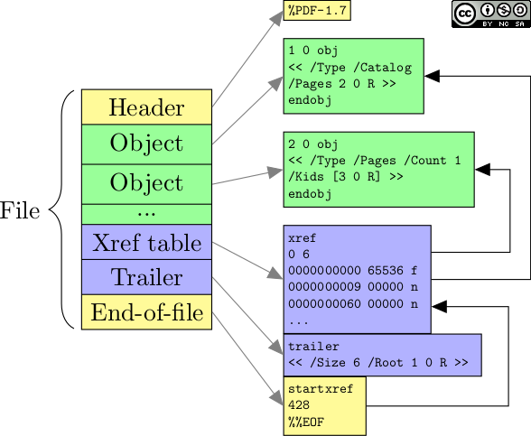
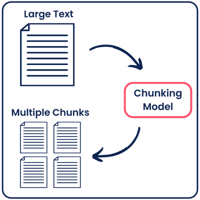

# Resumen · Unidad 1: Extracción y Procesamiento de Texto

> **Fuentes:** apunte de la cátedra (Notion), consigna de la práctica de scraping (Lectulandia) y enunciado del TP2.
> **Cómo usarlo:** leé primero el mapa (§0) y las ideas fuerza de cada sección. Las tablas son para repasar rápido. Antes del parcial, recorré las **trampas** (§6), las **preguntas de desarrollo** (§7) y los **casos prácticos** (§8).

---

## 0. Mapa de la unidad

```
 FUENTE              EXTRACCIÓN            PARSEO               LIMPIEZA Y              TOKENIZACIÓN        ANALÍTICA
 PDF, HTML,   ──►    texto plano    ──►    texto → datos  ──►   NORMALIZACIÓN     ──►   oraciones,    ──►   frecuencias,
 audio, imagen,      (o Markdown)          estructurados        minúsculas, acentos,    palabras,           n-gramas,
 DOCX, BD, web                                                  stopwords, ortografía   subpalabras         co-ocurrencia
                                                                        │
                                                                        └──► SEGMENTACIÓN (chunking) ──► Unidad 2: vectores
```

**Idea fuerza de toda la unidad:** cada paso es una **decisión con costo**. Se gana homogeneidad y se pierde información. No hay un preprocesamiento «correcto» universal: **decide la tarea** (y, como se ve en la Unidad 2, **el modelo**).

---

## 1. Extracción de texto

### 1.1 Qué es y qué no es

| | Extracción de **texto** | Extracción de **información** |
|---|---|---|
| Qué hace | Recupera y aísla **texto plano** de un contenedor | Obtiene **entidades, relaciones o eventos** estructurados |
| Entrada | PDF, HTML, audio, imágenes escaneadas… | Un texto **ya extraído** |
| Orden | Primero | Después |

Fuentes típicas: documentos (Word, PDF, TXT, RTF), páginas web, redes sociales (vía APIs con credenciales), correo, bases de datos, transcripciones de audio o video, y literatura digitalizada (PDF, EPUB, MOBI).

### 1.2 Codificación de caracteres

- **UTF-8** es de **longitud variable**: ASCII ocupa 1 byte, y el resto (tildes, ñ, ¿) ocupa 2 o más. Es la codificación por defecto en Python 3.
- **ISO-8859-1** (Latin-1) usa **1 byte fijo** por carácter y **sí** incluye las vocales acentuadas.
- Ejemplo del apunte, «¿Cómo estás?» (12 caracteres):

| Carácter | UTF-8 | ISO-8859-1 |
|---|---|---|
| ¿ | C2 BF (2 bytes) | BF (1 byte) |
| ó | C3 B3 (2 bytes) | F3 (1 byte) |
| á | C3 A1 (2 bytes) | E1 (1 byte) |
| **Total** | **15 bytes** | **12 bytes** |

- Abrir un archivo con la codificación equivocada da caracteres raros o un **`UnicodeDecodeError`**. Se corrige indicándola: `open(..., encoding='iso-8859-1')`.

> 📝 `latin-1` e `iso-8859-1` son **el mismo** encoding con dos nombres.

### 1.3 Formatos y herramientas

| Formato | Qué hay que saber | Herramientas |
|---|---|---|
| **TXT** | Texto sin formato; lo único que importa es la codificación | `open()` + `encoding` |
| **HTML** | Etiquetas (`<p>`, `<h1>`…`<h6>`, `<strong>`, `<em>`, `<pre>`, `<blockquote>`…); el texto suele estar en `<body>` | **BeautifulSoup** + **lxml**. Quitar todas las etiquetas también borra los cortes de `<p>` y `<br>` |
| **Markdown** | Texto con sintaxis de formato; es el estándar de GitHub | `markdown` o `mistune` (Markdown → HTML); `html2text` (HTML → texto plano) |
| **PDF digital** | Tiene capa de texto | **PyPDF2 / pypdf** (pypdf es el sucesor moderno), **pdfplumber** (tablas y estructura), **PyMuPDF** (muy rápido). Metadatos con `PdfReader` |
| **PDF escaneado** | Cada página es una **imagen**: no hay texto | **pdf2image** (requiere `poppler-utils`) → OCR |
| **Imagen** (JPG, PNG, BMP…) | Hace falta OCR | **pytesseract** (wrapper de Tesseract, junto con Pillow); **EasyOCR** si además se necesitan las **coordenadas** |
| **DOCX** | Formato basado en XML (Word 2007 en adelante) | **python-docx** |
| **Audio** | Reconocimiento del habla | **SpeechRecognition** (usa el servicio de Google); **Whisper** |
| **Video** | Primero hay que extraer la pista de audio | **ffmpeg**; **youtube-transcript-api** para transcripciones de YouTube |
| **Wikipedia** | Artículos por título e idioma | **wikipedia-api** |
| **Bases de datos** | SQL | **sqlite3** (incluida en Python), **psycopg2** (PostgreSQL), **PyMySQL** (MySQL), **SQLAlchemy** (ORM, varios motores) |
| **Tabulares** | Excel, CSV, Parquet | **pandas** |
| **JSON** | Local o desde una URL | **json** (+ **requests** para bajarlo) |

**Estructura de un PDF** (pregunta clásica de memoria):

1. **Cabecera**: la versión, por ejemplo `%PDF-1.7`.
2. **Cuerpo**: los objetos numerados (texto, imágenes, gráficos), organizados en árbol. El **catálogo** es la raíz, y de él cuelgan los objetos de página y los objetos de contenido (las instrucciones de dibujo).
3. **Tabla de referencias cruzadas** (*xref*): dónde está cada objeto, para acceder sin leer todo el archivo.
4. **Trailer**: dónde está la xref y cuál es el objeto raíz.
5. **EOF**: `%%EOF`.



**OCR:** nunca es 100 % preciso. Se mejora preprocesando la imagen (binarización, suavizado, eliminación de ruido) o entrenando con un conjunto de caracteres propio.

**Whisper:** es un **Transformer secuencia a secuencia multitarea**, entrenado con audios grandes y diversos. Hace reconocimiento multilingüe, traducción de voz, identificación del idioma y detección de actividad de voz. Las tareas se indican con **tokens especiales**, así que un solo modelo reemplaza varias etapas de un pipeline clásico.

### 1.4 Conversores de documentos: de extraer texto a reconstruir estructura

**Por qué existen:** un PDF **no guarda párrafos, guarda instrucciones de dibujo** («esta letra en esta coordenada»). `.extract_text()` pierde columnas, tablas y títulos. Un pipeline de NLP, y sobre todo uno para un LLM o un RAG, necesita la **estructura** (títulos, listas, tablas, orden de lectura). Por eso el formato intermedio típico de la ingestión es **Markdown**.

| Herramienta | Rol | Cuándo | Qué implica |
|---|---|---|---|
| **MarkItDown** (Microsoft) | Wrapper liviano a Markdown | Muchos formatos, prototipos, scripts | Instalación chica; para un OCR decente pide un LLM o Azure |
| **Docling** | Parser estructurado local | Tablas, orden de lectura, exportar a Markdown o JSON, sin nube | Más pesado (descarga modelos); corre en CPU |
| **Marker** | Calidad en PDF difíciles | Multicolumna, fórmulas, escaneos, papers | Casi necesita GPU; los pesos del modelo tienen licencia restrictiva |
| **MinerU** | Documentos complejos | Escaneos, fórmulas a LaTeX, tablas a HTML | Pesado; el backend `pipeline` corre en CPU y el modo VLM pide GPU |

> 🎯 **Criterio en una frase:** MarkItDown para entrar; Docling para estructura local; MinerU para papers y escaneos; Marker cuando la calidad del PDF importa y hay GPU.
>
> ⚠️ No son intercambiables, y **convertir a Markdown no elimina la necesidad de limpiar y segmentar**.

### 1.5 Web scraping

**Definición:** extraer información de sitios web, convirtiendo HTML en un formato estructurado (CSV, JSON, XML).

**Flujo cliente-servidor:**

- **Contenido estático:** el servidor devuelve un archivo que ya existe.
- **Contenido dinámico:** el servidor consulta una base de datos y genera el HTML.
- **Formularios:** el cliente envía datos por **POST**, y el servidor los valida y responde con una redirección o un error.


| Herramienta | Qué hace | Ejecuta JavaScript |
|---|---|---|
| **requests** | Hace pedidos HTTP y baja el HTML inicial | ❌ |
| **BeautifulSoup** | **Parsea** HTML (`find_all`, selectores CSS con `select`) | ❌ (no hace pedidos) |
| **Scrapy** | Framework de crawling | ❌ |
| **Selenium / Playwright** | Automatizan un **navegador real** | ✅ |
| **mechanize** | Navegación programática con formularios (el apunte la menciona para logins) | ❌ |

**Login con `requests`:** un objeto **`Session`** conserva las **cookies** entre pedidos (el ID de sesión). Así, después del POST de login, el GET a la página protegida sale autenticado. Algunos sitios piden además tokens **CSRF** o cabeceras especiales, y si el login usa JavaScript hace falta Playwright o Selenium.

**Ética y legalidad:** respetar los **términos de servicio** y el archivo **`robots.txt`**. Es una actividad legalmente «gris» en algunas jurisdicciones, y los sitios pueden bloquear o limitar a los scrapers.

**Práctica de Lectulandia (TP1):**

- **Playwright navega** (Chromium, puede correr sin ventana): abre la categoría, pagina y visita cada ficha. **BeautifulSoup interpreta** el HTML que Playwright le entrega.
- Pasos: abrir la categoría → recorrer las páginas → obtener el HTML → analizarlo con BeautifulSoup → extraer las URL de las fichas → visitar cada ficha → extraer metadatos y sinopsis → limpiar y validar → **eliminar duplicados** → guardar el CSV.
- Requisitos: pausa entre páginas, manejo de errores sin cortar la ejecución, guardado **incremental**, sin duplicados (por `url_libro`) y campos ausentes representados siempre igual. **Prohibido descargar los libros**: solo metadatos y sinopsis públicas.

### 1.6 Parseo de texto

**Definición:** analizar una cadena para **extraer, interpretar o estructurar** su contenido según reglas, patrones o gramáticas. Pasa de datos no estructurados a listas, diccionarios, objetos o tablas.

- **Entrada:** logs, CSV, JSON, XML, respuestas de APIs, lo que escribe un usuario.
- **Proceso:** delimitadores, expresiones regulares o estructuras sintácticas.
- **Salida:** tokens, números, fechas, árboles de sintaxis.
- **Usos:** validar formatos, extraer datos, convertir entre formatos, analizar sintaxis.

| Herramienta | Cuándo |
|---|---|
| `split()` | Formato fijo y predecible. **Frágil** si el formato cambia |
| `re` | Patrones flexibles: emails, teléfonos, fechas |
| **`parse`** | «`format()` al revés»: `parse("{:d}-{:d}-{:d} {:d}:{:d}", "07-23-2023 16:30")` |
| BeautifulSoup | HTML |

> 💡 **Parsear es decidir qué es mensaje y qué es ruido**, sin borrar las señales expresivas (mayúsculas sostenidas, repeticiones, signos enfáticos, emojis). Si una parte del corpus llega «sucia» o con señales borradas, las conclusiones se sesgan.

---

## 2. Procesamiento de texto

### 2.1 Limpieza y normalización

| Técnica | Qué hace | Cómo | ⚠️ Qué se pierde / cuándo no |
|---|---|---|---|
| **Minúsculas** | Unifica «Casa» y «casa» | `lower()`; `casefold()` para comparar | Entidades con nombre (`Madrid` y `madrid`) |
| **Puntuación** | Reduce el tamaño de los datos | Regex `[^\w\s]` | Los límites de oración. Los LLM trabajan con el texto completo |
| **Acentos** | Búsquedas insensibles a acentos («cafe» = «café»); homogeneiza fuentes | `unicodedata.normalize('NFKD')` + filtrar los caracteres combinantes | Distinciones como `si` y `sí`, o `el` y `él` |
| **Stopwords** | Saca palabras muy frecuentes y poco informativas; reduce dimensión y ruido | NLTK `stopwords.words('spanish')` + `casefold()` | **Negaciones, intensificadores y moduladores** («no», «muy», «apenas»). Conviene una lista **personalizada** |
| **Estandarización** | Formato uniforme: abreviaturas, jerga | Diccionario de reemplazos (`lookup_dict`) | — |
| **Corrección ortográfica** | Evita que los errores generen «palabras» distintas | TextBlob (bueno en **inglés**); **pyspellchecker** y **autocorrect** (`Speller`) para español | Hacerla **después** de resolver las abreviaturas («pq» → «porque») |
| **Emojis** | Ruido o **señal emocional**, según la tarea | Eliminar, **convertir a texto** o **tratar como tokens**. Librerías: `emoji`, `emot`, `demoji` (esta última en inglés) | En análisis de sentimiento suelen ser señal |

**Normalización Unicode, en detalle:** caracteres que se ven iguales pueden **no serlo**: `"Ç" == "Ç"` da `False` (Ç precompuesta frente a C + cedilla combinante). La forma **NFKD** descompone la letra y su acento, y después se descartan los combinantes.

> 💡 **Del TP2:** cada decisión de preprocesamiento es una **pérdida de información deliberada**. Pasar a minúsculas pierde entidades; sacar acentos pierde «sí» contra «si»; sacar puntuación pierde límites de oración; sacar stopwords pierde negaciones. Y además, **el preprocesamiento pertenece al modelo, no al corpus**: la limpieza que sirve para TF-IDF **destruye** información que usa un modelo de oración (ver Unidad 2).

### 2.2 Tokenización

- Divide el texto en **unidades mínimas significativas**: **oraciones**, **palabras** o **subpalabras** (útiles con morfología rica, errores o neologismos).
- Es un paso **obligatorio** en cualquier análisis. Herramientas: NLTK (`word_tokenize`, `sent_tokenize`), spaCy, TextBlob.
- **Tokenizar no elimina nada: segmenta.** Define **qué cuenta como evidencia** para el modelo. Un mismo texto tokenizado de dos formas son, para el modelo, dos realidades distintas.
- Decisiones del español: la puntuación, los emojis, las tildes, las contracciones («del», «al») y los clíticos («dámelo»).

### 2.3 Stemming y lematización

| | **Stemming** (derivación) | **Lematización** |
|---|---|---|
| Qué hace | Recorta sufijos para llegar a una raíz | Reduce la palabra a su **lema** (forma de diccionario) |
| Cómo | Reglas heurísticas (**Porter**, **Snowball**), sin diccionario | **Diccionarios** y análisis **morfológico**; usa el **contexto** y la **categoría gramatical** |
| Resultado | Puede **no ser una palabra** real | **Siempre** es una palabra válida |
| Costo | Rápido y barato | Más lento |
| Matices | **Aplana** matices | Los conserva mejor (se puede guardar el grado: comparativo, superlativo) |
| Herramienta del apunte | NLTK `SnowballStemmer('spanish')` | **spaCy** con `es_core_news_sm` |
| Ejemplo | «corriendo», «corre» → «corr» | «hojas» → «hoja»; «buenísimo» → «bueno» |
| Conviene para | Búsqueda y recuperación de información | Tareas donde importa la precisión o la interpretabilidad |

---

## 3. Analítica de texto

| Análisis | Qué mide | Herramienta |
|---|---|---|
| **Frecuencia** | Cuántas veces aparece cada palabra: da idea del tema | NLTK `FreqDist` |
| **Estructura** | Cantidad y largo de las oraciones: estilo simple o complejo | `sent_tokenize` |
| **Nube de palabras** | Visualización de las frecuencias | `wordcloud` |
| **n-gramas** | Secuencias **contiguas** de n palabras | `nltk.util.ngrams`; `ngram_range` en sklearn |
| **Co-ocurrencia** | Qué palabras aparecen **juntas** en un ámbito acotado | `CountVectorizer` → matriz de co-ocurrencia |
| **Correlación** | Si la presencia de una se asocia a la de otra, **considerando también la ausencia** | Pearson (`pandas.corr()`), información mutua |

**n-gramas:** en «El gato come pescado», los bigramas son «El gato», «gato come» y «come pescado» (las ventanas se **solapan**: n palabras dan n − 1 bigramas). Sirven para **predecir la palabra siguiente** a partir de las n − 1 anteriores (un modelo de bigramas usa 1 palabra de contexto, uno de trigramas usa 2), y también en corrección ortográfica y traducción. Su límite: si una secuencia no apareció en el corpus, el modelo no predice nada (en el ejemplo del apunte, «de la» → `[]`).

**Co-ocurrencia: el «ámbito acotado»** se define de dos maneras:

- **Ventana de palabras:** por ejemplo, ±5 palabras.
- **Límite estructural:** la misma oración, párrafo o tweet, sin importar la distancia.

Acotar el ámbito permite capturar relaciones reales: «inteligencia» y «artificial», «tasas» e «interés».

**Co-ocurrencia contra correlación:** la co-ocurrencia es un **prerrequisito** de la correlación, pero dos palabras pueden co-ocurrir **por azar**. La correlación mira el patrón de **presencia y ausencia** en **todos** los documentos y evalúa si es estadísticamente consistente.

> 📝 **Fe de erratas:** el apunte dice que una correlación alta indica que el otro término «tiende a no aparecer (correlación nula)». Eso es una correlación **negativa**; la nula es la **ausencia** de relación lineal (Pearson = 0).

---

## 4. Segmentación de texto (*chunking*)

**Qué es:** dividir el texto en fragmentos manejables (*chunks*). Es clave para la **búsqueda semántica** y los **agentes o RAG**, que arman su contexto con fragmentos, y porque los modelos de embeddings tienen un **límite de tokens**.



| Estrategia | Cómo | Herramientas |
|---|---|---|
| **Tamaño fijo** | N caracteres o tokens, con solapamiento opcional. La más común, barata y sin librerías de NLP | `CharacterTextSplitter` (LangChain), con separador o regex |
| **Por oraciones** | Respeta los límites de oración | Partir por «.» (ingenuo), NLTK `sent_tokenize`, **spaCy**, **stanza**, **pySBD** (22 idiomas, muy bueno en español) |
| **Recursiva** | Jerarquía de separadores `["\n\n", "\n", " ", ""]` hasta llegar al tamaño buscado | `RecursiveCharacterTextSplitter` |
| **Especializada** | Respeta la estructura de **Markdown** (títulos, listas, código) o **LaTeX** (secciones, ecuaciones) | `MarkdownTextSplitter`, `LatexTextSplitter` |
| **Semántica** | Agrupa oraciones por **similitud de embeddings** y corta donde cambia el tema | **chonkie** `SemanticChunker` (`threshold`, `chunk_size`, `similarity_window`; `threshold='auto'`) |

**Parámetros:**

- **`chunk_size`**: tamaño **máximo**. Los chunks tienen **≤** `chunk_size`, **no** exactamente ese tamaño.
- **`chunk_overlap`**: cuánto del final de un chunk se repite al inicio del siguiente, para **preservar contexto** y no cortar ideas. Si es muy chico, los chunks pueden quedar sin sentido; si es muy grande, se inflan y repiten información. El solapamiento **no siempre es exacto**: depende de dónde encuentre el splitter un separador.

**Cómo elegir el tamaño:**

1. **Preprocesar** primero (sacar HTML y ruido).
2. Considerar la naturaleza del contenido (textos cortos o largos) y el **modelo de embeddings** y su límite de tokens.
3. Probar un **rango**: chunks chicos (128–256 tokens) dan información granular; chunks grandes (512–1024) retienen más contexto.
4. Buscar el equilibrio entre **contexto y precisión**, y evaluarlo.

---

## 5. Chuleta de herramientas

| Herramienta | Para qué |
|---|---|
| BeautifulSoup + lxml | Parsear HTML |
| requests (`Session`) | Pedidos HTTP; mantener el login con cookies |
| Playwright / Selenium | Automatizar un navegador (páginas con JavaScript) |
| Scrapy | Framework de crawling |
| markdown / mistune / html2text | Markdown → HTML → texto plano |
| PyPDF2 / pypdf / PyMuPDF | Texto de PDF digital |
| pdfplumber | PDF con tablas y estructura |
| pdf2image (+ poppler) | PDF → imágenes |
| pytesseract (Tesseract) / EasyOCR | OCR (EasyOCR da además las coordenadas) |
| python-docx | Word (.docx) |
| MarkItDown / Docling / Marker / MinerU | Conversión de documentos a Markdown estructurado |
| SpeechRecognition / Whisper / ffmpeg | Audio a texto; extraer el audio de un video |
| youtube-transcript-api / wikipedia-api | Transcripciones de YouTube; artículos de Wikipedia |
| sqlite3 / psycopg2 / PyMySQL / SQLAlchemy | Bases de datos |
| pandas / json | Datos tabulares; JSON |
| re / parse | Parseo con regex; parseo de formatos fijos |
| unicodedata | Normalización Unicode, quitar acentos |
| NLTK | Stopwords, tokenización, `SnowballStemmer`, `FreqDist`, n-gramas, `sent_tokenize` |
| spaCy / stanza / pySBD | Lematización; segmentación en oraciones |
| TextBlob / pyspellchecker / autocorrect | Corrección ortográfica (TextBlob: inglés) |
| emoji / emot / demoji | Emojis a texto |
| wordcloud | Nube de palabras |
| LangChain text splitters / chonkie | Chunking (fijo, recursivo, Markdown o LaTeX; semántico) |

---

## 6. Trampas típicas de parcial

1. **Extracción de texto ≠ extracción de información.**
2. **ISO-8859-1 sí tiene tildes.** La diferencia de bytes se debe a que UTF-8 es de longitud variable.
3. **Un PDF escaneado no tiene texto:** cambiar la codificación o usar otro lector de PDF no sirve. Hace falta OCR.
4. **BeautifulSoup no ejecuta JavaScript ni hace pedidos**, y `requests` tampoco ejecuta JS.
5. **Convertir a Markdown no reemplaza** la limpieza ni la segmentación.
6. **Tokenizar no elimina nada:** segmenta.
7. **Quitar stopwords no siempre ayuda:** en sentimiento, «no», «muy» y «sin» cambian el sentido.
8. **Primero las abreviaturas, después el corrector ortográfico.**
9. **El stem puede no ser una palabra; el lema sí.** La lematización usa contexto y diccionario.
10. **Co-ocurrencia no es correlación:** la correlación considera también la ausencia y descarta el azar.
11. **Los chunks tienen como máximo `chunk_size`,** no exactamente ese tamaño.
12. **El overlap es intencional** (preserva contexto) y no siempre exacto.
13. **Los n-gramas se solapan:** 4 palabras dan 3 bigramas.

---

## 7. Preguntas de desarrollo para practicar

> Intentá responder cada una antes de abrir la respuesta. Son respuestas modelo: cubren lo que se espera encontrar en un parcial.

### 7.1 Tres fuentes distintas (PDF digital con tablas, PDF escaneado, fotos): qué herramienta usarías en cada caso y por qué

<details>
<summary>Ver respuesta</summary>

La primera pregunta es siempre **si el archivo tiene capa de texto o es una imagen**.

- **PDF digital con tablas:** tiene capa de texto, así que no hace falta OCR. Pero un PDF guarda **instrucciones de dibujo** («esta letra en esta coordenada»), no celdas ni párrafos, y `extract_text()` de pypdf o PyMuPDF devuelve la tabla como texto corrido. Por eso conviene **pdfplumber**, que reconstruye tablas a partir de las posiciones, o **Docling**, que es un parser estructurado local que respeta tablas y orden de lectura y exporta a Markdown o JSON.
- **PDF escaneado:** cada página es una **imagen**, y no hay texto que extraer: un lector de PDF devuelve vacío, y cambiar la codificación no sirve. Hay que convertir las páginas a imágenes con **pdf2image** (que necesita poppler) y aplicar **OCR** con **pytesseract**. Preprocesar la imagen (binarizar, eliminar ruido) mejora el resultado. Si tiene fórmulas o un diseño complejo, **MinerU** o **Marker**.
- **Fotos:** OCR directo con **pytesseract** (junto con Pillow). Si importa **dónde** está cada texto, por ejemplo en carteles o formularios, conviene **EasyOCR**, que devuelve las coordenadas de cada fragmento.

En los tres casos, el OCR **nunca es 100 % preciso**: hay que validar la salida, y después limpiar y segmentar.

</details>

### 7.2 Stemming contra lematización: funcionamiento, costo, calidad, cuándo conviene cada uno, con ejemplos

<details>
<summary>Ver respuesta</summary>

Las dos técnicas reducen las variantes de una palabra a una forma común, para que «corre», «corriendo» y «corrió» cuenten como lo mismo.

- **Stemming:** recorta sufijos con **reglas heurísticas** (Porter, Snowball), sin diccionario ni contexto.
  - Es **rápido y barato**.
  - La raíz que deja **puede no ser una palabra**: «corriendo» y «corre» → «corr».
  - **Aplana matices** y puede juntar palabras distintas que comparten raíz.
  - En NLTK: `SnowballStemmer('spanish')`.
- **Lematización:** lleva cada palabra a su **lema**, la forma de diccionario. Usa **diccionarios, análisis morfológico, la categoría gramatical y el contexto**.
  - El resultado **siempre es una palabra válida**: «hojas» → «hoja», «buenísimo» → «bueno».
  - Es **más lenta**, pero más precisa, y puede conservar información como el grado (comparativo, superlativo).
  - En spaCy: el modelo `es_core_news_sm`.
- **Cuándo conviene cada uno:**
  - **Stemming**, cuando importan la velocidad y el *recall*: búsqueda y recuperación de información sobre grandes volúmenes.
  - **Lematización**, cuando importan la precisión o la interpretabilidad: análisis de sentimiento, extracción de información, o resultados que va a leer una persona.

</details>

### 7.3 Pipeline de preprocesamiento para análisis de sentimiento: qué aplicás y qué evitás

<details>
<summary>Ver respuesta</summary>

La idea central es que en sentimiento **muchas cosas que en otras tareas son ruido acá son señal**.

**Qué aplico, en este orden:**

1. **Extraer y parsear sin borrar las señales expresivas:** mayúsculas sostenidas («MALÍSIMO»), repeticiones («buenooo»), signos enfáticos («!!!») y emojis.
2. **Emojis:** convertirlos a texto («😡» → «cara enojada») o tratarlos como tokens. Son **señal emocional**.
3. **Expandir abreviaturas y jerga** con un diccionario («pq» → «porque», «x» → «por»). Va **antes** de corregir: si no, el corrector convierte la abreviatura en otra palabra.
4. **Corrección ortográfica**, con pyspellchecker o autocorrect para español.
5. **Minúsculas**, guardando antes como rasgo, si interesa, que el texto venía en mayúsculas sostenidas (un «grito»).
6. **Stopwords con una lista personalizada**, que conserve **negaciones** («no», «nunca», «sin»), **intensificadores** («muy») y **moduladores** («apenas», «pero»).
7. **Tokenizar y lematizar**, mejor que *stemming* porque conserva matices.
8. **n-gramas (bigramas):** así «no bueno» es una unidad, y no la palabra «bueno» suelta.

**Qué evito:**

- Quitar stopwords con una lista genérica: «no me gustó» sin «no» invierte el sentido.
- Borrar los emojis y la puntuación expresiva.
- Corregir la ortografía antes de expandir las abreviaturas.
- Un *stemming* agresivo, que aplane «buenísimo» y «bueno».

</details>

### 7.4 Por qué los conversores generan Markdown, y en qué se diferencian MarkItDown, Docling, MinerU y Marker

<details>
<summary>Ver respuesta</summary>

**Por qué Markdown:**

- Un PDF **no guarda párrafos: guarda instrucciones de dibujo**. Al extraer el texto se pierden columnas, tablas, títulos y el orden de lectura.
- Un pipeline de NLP, y sobre todo un LLM o un RAG, necesita esa **estructura**: para segmentar por secciones, para que cada fragmento conserve su título y para que las tablas sigan siendo tablas.
- Markdown es **texto plano** (barato, legible por personas y por LLM) que **conserva la estructura** con una sintaxis mínima (`#` títulos, listas, tablas). Además, se puede segmentar respetando esa estructura (`MarkdownTextSplitter`). Por eso es el formato intermedio típico de la ingestión.

**Diferencias:**

| Herramienta | Qué es | Cuándo usarla | Costo |
|---|---|---|---|
| **MarkItDown** (Microsoft) | Wrapper liviano, muchos formatos | Prototipos y scripts; para empezar | Instalación chica; para un OCR decente pide un LLM o Azure |
| **Docling** | Parser estructurado local | Tablas y orden de lectura sin nube; exporta a Markdown o JSON | Más pesado (descarga modelos), pero corre en CPU |
| **MinerU** | Documentos complejos | Escaneos, fórmulas a LaTeX, tablas a HTML; papers | Pesado; el modo VLM pide GPU |
| **Marker** | Máxima calidad en PDF difíciles | Multicolumna, fórmulas, escaneos | Casi necesita GPU; licencia de los pesos restrictiva |

**Criterio:** MarkItDown para entrar, Docling para estructura local, MinerU para papers y escaneos, Marker cuando la calidad importa y hay GPU. Y en todos los casos, **convertir a Markdown no reemplaza la limpieza ni la segmentación**.

</details>

### 7.5 Scraping de un sitio con login y contenido generado con JavaScript: qué herramientas usás y qué cuidados éticos y técnicos tomás

<details>
<summary>Ver respuesta</summary>

**Herramientas:**

- **`requests` + BeautifulSoup no alcanzan.** `requests` solo baja el HTML inicial, BeautifulSoup solo parsea, y ninguno de los dos **ejecuta JavaScript**. Si el contenido se genera en el navegador, en ese HTML no está.
- **Playwright o Selenium** automatizan un **navegador real** (puede correr sin ventana): completan el formulario de login, esperan a que se renderice el contenido y navegan las páginas.
- **BeautifulSoup** para interpretar el HTML ya renderizado que devuelve el navegador. Es la combinación de la práctica de Lectulandia: Playwright navega y BeautifulSoup interpreta.
- **Si el login es un POST simple sin JavaScript**, alcanza con `requests.Session`, que conserva las cookies de sesión entre pedidos. Si hay tokens **CSRF** o el login depende de JavaScript, Playwright.

**Cuidados técnicos:**

- Esperar a que aparezcan los elementos antes de leerlos, y usar selectores robustos.
- **Pausas entre pedidos**, para no saturar el servidor.
- Manejar los errores sin cortar la ejecución, y guardar de forma **incremental** para poder reanudar.
- Eliminar duplicados y representar siempre igual los campos ausentes.
- No hacer login en cada pedido: reutilizar la sesión.

**Cuidados éticos y legales:**

- Respetar los **términos de servicio** y el **`robots.txt`**. Es una zona legalmente gris en algunas jurisdicciones.
- **Credenciales fuera del código**, por ejemplo en variables de entorno.
- No extraer datos personales ni contenido protegido: en Lectulandia, solo metadatos y sinopsis públicas, nunca los libros.
- Limitar la tasa de pedidos: los sitios pueden bloquear a los scrapers agresivos.

</details>

### 7.6 Estrategias de chunking, y cómo elegir `chunk_size` y `chunk_overlap` para un RAG

<details>
<summary>Ver respuesta</summary>

**Por qué segmentar:** los modelos de embeddings tienen un **límite de tokens** (lo que lo supera se trunca sin aviso), y un RAG arma el contexto del LLM con **fragmentos** recuperados. Un chunk enfocado en una idea se recupera con más precisión que un documento entero.

**Estrategias:**

| Estrategia | Cómo funciona | Cuándo conviene |
|---|---|---|
| **Tamaño fijo** | N caracteres o tokens, con solapamiento | La más simple y barata; un buen punto de partida |
| **Por oraciones** | Respeta los límites de oración (spaCy, NLTK, pySBD) | No cortar ideas a la mitad |
| **Recursiva** | Prueba separadores jerárquicos `["\n\n", "\n", " ", ""]` hasta llegar al tamaño | Texto general; respeta párrafos cuando puede |
| **Especializada** | Sigue la estructura de Markdown o LaTeX | Documentación y papers ya convertidos |
| **Semántica** | Agrupa oraciones por similitud de embeddings y corta donde cambia el tema | Cuando el tema cambia sin marcas de formato |

**Cómo elegir `chunk_size`:**

1. **Preprocesar** antes: sacar el HTML y el ruido.
2. **No superar el límite de tokens** del modelo de embeddings.
3. Considerar el contenido: textos cortos (mensajes) contra largos (manuales).
4. Saber qué se gana y qué se pierde:
   - **Chunks chicos** (128–256 tokens): información granular y recuperación precisa, pero cada fragmento tiene poco contexto.
   - **Chunks grandes** (512–1024): más contexto, pero el embedding mezcla varios temas y le llega más ruido al LLM.
5. **Probar un rango y evaluarlo** con consultas reales.

**`chunk_overlap`:** cuánto del final de un chunk se repite al principio del siguiente, para no cortar una idea justo en el borde. Si es muy chico, quedan fragmentos sin sentido; si es muy grande, se repite información y crecen la cantidad de chunks y el costo. Un valor orientativo es una fracción chica del `chunk_size`.

**Dos aclaraciones:** `chunk_size` es un **máximo**, no un tamaño exacto, y el solapamiento **no siempre es exacto**, porque depende de dónde encuentre el splitter un separador.

</details>

### 7.7 Co-ocurrencia contra correlación de palabras, con un ejemplo

<details>
<summary>Ver respuesta</summary>

- **Co-ocurrencia:** cuenta cuántas veces dos palabras aparecen **juntas en un ámbito acotado**. Ese ámbito puede ser una **ventana** (por ejemplo, ±5 palabras) o una **unidad estructural** (la misma oración, el mismo párrafo, el mismo tweet). Se arma con una matriz de co-ocurrencia, por ejemplo a partir de `CountVectorizer`.
- **Correlación:** mide si la **presencia** de una palabra se **asocia estadísticamente** a la de la otra **a lo largo de todos los documentos**, considerando también cuándo **no** aparecen. Se calcula con Pearson (`pandas.corr()`) sobre los vectores de presencia por documento, o con información mutua.
- **La diferencia:** la co-ocurrencia es un **prerrequisito** de la correlación, pero dos palabras pueden co-ocurrir **por azar** o porque una de ellas aparece en todos lados. La correlación descarta eso, porque mira el patrón completo de presencia y ausencia.

**Ejemplo, en un corpus de noticias:**

- **«tasas» e «interés»** co-ocurren mucho y además **correlacionan alto**: cuando aparece una, casi siempre aparece la otra, y cuando falta una, suele faltar la otra.
- **«el» y «gobierno»** co-ocurren muchísimo, porque «el» está en casi todas las oraciones, pero **la correlación es baja**: que aparezca «el» no dice nada sobre si aparece «gobierno».

**Ojo con los términos:** una correlación **negativa** significa que las palabras **tienden a excluirse**; una correlación **nula** significa que **no hay relación lineal**. El apunte los confunde (ver la fe de erratas del §3).

</details>

---

## 8. Casos prácticos: ¿cómo lo resolverías?

> Cada caso plantea un problema concreto. Pensá la solución completa (qué herramienta, en qué orden, qué cuidar) antes de abrir la respuesta.

### 8.1 Pólizas en PDF para un asistente con RAG

Una aseguradora tiene 10.000 pólizas en PDF y quiere un asistente que responda preguntas sobre las coberturas. La mitad son PDF generados por computadora; la otra mitad, escaneos de papel. Casi todas tienen **tablas** de coberturas y montos. ¿Cómo armás la ingestión de los documentos?

<details>
<summary>Ver resolución</summary>

**Diagnóstico:** hay dos tipos de documento que necesitan herramientas distintas, y las tablas son la información más valiosa: si se rompen, el asistente responde mal sobre montos y coberturas.

**Solución:**

1. **Clasificar cada PDF:** intentar extraer texto con pypdf. Si sale vacío o casi vacío, es un escaneo.
2. **PDF digitales:** usar un parser que **conserve la estructura**, como **Docling** o **pdfplumber**, y no `extract_text()`, que convierte las tablas en texto corrido. Exportar a **Markdown**, con títulos y tablas.
3. **PDF escaneados:** pasar las páginas a imágenes con **pdf2image** y aplicar OCR (**pytesseract**), preprocesando la imagen (binarizar, eliminar ruido). Con tablas complejas o muchos documentos, **Docling** o **MinerU** hacen OCR y además reconstruyen la tabla.
4. **Limpiar:** eliminar encabezados y pies de página repetidos, números de página y saltos de línea cortados.
5. **Segmentar respetando la estructura:** chunking por secciones de Markdown (`MarkdownTextSplitter` o recursivo), **sin partir una tabla** a la mitad y guardando como metadatos el número de póliza, la sección y la página. El `chunk_size` no puede superar el límite de tokens del modelo de embeddings.

**Cómo validarlo:** revisar a mano una muestra de escaneos (el OCR nunca es 100 % preciso), comparando montos contra el original, y probar el asistente con preguntas reales sobre coberturas.

**Qué evitar:** procesar todo con un solo lector de PDF, perder las tablas o creer que convertir a Markdown ya alcanza sin limpiar ni segmentar.

</details>

### 8.2 Caracteres raros en un CSV

Exportás los clientes de un sistema viejo a CSV y, al leerlo con pandas, aparece `UnicodeDecodeError`. Un compañero lo "arregla" abriéndolo con otra codificación, pero ahora los nombres dicen «Política» y «María». ¿Qué está pasando y cómo lo resolvés?

<details>
<summary>Ver resolución</summary>

**Diagnóstico:** es un problema de **codificación**: el texto se escribió con una codificación y se está leyendo con otra.

- **El `UnicodeDecodeError`** aparece al leer como UTF-8 bytes que no son UTF-8 válido: el archivo probablemente está en **ISO-8859-1 (Latin-1)** o en Windows-1252.
- **«Política»** es el síntoma inverso, llamado *mojibake*: bytes UTF-8 leídos como Latin-1. La «í» en UTF-8 son dos bytes (`C3 AD`); leídos como Latin-1, cada byte se vuelve un carácter: «Ã» y un guion invisible.

**Solución:**

1. **Averiguar la codificación real** del archivo: preguntar en el sistema de origen o probar las candidatas y mirar las palabras con tildes y ñ.
2. **Leer con la codificación correcta:** `pd.read_csv(ruta, encoding="latin-1")` si es Latin-1, o UTF-8 si es UTF-8.
3. **Si el texto ya quedó mal leído,** se puede deshacer: volver a los bytes con la codificación equivocada y decodificarlos con la correcta, `texto.encode("latin-1").decode("utf-8")`. El patrón del error indica qué pasó: «Ã» suele delatar UTF-8 leído como Latin-1, y «√» UTF-8 leído como Mac Roman (lo que apareció en el dataset de Lectulandia).
4. **Guardar el resultado en UTF-8** y documentarlo.

**Cómo validarlo:** buscar en todo el archivo los patrones típicos («Ã», «√», «�») y contar cuántos quedan. Antes, en el dataset de Lectulandia, el mojibake creaba géneros duplicados como «Histórico» e «Hist√≥rico».

**Qué evitar:** probar codificaciones hasta que "no dé error". Latin-1 **nunca** da error, porque cualquier byte es un carácter válido, así que leer todo como Latin-1 esconde el problema en vez de resolverlo.

</details>

### 8.3 Un buscador para 200 horas de clases grabadas

Una facultad tiene 200 horas de clases en video y quiere que los alumnos busquen un tema («regresión logística») y lleguen al minuto exacto en que se explica. ¿Cómo lo armás?

<details>
<summary>Ver resolución</summary>

**Diagnóstico:** el contenido está en el **audio**, así que primero hay que convertirlo en texto, y conservar **en qué minuto** se dijo cada cosa.

**Solución:**

1. **Extraer el audio** de cada video con **ffmpeg**. Si los videos están en YouTube y tienen subtítulos, **youtube-transcript-api** da la transcripción directamente.
2. **Transcribir con Whisper,** que es multilingüe, robusto al ruido y devuelve el texto en segmentos con **marcas de tiempo**.
3. **Limpiar la transcripción:** muletillas, repeticiones y errores en los términos técnicos. Un diccionario de términos de la materia ayuda a corregirlos.
4. **Segmentar por tiempo o por oraciones,** por ejemplo en fragmentos de 1 o 2 minutos con solapamiento, guardando como metadatos el video y el minuto de inicio de cada fragmento.
5. **Indexar los fragmentos** para buscar. Para encontrar el tema aunque el profesor lo diga con otras palabras, conviene una búsqueda por significado (Unidad 2). Cada resultado lleva al video en el minuto guardado.

**Cómo validarlo:** revisar una muestra de transcripciones (el reconocimiento del habla también se equivoca, sobre todo con nombres propios y términos técnicos) y probar búsquedas de temas que se sepa dónde están.

**Qué evitar:** transcribir sin guardar las marcas de tiempo, o indexar cada clase entera como un solo documento: el alumno llegaría a la clase, pero no al minuto.

</details>

### 8.4 Recetas de un sitio con scroll infinito

Querés armar un dataset con 2.000 recetas de un sitio. La página carga las recetas con JavaScript a medida que bajás (scroll infinito), y el `robots.txt` prohíbe acceder a `/api/`. ¿Cómo lo resolvés?

<details>
<summary>Ver resolución</summary>

**Diagnóstico:** con `requests` solo se obtiene el HTML inicial, sin las recetas, porque las genera JavaScript. Y el atajo técnico de llamar directo a `/api/` está **prohibido** por el sitio.

**Solución:**

1. **Revisar primero los términos de servicio y si existe una API oficial o un dataset público.** Si existe, usarla.
2. **Automatizar un navegador con Playwright** (o Selenium): abrir la página, **hacer scroll** y esperar a que carguen las tarjetas nuevas, hasta juntar los enlaces necesarios.
3. **Visitar cada receta con pausas** entre pedidos (por ejemplo, 1 o 2 segundos) y pasar el HTML renderizado a **BeautifulSoup** para extraer los campos: título, ingredientes y pasos.
4. **Ser robusto:** manejar errores sin cortar la ejecución, guardar de forma **incremental** para poder reanudar, eliminar duplicados por URL y representar siempre igual los campos faltantes.
5. **Respetar el `robots.txt`:** no tocar `/api/`, aunque sea técnicamente posible.

**Cómo validarlo:** comparar a mano algunas recetas extraídas con la página, y contar duplicados y campos vacíos.

**Qué evitar:** saturar el sitio con pedidos sin pausa, ignorar el `robots.txt` o descargar contenido que no se puede redistribuir.

</details>

### 8.5 Un buscador de productos que no encuentra nada

En un supermercado online, los usuarios buscan «cafe», «CAFÉ» o «cafés», y el buscador, que compara palabras exactas, solo encuentra los productos escritos igual que la búsqueda. ¿Qué preprocesamiento aplicás?

<details>
<summary>Ver resolución</summary>

**Diagnóstico:** las variantes de una misma palabra (mayúsculas, tildes, plural) se tratan como palabras distintas. En búsqueda importa sobre todo el *recall*: no perder productos relevantes.

**Solución:** aplicar **la misma normalización a la consulta y a los productos**.

1. **Minúsculas** con `casefold()`, más robusto que `lower()` para comparar.
2. **Quitar tildes** con `unicodedata.normalize("NFKD", ...)` y descartar los caracteres combinantes: así «café» = «cafe». En nombres de productos, perder la diferencia entre «si» y «sí» no importa.
3. **Stemming** (por ejemplo, `SnowballStemmer('spanish')`): «cafés» y «café» quedan con la misma raíz. Para búsqueda conviene más que la lematización, porque es rápido y prioriza el *recall*.
4. **Corrección ortográfica opcional,** para errores frecuentes como «cafe con lece».
5. **Stopwords:** sacar las palabras vacías de la consulta («de», «la», «para»).

**Cómo validarlo:** armar una lista de búsquedas reales con sus productos esperados y medir cuántos encuentra antes y después.

**Qué evitar:** normalizar solo los productos y no la consulta (o al revés), o un stemming tan agresivo que junte productos distintos con la misma raíz.

</details>

### 8.6 ¿Qué problemas aparecen juntos en los reclamos?

Una empresa de internet tiene 30.000 reclamos de clientes en texto libre y quiere saber qué problemas aparecen juntos, por ejemplo si «corte» suele venir con «lluvia» o con «módem». ¿Cómo lo analizás?

<details>
<summary>Ver resolución</summary>

**Diagnóstico:** es un problema de **co-ocurrencia y correlación** de términos.

**Solución:**

1. **Preprocesar:** minúsculas, stopwords, y lematización o stemming para que «cortes» y «corte» cuenten igual. Expandir abreviaturas frecuentes.
2. **Definir el ámbito:** cada **reclamo** es la unidad estructural; también se puede usar una ventana de palabras.
3. **Contar la co-ocurrencia:** una matriz de presencia de términos por reclamo, con `CountVectorizer(binary=True)`, y a partir de ella cuántas veces aparece cada par.
4. **Pasar a la correlación:** que dos términos co-ocurran mucho puede deberse solo a que los dos son muy frecuentes. La **correlación** (Pearson sobre la presencia y ausencia en todos los reclamos, o información mutua) mide si de verdad aparecen asociados más de lo que se esperaría por azar.
5. **Sumar n-gramas,** como «sin servicio» o «módem reinicia», que capturan problemas de más de una palabra.

**Cómo validarlo:** leer algunos reclamos de los pares más asociados y confirmar que la relación tiene sentido.

**Qué evitar:** concluir a partir de la co-ocurrencia sola: «internet» va a co-ocurrir con todo, porque está en casi todos los reclamos, y eso no indica ninguna relación entre problemas.

</details>

---

## 9. Glosario

- **Chunk:** fragmento de texto producido por la segmentación.
- **Co-ocurrencia:** aparición conjunta de palabras en un ámbito acotado (una ventana o una unidad estructural).
- **Encoding:** correspondencia entre caracteres y bytes (UTF-8, ISO-8859-1).
- **Lema:** forma de diccionario de una palabra («hoja» para «hojas»).
- **n-grama:** secuencia contigua de n tokens.
- **NFKD:** forma de normalización Unicode que descompone los caracteres (letra + acento combinante).
- **OCR:** *Optical Character Recognition*, reconocimiento de texto en imágenes.
- **Parseo:** análisis de una cadena para extraer o estructurar su contenido.
- **RAG:** *Retrieval-Augmented Generation*: se recuperan fragmentos relevantes para dárselos como contexto a un LLM.
- **robots.txt:** archivo con el que un sitio indica qué pueden recorrer los crawlers.
- **Stem:** raíz que resulta del stemming; puede no ser una palabra.
- **Stopwords:** palabras muy frecuentes y de poco contenido léxico (artículos, preposiciones…).
- **Token:** unidad mínima en la que se segmenta un texto.
