# Unidad 2 - Representación Vectorial de Texto


> Fuente: [https://gentle-cress-e61.notion.site/Unidad-2-Representaci-n-Vectorial-de-Texto-6ad0dcf3b18a447e8b2989b325b57d3f](https://gentle-cress-e61.notion.site/Unidad-2-Representaci-n-Vectorial-de-Texto-6ad0dcf3b18a447e8b2989b325b57d3f)

**UNR - TUIA - Procesamiento de Lenguaje Natural**

Docente teoría: Juan Pablo Manson - [jpmanson@gmail.com](mailto:jpmanson@gmail.com) - [LinkedIN](https://www.linkedin.com/in/juanpablomanson/)

**Introducción**

En el Procesamiento del Lenguaje Natural, uno de los desafíos más fundamentales es cómo representar el texto de una manera que los modelos puedan entender y procesar. Este capítulo se centra en la codificación y representación vectorial de Texto. Al convertir el texto en vectores numéricos, podremos luego aplicar una amplia gama de algoritmos de aprendizaje automático para tareas de NLP.

## 1. Codificación de Texto en Vectores

### One-hot encoding

La codificación One-Hot es una técnica de procesamiento de datos que se utiliza para convertir categorías nominales en un formato que se puede proporcionar a los algoritmos de aprendizaje automático para mejorar la precisión de las predicciones. Las categorías nominales son básicamente [**variables categóricas**](https://es.wikipedia.org/wiki/Variable_categ%C3%B3rica) que pueden ser divididas en múltiples categorías pero no tienen ningún orden ni prioridad. Son el tipo de variables que se utilizan para etiquetar un grupo con un nombre, como los nombres de las ciudades o los estados.

En el contexto del procesamiento del lenguaje natural (NLP), la codificación One-Hot se utiliza para convertir palabras en vectores. En este proceso, cada palabra de la frase se representa como un vector en n-dimensiones, donde n es el tamaño del vocabulario, es decir, el número total de palabras únicas en el texto. Cada palabra se representa con un vector de longitud n, donde la posición correspondiente a la palabra en el vocabulario se establece en 1, y todas las demás posiciones se establecen en 0.

Por ejemplo, si nuestro vocabulario consta de las palabras \['gato', 'perro', 'casa'\], la palabra 'gato' se representaría como \[1, 0, 0\], 'perro' como \[0, 1, 0\] y 'casa' como \[0, 0, 1\]:

|  |  |  |
|---|---|---|
| **gato** | **perro** | **casa** |
| 1 | 0 | 0 |
| 0 | 1 | 0 |
| 0 | 0 | 1 |

La codificación One-Hot es una forma simple y eficaz de representar datos categóricos para el aprendizaje automático, pero tiene la desventaja de que puede resultar en vectores de alta dimensionalidad si el vocabulario es muy grande. Además, la codificación One-Hot **no tiene en cuenta la similitud semántica entre las palabras**, es decir, palabras con significados similares no tienen vectores similares.

Para realizar la codificación One-Hot en Python, podemos utilizar la librería **`sklearn`**. Aquí vemos como hacerlo con la frase "*Me gustan las hamburguesas*":

```python
from sklearn.preprocessing import OneHotEncoder
import numpy as np

# Nuestra frase de trabajo
frase = "Me gustan las hamburguesas"

# Dividimos la frase en palabras
palabras = frase.split()

# Creamos un codificador One-Hot
onehot_encoder = OneHotEncoder(sparse=False)

# Ajustamos el codificador One-Hot a nuestras palabras
onehot_encoded = onehot_encoder.fit_transform(np.array(palabras).reshape(-1, 1))

# Imprimimos el resultado
print(onehot_encoded)

# Imprimimos cómo se codificó cada palabra
for i, palabra in enumerate(palabras):
    print(f"La palabra '{palabra}' se codificó como: {onehot_encoded[i]}")
```

La salida será una matriz donde cada fila corresponde a una palabra en la frase, y cada columna corresponde a una palabra única en el vocabulario. Un '1' en una posición indica que la palabra de esa fila es la palabra correspondiente a esa columna en el vocabulario.

El resultado de la ejecución será el siguiente:

```python
[[1. 0. 0. 0.]
 [0. 1. 0. 0.]
 [0. 0. 0. 1.]
 [0. 0. 1. 0.]]
La palabra 'Me' se codificó como: [1. 0. 0. 0.]
La palabra 'gustan' se codificó como: [0. 1. 0. 0.]
La palabra 'las' se codificó como: [0. 0. 0. 1.]
La palabra 'hamburguesas' se codificó como: [0. 0. 1. 0.]
```

También podemos usar Pandas para realizar codificaciones One-Hot. Los dummies son codificaciones basadas en el mismo mecanismo. Veamos un ejemplo:

```python
import pandas as pd

# Nuestra frase de trabajo
frase = "Me gustan las hamburguesas"

# Dividimos la frase en palabras
palabras = frase.split()

# Creamos un DataFrame a partir de nuestras palabras
df = pd.DataFrame(palabras, columns=['Palabras'])

# Creamos una codificación One-Hot usando get_dummies
onehot_encoded = pd.get_dummies(df['Palabras'])

# Imprimimos el resultado
print(onehot_encoded)

# Imprimimos cómo se codificó cada palabra
for i, palabra in enumerate(palabras):
    print(f"La palabra '{palabra}' se codificó como: {onehot_encoded.iloc[i].to_numpy()}")
```

Y el resultado será similar al obtenido con Scikit-Learn.

### Count Vectorizer

La técnica de Count Vectorizer es una forma de convertir texto en características numéricas. Es una técnica de codificación que es muy útil para el procesamiento del lenguaje natural y la minería de texto.

La idea detrás de Count Vectorizer es bastante simple. Para cada documento en nuestro conjunto de datos, contamos cuántas veces aparece cada palabra. Luego, creamos un vector para cada documento que contiene las cuentas de cada palabra. 

Supongamos que tenemos estos dos documentos:

- Documento 1: "Me gusta jugar fútbol"
- Documento 2: "Me gusta el tenis"

El vocabulario sería: \["Me", "gusta", "jugar", "fútbol", "el", "tenis"\]. En este caso, la vectorización de cada documento u oración, sería:

|  | Me | gusta | jugar | fútbol | el | tenis |
|---|---|---|---|---|---|---|
| **Documento 1** | 1 | 1 | 1 | 1 | 0 | 0 |
| **Documento 2** | 1 | 1 | 0 | 0 | 1 | 1 |

Una de las ventajas de Count Vectorizer es que es muy fácil de entender e implementar. Sin embargo, tiene la desventaja de que **no tiene en cuenta el orden de las palabras en el documento**, lo que puede ser importante en muchos contextos de procesamiento del lenguaje natural.

Además, Count Vectorizer puede dar mucha importancia a las palabras que aparecen con mucha frecuencia, lo que puede no ser siempre deseable. Por ejemplo, palabras como 'el', 'un', 'la', etc., pueden aparecer con mucha frecuencia en los documentos, pero no aportan mucha información útil para tareas como la clasificación de documentos. Para manejar este problema, a menudo se utiliza una técnica llamada TF-IDF (Term Frequency-Inverse Document Frequency), que da más importancia a las palabras que son más raras en el conjunto de datos.

Veamos un ejemplo de cómo usar **`CountVectorizer`** en Python con la librería sklearn:

```python
import pandas as pd
from sklearn.feature_extraction.text import CountVectorizer

# Nuestro corpus de texto
corpus = ["El gato está en la casa",
          "El perro está en el jardín",
          "La casa está limpia",
          "El gato juega en el jardín"]

# Creamos una instancia de CountVectorizer
vectorizer = CountVectorizer()

# Ajustamos el vectorizador a nuestro corpus y transformamos nuestro corpus en vectores de conteo
X = vectorizer.fit_transform(corpus)

# Imprimimos los vectores de características
print("Vectores de características:\n", X.toarray())

# Imprimimos las palabras del vocabulario
print("\nPalabras del vocabulario:", vectorizer.get_feature_names_out())

# Convertimos la matriz en un DataFrame de pandas para una mejor visualización
df = pd.DataFrame(X.toarray(), columns=vectorizer.get_feature_names_out())

# Imprimimos el DataFrame
print('\nVectores con palabras como columnas:')
print(df)
```

Este código imprimirá los vectores de características para cada documento en el corpus, así como las palabras del vocabulario. Cada vector de características representa la cantidad de veces que cada palabra del vocabulario aparece en el documento correspondiente:

```python
Vectores de características:
 [[1 1 1 1 1 0 0 1 0 0]
 [0 2 1 1 0 1 0 0 0 1]
 [1 0 0 1 0 0 0 1 1 0]
 [0 2 1 0 1 1 1 0 0 0]]

Palabras del vocabulario: ['casa' 'el' 'en' 'está' 'gato' 'jardín' 'juega' 'la' 'limpia' 'perro']

Vectores con palabras como columnas:
   casa  el  en  está  gato  jardín  juega  la  limpia  perro
0     1   1   1     1     1       0      0   1       0      0
1     0   2   1     1     0       1      0   0       0      1
2     1   0   0     1     0       0      0   1       1      0
3     0   2   1     0     1       1      1   0       0      0
```

### Codificación TF-IDF

TF-IDF, que significa Frecuencia de Término - Frecuencia Inversa de Documento, es una técnica de codificación de texto que se utiliza comúnmente en el procesamiento del lenguaje natural. Es una forma de representar cómo es de importante una palabra específica para un documento en una colección o corpus. 

El valor de TF-IDF aumenta proporcionalmente al número de veces que una palabra aparece en el documento, pero se compensa por la frecuencia de la palabra en el corpus, lo que ayuda a ajustar el hecho de que algunas palabras aparecen más frecuentemente en general.

TF-IDF se compone de dos componentes:

- **TF (Frecuencia de Término)**: Es simplemente la frecuencia de una palabra en un documento. Es similar a la codificación de conteo que acabamos de ver, pero en lugar de contar el número de apariciones de cada palabra, calculamos la **frecuencia de aparición**. Esto se hace dividiendo el número de veces que la palabra aparece en un documento por el número total de palabras en el documento.

$$
\text{TF}(t, d) = \frac{\text{número de veces que el término } t \text{ aparece en el documento } d}{\text{número total de términos en el documento } d}
$$

***t***: Representa un "término" específico o una "palabra".

***d***: Representa un "documento" específico en el corpus de documentos que estamos analizando. Un "documento" podría ser un artículo, un tweet, una publicación de blog, etc.

- **IDF (Frecuencia Inversa de Documento)**: Este es el componente que equilibra la frecuencia de las palabras. Es el logaritmo del número total de documentos en el corpus dividido por el número de documentos en los que aparece la palabra. De esta manera, las palabras que son muy comunes, como "el", "un", "es", etc., que aparecen en muchos documentos, tendrán un valor IDF más bajo, reduciendo su importancia en los cálculos de TF-IDF.

$$
\text{IDF}(t, D) = \log \left( \frac{\text{número total de documentos en el corpus } D}{\text{número de documentos que contienen el término } t} \right)
$$

***D***: representa el conjunto completo de documentos que estamos analizando.

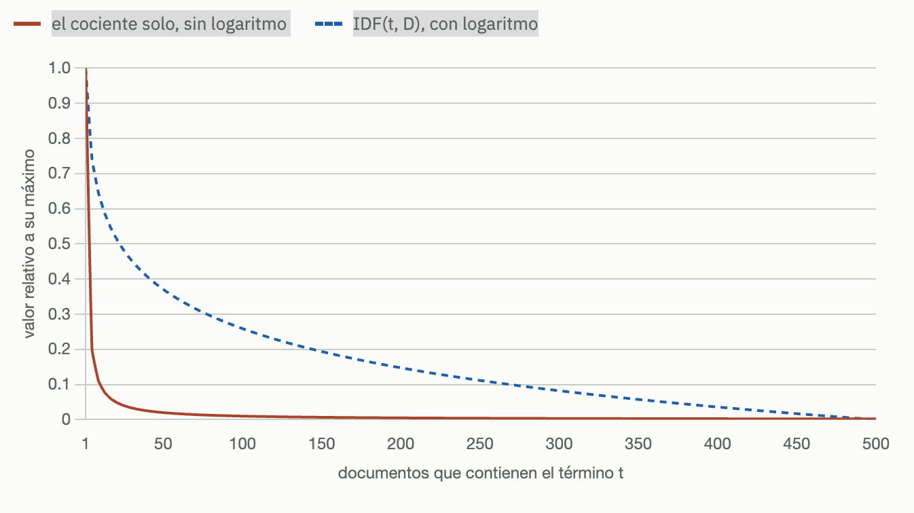

> 💡 El efecto de la función logarítmica, es la amortiguación del efecto de frecuencia:
>
> - Sin el logaritmo, las palabras muy raras tendrían un peso desproporcionadamente alto.
> - El logaritmo "suaviza" estas diferencias, haciendo que el crecimiento del IDF sea más gradual a medida que un término se vuelve más raro.

Finalmente, TF-IDF es el producto simple de TF e IDF:


La codificación TF-IDF se utiliza a menudo en la recuperación de información y la minería de texto para representar documentos como vectores, donde cada dimensión es una palabra específica del corpus y el valor en esa dimensión es el TF-IDF de esa palabra en ese documento. Esto es útil para tareas como la clasificación de documentos y la agrupación de documentos, donde necesitamos una forma de representar documentos en un espacio vectorial.

> 💡 Si una palabra aparece muchas veces en un documento, eleva el valor de TF-IDF. Por el contrario, si una palabra aparece muchas veces en el corpus o conjunto de documentos, disminuirá el valor TF-IDF 

Aquí vemos ejemplo de cómo usar **`TfidfVectorizer`** de **`sklearn`** en Python:

```python
from sklearn.feature_extraction.text import TfidfVectorizer

# Nuestro corpus de texto en español
corpus = ["Juan tiene algunos gatos",
          "Los gatos comen pescado",
          "Yo comí una gran hamburguesa"]

# Inicializamos el TfidfVectorizer
vectorizer = TfidfVectorizer()

# Ajustamos y transformamos nuestro corpus
X = vectorizer.fit_transform(corpus)

# Mostramos las características (palabras únicas en el corpus)
print("Características: ", vectorizer.get_feature_names_out())

# Mostramos la matriz TF-IDF resultante
print("\nMatriz TF-IDF:")
print(X.toarray())

# Resumen
print("\nVocabulario:")
print(vectorizer.vocabulary_)

print("\nIDF:")
print(vectorizer.idf_)
```

Este código primero inicializa el **`TfidfVectorizer`**, luego ajusta este vectorizador a nuestro corpus y transforma el corpus en una matriz TF-IDF. Después imprime las características, que son las palabras **únicas** en el corpus, y la matriz TF-IDF resultante. Cada **fila** en la matriz corresponde a un **documento** en el corpus, y cada **columna** corresponde a una **palabra** en el corpus. Los valores en la matriz son los valores TF-IDF de cada palabra en cada documento. Como resultado de la ejecución obtendremos:

```python
Características:  ['algunos' 'comen' 'comí' 'gatos' 'gran' 'hamburguesa' 'juan' 'los'
 'pescado' 'tiene' 'una' 'yo']

Matriz TF-IDF:
[[0.52863461 0.         0.         0.40204024 0.         0.
  0.52863461 0.         0.         0.52863461 0.         0.        ]
  
 [0.         0.52863461 0.         0.40204024 0.         0.
  0.         0.52863461 0.52863461 0.         0.         0.        ]
  
 [0.         0.         0.4472136  0.         0.4472136  0.4472136
  0.         0.         0.         0.         0.4472136  0.4472136 ]]

Vocabulario:
{'juan': 6, 'tiene': 9, 'algunos': 0, 'gatos': 3, 'los': 7, 'comen': 1, 'pescado': 8, 
'yo': 11, 'comí': 2, 'una': 10, 'gran': 4, 'hamburguesa': 5}

IDF:
[1.69314718 1.69314718 1.69314718 1.28768207 1.69314718 1.69314718
 1.69314718 1.69314718 1.69314718 1.69314718 1.69314718 1.69314718]
```

Cada documento, se convierte a un vector de 12 dimensiones, que es el tamaño del vocabulario.

La mayoría de las palabras tienen IDF = 1.69314718:

- Este valor corresponde a palabras que aparecen en exactamente 1 de los 3 documentos
- Matemáticamente: log((1+3)/(1+1)) + 1 = log(2) + 1 ≈ 0.693 + 1 = 1.693
- Ejemplos: "Juan", "tiene", "algunos", "comen", "hamburguesa", etc.

Ahora, vamos a graficar para comprender mejor:

```python
# Paso 1: Importar librerías necesarias
import numpy as np
import pandas as pd
import matplotlib.pyplot as plt
import seaborn as sns
from sklearn.feature_extraction.text import TfidfVectorizer

# Paso 2: Definir el corpus
corpus = [
    "Juan tiene algunos gatos",
    "Los gatos comen pescado",
    "Yo comí una gran hamburguesa"
]

# Paso 3: Crear el vectorizador TF-IDF
vectorizer = TfidfVectorizer()
X = vectorizer.fit_transform(corpus)

# Paso 4: Obtener las características (palabras) y la matriz
features = vectorizer.get_feature_names_out()
tfidf_matrix = X.toarray()

# Paso 5: Crear el DataFrame
df = pd.DataFrame(tfidf_matrix, columns=features, index=["Frase 1", "Frase 2", "Frase 3"])

# Paso 6: Reordenar columnas si querés usar el vocabulariooooko original
vocabulario = {
    'juan': 6, 'tiene': 9, 'algunos': 0, 'gatos': 3, 'los': 7, 'comen': 1,
    'pescado': 8, 'yo': 11, 'comí': 2, 'una': 10, 'gran': 4, 'hamburguesa': 5
}
orden_columnas = [k for k, _ in sorted(vocabulario.items(), key=lambda item: item[1])]
df = df[orden_columnas]

# Paso 7: Graficar el mapa de calor
plt.figure(figsize=(12, 6))
sns.heatmap(df, annot=True, cmap="YlGnBu", cbar_kws={'label': 'TF-IDF'}, fmt=".2f")

plt.title("Mapa de Calor TF-IDF por Frase y Palabra")
plt.ylabel("Frases")
plt.xlabel("Palabras del Vocabulario")
plt.xticks(rotation=45)
plt.tight_layout()
plt.show()
```

Obtendremos el siguiente mapa de calor:

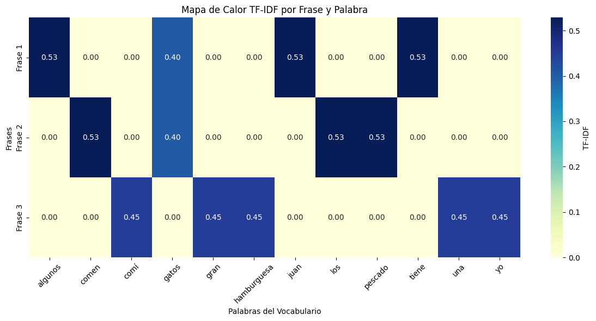

El mapa de calor que muestra visualmente qué palabras (dimensiones) están activas en cada frase según su valor TF-IDF. Cuanto más intenso el color, mayor es la importancia de esa palabra en esa frase.

> 💡 **TF-IDF y stopwords**:
>
> 1. Efecto en el TF (Term Frequency):
>
>    - Las stopwords suelen aparecer con mucha frecuencia en los textos. Esto generaría valores de TF altos.
>    - En TF-IDF este efecto se minimiza por el término IDF.
> 2. Efecto en el IDF (Inverse Document Frequency):
>
>    - Como las stopwords aparecen en casi todos los documentos, su IDF sería muy bajo (más cerca de cero).
>    - Esto significa que, incluso si tienen un TF alto, su valor final de TF-IDF sería relativamente bajo.
> 3. Razones para eliminar stopwords en TF-IDF:
>
>    - Reducción de dimensionalidad: Eliminar stopwords reduce el tamaño del vocabulario y, por lo tanto, la dimensión de los vectores TF-IDF.
>    - Enfoque en palabras significativas: Al eliminar stopwords, nos concentramos en las palabras que realmente diferencian los documentos.
>    - Eficiencia computacional: Menos palabras significan cálculos más rápidos y menor uso de memoria.
>    - Mejora en la calidad de los resultados: En muchas aplicaciones, como búsqueda o clasificación de textos, eliminar stopwords puede mejorar la precisión.
> 4. Consideraciones al eliminar stopwords:
>
>    - La eliminación de stopwords debe hacerse con cuidado, ya que en algunos contextos estas palabras pueden ser importantes.
>    - En algunos casos, como en el análisis de sentimientos, ciertas stopwords pueden ser relevantes (por ejemplo, "no" en "no me gusta"). En español, además de "no", palabras como "pero" o "si" podrían ser relevantes en análisis más finos (por ejemplo, detección de matices o contradicciones). Por eso, a veces se usan listas de *stopwords* personalizadas en lugar de las genéricas.

### Vectorización de hash

Para entender este método, primero es necesario comprender qué es un [hash](https://es.wikipedia.org/wiki/Funci%C3%B3n_hash). Una función de hash es una función que toma una entrada (o "mensaje") y devuelve una cadena de longitud fija, que generalmente es una secuencia de números y letras. Esta salida, conocida como valor hash, debería ser única (dentro de lo razonable) para cada entrada diferente. Es decir, es muy poco probable que dos entradas diferentes produzcan el mismo valor hash. Esa situación es conocida como **colisión de hash**. Los algoritmos de hash más conocidos incluyen MD5, SHA-1, SHA-256, SHA-512, ampliamente utilizada en criptografía y verificación de integridad. Para vectorización de texto y características, los algoritmos no criptográficos como [MurmurHash](https://en.wikipedia.org/wiki/MurmurHash) son generalmente preferidos por su eficiencia.  

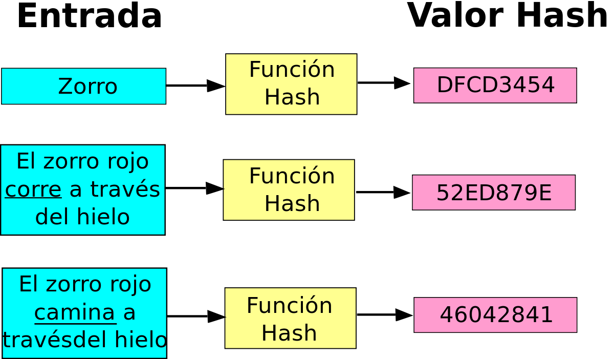

La [vectorización de hash](https://en.wikipedia.org/wiki/Feature_hashing) es una técnica de vectorización que utiliza una función de hash para convertir las características de texto en representaciones numéricas. A diferencia de las técnicas de vectorización como la codificación one-hot, la vectorización de conteo y la vectorización TF-IDF, la vectorización de hash no requiere que se mantenga un vocabulario, lo que puede ser muy útil en situaciones en las que el vocabulario puede ser muy grande y consumir mucha memoria.

La vectorización de hash puede realizarse utilizando la clase [**`HashingVectorizer`**](https://scikit-learn.org/stable/modules/generated/sklearn.feature_extraction.text.HashingVectorizer.html) en **`sklearn`**. Cuando se inicializa un [**`HashingVectorizer`**](https://scikit-learn.org/stable/modules/generated/sklearn.feature_extraction.text.HashingVectorizer.html), se puede especificar el número de características (es decir, la longitud del vector de características) que se desea para la salida. Cuando se transforma un texto, cada palabra en el texto se convierte en un número entero utilizando una función de hash, y luego se utiliza este número para indexar en el vector de características y aumentar el valor en ese índice.

El proceso de vectorización consiste en tokenizar las palabras, crear los hash de cada palabra, y luego convertir esos hash en una [matriz dispersa](https://en.wikipedia.org/wiki/Sparse_matrix) ("sparse matrix"). Una matriz dispersa es una matriz en la que la mayoría de sus elementos son cero (o, en general, cualquier valor que se considere "predeterminado" o "no significativo"). 

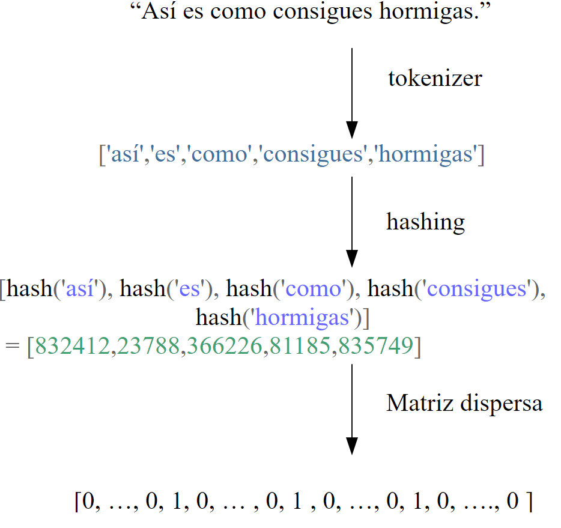

El tamaño de la matriz resultante, está determinado por la cantidad de frases o documentos, y el número de características que usemos como parámetro en **`HashingVectorizer`**.

Un aspecto importante a tener en cuenta sobre la vectorización de hash es que es una técnica "sin estado", lo que significa que no mantiene ninguna información sobre el estado anterior (como un vocabulario). Esto significa que no puede proporcionar una forma de mapear desde las características a las palabras originales. Esto puede ser un inconveniente si necesitamos interpretar los vectores de características.

```python
from sklearn.feature_extraction.text import HashingVectorizer

# Nuestro texto de trabajo
texto = ['Esta es una introducción a NLP', 'Es probable que sea útil para las personas',
'Machine learning es la nueva electricidad', 'Habrá menos exageración sobre la IA y más acción en adelante',
'¡Python es la mejor herramienta!', 'Python es un buen lenguaje', 'Me gusta este libro',
 'Quiero más libros como este']

# Creamos el HashingVectorizer
vectorizer = HashingVectorizer(n_features=10)

# Aplicamos la transformación
X = vectorizer.transform(texto)

# Imprimimos el resultado
print("\Filas de la matriz:")
print(X.toarray())

# Ver dimensiones resultantes
print(f"Dimensiones de la matriz: {X.shape}")
print(f"Número de elementos no cero: {X.nnz}")
print(f"Densidad de la matriz: {X.nnz / (X.shape[0] * X.shape[1]):.6f}")
```

En este ejemplo, hemos configurado **`HashingVectorizer`** para producir vectores de características de longitud 10. Luego, transformamos nuestro texto en estos vectores de características utilizando el método **`transform()`**. Finalmente, imprimimos los vectores de características resultantes.

```text
Filas de la matriz:
[[ 0.          0.          0.          0.37796447  0.75592895  0.
   0.37796447  0.37796447  0.          0.        ]
   
 [ 0.28867513  0.57735027 -0.28867513  0.57735027  0.28867513  0.
  -0.28867513  0.          0.          0.        ]
  
 [-0.5         0.          0.5         0.          0.5         0.
   0.          0.          0.          0.5       ]
   
 [-0.28867513 -0.28867513  0.          0.57735027  0.28867513  0.28867513
   0.          0.57735027  0.          0.        ]
   
 [ 0.          0.57735027  0.          0.          0.57735027  0.57735027
   0.          0.          0.          0.        ]
   
 [ 0.         -0.4472136   0.          0.          0.4472136   0.4472136
  -0.4472136  -0.4472136   0.          0.        ]
  
 [ 0.5        -0.5        -0.5         0.          0.         -0.5
   0.          0.          0.          0.        ]
   
 [ 0.         -0.4472136   0.          0.4472136   0.         -0.4472136
   0.          0.4472136   0.          0.4472136 ]]
   
Dimensiones de la matriz: (8, 10)
Número de elementos no cero: 37
Densidad de la matriz: 0.462500
```

Por defecto, la matriz obtenida tiene sus valores normalizados entre -1 y 1. Podríamos indicar que los valores no sean normalizados del siguiente modo:

```python
vectorizer = HashingVectorizer(n_features=10, norm=None)
```

Es importante tener en cuenta que, a diferencia de otros métodos de vectorización, **`HashingVectorizer`** no proporciona una forma de mapear las características de nuevo a las palabras originales, ya que no mantiene un vocabulario. Además, puede haber colisiones de hash, donde diferentes palabras pueden mapearse al mismo índice en el vector de características. Sin embargo, en la práctica, este suele ser un problema menor, especialmente si el número de características es lo suficientemente grande.

### Resumen de métodos vectorización

Si bien hay más métodos que podríamos explorar, aquí tenemos un resumen de los cuatro métodos vistos:

| Técnica | Descripción | Aplica a | Pros | Contras | Dimensiones |
|---|---|---|---|---|---|
| **One-hot encoding** | Cada palabra en el vocabulario se representa como un vector en el que un elemento es 1 y el resto son 0. | Palabras | Fácil de entender y de implementar. | Genera vectores de alta dimensionalidad. No tiene en cuenta la frecuencia de las palabras ni su relevancia en el texto. | Tamaño del vocabulario |
| **Count Vectorizer** | Cada oración se representa como un vector en el que cada elemento es la frecuencia de una palabra en el documento. | Oraciones o documentos | Toma en cuenta la frecuencia de las palabras. | No tiene en cuenta la relevancia de las palabras en el texto. Puede dar demasiado peso a las palabras comunes. | Tamaño del vocabulario |
| **TF-IDF** | Similar a Count Vectorizer, pero da más peso a las palabras que son raras en el corpus y menos peso a las palabras que son comunes. | Oraciones o documentos | Toma en cuenta tanto la frecuencia de las palabras como su relevancia en el texto. | Más complejo de entender y de implementar que las técnicas anteriores. | Tamaño del vocabulario |
| **Hash Vectorizer** | Cada palabra se mapea a un número en un rango predefinido utilizando una función de hash. | Palabras, Oraciones o documentos | Permite trabajar con vectores de tamaño fijo, independientemente del tamaño del vocabulario. Útil cuando el vocabulario es muy grande. | Puede haber colisiones de hash. No se puede mapear las características de vuelta a las palabras originales. | Fijo (definido por el parámetro `n_features`) |

> 💡 Es importante tener en cuenta que la elección de la técnica de vectorización depende del problema específico que estemos tratando de resolver. Algunas técnicas pueden funcionar mejor que otras en diferentes contextos.

**Codificación de texto. Conclusión**

Estos métodos de codificación que hemos visto, podrían aplicarse en complementación con modelos como Naive Bayes, Regresión Logística, Máquinas de Vectores de Soporte (SVM), modelos de redes neuronales, entre otros, pero tienen una limitación. Los métodos de codificación de palabras en vectores, se centran en la representación numérica del texto, pero no capturan la semántica o el significado del texto. Estos métodos tratan las palabras como entidades aisladas y no capturan el contexto o la relación entre las palabras.

Por ejemplo, en One-Hot Encoding, cada palabra se representa como un vector en un espacio de alta dimensión, y cada palabra es ortogonal a todas las demás, lo que significa que no hay relación entre las palabras. 

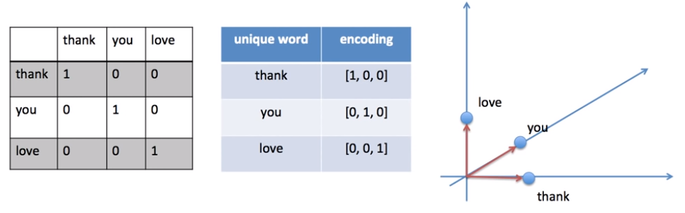

En el caso de Count Vectorizer y TF-IDF, aunque se tiene en cuenta la frecuencia de las palabras, no se captura la relación semántica entre las palabras. Entonces, independientemente del modelo que usemos, estaremos limitados en cuando a la comprensión del lenguaje natural.

Para capturar la semántica y el contexto de las palabras, se utilizan técnicas como [Word2Vec](https://arxiv.org/pdf/1301.3781.pdf), [GloVe](https://nlp.stanford.edu/projects/glove/) (Global Vectors for Word Representation) y [FastText](https://fasttext.cc/). Estos métodos generan lo que se conoce como "embeddings" de palabras, que **son representaciones vectoriales densas** donde las palabras con significados similares se ubican cerca unas de otras en el espacio vectorial, y **son capaces de capturar la semántica y las relaciones entre las palabras**. Generalmente se entrenan con grandes cantidades de texto y aprenden a predecir palabras en función de su contexto.

## 2. Word embeddings (incrustaciones de palabras) 

Los "Word Embeddings" o "Incrustaciones de palabras" son una de las técnicas más populares en el procesamiento del lenguaje natural, especialmente cuando se trata de tareas de aprendizaje automático. Esta técnica se utiliza para representar palabras en un espacio de alta dimensión, donde las palabras con significados similares se agrupan juntas. En otras palabras, los "Word Embeddings" son una forma de representar la semántica de las palabras como vectores, de tal manera que las palabras con contextos similares se encuentren cercanas en el espacio vectorial.

La idea detrás de los "Word Embeddings" es que las palabras que aparecen en contextos similares tienen significados similares. Por ejemplo, las palabras "perro" y "gato" a menudo aparecen en contextos similares (como "mi \_\_\_\_ come mucho alimento") y, por lo tanto, deberían tener vectores cercanos.

Los "Word Embeddings" se generan utilizando algoritmos como Word2Vec, GloVe, entre otros, que utilizan redes neuronales para aprender estas representaciones a partir de grandes corpus de texto. Estos algoritmos pueden capturar sutilezas semánticas y sintácticas, como que "rey" es para "hombre" como "reina" es para "mujer", o que "caminar" es la versión en presente de "caminó".

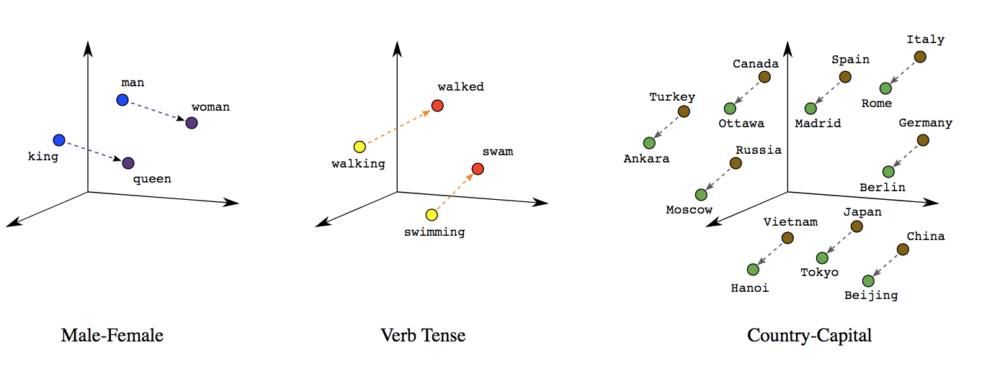

Consideremos las siguientes frases similares: "Ten un buen día" y "Ten un gran día". Apenas tienen un significado diferente. Si construimos un vocabulario exhaustivo (llamémoslo V), tendríamos V = {Ten, un, buen, gran, día}.

Ahora, creemos un vector codificado en one-hot para cada una de estas palabras en V. La longitud de nuestro vector codificado en one-hot sería igual al tamaño de V (=5). Tendríamos un vector de ceros excepto para el elemento en el índice que representa la palabra correspondiente en el vocabulario. Ese elemento en particular sería uno. Las codificaciones a continuación explicarían esto mejor.

Ten = \[1,0,0,0,0\]; un=\[0,1,0,0,0\]; buen=\[0,0,1,0,0\]; gran=\[0,0,0,1,0\]; día=\[0,0,0,0,1\]

Si intentamos visualizar estas codificaciones, podemos pensar en un espacio de 5 dimensiones, donde cada palabra ocupa una de las dimensiones y no tiene nada que ver con el resto (no hay proyección a lo largo de las otras dimensiones). Esto significa que 'buen' y 'gran' son tan diferentes como 'día' y 'ten', lo cual no es cierto.

Aquí vemos una comparación de la codificación de texto (one-hot) vs. embeddings:

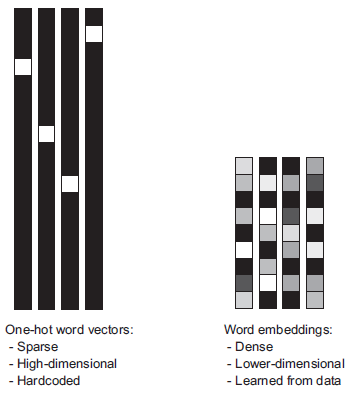

Mientras que las representaciones de palabras obtenidas de la codificación one-hot o hash son dispersas, de alta dimensión y codificadas de forma rígida, las incrustaciones de palabras son densas, relativamente de baja dimensión y aprendidas a partir de los datos.

### Características semánticas

*Fuente:* [*https://www.cs.cmu.edu/~dst/WordEmbeddingDemo/tutorial.html*](https://www.cs.cmu.edu/~dst/WordEmbeddingDemo/tutorial.html)

Consideremos las palabras "man", "woman", "boy", and "girl”. Dos de ellos se refieren a hombres y dos a mujeres. Además, dos de ellos se refieren a adultos y dos a niños. Podemos trazar estos mundos como puntos en un gráfico donde el eje *x representa el género y el eje y* representa la edad:

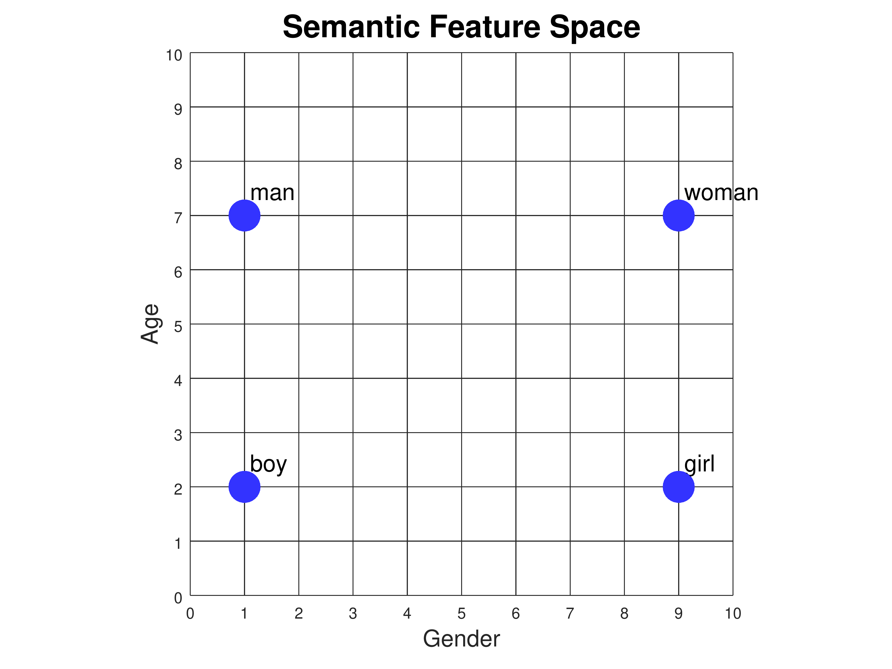

El género y la edad se denominan *rasgos semánticos*: representan parte del significado de cada palabra. Si asociamos una escala numérica con cada característica, entonces podemos asignar coordenadas a cada palabra:

|  | Gender | Age |
|---|---|---|
| **man** | 1 | 7 |
| **woman** | 9 | 7 |
| **boy** | 1 | 2 |
| **girl** | 9 | 2 |

Podemos agregar nuevas palabras a la trama en función de sus significados. Por ejemplo, ¿dónde deben ir las palabras "adult" y "child”? ¿Qué tal "infant"? ¿O "grandfather"?

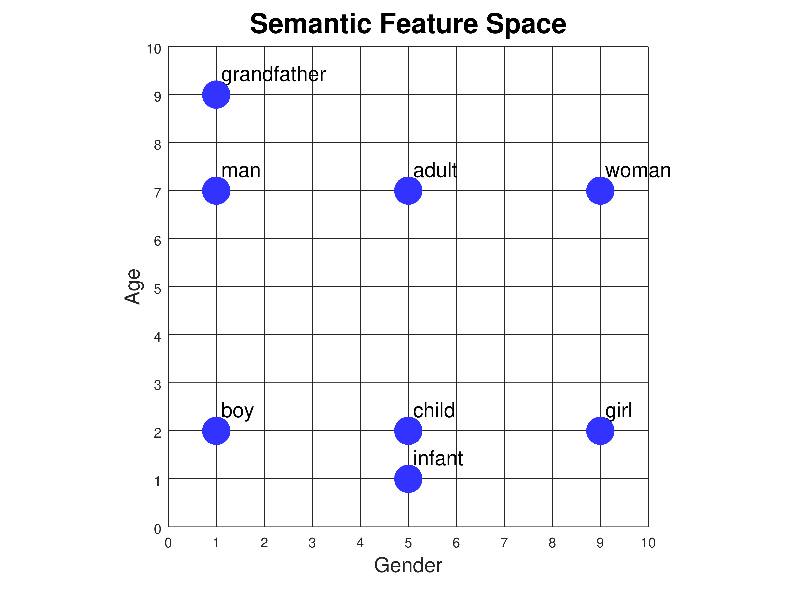

Ahora consideremos las palabras "king", "queen", "prince" y "princess". Tienen los mismos atributos de género y edad que "man", "woman", "boy" y "girl". Pero no significan lo mismo. Para distinguir "man" de "king", "woman" de "queen", y así sucesivamente, necesitamos introducir una nueva característica semántica en la que se diferencian. Llamémoslo "realeza". Ahora tenemos que trazar los puntos en un espacio tridimensional:

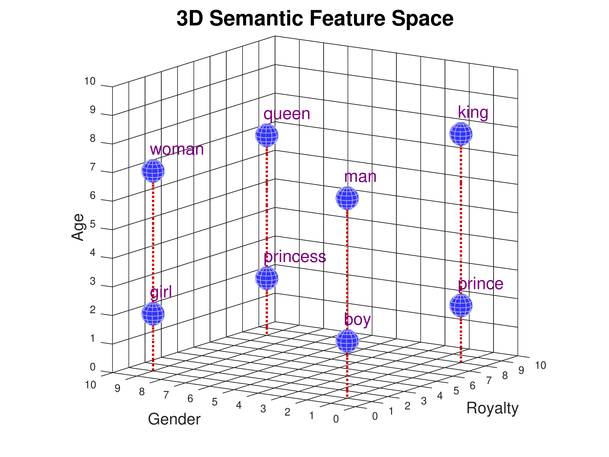

|  | Gender | Age | Royalty |
|---|---|---|---|
| **man** | 1 | 7 | 1 |
| **woman** | 9 | 7 | 1 |
| **boy** | 1 | 2 | 1 |
| **girl** | 9 | 2 | 1 |
| **king** | 1 | 8 | 8 |
| **queen** | 9 | 7 | 8 |
| **prince** | 1 | 2 | 8 |
| **princess** | 9 | 2 | 8 |

Cada palabra tiene tres valores de coordenadas: edad, género y realeza. A estas listas de números las llamamos *vectores*. Dado que representan los valores de las características semánticas, también podemos llamarlos *vectores de características*. Tengamos en cuenta que le hemos asignado a "king" un valor de edad ligeramente mayor (8) que a "reina" (7). Tal vez sea porque hemos leído muchas historias sobre reyes muy antiguos, pero no tantas sobre reinas muy antiguas. Los valores de las características no tienen que ser perfectamente simétricos.

### Similitud de Coseno

Nuestro objetivo es que las palabras con un contexto similar ocupen posiciones espaciales cercanas. Matemáticamente, el coseno del ángulo entre tales vectores debería estar cerca de 1, es decir, ángulo cercano a 0. La medida que ayuda a estimar el ángulo entre vectores se llama similitud de coseno, y tiene la buena propiedad de ser mayor cuando los dos vectores están más cerca entre sí con un ángulo menor (es decir, más similares) y menor cuando están más distantes con un ángulo mayor (es decir, menos similar).  La fórmula es la siguiente:

$$
\cos (\theta ) =   \dfrac {A \cdot B} {\left\| A\right\|\left\| B\right\|} 
$$

Notación:

- *A* y *B* son dos vectores.
- cos(*θ*) es el coseno del ángulo *θ* entre los vectores *A* y *B*
- *A* ⋅ *B* denota el producto escalar de los vectores *A* y *B*.
- ∥*A*∥ y ∥*B*∥ son las magnitudes (o normas) de los vectores *A* y *B*, respectivamente.

Veámoslo gráficamente:

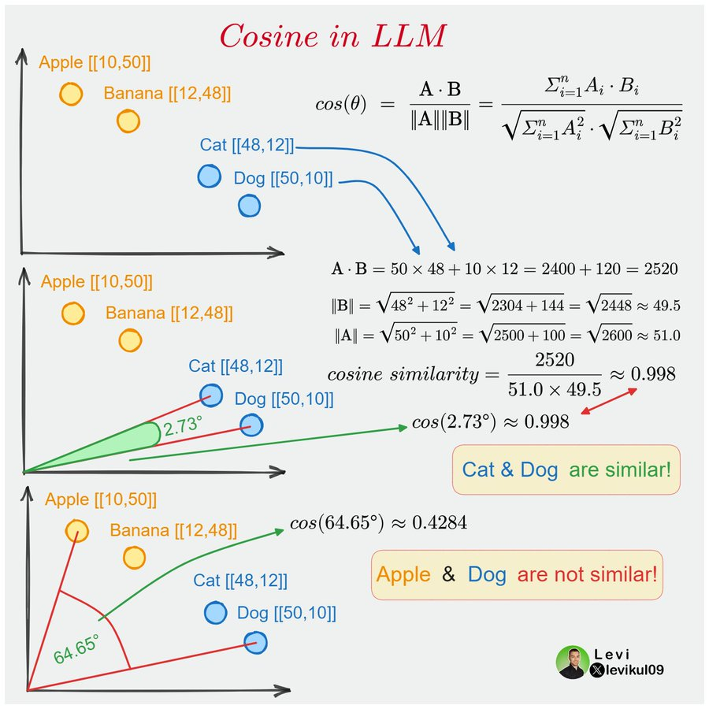

Si bien podríamos medir similitud entre palabras usando la [distancia euclidiana](https://es.wikipedia.org/wiki/Distancia_euclidiana), en NLP se usa principalmente la **similitud de coseno** por estos motivos:

- **Invarianza de la longitud del vector**: En muchos casos en NLP, los vectores de palabras se normalizan para tener una longitud (o magnitud) de 1. Esto significa que solo nos importa la dirección del vector, no su longitud. La similitud del coseno es una medida de la orientación de los vectores y no se ve afectada por la magnitud. Por lo tanto, es una buena opción cuando queremos comparar la similitud de las palabras independientemente de la frecuencia de aparición de las palabras o tamaño del texto.   
  Si se utilizara la distancia euclidiana, esta diferencia de longitud podría penalizar la similitud percibida. Un documento corto y un documento largo que tratan exactamente el mismo tema podrían ser juzgados como disímiles simplemente debido a la diferencia en sus magnitudes vectoriales.
- **Alta dimensionalidad**: Los vectores de palabras en NLP suelen ser de alta dimensión (por ejemplo, 300 dimensiones para los vectores de palabras de GloVe). En espacios de alta dimensión, la ["maldición de la dimensionalidad"](https://www.iartificial.net/la-maldicion-de-la-dimension-en-machine-learning/) significa que la distancia euclidiana puede ser menos significativa. La similitud del coseno tiende a ser una métrica más útil en estos casos.
- **Interpretación intuitiva**: La similitud del coseno mide el coseno del ángulo entre dos vectores. Un valor de 1 significa que los vectores son idénticos, un valor de 0 significa que son ortogonales (no relacionados), y un valor de -1 significa que son diametralmente opuestos. Esta es una interpretación intuitiva que a menudo es útil en NLP.
- **Eficiencia computacional**: Calcular la similitud del coseno puede ser más eficiente que calcular la distancia euclidiana, especialmente en espacios de alta dimensión.

Podemos implementar la fórmula vista anteriormente en el gráfico, en una función de Python, usando la librería **`numpy`**:

```python
import numpy as np

def cosine_similarity(A, B):
    """
    Calcula la similitud del coseno entre dos vectores A y B.

    Parámetros:
    - A, B: Vectores de entrada.

    Retorna:
    - Similitud del coseno entre A y B.
    """
    dot_product = np.dot(A, B)
    norm_A = np.linalg.norm(A)
    norm_B = np.linalg.norm(B)

    return dot_product / (norm_A * norm_B)

# Ejemplo de uso:
vector_A = np.array([1, 2, 3])
vector_B = np.array([4, 5, 6])

print(cosine_similarity(vector_A, vector_B))
```

La función **`cosine_similarity`** toma dos vectores **`A`** y **`B`** como entrada y devuelve su similitud del coseno. El coseno de un ángulo de 0° es igual a 1, lo que significa máxima cercanía y similitud entre los dos vectores. La siguiente figura muestra un ejemplo:

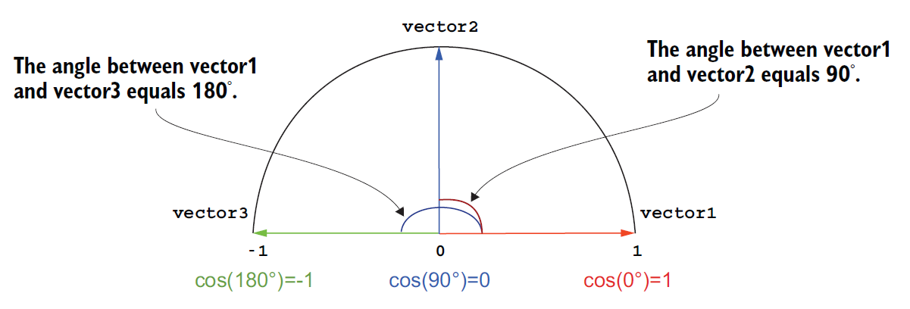

Incluso, como vemos en el gráfico anterior, podríamos tener similitud negativa. Un valor de -1 significaría vectores opuestos.

Veamos un ejemplo de cómo trabajar con similitud de coseno, usando **`cosine_similarity`**

de Scikit-Learn:

```python
from sklearn.metrics.pairwise import cosine_similarity
import numpy as np

# Supongamos que estos son tus vectores (embeddings)
vectors = np.array([
    [0.1, 0.2, 0.4],  # Banana
    [0.3, 0.4, 0.5],  # Manzana
    [0.1, 0.3, 0.1]   # Mandarina
])

# Les asignamos nombres a los vectores
vector_names = ["Banana", "Manzana", "Mandarina"]

# Y este es nuestro vector de consulta para medir similaridad
query_vector = np.array([[0.3, 0.5, 0.5]])

# Calcula la similitud de coseno entre el vector de consulta y todos los otros vectores
similarities = cosine_similarity(query_vector, vectors)

# Imprime las similitudes junto con los nombres de los vectores
for name, similarity in zip(vector_names, similarities[0]):
    print(f"{name}: {similarity:.4f}")
```

Obtendremos:

```python
Banana: 0.9375
Manzana: 0.9942
Mandarina: 0.9028
```

Vemos que al mostrar las similitudes, el vector “Manzana” (\[0.3, 0.4, 0.5\]) es el que más se acerca a \[0.3, 0.5, 0.5\].

> 💡 Un buen recurso para profundizar en espacios vectoriales es el siguiente: [https://aman.ai/coursera-nlp/vector-spaces/](https://aman.ai/coursera-nlp/vector-spaces/)

### Tipos de modelos de embeddings

Los modelos de embeddings se pueden clasificar según la capacidad de capturar la relación de las palabras con el contexto:


*Fuente: [**A Comparative Study on Word Embeddings in Deep Learning for Text Classification**](https://www.researchgate.net/publication/348946675_A_Comparative_Study_on_Word_Embeddings_in_Deep_Learning_for_Text_Classification?_tp=eyJjb250ZXh0Ijp7InBhZ2UiOiJfZGlyZWN0In19)*

**1. Contexto-Independiente (Context-independent):**

- Estos métodos son conocidos como "embeddings clásicos". Aprenden representaciones a través de redes neuronales superficiales basadas en modelos de lenguaje o factorización de matrices de co-ocurrencia.
- Las representaciones aprendidas son únicas y distintas para cada palabra sin considerar el contexto de la palabra.
- Estos embeddings suelen ser pre-entrenados en corpus de texto generales y se distribuyen en forma de archivos descargables. Estos archivos pueden aplicarse directamente para inicializar los pesos de embedding para tareas de lenguaje downstream.
- Ejemplos prominentes incluyen: **word2vec**, **GloVe** y **FastText**.

**2. Contexto-Dependiente (Context-dependent):**

- A diferencia de los embeddings de contexto-independiente, los métodos de contexto-dependiente aprenden diferentes embeddings para la misma palabra dependiendo del contexto en el que se utiliza.
- Por ejemplo, la palabra polisémica "banco" tendrá múltiples embeddings dependiendo de si se usa en un contexto relacionado con el deporte o uno relacionado con finanzas.
- Estos embeddings han ganado popularidad en los últimos años, y se pueden clasificar en dos categorías principales:

  - **Basados en RNNs (Redes Neuronales Recurrentes)**: Como **CoVe**, **Flair** y **ELMo**.
  - **Basados en Transformers**: Como **BERT** y **ALBERT**.

### Word2Vec

[Word2vec](https://arxiv.org/pdf/1301.3781.pdf) fue publicada en 2013 y marcó un hito fundamental en el Procesamiento del Lenguaje Natural (PLN) al popularizar la idea de los **embeddings de palabras**: representaciones vectoriales densas que capturan relaciones semánticas y sintácticas aprendidas automáticamente a partir de grandes corpus de texto. Su importancia radica en que, a diferencia de métodos anteriores como one-hot encoding o TF-IDF que generaban vectores dispersos y de alta dimensionalidad sin una noción inherente de similitud, Word2Vec demostró ser capaz de aprender eficientemente vectores donde palabras con significados similares ocupan posiciones cercanas en el espacio vectorial.

Hay dos algoritmos de entrenamiento principales para word2vec, uno es la bolsa continua de palabras (CBOW), otro se llama skip-gram. La principal diferencia entre estos dos métodos es que CBOW está utilizando el contexto para predecir una palabra objetivo mientras que skip-gram está utilizando una palabra para predecir un contexto objetivo. 


*La arquitectura CBOW predice la palabra actual en función del contexto, y Skip-gram predice las palabras circundantes dada la palabra actual. [https://arxiv.org/pdf/1301.3781.pdf](https://arxiv.org/pdf/1301.3781.pdf)*

**Skip-Gram**

Para este modelo, consideremos el problema de predecir un conjunto de palabras de contexto a partir de una única palabra central. En este caso, imaginemos predecir las palabras de contexto "neumático", "carretera", "vehículo", "puerta" a partir de la palabra central "coche". En este otro ejemplo, tratamos de predecir las palabras en verde, a partir de la palabra central:


En el enfoque "Skip-Gram", la palabra central se representa como un único vector codificado en one-hot y se presenta a una red neuronal que se optimiza para producir un vector con valores altos en las palabras de contexto predichas, es decir, valores cercanos a 1 para palabras como "neumático", "vehículo", "puerta", etc.

El tamaño de la ventana (o *window size*) en Word2Vec con Skip-Gram se define como un hiperparámetro fijo antes del entrenamiento del modelo. En el ejemplo de arriba la ventana es de 1 palabra, una antes y otra después de la palabra central.


*El algoritmo Skip-Gram para el entrenamiento de incrustación de palabras utilizando una red neuronal para predecir palabras de contexto a partir de una codificación one-hot de palabras centrales.
[http://mccormickml.com/2016/04/19/word2vec-tutorial-the-skip-gram-model/](http://mccormickml.com/2016/04/19/word2vec-tutorial-the-skip-gram-model/)*

Las capas internas de la red neuronal son pesos lineales, que pueden representarse como una matriz de tamaño (*número de palabras en el vocabulario*) X (*número de neuronas (arbitrario)*). 

Para nuestro ejemplo, vamos a decir que estamos aprendiendo vectores de palabras con 300 características. Entonces, la capa oculta estará representada por una matriz de pesos con 10,000 filas (una para cada palabra en nuestro vocabulario) y 300 columnas (una para cada neurona oculta).

300 características es lo que Google usó en su modelo publicado entrenado en el conjunto de datos de noticias de Google ([se puede descargar aquí](https://code.google.com/archive/p/word2vec/)). La cantidad de funciones es un "hiperparámetro" que ajustaremos a nuestra aplicación (es decir, probar diferentes valores y ver qué valor produce los mejores resultados).  
Si dos palabras diferentes tienen "contextos" muy similares (es decir, qué palabras es probable que aparezcan a su alrededor), entonces nuestro modelo debe generar resultados muy similares para estas dos palabras. ¿Y qué significa que dos palabras tengan contextos similares? Se podría esperar que las palabras "comer" y "alimento" tuvieran contextos muy similares, o "lluvia" y "clima", probablemente también tengan contextos similares.

Veamos un ejemplo con [**`Gensim`**](https://radimrehurek.com/gensim/) ([RaRe-Technologies/gensim](https://github.com/RaRe-Technologies/gensim)) de carga de modelo pre-entrenado. En Colab, instalamos la librería `gensim` y descargamos un modelo word2vec Skip-Gram [entrenado en español](https://crscardellino.ar/SBWCE/) sobre un total de 1.000.653 tokens:

```python
!pip install gdown

import gdown

url = 'https://drive.google.com/uc?id=1V8hNcnGEyrz0c_dA-v0_5sg31bNgy75r'
output = '/content/SBW-vectors-300-min5.bin.gz'
gdown.download(url, output, quiet=False)
```

Una vez que descargamos el modelo, podremos correr el siguiente ejemplo:

```python
# Instala versiones específicas y estables
!pip install numpy==1.23.5 gensim==4.3.2 scipy==1.10.1
from gensim.models import KeyedVectors

# Carga un modelo Word2Vec preentrenado (asegúrate de tener el archivo en tu directorio)
model = KeyedVectors.load_word2vec_format('SBW-vectors-300-min5.bin.gz', binary=True)

# Información del modelo
print(model)

# Similitud entre dos palabras específicas
print(f"Similitud entre 2 palabras: {model.similarity('perro', 'conejo')}")

# Palabra de consulta
query_word = "gato"

# Encuentra las palabras más similares a la palabra de consulta
most_similar_words = model.most_similar(positive=[query_word], topn=10)

# Imprime las palabras más similares y sus similitudes de coseno
print(f'Palabras cercanas a {query_word}:')
for word, similarity in most_similar_words:
    print(f"Palabra: {word}, Similitud: {similarity}")
```

Y los resultados serán:

```python
KeyedVectors<vector_size=300, 1000653 keys>
Similitud entre 2 palabras: 0.6112384796142578
Palabras cercanas a gato:
Palabra: perro, Similitud: 0.7445881366729736
Palabra: zorro, Similitud: 0.7061581611633301
Palabra: conejo, Similitud: 0.7018613815307617
Palabra: montés, Similitud: 0.6875571012496948
Palabra: mapache, Similitud: 0.6867462396621704
Palabra: maúlla, Similitud: 0.6719425916671753
Palabra: tigre, Similitud: 0.6647046804428101
Palabra: lybica, Similitud: 0.6631762385368347
Palabra: huiña, Similitud: 0.6606248617172241
Palabra: gatito, Similitud: 0.6600393056869507
```

Una herramienta interesante para explorar las relaciones semánticas, es usar **`negative`** cuando usamos el método **`most_similar`**: 

```python
result = model.most_similar(positive=['mujer', 'rey'], negative=['hombre'], topn=1)
print(result)

# Obtenemos:
# [('reina', 0.7493031620979309)]
```

  
**`most_similar`** obtiene los vectores de las palabras suministradas en las listas `positive` y `negative`. Luego suma los vectores de `positive` y resta los de `negative`. Finalmente calcula la similitud de coseno entre el resultado y todos los demás vectores del vocabulario, ordena las palabras por similitud descendente y devuelve las `topn`.


Un ejemplo clásico de analogía usando word embeddings es "hombre" - "mujer" + "rey" = "reina”. En nuestro caso, el argumento **`negative`** permite especificar una lista de palabras cuyos vectores deben ser restados del vector resultante antes de buscar las palabras más similares.

> 💡 
>
> Una de sus características clave de Skip-Gram es que toma una palabra central y predice las palabras de contexto dentro de una ventana definida, sin distinguir si estas están a la izquierda o a la derecha. Esto significa que no conserva información sobre el orden o la dirección de las palabras en el texto, lo que limita su capacidad para capturar relaciones sintácticas específicas donde la posición es crucial. Por ejemplo, en una frase como "El gato maúlla", Skip-Gram no indica si "gato" precede o sigue a "maúlla"; simplemente asocia ambas palabras como parte del mismo contexto. Esta falta de direccionalidad implica que las predicciones devueltas —como una lista de palabras similares— reflejan coocurrencias estadísticas más que secuencias estructuradas, lo que puede ser insuficiente para tareas que requieren reconstruir frases o entender la gramática.

**CBOW**

CBOW, que significa "Continuous Bag of Words", también forma parte de la herramienta Word2Vec. En este caso, CBOW intenta predecir una palabra objetivo (la "palabra central") basándose en las palabras de su entorno (las "palabras de contexto"). Por ejemplo, si tuviéramos la frase "El gato persigue al ratón", y eligiéramos "persigue" como la palabra objetivo, las palabras de contexto podrían ser "El", "gato", "al", "ratón".

En este otro ejemplo, tratamos de predecir la palabra central (verde), a partir de las palabras de contexto dentro de la ventana:


El modelo CBOW toma todas las palabras de contexto, las codifica como vectores (a través de "one-hot encoding"), y luego las alimenta a una red neuronal. La red tiene una capa oculta de tamaño N, donde N es una cantidad arbitraria que determina la "dimensión" de los vectores de palabras finales. La red se entrena para predecir la palabra objetivo basándose en las palabras de contexto, ajustando los pesos de la red para minimizar el error de predicción.


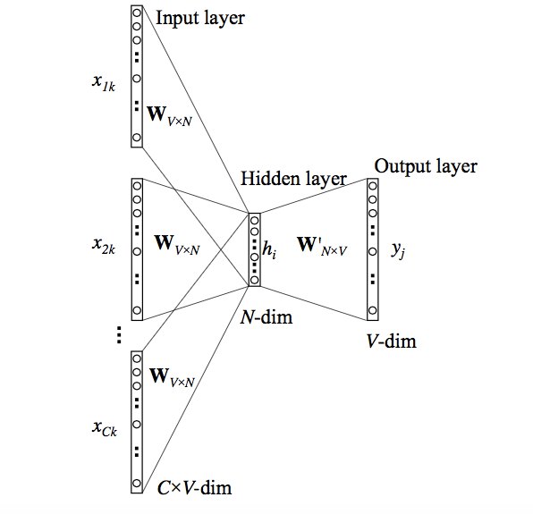

La entrada o la palabra de contexto es un vector codificado en one-hot de tamaño V. La capa oculta contiene N neuronas y la salida es nuevamente un vector de longitud V con los elementos siendo los valores softmax.

Aclaremos los términos en la imagen:

- Wvn es la matriz de pesos que mapea la entrada x a la capa oculta (matriz de dimensiones V\*N)
- W’nv es la matriz de pesos que mapea las salidas de la capa oculta a la capa de salida final (matriz de dimensiones N\*V)

El modelo anterior toma C palabras de contexto. Cuando se usa Wvn para calcular las entradas de la capa oculta, tomamos un promedio de todas estas C entradas de palabras de contexto.

Después de entrenar el modelo en un gran corpus de texto, los pesos de la capa oculta de la red se utilizan como los vectores de palabras. 

Veamos un ejemplo de como entrenar un modelo CBOW en Python:

```python
from gensim.models import Word2Vec
import numpy as np 

# Supongamos que este es nuestro corpus de frases (tokenizado)
sentences = [
    ["el", "gato", "come", "pescado"],
    ["los", "perros", "ladran", "todo", "el", "tiempo"],
    ["el", "gato", "maúlla", "por", "la", "noche"],
    ["los", "perros", "corren", "sin", "parar"]
]

# Entrenar un modelo CBOW
# sg=0: CBOW; sg=1: Skip-gram
model_cbow = Word2Vec(sentences, vector_size=100, window=4, min_count=1, workers=4, sg=0, epochs=5000)

context_words = ["el", "gato", "come"]

# Buscar las palabras más similares al contexto suministrado
similar_words = model_cbow.wv.most_similar(positive=context_words, topn=5)

# Filtrar las palabras similares para excluir las palabras en context_words
# Estamos excluyendo las palabras que ya están en context_words ("el", "gato", "come")
# porque no queremos que el modelo "prediga" algo que ya está en el contexto dado. 
# El objetivo es encontrar una palabra nueva que sea probable en ese contexto, 
# no repetir lo que ya sabemos
filtered_words = [word for word, similarity in similar_words if word not in context_words]

# Palabra con la mayor similitud que no esté en context_words
most_probable_word = filtered_words[0] if filtered_words else None

if most_probable_word:
    print(f"La palabra más probable para el contexto ({context_words}) es: {most_probable_word}")
else:
    print("No se encontró una palabra probable fuera del contexto dado.")

# Resultado:
# La palabra más probable para el contexto (['el', 'gato', 'come']) es: pescado
```

En este código, después de calcular las palabras similares, filtramos la lista para excluir las palabras en **`context_words`**. Luego, seleccionamos la primera palabra de la lista filtrada.

🔗 [Word2Vec - Skipgram and CBOW](https://www.youtube.com/watch?v=UqRCEmrv1gQ)  
#Word2Vec #SkipGram #CBOW #DeepLearning

Word2Vec is a very popular algorithm for generating word embeddings. It preserves word relationships and is used with a lot of Deep Learning applications. 

In this video we will learn about the working of word2vec and word embeddings. We will also learn about Skipgram and Continuous bag of words (CBOW ) which help in generating word2vec embeddings.

Word2Vec coupled with RNNs and CNNs are also used in building chatbots. They have lots of other use cases too.

Introduction: (0:00)
Why use word embeddings?: (0:14)
What is Word2vec?: (0:42)
Working of Word2vec?: (1:58)
CBOW and skipgram?: (2:48)
CBOW working ?: (3:36)
skip gram working ?: (5:32)

### FastText

[FastText](https://fasttext.cc/) (Bojanowski et al., FAIR, 2016) es la extensión natural de Word2Vec: en lugar de un vector por palabra, aprende vectores para **n-gramas de caracteres** y representa cada palabra como la suma de esos n-gramas.

Por ejemplo, con n = 3 la palabra **donde** se descompone en `do, don, ond, nde, de` — más precisamente: `<do`, `don`, `ond`, `nde`, `de>`. Los caracteres `<` y `>` marcan inicio y fin de palabra.

- **Morfología**: gato, gatos, gatito comparten n-gramas; el modelo captura flexión sin tratarlas como símbolos ajenos.
- **Palabras fuera de vocabulario (OOV)**: una palabra nunca vista igual obtiene vector, porque se arma con n-gramas que sí se vieron.
- **Sigue siendo estático**: un único vector por tipo léxico. No distingue «banco» (dinero) de «banco» (asiento).

Ejemplo mínimo de FastText:

```python
from gensim.models import FastText

# Corpus ya tokenizado: cada oración es una lista de palabras (14 tokens, 12 palabras distintas)
sentences = [
    ["el", "gato", "come", "pescado"],
    ["los", "gatos", "comen", "pescado"],
    ["el", "perro", "ladra"],
    ["un", "gatito", "juega"],
]

model = FastText(
    sentences,       # Corpus: al pasarlo acá, gensim construye el vocabulario y entrena en un solo paso
    vector_size=50,  # Dimensión de cada vector (palabras y n-gramas). Default: 100
    window=3,        # Distancia máxima entre la palabra central y su contexto. Default: 5
                     #   (el tamaño efectivo se sortea entre 1 y window para cada palabra)
    min_count=1,     # Frecuencia mínima para entrar al vocabulario. Default: 5
                     #   (con 5, este corpus quedaría sin vocabulario y el entrenamiento fallaría)
    epochs=400,      # Pasadas completas sobre el corpus. Default: 5
                     #   (muchas épocas compensan el corpus diminuto y el submuestreo de 'sample')
    min_n=3,         # Longitud mínima de los n-gramas de caracteres. Default: 3
    max_n=6,         # Longitud máxima de los n-gramas de caracteres. Default: 6
                     #   ej: "gato" -> <gato> -> <ga, gat, ato, to>, <gat, gato, ato>, ...
    seed=42,         # Semilla aleatoria para inicialización y muestreo. Default: 1
    workers=1,       # Hilos de entrenamiento. Default: 3
                     #   (1 hilo + seed fija = resultados reproducibles)

    # --- Parámetros implícitos (no se pasan, pero influyen) ---
    # sg=0,          # Arquitectura: 0 = CBOW (contexto -> palabra), 1 = skip-gram
    # negative=5,    # Cantidad de muestras negativas en negative sampling
    # alpha=0.025,   # Tasa de aprendizaje inicial (decrece linealmente hasta min_alpha)
    # sample=1e-3,   # Umbral de submuestreo de palabras frecuentes (0 = desactivado)
    # bucket=2000000,# Filas de la tabla hash donde se guardan los vectores de n-gramas
)

# Las 5 palabras del vocabulario más similares a "gato" (similitud coseno)
print(model.wv.most_similar("gato", topn=5))

# FastText infiere un vector para formas no vistas (OOV) vía n-gramas
print("gatitos" in model.wv.key_to_index)  # False: no está en el vocabulario
print(model.wv["gatitos"][:8])             # Igual obtiene vector (primeras 8 de 50 componentes)

# Similitudes: reflejan cuántos n-gramas comparten y en qué contextos aparecen
print("sim gato/gatos:", model.wv.similarity("gato", "gatos"))      # Alta: muchos n-gramas + contexto similar
print("sim gato/gatito:", model.wv.similarity("gato", "gatito"))    # Menor: comparten sobre todo el inicio
print("sim gato/gatitos:", model.wv.similarity("gato", "gatitos"))  # OOV: vector armado solo con n-gramas
```

Al correrlo (gensim FastText, corpus mínimo en español, seed=42):

```python
[('gatos', 0.6659362316131592), ('gatito', 0.49098676443099976), 
('ladra', 0.1837499737739563), ('un', 0.07022696733474731), 
('el', 0.06995019316673279)]
False
[ 1.0537305e-03  6.0176551e-03  6.1371407e-05 -6.9407182e-04
  3.3877461e-04  1.6078450e-03  1.5331679e-03  3.1366467e-03]
sim gato/gatos: 0.66593623
sim gato/gatito: 0.49098673
sim gato/gatitos: 0.28047034
```

Los vecinos de *gato* son *gatos* y *gatito* (plural y diminutivo). *gatitos* no está en el vocabulario (False), pero igual obtiene vector por n-gramas y queda más cerca de *gato* que una palabra no emparentada. Eso es lo que FastText aporta al español: flexión y OOV sin un vector por cada forma.

### Hitos en embeddings (línea temporal)

Word2Vec y FastText son los dos modelos que practicamos a nivel de palabra. El resto de la familia se entiende mejor como una secuencia de hitos: cada uno resolvió un límite del anterior. No los mostramos a todos aquí, pero sí conviene ubicarlos en el tiempo.

| Año | Modelo | Qué cambió |
|---|---|---|
| 2013 | [Word2Vec](https://arxiv.org/abs/1301.3781) | Embeddings densos; analogías (rey − hombre + mujer ≈ reina). |
| 2014 | [GloVe](https://aclanthology.org/D14-1162/) | Mismo rol que Word2Vec, entrenado por co-ocurrencia global (Stanford). |
| 2014 | [Doc2Vec](https://arxiv.org/abs/1405.4053) | Extiende Word2Vec a un vector por documento/párrafo. |
| 2016 | [FastText](https://arxiv.org/abs/1607.04606) | n-gramas de caracteres: morfología y OOV. |
| 2017 | [InferSent](https://arxiv.org/abs/1705.02364) | Sentence embeddings supervisados (inferencia textual / NLI). |
| 2018 | [ELMo](https://arxiv.org/abs/1802.05365) | Primer embedding contextual de uso masivo (biLSTM): «banco» cambia con la oración. |
| 2018 | [BERT](https://arxiv.org/abs/1810.04805) | Contextual con Transformers; base de casi todo lo posterior. |
| 2018 | [USE](https://arxiv.org/abs/1803.11175) | Universal Sentence Encoder (Google): vector de oración «universal» vía multi-task. |
| 2019 | [Sentence-BERT](https://arxiv.org/abs/1908.10084) | Embeddings de oración comparables con coseno; búsqueda semántica práctica. |
| 2022 | [MTEB](https://arxiv.org/abs/2210.07316) | Benchmark para elegir modelo de embedding según tarea e idioma. |
| 2025 | [EmbeddingGemma](https://arxiv.org/abs/2509.20354) | Embeddings compactos on-device (familia Gemma).  |

> 📌 GloVe no agrega una idea distinta a Word2Vec (sí otro entrenamiento). Doc2Vec, ELMo y USE fueron hitos reales y hoy están superados en la práctica por Sentence-BERT y sus derivados. 

### Embeddings contextuales (BERT)

**BERT** (*Devlin et al., 2018*) marca el corte respecto de Word2Vec/FastText: el vector de una palabra **depende de la oración**. «Banco» en «retirar dinero del banco» no es el mismo punto del espacio que en «sentarse en el banco de la plaza».

Eso se llama embedding **contextual**. ELMo (2018) lo había mostrado con LSTMs bidireccionales; BERT lo hizo con Transformers y se volvió el estándar. 

Ejemplo: el mismo token «banco» en dos oraciones, comparado con BERT multilingüe:

```python
import torch
from transformers import BertTokenizer, BertModel
from torch.nn.functional import cosine_similarity

tokenizer = BertTokenizer.from_pretrained("bert-base-multilingual-cased")
model = BertModel.from_pretrained("bert-base-multilingual-cased")
model.eval()

def vector_de(oracion, palabra):
    tokens = tokenizer.tokenize(oracion)
    ids = tokenizer.convert_tokens_to_ids(tokens)
    # primer subtoken de la palabra (WordPiece puede partirla)
    idx = tokens.index(palabra)
    with torch.no_grad():
        hidden = model(torch.tensor([ids])).last_hidden_state[0]
    return hidden[idx]

v_dinero = vector_de("Fui al banco a retirar dinero", "banco")
v_plaza = vector_de("Me senté en el banco de la plaza", "banco")
v_gato = vector_de("El gato duerme en el sillón", "gato")

print("banco-dinero vs banco-plaza:", cosine_similarity(v_dinero[None], v_plaza[None]).item())
print("banco-dinero vs gato:", cosine_similarity(v_dinero[None], v_gato[None]).item())

```

> 💡 Al correr el ejemplo, la similitud banco-dinero vs banco-plaza debería ser claramente menor que 1, y menor que la de dos usos verdaderamente equivalentes. Word2Vec devolvería el mismo vector en ambos casos.

### Resumen

Hasta aquí hemos visto diversos métodos que nos permiten llevar palabras u oraciones a vectores. Veamos una tabla comparativa de las características principales:

| Modelo/Método | Enfoque | Similitud semántica | Coseno útil | Contextual |
|---|---|---|---|---|
| One-Hot | Palabra | No | No (ortogonales) | No |
| Count / Hash / TF-IDF | Documento | No | Sí | No |
| Word2Vec | Palabra | Sí | Sí | No |
| FastText | Palabra + subpalabra | Sí (+ OOV/morfología) | Sí | No |
| BERT | Palabra en contexto | Sí | Sí | Sí |
| Sentence-BERT | Oración | Sí | Sí | Sí |

> 💡 
>
> Count Vectorizer y TF-IDF representan cada documento por los mismos tokens y por cuánto pesan: cuenta bruta en un caso, frecuencia × rareza (IDF) en el otro. Hash Vectorizer hace lo mismo sobre features hasheadas: no conserva el término y, por colisiones, puede acercar documentos que no comparten palabras. El coseno entre esos vectores mide esa coincidencia ponderada, no que dos palabras distintas signifiquen algo parecido. Esa semántica aparece con los embeddings (Word2Vec, FastText). Que una misma palabra cambie de significado según la oración es otra cosa: embeddings contextuales.

## 3. Visualización de embeddings

Visualizar word embeddings es una tarea importante en el procesamiento de lenguaje natural (NLP) para entender cómo las palabras están representadas en un espacio vectorial. Dado que los embeddings suelen tener muchas dimensiones (por ejemplo, 100, 200, 300, 768 o más), se utilizan técnicas de reducción de dimensionalidad para visualizarlos en un espacio bidimensional o tridimensional. Aquí mencionamos algunos de los métodos más comunes de reducción de dimensionalidad:

- [**t-SNE (t-Distributed Stochastic Neighbor Embedding)**](https://en.wikipedia.org/wiki/T-distributed_stochastic_neighbor_embedding):  
  t-SNE es una técnica popular para visualizar datos de alta dimensión. Reduce la dimensionalidad mientras intenta mantener las relaciones de vecindad entre los puntos. Es especialmente útil para visualizar cómo los embeddings de palabras están agrupados en el espacio.
- [**PCA (Principal Component Analysis)**](https://es.wikipedia.org/wiki/An%C3%A1lisis_de_componentes_principales):  
  PCA es un método estadístico que transforma los datos a un nuevo sistema de coordenadas en el que las primeras coordenadas capturan la mayor cantidad de variación en los datos. Al tomar las dos o tres primeras componentes principales, se puede visualizar la estructura de los embeddings en un espacio bidimensional o tridimensional.

Vemos un ejemplo de visualización de embeddings usando el modelo word2vec y reducción a 2 dimensiones usando T-SNE. Primero preparamos el entorno en Colab:

```python
!pip install numpy==1.23.5 gensim==4.3.2 scipy==1.10.1
!wget https://cs.famaf.unc.edu.ar/~ccardellino/SBWCE/SBW-vectors-300-min5.bin.gz
```

Luego podremos correr el siguiente ejemplo:

```python
from gensim.models import KeyedVectors

# Carga un modelo Word2Vec preentrenado (asegúrate de tener el archivo en tu directorio)
model = KeyedVectors.load_word2vec_format('SBW-vectors-300-min5.bin.gz', binary=True)

# Lista de palabras para visualizar
words = ["rey", "reina", "hombre", "mujer", "niño", "niña", "príncipe", "princesa"]

# Obtener embeddings para las palabras
embeddings = np.array([model[word] for word in words])

# Usar t-SNE para reducir la dimensionalidad
tsne = TSNE(n_components=2, random_state=0, perplexity=6)
embeddings_2d = tsne.fit_transform(embeddings)

# Visualizar los embeddings en 2D
plt.figure(figsize=(10, 8))
for i, word in enumerate(words):
    plt.scatter(embeddings_2d[i, 0], embeddings_2d[i, 1], marker='o', color='red')
    plt.text(embeddings_2d[i, 0]+0.1, embeddings_2d[i, 1], word, fontsize=12)
plt.xlabel('t-SNE dimension 1')
plt.ylabel('t-SNE dimension 2')
plt.title('Visualization of Word2Vec Embeddings using t-SNE')
plt.grid(True)
plt.show()
```

Este código cargará un modelo pre-entrenado de **`word2vec`**, obtendrá embeddings para una lista de palabras y luego visualizará estos embeddings en un espacio 2D usando t-SNE.

Y el resultado será:

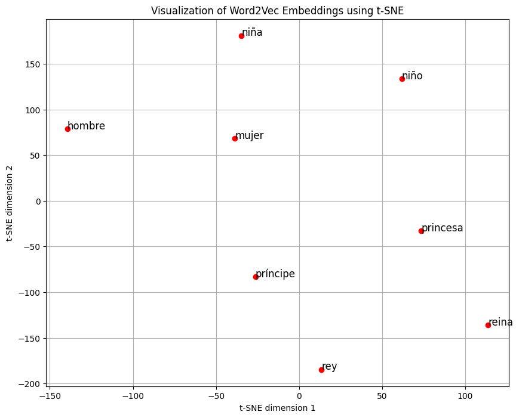

> Más información:  
> [https://www.cs.cmu.edu/~dst/WordEmbeddingDemo/index.html](https://www.cs.cmu.edu/~dst/WordEmbeddingDemo/index.html)  
> [https://projector.tensorflow.org/](https://projector.tensorflow.org/)  
> [https://towardsdatascience.com/visualizing-word-embedding-with-pca-and-t-sne-961a692509f5C](https://towardsdatascience.com/visualizing-word-embedding-with-pca-and-t-sne-961a692509f5)

## 4. Embeddings en oraciones

Los "sentence embeddings" (o incrustaciones de oraciones) se refieren a la representación vectorial de oraciones completas, párrafos o incluso documentos más largos. Mientras que las incrustaciones de palabras (word embeddings) representan palabras individuales en un espacio vectorial, las incrustaciones de oraciones buscan capturar el **significado semántico y la estructura de oraciones completas en un vector.**

Las siguientes son algunas características y detalles sobre las incrustaciones de oraciones:

1. **Objetivo**: El objetivo principal de las incrustaciones de oraciones es capturar el significado semántico de una oración completa en un vector de dimensiones fijas.
2. **Aplicaciones**: Las incrustaciones de oraciones se utilizan en diversas tareas de NLP, como la clasificación de texto, la búsqueda por similitud semántica entre oraciones, la respuesta automática a preguntas, la traducción automática, entre otras.
3. **Métodos**:

   - **Promedio de Word Embeddings**: Una técnica simple pero limitada, es tomar el promedio (o suma ponderada) de las incrustaciones de palabras en una oración para obtener una incrustación de oración.
   - **Modelos Específicos**: Modelos como [InferSent](https://arxiv.org/abs/1705.02364) ([facebookresearch/InferSent](https://github.com/facebookresearch/InferSent)), [Sentence-BERT](https://arxiv.org/abs/1908.10084) ([UKPLab/sentence-transformers](https://github.com/UKPLab/sentence-transformers)), o [Universal Sentence Encoder](https://arxiv.org/abs/1803.11175) han sido entrenados específicamente para generar embeddings de oraciones.
4. **Ventajas sobre Word Embeddings**:

   - **Captura de Contexto**: Mientras que las incrustaciones de palabras representan el significado de una palabra en general, las incrustaciones de oraciones pueden capturar el contexto en el que se utilizan las palabras, lo que es fundamental para captar el significado de una oración.
   - **Representación Unificada**: Proporcionan una representación unificada para oraciones de diferentes longitudes.
5. **Desafíos**:

   - **Variedad de Información**: Una oración puede contener una variedad de información, desde hechos y opiniones hasta emociones y relaciones entre conceptos. Capturar toda esta información en un vector de tamaño fijo es un desafío.
   - **Longitud Variable**: Las oraciones pueden tener longitudes variables, lo que puede dificultar la obtención de una representación coherente.
6. **Uso en Modelos de Aprendizaje Profundo**: Las incrustaciones de oraciones se pueden utilizar como entrada para modelos de aprendizaje profundo, como redes neuronales recurrentes (RNN) o redes neuronales de atención (Transformers), para tareas más avanzadas.

Una técnica “ingenua” para hacer embeddings de oraciones es promediar los embeddings de palabras en una oración y usar el promedio como representación de la oración completa. Este enfoque tiene limitaciones.

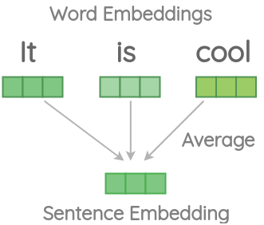

*Promediar vectores de palabras para incrustar oraciones*

Entendamos estos desafíos con algunos ejemplos de código usando la biblioteca Spacy. Primero instalamos **`spacy`** y creamos un objeto nlp para cargar la versión mediana de su modelo.

```python
# !pip install spacy
# !python -m spacy download en_core_web_md

import en_core_web_md
nlp = en_core_web_md.load()
```

**Pérdida de información**  
Si calculamos la similitud del coseno de los documentos que se muestran a continuación utilizando vectores de palabras promediados, la similitud es bastante alta incluso si la segunda oración tiene una sola palabra “It” y no tiene el mismo significado que la primera oración.

```python
print('It', nlp('It is cool').similarity(nlp('It')))
print('is', nlp('It is cool').similarity(nlp('is')))
print('cool', nlp('It is cool').similarity(nlp('cool')))
print('bad', nlp('It is cool').similarity(nlp('bad')))
print('dog', nlp('It is cool').similarity(nlp('dog')))

# It 0.8406058040674452
# is 0.70723585891297
# cool 0.7215671366454403
# bad 0.8406058040674452
# dog 0.26841879878619784
```

**El orden no afecta**  
En este ejemplo, intercambiamos el orden de las palabras en una oración, lo que da como resultado una oración con un significado diferente. Sin embargo, la similitud obtenida a partir de vectores de palabras promediados es del 100%:

```python
nlp('this is cool').similarity(nlp('is this cool'))

1.0
```

Podríamos solucionar algunos de estos desafíos con ingeniería manual de funciones, como omitir las “stop-words”, ponderar las palabras según sus puntuaciones TF-IDF, agregar n-gramas para respetar el orden al promediar, concatenar embeddings, etc. .

Una línea de pensamiento diferente es entrenar un modelo “end-to-end” para obtener incrustaciones de oraciones.

> ➡️ Históricamente, Doc2Vec (2014), InferSent (2017) y USE (2018) fueron los intentos de pasar de palabra a oración. El modelo que usamos de acá en adelante es Sentence-BERT: mismo objetivo, pero con un salto tecnológico a partir de la arquitectura Trasnformers.

### Sentence-BERT (S-BERT)

[Sentence-BERT](https://arxiv.org/abs/1908.10084) ([UKPLab/sentence-transformers](https://github.com/UKPLab/sentence-transformers)) es una modificación de la arquitectura BERT pre-entrenada originalmente desarrollada por Google en 2020. S-BERT puede entender el significado semántico de las oraciones a un nivel más profundo que BERT, lo que es vital para tareas de búsqueda semántica.

En el mundo de NLP, los transformers más utilizados, como BERT y RoBERTa, se han centrado principalmente en generar embeddings a nivel de palabra para resolver diversas tareas, incluyendo el modelado del lenguaje y la respuesta a preguntas. Sin embargo, estas técnicas encuentran limitaciones significativas cuando se trata de búsqueda semántica, que requiere una comprensión profunda a nivel de oración.

Para abordar este problema, Sentence-BERT mejora BERT, y utiliza redes siamesas y tripletas para crear embeddings de oraciones que pueden compararse utilizando similitud coseno. Esto hace que la búsqueda semántica sea computacionalmente factible, incluso cuando se trata de comparar un gran número de oraciones, reduciendo el tiempo de entrenamiento de varias horas a solo unos segundos.

El S-BERT supera el enfoque de búsqueda semántica de BERT, que utiliza un cross-encoder para comparar pares de oraciones y calcular un score de similitud, un proceso que se vuelve computacionalmente intenso y prácticamente inviable cuando el número de oraciones aumenta a cientos o miles.

Veamos un ejemplo de cómo utilizar SBERT:

```python
# !pip install sentence-transformers

from sentence_transformers import SentenceTransformer, util
from prettytable import PrettyTable

# Cargamos el modelo preentrenado multilingüe
modelo = SentenceTransformer('distiluse-base-multilingual-cased-v1')

# Definimos una lista de oraciones
oraciones = ['El gato está fuera',
             'Un hombre está tocando la guitarra',
             'Me encanta la pasta',
             'La nueva película es impresionante',
             'El gato juega en el jardín',
             'Una mujer está viendo la televisión',
             'La nueva película es genial',
             '¿Te gusta la pizza?',
             'La mujer y el señor miran la guitarra']

# Codificamos las oraciones
embeddings = modelo.encode(oraciones, convert_to_tensor=True)

# Calculamos las puntuaciones de similitud
puntuaciones_coseno = util.cos_sim(embeddings, embeddings)

# Encontramos las puntuaciones de similitud más altas
pares = []
for i in range(len(puntuaciones_coseno)-1):
    for j in range(i+1, len(puntuaciones_coseno)):
        pares.append({'index': [i, j], 'score': puntuaciones_coseno[i][j]})

# Ordenamos las puntuaciones en orden decreciente
pares = sorted(pares, key=lambda x: x['score'], reverse=True)

# Creamos una tabla para mostrar los resultados
tabla = PrettyTable()
tabla.field_names = ["Oración 1", "Oración 2", "Puntuación de Similitud"]

# Añadimos las filas a la tabla
for par in pares[0:10]:
    i, j = par['index']
    tabla.add_row([oraciones[i], oraciones[j], f"{par['score']:.4f}"])

# Mostramos la tabla
print(tabla)
```

Y la salida será la siguiente:

```text
+-------------------------------------+---------------------------------------+-------------------------+
|              Oración 1              |               Oración 2               | Puntuación de Similitud |
+-------------------------------------+---------------------------------------+-------------------------+
|  La nueva película es impresionante |      La nueva película es genial      |          0.9809         |
|  Un hombre está tocando la guitarra | La mujer y el señor miran la guitarra |          0.6964         |
|          El gato está fuera         |       El gato juega en el jardín      |          0.5979         |
| Una mujer está viendo la televisión | La mujer y el señor miran la guitarra |          0.4653         |
|         Me encanta la pasta         |          ¿Te gusta la pizza?          |          0.3107         |
|         Me encanta la pasta         |      La nueva película es genial      |          0.2879         |
|  Un hombre está tocando la guitarra |       El gato juega en el jardín      |          0.2811         |
|         Me encanta la pasta         |   La nueva película es impresionante  |          0.2713         |
|  Un hombre está tocando la guitarra |  Una mujer está viendo la televisión  |          0.2106         |
|      El gato juega en el jardín     |  Una mujer está viendo la televisión  |          0.1787         |
+-------------------------------------+---------------------------------------+-------------------------+
```

El modelo pre-entrenado que se ha utilizado es `distiluse-base-multilingual-cased-v1`, pero S-BERT permite varias opciones: [https://www.sbert.net/docs/pretrained_models.html](https://www.sbert.net/docs/pretrained_models.html) 

Al igual que hemos visto anteriormente, es posible también graficar los vectores de las oraciones, realizando una reducción de dimensiones. Para eso, podemos usar el método PCA para llevar los vectores a 2 dimensiones:

```python
# Importaciones de librerías
from sklearn.decomposition import PCA
import matplotlib.pyplot as plt

# Codifica las oraciones en vectores (sin convertir a tensor)
embeddings_array = modelo.encode(oraciones, convert_to_tensor=False)

# Aplica PCA para reducir a 2 dimensiones
pca = PCA(n_components=2)
embeddings_2d = pca.fit_transform(embeddings_array)

# Grafica los vectores en un gráfico de dispersión
plt.figure(figsize=(10, 8))
for i, oracion in enumerate(oraciones):
    plt.scatter(embeddings_2d[i, 0], embeddings_2d[i, 1], marker='o')
    plt.annotate(oracion, (embeddings_2d[i, 0], embeddings_2d[i, 1]))

plt.xlabel('Componente Principal 1')
plt.ylabel('Componente Principal 2')
plt.title('Visualización de oraciones usando PCA')
plt.grid(True)
plt.show()
```

Y el resultado será el siguiente:

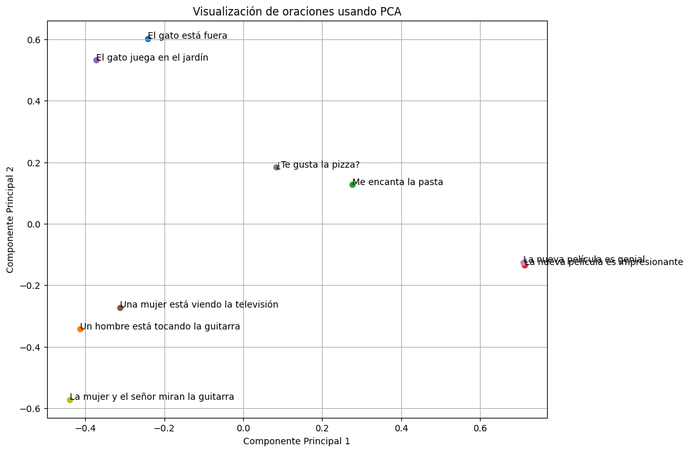

Como podemos observar, las frases con significado cercano o contexto similar, se encuentran más próximas entre si. 

### Massive Text Embedding Benchmark (MTEB)

El [**Massive Text Embedding Benchmark (MTEB)**](https://arxiv.org/pdf/2210.07316) ([embeddings-benchmark/mteb](https://github.com/embeddings-benchmark/mteb)) es una iniciativa diseñada para evaluar exhaustivamente los modelos de incrustación de texto (text embeddings) en una variedad de tareas. Su objetivo principal es proporcionar una visión clara sobre el rendimiento de diferentes modelos en múltiples tareas de incrustación de texto, abordando una laguna en las evaluaciones anteriores que generalmente se centraban en un conjunto limitado de tareas.

El MTEB incluye 58 conjuntos de datos que abarcan 112 idiomas y cubre 8 tareas diferentes de incrustación de texto, como la minería de textos bilingües (bitext mining), clasificación, agrupación (clustering), clasificación de pares, reranking, recuperación (retrieval), similitud textual semántica (STS) y resumen. Esta amplia cobertura permite una evaluación integral de los modelos, facilitando la comparación de su efectividad en un espectro diverso de aplicaciones.

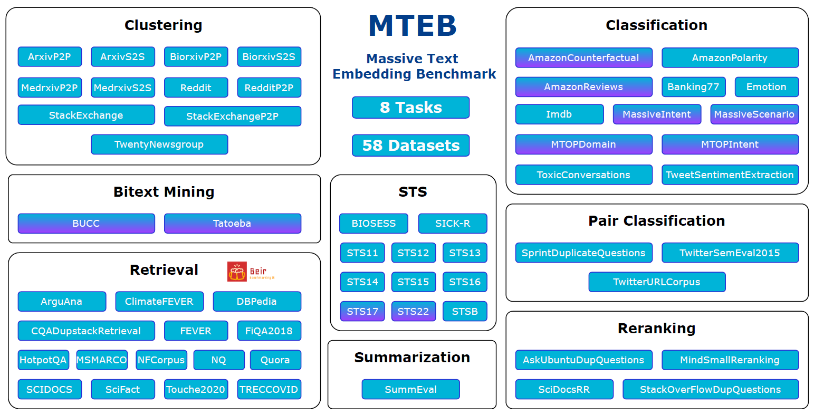

Además, el MTEB está diseñado para ser accesible y extensible, ofreciendo un código abierto y un tablero de líderes públicos, lo que permite a la comunidad evaluar fácilmente nuevos modelos de incrustaciones y contribuir al desarrollo del benchmark. Este enfoque colaborativo busca acelerar el progreso en la investigación de incrustaciones de texto y ayudar a identificar los modelos más efectivos para diferentes necesidades de aplicación.

En esta página, podemos encontrar la tabla de posiciones de los mejores modelos según el benchmark MTEB: 

🔗 [MTEB Leaderboard - a Hugging Face Space by mteb](https://huggingface.co/spaces/mteb/leaderboard)  
Discover amazing ML apps made by the community

> 💡 
>
> Debemos tener en cuenta que no todos los modelos han sido entrenados en español o son multilingües. Otro factor importante es el tamaño del modelo. Un modelo demasiado grande y complejo ocupará mucha memoria y puede ser que nuestro servidor no tenga la suficiente memoria para correrlo.

En la práctica no hace falta reentrenar un embedding de oración. Se elige un modelo del leaderboard que sea **multilingüe o entrenado en español**, se mira el tamaño (RAM/latencia) y se valida con un puñado de pares de ejemplos. La carga es una línea: `SentenceTransformer("nombre-del-modelo")`.

### Resumen

Los modelos de embeddings modernos (como los basados en Transformers: BERT, GPT, etc.) aprenden a representar frases o documentos como vectores numéricos en un espacio multidimensional. Lo hacen de la siguiente manera:

- **Entrenamiento Masivo:** Se entrenan con cantidades enormes de texto (libros, artículos, webs).
- **Aprendizaje Contextual:** Durante el entrenamiento, el modelo realiza tareas que le obligan a entender el contexto. Una tarea común es predecir palabras ocultas en una frase (Masked Language Modeling). Para hacer esto bien, el modelo debe aprender qué palabras suelen aparecer juntas y en qué contextos, capturando así relaciones semánticas.
- **Codificación a Vectores (Embeddings):** El modelo ajusta sus parámetros internos para que, al procesar una palabra o una secuencia de texto, genere un vector (embedding).
- **Proximidad = Similaridad Semántica:** El proceso de entrenamiento optimiza estos vectores de tal forma que textos con significados similares (aunque usen palabras distintas, sean de diferente longitud o incluso en distintos idiomas en modelos multilingües) terminen teniendo vectores cercanos en ese espacio multidimensional. El modelo aprende que "coche" y "automóvil", o frases como "estoy feliz" y "siento alegría", se usan en contextos parecidos y, por lo tanto, les asigna vectores cercanos.

> 💡 
>
> En resumen, el modelo no entiende el significado como un humano, pero aprende patrones estadísticos y contextuales tan complejos del lenguaje que logra agrupar textos semánticamente relacionados en su espacio vectorial, permitiendo medir la similitud por la distancia entre sus vectores.
