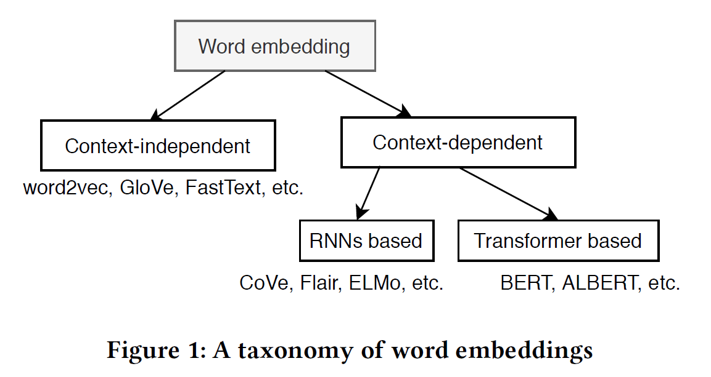
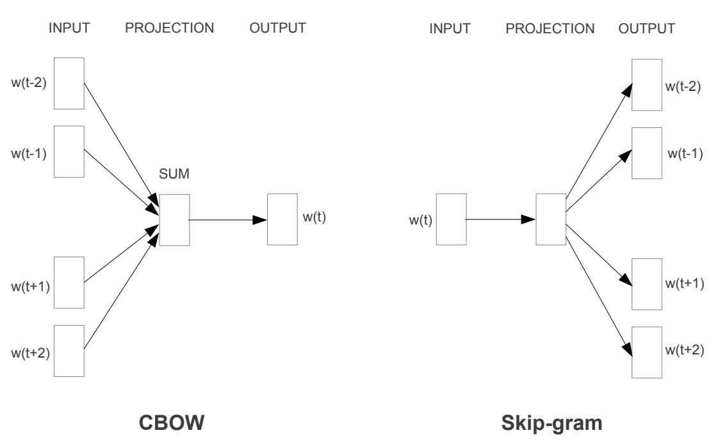

# Resumen · Unidad 2: Representación Vectorial de Texto

> **Fuentes:** apunte de la cátedra (Notion), prácticas «Vectorización frecuentista» y «Embeddings semánticos», y enunciado del TP2.
> **Cómo usarlo:** el hilo conductor es **qué limitación resolvió cada método respecto del anterior**. Si podés contar esa historia de memoria (§0), tenés la unidad. Antes del parcial, recorré las **trampas** (§7), las **preguntas de desarrollo** (§8) y los **casos prácticos** (§9).

---

## 0. Mapa de la unidad

Los modelos necesitan números. Hay dos familias para convertir texto en vectores:

```
 FRECUENTISTAS (dispersos, léxicos)                     EMBEDDINGS (densos, semánticos)
 «qué palabras hay y cuánto pesan»                      «qué significan… y en qué contexto»

 One-hot ─► Count ─► TF-IDF ─► Hashing       ═══►       Word2Vec/GloVe ─► FastText ─► ELMo/BERT ─► Sentence-BERT
                                                         (palabra)        (subpalabra)  (contexto)   (oración)
```

| Método | Qué problema del anterior resuelve | Qué limitación deja |
|---|---|---|
| **One-hot** | Pasar de palabras a números | Ortogonalidad (sin similitud), dimensión = vocabulario |
| **Count Vectorizer** | Representa **documentos** y cuenta **frecuencias** | Ignora el orden; sobrevalora las palabras comunes |
| **TF-IDF** | Baja el peso de las palabras comunes y sube el de las **discriminativas** | Sigue siendo léxico: los sinónimos no se parecen |
| **Hashing** | Evita guardar un vocabulario (tamaño fijo, streaming) | Colisiones, no se puede volver a la palabra |
| **Word2Vec / GloVe** | **Semántica**: las palabras parecidas quedan cerca | Un vector por palabra; no maneja palabras OOV |
| **FastText** | **Morfología** y palabras **OOV** (n-gramas de caracteres) | Sigue siendo **estático** (polisemia) |
| **ELMo / BERT** | Vector **contextual**: «banco» cambia según la oración | Da vectores de palabra, no de oración comparables directamente |
| **Sentence-BERT** | Un embedding por **oración**, comparable con coseno | Límite de tokens (trunca los textos largos) |

---

## 1. Codificación clásica (frecuentista)

### 1.1 One-hot encoding

- Cada palabra es un vector de largo **|V|** (el tamaño del vocabulario) con un **1** en su posición y **0** en el resto: gato = [1, 0, 0], perro = [0, 1, 0].
- Viene de codificar **variables categóricas nominales** (sin orden). Herramientas: `sklearn.preprocessing.OneHotEncoder`, `pandas.get_dummies`.
- ✅ Simple. ❌ Alta dimensionalidad; no refleja frecuencia ni relevancia; **todas las palabras son ortogonales**, así que «buen» está tan lejos de «gran» como de «día».
- **En la práctica:** `CountVectorizer(binary=True)` es el «one-hot **de documentos**»: marca presencia o ausencia de cada palabra sin contar repeticiones. Con 10 000 palabras de vocabulario y unas 200 por sinopsis, el **98 % del vector son ceros** (**sparsidad**; sklearn guarda solo los valores distintos de cero).

### 1.2 Count Vectorizer (bolsa de palabras)

- Cada **documento** es un vector con **cuántas veces** aparece cada palabra del vocabulario.

| | Me | gusta | jugar | fútbol | el | tenis |
|---|---|---|---|---|---|---|
| Doc 1: «Me gusta jugar fútbol» | 1 | 1 | 1 | 1 | 0 | 0 |
| Doc 2: «Me gusta el tenis» | 1 | 1 | 0 | 0 | 1 | 1 |

- ❌ **Ignora el orden**: «el perro muerde al hombre» y «el hombre muerde al perro» dan el mismo vector. ❌ Les da **mucho peso a las palabras frecuentes** («el», «la»), lo que motiva TF-IDF.

**Parámetros de sklearn (práctica):**

| Parámetro | Efecto |
|---|---|
| `max_features=N` | Se queda con las N palabras más frecuentes |
| `min_df=2` | Descarta los términos que aparecen en menos de 2 documentos (los *hapax*). Casi siempre conviene |
| `max_df=0.9` | Descarta los términos presentes en más del 90 % de los documentos (efecto parecido a quitar stopwords) |
| `binary=True` | Solo presencia o ausencia (one-hot de documentos) |
| `ngram_range=(1, 2)` | Suma **bigramas**: «no me gustó» deja de confundirse con «me gustó». La dimensión **crece** |

### 1.3 TF-IDF

**Intuición:** una palabra es importante para un documento si aparece **mucho en él** y **poco en el resto del corpus**.

$$
\text{TF}(t,d) = \frac{\text{veces que } t \text{ aparece en } d}{\text{total de términos en } d}
\qquad
\text{IDF}(t,D) = \log\frac{N}{\text{nº de documentos que contienen } t}
\qquad
\text{TF-IDF} = \text{TF} \times \text{IDF}
$$

- Sube si la palabra aparece más en **el documento**; baja si aparece en **muchos documentos**.
- Una palabra que está en **todos** los documentos tiene IDF = log(N/N) = **0**.
- El **logaritmo amortigua**: sin él, las palabras rarísimas tendrían un peso desproporcionado.
- **sklearn** (`smooth_idf=True`, por defecto) usa IDF = ln((1 + N) / (1 + df)) + 1. Con N = 3 y df = 1 da ln 2 + 1 ≈ **1,693**, el valor que aparece en el ejemplo del apunte.
- **Matriz:** **filas = documentos**, **columnas = palabras** del vocabulario.
- **TF-IDF y stopwords:** el IDF ya baja su peso (aparecen en casi todos los documentos), pero quitarlas igual reduce la dimensión y el costo. Cuidado con «no», «pero» y «si» en tareas de matiz: conviene usar listas personalizadas.

| Parámetro (práctica) | Qué hace |
|---|---|
| `sublinear_tf=True` | Usa log(1 + tf): la repetición no domina en los documentos largos |
| `smooth_idf=True` | Evita divisiones por cero; conviene dejarlo en `True` |
| `use_idf=False` | Solo TF normalizado |

> 🎯 Buen punto de partida para clasificar: `TfidfVectorizer(sublinear_tf=True, min_df=2)`.

### 1.4 Vectorización de hash (*hashing trick*)

- Una **función hash** lleva cada token a un índice: `índice = hash(token) % n_features`. Para esto se prefieren funciones **no criptográficas** y rápidas, como **MurmurHash**, en lugar de MD5 o SHA.
- ✅ **No guarda un vocabulario** y **no necesita `fit`**: el mismo vectorizador sirve para textos nuevos, **streaming** y corpus que no entran en memoria. La dimensión es **fija** (`n_features`, por ejemplo 2<sup>18</sup> ≈ 262 000).
- ❌ **Colisiones**: dos palabras distintas pueden caer en el mismo índice. Es raro si `n_features` es grande, pero puede acercar documentos que no comparten palabras. ❌ Es **sin estado**: no se puede volver de una columna a su palabra, y eso dificulta interpretar.
- Por defecto normaliza con norma L2 y usa signos alternados (`alternate_sign`): los valores quedan entre −1 y 1.

### 1.5 Comparación y límite común

| Técnica | Aplica a | Pros | Contras | Dimensión |
|---|---|---|---|---|
| One-hot | Palabras | Simple | Alta dimensión; ni frecuencia ni relevancia | Vocabulario |
| Count | Documentos | Tiene en cuenta la frecuencia | Sobrevalora las palabras comunes; ignora el orden | Vocabulario |
| TF-IDF | Documentos | Frecuencia **y** relevancia | Algo más complejo | Vocabulario |
| Hash | Palabras o documentos | Tamaño fijo; sin vocabulario | Colisiones; no invertible | `n_features` |

> ⚠️ **Ninguno captura semántica.** El coseno entre esos vectores mide **coincidencia léxica ponderada**. Ejemplo del TP2: «una novela sobre piratas» y «un relato de bucaneros» tienen similitud TF-IDF **exactamente 0**, porque no comparten ningún token.

---

## 2. Word embeddings

### 2.1 La idea

- **Hipótesis distribucional:** las palabras que aparecen en **contextos similares** tienen **significados similares** («mi ___ come mucho»: perro, gato), y por eso sus vectores deben quedar **cerca**.
- Los embeddings son **densos**, de **dimensión relativamente baja** (unos 300 contra cientos de miles de palabras de vocabulario) y **aprendidos** de los datos. One-hot es **disperso**, de alta dimensión y fijado a mano.
- Capturan relaciones semánticas y sintácticas: **rey − hombre + mujer ≈ reina**; «caminar» es a «caminó» lo que el presente al pasado.


**Rasgos semánticos (ejemplo del apunte):** cada dimensión puede pensarse como un rasgo del significado.

| | Género | Edad | Realeza |
|---|---|---|---|
| man | 1 | 7 | 1 |
| woman | 9 | 7 | 1 |
| king | 1 | 8 | 8 |
| queen | 9 | 7 | 8 |

Los modelos reales **aprenden** cientos de dimensiones de este tipo, que no tienen un nombre interpretable.

### 2.2 Similitud coseno

$$
\cos(\theta) = \frac{A \cdot B}{\lVert A\rVert\,\lVert B\rVert}
$$

- **1**: misma dirección (máxima similitud) · **0**: ortogonales (sin relación) · **−1**: opuestos. **Puede ser negativa**: no es una probabilidad.
- **Por qué se prefiere a la distancia euclidiana:**
  1. Es **invariante a la magnitud**: mide orientación. Un documento corto y uno largo sobre el mismo tema pueden ser similares.
  2. En **alta dimensión**, la distancia euclidiana pierde significado (la *maldición de la dimensionalidad*).
  3. Se **interpreta** de forma intuitiva (1, 0, −1).
  4. Con vectores normalizados, se reduce a un producto escalar (el apunte lo menciona como eficiencia).
- Herramientas: `sklearn.metrics.pairwise.cosine_similarity`, `sentence_transformers.util.cos_sim`.

### 2.3 Tipos de embeddings



- **Independientes del contexto** (estáticos, los «clásicos»): **word2vec, GloVe, FastText**. Redes superficiales o factorización de matrices de co-ocurrencia; **un vector por palabra**. Se distribuyen pre-entrenados.
- **Dependientes del contexto:** la **misma palabra recibe vectores distintos** según la oración («banco» financiero o de plaza).
  - Basados en **RNN**: CoVe, Flair, **ELMo**.
  - Basados en **Transformers**: **BERT**, ALBERT.

### 2.4 Word2Vec (2013)

| | **CBOW** (*Continuous Bag of Words*) | **Skip-gram** |
|---|---|---|
| Predice | La **palabra central** a partir del **contexto** | El **contexto** a partir de la **palabra central** |
| Entrada | C palabras de contexto (sus vectores se **promedian**) | Una palabra (en one-hot) |
| En gensim | `sg=0` | `sg=1` |



**Arquitectura:**

1. La entrada es un **one-hot de tamaño V**.
2. La **capa oculta** tiene N neuronas (N es un hiperparámetro: la dimensión del embedding, por ejemplo 300). La salida es un **softmax de tamaño V**.
3. Hay dos matrices: **W (V × N)**, de entrada a la capa oculta, y **W′ (N × V)**, de la capa oculta a la salida.
4. **Los vectores de palabras son los pesos de la capa oculta** (las filas de W). La tarea de predicción es solo una excusa para aprenderlos.


- La **ventana** (*window size*) es un hiperparámetro fijo: cuántas palabras a cada lado se consideran contexto.
- **Skip-gram no distingue la dirección**: no sabe si una palabra de contexto estaba a la izquierda o a la derecha. Refleja **co-ocurrencias**, no gramática.
- **`most_similar(positive=[...], negative=[...])`** en gensim suma los vectores de `positive`, resta los de `negative` y devuelve los más similares por coseno (analogías).
- **Negative sampling (TP2):** calcular el softmax sobre **todo el vocabulario** en cada paso es inviable. Se reemplaza por una clasificación binaria entre el par (palabra, contexto) real y unas pocas palabras «negativas» muestreadas.
- **Modelo pre-entrenado en español** del apunte: **SBW-vectors-300-min5** (Spanish Billion Words Corpus), cargado con `gensim.models.KeyedVectors`.

### 2.5 FastText (FAIR, 2016)

- Representa cada palabra como la **suma de los vectores de sus n-gramas de caracteres**. Con n = 3: «donde» → `<do`, `don`, `ond`, `nde`, `de>`, donde `<` y `>` marcan el inicio y el fin de la palabra.
- ✅ **Morfología**: gato, gatos y gatito comparten n-gramas. ✅ Palabras **fuera de vocabulario (OOV)**: una palabra nunca vista igual obtiene vector.
- ❌ **Sigue siendo estático**: no distingue los sentidos de «banco».

### 2.6 Línea temporal

| Año | Modelo | Qué cambió |
|---|---|---|
| 2013 | **Word2Vec** | Embeddings densos; analogías |
| 2014 | **GloVe** | Mismo rol, entrenado con **co-ocurrencia global** (Stanford) |
| 2014 | **Doc2Vec** | Un vector **por documento o párrafo** |
| 2016 | **FastText** | n-gramas de caracteres: morfología y OOV |
| 2017 | **InferSent** | Embeddings de oración supervisados (NLI) |
| 2018 | **ELMo** | Primer embedding **contextual** masivo (biLSTM) |
| 2018 | **BERT** | Contextual con **Transformers**; base de casi todo lo posterior |
| 2018 | **USE** | *Universal Sentence Encoder* (Google), entrenado con varias tareas |
| 2019 | **Sentence-BERT** | Embeddings de oración comparables con coseno |
| 2022 | **MTEB** | Benchmark para **elegir** un modelo de embeddings |
| 2025 | **EmbeddingGemma** | Embeddings compactos que corren en el dispositivo |

> 📌 GloVe no aporta una idea nueva respecto de Word2Vec, sino otra forma de entrenar. Doc2Vec, ELMo y USE fueron hitos reales, pero hoy los superan Sentence-BERT y sus derivados.

### 2.7 Embeddings contextuales (BERT)

- El vector de una palabra **depende de la oración**: «retirar dinero del **banco**» y «sentarse en el **banco** de la plaza» dan puntos distintos. Con Word2Vec, en cambio, serían el mismo vector.
- ELMo lo mostró con **LSTM bidireccionales**; BERT lo hizo con **Transformers** y se volvió el estándar.
- **Cómo aprenden los modelos modernos:** con **entrenamiento masivo** y tareas como el ***Masked Language Modeling*** (predecir palabras ocultas), que obligan a usar el contexto. Resultado: la **proximidad** en el espacio equivale a **similitud semántica**, incluso entre palabras distintas, longitudes distintas o idiomas distintos en los modelos multilingües. El modelo no «entiende»: aprende patrones estadísticos muy ricos.

### 2.8 Cuadro resumen

| Método | Enfoque | Similitud semántica | ¿Sirve el coseno? | Contextual |
|---|---|---|---|---|
| One-hot | Palabra | No | No (ortogonales) | No |
| Count / Hash / TF-IDF | Documento | No | Sí (coincidencia léxica) | No |
| Word2Vec | Palabra | Sí | Sí | No |
| FastText | Palabra + subpalabra | Sí (+ OOV y morfología) | Sí | No |
| BERT | Palabra en contexto | Sí | Sí | **Sí** |
| Sentence-BERT | Oración | Sí | Sí | **Sí** |

---

## 3. Visualización de embeddings

| | **PCA** | **t-SNE** |
|---|---|---|
| Tipo | **Lineal**, determinista | **No lineal**, estocástico |
| Qué preserva | Las direcciones de **máxima varianza** | Las **vecindades locales** (quién está cerca de quién) |
| Para qué | Estructura global; dice cuánta varianza se explica | Ver **grupos** |
| ⚠️ Cuidado | 2 componentes explican **muy poca varianza**: en las prácticas, un 2 % con TF-IDF y un 6 % con E5 (la consigna decía 10–15 %, y estaba mal). Puntos mezclados en 2D **no** implican que el espacio original no separe | Las **distancias entre clusters** y sus tamaños **no se interpretan**; dependen de la `perplexity` |

- Para matrices **dispersas** (TF-IDF), la práctica usa **`TruncatedSVD`**, que cumple el rol de PCA sin densificar la matriz.
- Ninguno usa etiquetas: el color por género se agrega **después**, y es información que el modelo **nunca vio**.
- Herramientas online: *TensorFlow Embedding Projector*, *WordEmbeddingDemo* (CMU).

---

## 4. Embeddings de oraciones

### 4.1 Qué son

Son vectores de **dimensión fija** que representan el significado de una oración, un párrafo o un documento. Se usan en **búsqueda semántica**, clasificación, clustering, respuesta a preguntas, traducción y **RAG**. Frente a los word embeddings, capturan el **contexto** y dan una **representación unificada** para textos de distinta longitud. Los desafíos: meter mucha información (hechos, opiniones, emociones) en un vector de tamaño fijo, y manejar longitudes variables.

### 4.2 Por qué promediar word embeddings es limitado


- **Pérdida de información:** una oración de una sola palabra («It») puede dar similitud alta con una oración completa.
- **El orden no afecta:** «this is cool» e «is this cool» dan similitud **1,0**, porque el promedio es conmutativo.
- **Parches manuales:** omitir stopwords, **ponderar con TF-IDF**, agregar n-gramas, concatenar embeddings.
- **Solución de fondo:** entrenar un modelo **de punta a punta** para oraciones. Los intentos históricos fueron Doc2Vec, InferSent y USE; el que se usa en la materia es **Sentence-BERT**.

### 4.3 Sentence-BERT (SBERT)

- Modifica BERT con **redes siamesas y tripletas** para producir embeddings de oración **comparables con el coseno**.
- **Frente al cross-encoder de BERT:** el cross-encoder procesa **cada par** de oraciones (la cantidad de pares crece cuadráticamente, y se vuelve inviable con miles). SBERT codifica **cada oración una vez** y compara con coseno. En el paper, encontrar el par más parecido entre 10 000 oraciones pasa de unas 65 horas a unos 5 segundos.
- Modelo del apunte: **`distiluse-base-multilingual-cased-v1`** (multilingüe). Librería: **`sentence-transformers`**.

### 4.4 MTEB (*Massive Text Embedding Benchmark*)

- Evalúa modelos de embeddings en **58 datasets, 112 idiomas y 8 tareas**: bitext mining, clasificación, clustering, clasificación de pares, reranking, **retrieval**, **STS** (similitud semántica) y resumen. Tiene un **leaderboard** público en Hugging Face.
- **Cómo elegir un modelo:** que sea **multilingüe o entrenado en español**, que su **tamaño** (RAM y latencia) sea viable, y **validarlo** con pares de ejemplo propios. **No hace falta reentrenar**: cargarlo es `SentenceTransformer("nombre-del-modelo")`.

### 4.5 E5 en la práctica

- **`intfloat/multilingual-e5-small`**: 384 dimensiones, más de 100 idiomas, rápido en CPU.
- Usa **prefijos**: **`query: `** para las consultas y **`passage: `** para los documentos que se indexan. Usar el prefijo correcto mejora bastante los resultados.
- Flujo: **vectorizar una sola vez** (`normalize_embeddings=True`), **guardar** los embeddings (en la práctica, en un ZIP) y cargar el modelo solo para codificar consultas nuevas.
- **Centrar antes de promediar:** todos los embeddings comparten una componente común («es una sinopsis de libro en español»), así que los centroides por género dan similitud ≈ 0,98. Restar la **media global** deja a la vista lo que distingue a cada grupo.
- Métricas de clustering usadas: **silhouette** (sin etiquetas) y **ARI** (contra etiquetas reales).

| | TF-IDF | E5 (Sentence Transformer) |
|---|---|---|
| Vector | Disperso, alta dimensión | Denso, 384 dimensiones |
| Semántica | Léxica (palabras exactas) | Significado |
| Multilingüe | No | Sí |
| Velocidad | Muy rápido | Moderada |
| Mejor para | Búsqueda por palabras clave | Búsqueda por significado |

---

## 5. Evaluar representaciones (TP2)

Esta es la parte que más pesa en el TP, y sirve como argumento en cualquier pregunta de desarrollo.

- **El preprocesamiento pertenece al modelo, no al corpus.** La limpieza para TF-IDF (minúsculas, sin stopwords, sin puntuación) es **destructiva** para un modelo de oración, que se entrenó con texto natural y usa el orden y las palabras funcionales. Por eso se preparan **dos versiones** del texto: una limpia y otra cruda.
- **Toda métrica necesita una línea de base:** se compara con **TF-IDF** (la línea de base léxica) y con la **elección al azar** (el **piso**). Si un género cubre la mitad de la colección, el azar ya da ≈ 0,5.
- **precision@k** sobre un conjunto de consultas **propio**, con los relevantes definidos **antes** de ver los resultados.
- Incluir **consultas sin solapamiento léxico** con sus relevantes: ahí TF-IDF no puede ganar por construcción.
- Que TF-IDF **empate o gane** en algunas consultas es normal: hay que **explicarlo**, no cambiar la métrica.
- La **distribución de similitudes entre pares al azar** (media, desvío, rango) muestra si el espacio discrimina: si todo se parece a todo, el ranking ordena ruido.
- **Límite de tokens:** SBERT **trunca** los textos largos **sin avisar**, así que hay que contar cuántos documentos se cortan. El chunking lo mitiga.
- **Multi-etiqueta** (un libro con varios géneros) no es lo mismo que **multi-clase**, y cambia la evaluación: un clustering «duro» penaliza a los libros con varios géneros.
- Las **sinopsis son texto promocional** (escrito para vender): eso sesga, por ejemplo, un clasificador de géneros.
- **Qué no mide precision@k:** el *recall*, el orden dentro del top-k ni la relevancia graduada. Además, depende de juicios subjetivos, y con pocas consultas es ruidosa.

> 🧩 **Infraestructura del TP2** (probablemente fuera del parcial teórico): los vectores se guardan en **Postgres con `pgvector`**, con **una tabla por modelo** (no pueden convivir dos dimensiones en la misma columna indexada). El índice **HNSW** tiene que usar la *opclass* que corresponde al operador de distancia. Hay que manejar los vectores nulos o `NaN` **antes** de insertarlos, y un índice aproximado combinado con un filtro selectivo puede **perder recall**.

---

## 6. Chuleta de herramientas

| Herramienta | Para qué |
|---|---|
| `OneHotEncoder` (sklearn), `get_dummies` (pandas) | One-hot |
| `CountVectorizer` | Bolsa de palabras (`binary=True`: one-hot de documentos; `ngram_range`) |
| `TfidfVectorizer` | TF-IDF (`sublinear_tf`, `smooth_idf`, `min_df`, `max_df`) |
| `HashingVectorizer` | Hashing trick (`n_features`, sin `fit`) |
| `cosine_similarity` (sklearn) / `util.cos_sim` | Similitud coseno |
| **gensim**: `KeyedVectors`, `Word2Vec`, `FastText` | Cargar o entrenar embeddings de palabra; `most_similar` |
| spaCy (`en_core_web_md`) | Vectores de palabra promediados para oraciones |
| transformers (`BertModel`, `BertTokenizer`) | Embeddings contextuales de BERT |
| **sentence-transformers** | SBERT, E5: embeddings de oración |
| `PCA`, `TruncatedSVD`, `TSNE` | Reducción de dimensión y visualización |
| `KMeans`, `silhouette_score`, `adjusted_rand_score` | Clustering y su evaluación |
| MTEB | Elegir un modelo de embeddings |

---

## 7. Trampas típicas de parcial

1. **CBOW:** contexto → palabra central. **Skip-gram:** palabra central → contexto. (Invertirlos es la trampa clásica.)
2. **Los embeddings de Word2Vec son los pesos de la capa oculta**, no la salida del softmax.
3. **FastText no resuelve la polisemia**: es estático. La resuelven los modelos **contextuales** (ELMo, BERT).
4. **Skip-gram no distingue izquierda y derecha** dentro de la ventana.
5. **El coseno puede ser negativo** y no es una probabilidad.
6. **TF-IDF no capta sinónimos**: sin palabras en común, la similitud es 0.
7. En la matriz TF-IDF de sklearn, las **filas son documentos** y las **columnas, palabras**.
8. Una palabra presente en **todos** los documentos tiene **IDF = 0** con la fórmula del apunte (y 1 con el suavizado de sklearn).
9. **`ngram_range=(1, 2)` aumenta** la dimensión: los bigramas **se suman** a los unigramas.
10. **Hashing:** no necesita `fit` ni vocabulario, pero tiene colisiones y no es invertible.
11. **One-hot** (vectores de palabra en la teoría) no es lo mismo que **`binary=True`** (vectores de documento en la práctica).
12. **Promediar word embeddings** descarta el orden: «this is cool» = «is this cool».
13. **SBERT contra cross-encoder:** SBERT codifica cada oración una vez; el cross-encoder procesa cada par.
14. **MTEB es un benchmark**, no un modelo.
15. **t-SNE:** las distancias entre clusters no se interpretan. **PCA a 2D:** que los puntos se vean mezclados no prueba nada.
16. Los embeddings son de **baja** dimensión comparados con el vocabulario (300 contra 100 000), aunque sean de **alta** dimensión comparados con 2D. El apunte usa las dos expresiones.
17. **E5:** `query: ` para las consultas y `passage: ` para los documentos.

---

## 8. Preguntas de desarrollo para practicar

> Intentá responder cada una antes de abrir la respuesta. Son respuestas modelo: cubren lo que se espera encontrar en un parcial.

### 8.1 Compará one-hot, Count, TF-IDF y Hashing: qué representan, pros, contras y dimensión

<details>
<summary>Ver respuesta</summary>

Los cuatro son métodos **frecuentistas**: producen vectores **dispersos** (casi todos ceros) basados en qué palabras aparecen.

| | One-hot | Count Vectorizer | TF-IDF | Hashing |
|---|---|---|---|---|
| **Representa** | Una **palabra**: un 1 en su posición y 0 en el resto | Un **documento**: cuántas veces aparece cada palabra | Un **documento**: cada palabra pesada por frecuencia × rareza | Un documento (o palabra), con índices calculados por una función hash |
| **Pros** | Muy simple | Tiene en cuenta la frecuencia | Baja el peso de las palabras comunes y sube el de las **discriminativas** | **No guarda vocabulario**: no necesita `fit`, sirve para streaming y textos nuevos |
| **Contras** | Todas las palabras son **ortogonales** (sin similitud); no refleja frecuencia ni relevancia | **Sobrevalora** las palabras comunes («el», «la»); ignora el orden | Sigue siendo **léxico**: los sinónimos no se parecen | **Colisiones**; no es invertible (no se puede volver de la columna a la palabra) |
| **Dimensión** | Tamaño del vocabulario | Tamaño del vocabulario | Tamaño del vocabulario | **Fija**: `n_features` (por ejemplo, 2<sup>18</sup>) |

**Lo que tienen en común:**

- **Ninguno captura semántica:** el coseno entre esos vectores mide coincidencia de palabras. «Una novela sobre piratas» y «un relato de bucaneros» tienen similitud **0**.
- **Todos ignoran el orden:** «el perro muerde al hombre» y «el hombre muerde al perro» dan el mismo vector. Los n-gramas lo mitigan en parte.
- **Producen vectores muy dispersos:** en la práctica, la matriz de sinopsis tenía un 99,86 % de ceros.

**La evolución:** Count resuelve que one-hot no cuente frecuencias; TF-IDF resuelve que Count sobrevalore las palabras comunes; Hashing resuelve tener que guardar un vocabulario.

</details>

### 8.2 Explicá TF-IDF con sus fórmulas y el papel del logaritmo. ¿Qué pasa con las stopwords?

<details>
<summary>Ver respuesta</summary>

**Intuición:** una palabra es importante para un documento si aparece **mucho en él** y **poco en el resto** del corpus.

**Fórmulas:**

- **TF(t, d)** = veces que t aparece en d / total de términos de d. Mide la importancia **dentro** del documento.
- **IDF(t, D)** = log(N / cantidad de documentos que contienen t). Mide la **rareza en el corpus**: si t aparece en los N documentos, IDF = log 1 = **0**.
- **TF-IDF** = TF × IDF.

sklearn usa por defecto una versión suavizada: IDF = ln((1 + N) / (1 + df)) + 1. Evita divisiones por cero y hace que una palabra presente en todos los documentos valga 1 en vez de 0.

**El papel del logaritmo:** **amortigua** la escala. Sin él, una palabra que aparece en 1 documento de un millón tendría un peso de 1.000.000; con el logaritmo natural, ≈ 13,8. Así la rareza suma importancia, pero no domina por completo. Con `sublinear_tf=True`, se aplica el mismo criterio al TF, usando log(1 + tf), para que repetir mucho una palabra en un documento largo no lo domine.

**Las stopwords:**

- Como aparecen en casi todos los documentos, su **IDF es bajo** y su peso cae.
- Pero **TF-IDF no las elimina**, y su TF es altísimo. En la práctica de U2, el TF-IDF promedio por género seguía dominado por «de», «la» y «que».
- Por eso conviene igual quitarlas: reduce la dimensión, el ruido y el costo.
- Con una advertencia: en tareas de matiz (sentimiento), «no», «pero» o «sin» cambian el sentido, y conviene una lista personalizada.

</details>

### 8.3 ¿Por qué los métodos frecuentistas no capturan semántica y cómo lo resuelven los word embeddings? ¿Qué limitación queda y qué la resuelve?

<details>
<summary>Ver respuesta</summary>

**Por qué no capturan semántica:** cada palabra es una **dimensión independiente**. «Perro» y «can» son columnas distintas y no tienen ninguna relación entre sí. Dos documentos solo se parecen si **comparten palabras**: «una novela sobre piratas» y «un relato de bucaneros» tienen similitud TF-IDF **0**, aunque digan lo mismo.

**Cómo lo resuelven los word embeddings:** se basan en la **hipótesis distribucional**, que dice que las palabras que aparecen en **contextos similares** tienen **significados similares**.

- Modelos como **Word2Vec** aprenden, a partir de un corpus grande, un vector **denso** de unas 300 dimensiones para cada palabra, de modo que las palabras parecidas quedan **cerca**.
- Así, «pirata» y «bucanero» tienen vectores con coseno alto, y aparecen relaciones como **rey − hombre + mujer ≈ reina**.

**Qué limitaciones quedan y qué las resuelve:**

1. **Las palabras fuera del vocabulario (OOV)** no tienen vector. Lo resuelve **FastText**, que arma cada palabra con sus n-gramas de caracteres.
2. **Son estáticos:** «banco» tiene un único vector, sea el financiero o el de la plaza (polisemia). Lo resuelven los **embeddings contextuales**, como **ELMo** y **BERT**, donde el vector depende de la oración.
3. **Representan palabras, no oraciones:** promediar los vectores de una oración pierde el orden («this is cool» = «is this cool»). Lo resuelve **Sentence-BERT**, que produce un embedding de oración comparable con el coseno.

</details>

### 8.4 Word2Vec: CBOW contra Skip-gram, arquitectura, de dónde salen los vectores y para qué sirve el negative sampling

<details>
<summary>Ver respuesta</summary>

**Las dos variantes** son tareas de predicción sobre una ventana de contexto:

| | **CBOW** | **Skip-gram** |
|---|---|---|
| Predice | La **palabra central** a partir del **contexto** | El **contexto** a partir de la **palabra central** |
| Entrada | Las palabras de contexto (sus vectores se promedian) | Una palabra |
| gensim | `sg=0` | `sg=1` |
| Se dice que | Es más rápido y anda bien con palabras frecuentes | Aprende mejor las palabras poco frecuentes y los corpus chicos |

**Arquitectura:** una red **superficial**.

- La entrada es un **one-hot de tamaño V** (el vocabulario).
- Hay una **capa oculta** de N neuronas: N es la dimensión del embedding, por ejemplo 300.
- La salida es un **softmax de tamaño V**.
- Hay dos matrices de pesos: **W (V × N)** y **W′ (N × V)**.

**De dónde salen los vectores:** de los **pesos de la capa oculta**. Cada fila de W es el vector de una palabra, porque multiplicar un one-hot por W selecciona justamente esa fila. La predicción es solo una **excusa**: lo que interesa son los pesos que se aprenden para resolverla.

**Hiperparámetros:** el tamaño de la **ventana** (cuántas palabras a cada lado cuentan como contexto), la dimensión, `min_count` y las épocas. Skip-gram **no distingue** si una palabra de contexto estaba a la izquierda o a la derecha: refleja co-ocurrencias, no gramática.

**Negative sampling:** calcular el softmax sobre **todo el vocabulario** en cada paso es carísimo, porque hay que normalizar sobre cientos de miles de palabras. En su lugar, el modelo aprende una **clasificación binaria**: distinguir el par (palabra, contexto) **real** de unos pocos pares con palabras **«negativas»** elegidas al azar (por ejemplo, 5). Solo se actualizan los pesos de esas pocas palabras, y eso hace viable entrenar con corpus enormes.

</details>

### 8.5 FastText: qué aporta y qué no resuelve

<details>
<summary>Ver respuesta</summary>

**Qué aporta:** representa cada palabra como la **suma de los vectores de sus n-gramas de caracteres**. Con n = 3, «donde» se parte en `<do`, `don`, `ond`, `nde` y `de>`, donde `<` y `>` marcan el inicio y el fin de la palabra.

- **Morfología:** «gato», «gatos» y «gatito» comparten n-gramas, así que sus vectores quedan cerca aunque alguna sea poco frecuente. Sirve mucho en idiomas con morfología rica, como el español.
- **Palabras fuera del vocabulario (OOV):** una palabra que nunca apareció en el entrenamiento igual obtiene un vector, armado con sus n-gramas. Lo mismo pasa con errores de tipeo y neologismos. Word2Vec, en cambio, no tiene vector para una palabra que no vio.

**Qué no resuelve:**

- **Sigue siendo estático:** cada palabra tiene un solo vector, sin importar la oración. «Banco» (financiero) y «banco» (de plaza) son el mismo punto. La **polisemia** la resuelven los modelos **contextuales** (ELMo, BERT).
- **Representa palabras, no oraciones:** para un documento hay que promediar, con las mismas pérdidas que en Word2Vec (el orden, las negaciones).

</details>

### 8.6 Similitud coseno: fórmula, interpretación y por qué se prefiere a la distancia euclidiana

<details>
<summary>Ver respuesta</summary>

**Fórmula:** cos(θ) = (A · B) / (‖A‖ ‖B‖). Es el producto escalar dividido por el producto de las normas: mide el **ángulo** entre los vectores, no su largo.

**Interpretación:**

- **1:** misma dirección (máxima similitud).
- **0:** ortogonales (sin relación).
- **−1:** direcciones opuestas.
- **Puede ser negativa y no es una probabilidad.**
- Con vectores frecuentistas (siempre positivos) queda entre 0 y 1.

**Por qué se prefiere a la distancia euclidiana:**

1. **Es invariante a la magnitud.** Un documento largo y uno corto sobre el mismo tema tienen vectores de distinto largo pero la misma dirección. La distancia euclidiana los vería lejos; el coseno, parecidos.
2. **Funciona mejor en alta dimensión:** con cientos o miles de dimensiones, las distancias euclidianas tienden a parecerse todas (la maldición de la dimensionalidad).
3. **Se interpreta fácil:** la escala es de −1 a 1.
4. **Es eficiente:** con vectores normalizados (norma 1), se reduce a un producto escalar.

**Una advertencia práctica:** los puntajes **no se comparan entre modelos**. En la práctica, con E5 dos libros cualesquiera ya daban entre 0,75 y 0,89. Lo que importa es el **orden** de los resultados, no el valor absoluto.

</details>

### 8.7 Sentence embeddings: por qué no alcanza el promedio, cómo funciona SBERT y cómo elegir un modelo con MTEB

<details>
<summary>Ver respuesta</summary>

**Por qué no alcanza promediar los vectores de las palabras:**

- **Pierde el orden:** el promedio es conmutativo, así que «this is cool» e «is this cool» dan similitud 1,0.
- **Diluye el significado:** las palabras importantes pesan lo mismo que las accesorias, y en textos largos todos los promedios tienden a parecerse. En el TP, con SBW, dos libros al azar daban 0,87 de similitud.
- **Pierde las negaciones y los modificadores.**
- **Los parches** (ponderar con TF-IDF, quitar stopwords, agregar n-gramas) ayudan, pero no resuelven el fondo.

**Cómo funciona Sentence-BERT:**

- Modifica BERT con **redes siamesas y tripletas**: dos ramas con los **mismos pesos** codifican cada oración por separado, y se entrena para que las oraciones con el mismo significado queden **cerca según el coseno**.
- Así produce **un vector de tamaño fijo por oración**, comparable directamente.
- **Frente al cross-encoder de BERT:** el cross-encoder procesa **cada par** de oraciones junto, y la cantidad de pares crece de forma cuadrática. SBERT codifica **cada oración una sola vez** y después compara con el coseno. En el paper, buscar el par más parecido entre 10.000 oraciones pasa de unas 65 horas a unos 5 segundos.
- **Limitación:** tiene un **límite de tokens**, y lo que lo supera se trunca **sin aviso**. En el TP, `distiluse` (128 tokens) truncaba el 89 % de las sinopsis.

**Cómo elegir con MTEB:** MTEB es un **benchmark**, no un modelo. Evalúa modelos de embeddings en 8 tareas (retrieval, STS, clustering, clasificación…), con 58 datasets y 112 idiomas, y tiene un leaderboard público.

1. Mirar las tareas que importan para el caso: **retrieval** para un buscador, **STS** para similitud.
2. Filtrar los modelos **multilingües o entrenados en español**.
3. Considerar el **tamaño** (RAM, latencia, costo) y el **límite de tokens**.
4. **Validar** con pares de ejemplo propios.

No hace falta reentrenar: cargarlo es `SentenceTransformer("nombre-del-modelo")`.

</details>

### 8.8 ¿Cómo evaluarías si un buscador con embeddings es mejor que uno con TF-IDF?

<details>
<summary>Ver respuesta</summary>

1. **Armar un conjunto de evaluación propio:** consultas en lenguaje natural y, para cada una, los documentos relevantes. Los relevantes se definen **antes de ver los resultados**; si no, se ajusta la respuesta a lo que devolvió el modelo.
2. **Variar el tipo de consulta,** e incluir **consultas sin solapamiento léxico** con sus relevantes (paráfrasis, sinónimos, incluso otro idioma). Ahí TF-IDF no puede ganar por construcción, y es donde se ve el aporte de la semántica.
3. **Usar una métrica de ranking,** por ejemplo **precision@k**: la proporción de relevantes entre los k primeros resultados.
4. **Comparar contra líneas de base:**
   - **TF-IDF**, la línea de base léxica.
   - **El azar**, el piso. Su precision@k esperada es `relevantes / N`. Si un género cubre la mitad del corpus, el azar ya da 0,5, y un 0,55 casi no significa nada.
5. **Mirar el espacio, no solo el ranking:** la **distribución de similitudes entre pares al azar** muestra si el modelo discrimina o si todo se parece a todo.
6. **Analizar por tipo de consulta y buscar casos de falla,** con una hipótesis de por qué fallaron. Que TF-IDF **empate o gane** en algunas consultas es normal (nombres propios, vocabulario literal): hay que explicarlo, no cambiar la métrica.
7. **Discutir los límites de la métrica:**
   - precision@k no mide el *recall* ni el orden dentro del top-k;
   - depende de cuántos relevantes tiene cada consulta;
   - con pocas consultas es ruidosa;
   - los juicios de relevancia son subjetivos.

**Ejemplo del TP2:** con 13 consultas, SBERT sacó 0,40 de precision@5, TF-IDF 0,385 y el azar 0,027. En promedio empataron, pero en las consultas sin palabras en común TF-IDF sacó 0 y SBERT 0,40.

</details>

### 8.9 PCA contra t-SNE para visualizar, y qué advertencias hay que hacer al interpretarlos

<details>
<summary>Ver respuesta</summary>

| | **PCA** | **t-SNE** |
|---|---|---|
| Tipo | **Lineal**, determinista | **No lineal**, estocástico (depende de la semilla) |
| Qué preserva | Las direcciones de **máxima varianza global** | Las **vecindades locales**: quién está cerca de quién |
| Sirve para | La estructura global; dice cuánta varianza explica cada componente | Ver **grupos** |
| Parámetros | La cantidad de componentes | La **`perplexity`** (cuántos vecinos considera) |

Para matrices dispersas como TF-IDF se usa **`TruncatedSVD`**, que no centra los datos y no densifica la matriz (técnicamente es LSA, no PCA).

**Advertencias con PCA:**

- **Dos componentes explican muy poca varianza.** En las prácticas, un 2 % con TF-IDF y un 6 % con E5: se descarta más del 90 % de la información.
- **Puntos mezclados en 2D no prueban que el espacio original no separe.** El clasificador usa todas las dimensiones.
- **La varianza alta no siempre es lo que interesa.** En el TP, las dos componentes de TF-IDF solo separaban libros **duplicados**.

**Advertencias con t-SNE:**

- **Las distancias entre grupos y el tamaño de los grupos no significan nada:** solo vale la cercanía local.
- **El resultado cambia** con la `perplexity` y con la semilla.
- **Es lento** con muchos puntos: conviene usar una muestra.

**Para los dos:** ninguno usa las etiquetas. El color (por ejemplo, por género) se agrega **después**, y es información que el modelo **nunca vio**. Si los colores forman grupos, el espacio captura algo de esa categoría; si no, puede deberse a la proyección y no al espacio.

</details>

---

## 9. Casos prácticos: ¿cómo lo resolverías?

> Cada caso plantea un problema concreto. Pensá la solución completa (qué representación, por qué y cómo comprobar que funciona) antes de abrir la respuesta.

### 9.1 Las preguntas frecuentes de un banco

El buscador de preguntas frecuentes de un banco usa TF-IDF. Un usuario escribe «cómo saco plata del cajero» y no aparece la respuesta que corresponde, que se titula «Extracción de efectivo en terminales ATM». ¿Por qué falla y qué proponés?

<details>
<summary>Ver resolución</summary>

**Diagnóstico:** la consulta y la respuesta **no comparten ninguna palabra** («saco» y «extracción», «plata» y «efectivo», «cajero» y «ATM»), así que la similitud TF-IDF es **0**. TF-IDF mide coincidencia léxica, no significado.

**Solución:**

1. **Usar embeddings de oración** con un modelo **multilingüe o entrenado en español**, elegido con **MTEB** mirando las tareas de *retrieval*: por ejemplo, `multilingual-e5-small` o un modelo de `sentence-transformers` como el `distiluse` del apunte.
2. **Vectorizar las preguntas frecuentes una sola vez** y guardar los embeddings normalizados. Con E5, el prefijo `passage:` va en los documentos y `query:` en las consultas.
3. **Buscar por similitud coseno** entre la consulta y las preguntas frecuentes.
4. **Combinarlo con TF-IDF:** los usuarios también buscan por términos exactos («CBU», «tarjeta Visa»), donde TF-IDF es muy bueno. Una búsqueda híbrida aprovecha los dos.

**Cómo validarlo:**

- Armar un conjunto de consultas reales, con varias **paráfrasis** sin palabras en común con la respuesta, y definir la respuesta correcta de cada una antes de probar.
- Medir **precision@k** del modelo nuevo **contra TF-IDF y contra el azar**.

**Qué evitar:** limpiar las consultas como para TF-IDF (sin stopwords, sin puntuación) antes de pasarlas al modelo de oración, que usa el texto natural.

</details>

### 9.2 Clasificar reseñas que no paran de llegar

Una tienda recibe miles de reseñas por día y quiere clasificarlas en positivas y negativas con poco cómputo. Además, aparecen todo el tiempo palabras nuevas (productos, marcas, jerga). ¿Qué representación usás?

<details>
<summary>Ver resolución</summary>

**Diagnóstico:** se necesita algo **barato**, que capture expresiones como «no me gustó», y que no haya que reentrenar cada vez que aparece una palabra nueva.

**Solución:**

1. **Línea de base:** **TF-IDF** con `ngram_range=(1, 2)` y una **regresión logística**. Los **bigramas** capturan las negaciones («no bueno», «nunca más»), y `sublinear_tf=True` evita que una palabra repetida domine.
2. **Stopwords con una lista personalizada,** que **no** saque «no», «nunca», «muy» ni «pero»: en sentimiento cambian el sentido.
3. **Para el flujo continuo, `HashingVectorizer`:** **no necesita `fit` ni guardar un vocabulario**, así que una palabra nueva cae en un índice fijo y el mismo vectorizador sirve para siempre. Con `n_features` grande (por ejemplo, 2<sup>20</sup>), las colisiones son raras. El costo es que no se puede volver de una columna a su palabra, y eso dificulta interpretar el modelo.
4. **Si hace falta más calidad,** probar embeddings de oración y comparar.

**Cómo validarlo:** validación cruzada con una métrica que considere las dos clases (por ejemplo, F1), y revisar en la matriz de confusión qué tipo de reseña se confunde, por ejemplo las irónicas.

**Qué evitar:** un `CountVectorizer` con vocabulario fijo que haya que reentrenar todos los días, o sacar las negaciones como si fueran stopwords.

</details>

### 9.3 Un Word2Vec propio que no aprende nada

Entrenaste Word2Vec con 300 noticias de economía para encontrar términos relacionados, pero los vecinos de «inflación» son palabras sin relación, como nombres de periodistas y de ciudades. ¿Qué pasó y qué hacés?

<details>
<summary>Ver resolución</summary>

**Diagnóstico:** el corpus es **demasiado chico**. Word2Vec aprende de la co-ocurrencia: con pocas noticias, cada palabra aparece en pocos contextos, y dos palabras "se parecen" solo porque salieron **en la misma nota**. Es lo mismo que pasó en el TP2 con 200 sinopsis: los vecinos de «guerra» eran palabras de un solo libro.

**Solución:**

1. **Usar vectores pre-entrenados** con un corpus grande en español, como **SBW** (Spanish Billion Words) cargado con `KeyedVectors`, que ya aprendieron el significado general de «inflación».
2. **Si las palabras del dominio no están en el vocabulario,** usar **FastText**, que arma vectores para palabras nuevas a partir de sus n-gramas de caracteres.
3. **Si igual hay que entrenar un modelo propio,** hacerlo con **mucho más texto** del dominio (miles de noticias), con skip-gram (`sg=1`), `min_count` bajo y más épocas.

**Cómo validarlo:** revisar los vecinos más cercanos de varias palabras del dominio y probar algunas analogías, comparando el modelo propio con el pre-entrenado.

**Qué evitar:** interpretar las similitudes altas como calidad: en un corpus chico, que dos palabras tengan coseno 0,8 puede significar solo que salieron en la misma noticia.

</details>

### 9.4 Contratos largos y cláusulas que no aparecen

Armaste un buscador semántico de contratos con SBERT. Cada contrato tiene unas 5.000 palabras, y las búsquedas sobre cláusulas que están al final («penalidades por rescisión») nunca encuentran el contrato correcto. ¿Qué pasa?

<details>
<summary>Ver resolución</summary>

**Diagnóstico:** **truncado silencioso.** Los modelos de oración tienen un **límite de tokens** (`max_seq_length`): `distiluse` procesa 128 tokens y E5, 512. Todo lo que pasa de ese límite **se descarta sin aviso**, así que el embedding de cada contrato representa solo el comienzo. Las cláusulas del final, para el modelo, no existen.

**Solución:**

1. **Confirmar el problema:** tokenizar cada contrato con el tokenizador del modelo y contar cuántos superan el límite. Seguramente, todos.
2. **Segmentar** (*chunking*) cada contrato en fragmentos que entren en el límite, mejor si respetan la estructura (una cláusula por fragmento), con un poco de solapamiento.
3. **Guardar varios vectores por contrato,** uno por fragmento, con el contrato y la cláusula como metadatos.
4. **Al buscar,** comparar la consulta con todos los fragmentos y devolver el contrato al que pertenece el fragmento más parecido. Además, se puede mostrar la cláusula exacta.

**Cómo validarlo:** consultas sobre cláusulas de distintas partes de los contratos (el principio, el medio y el final), comparando la precisión antes y después de segmentar.

**Qué evitar:** asumir que el modelo "lee" todo el documento, o promediar los vectores de todos los fragmentos en uno solo, porque así se diluye justamente la cláusula buscada.

</details>

### 9.5 Preguntas duplicadas en un foro enorme

Un foro tiene un millón de preguntas y quiere avisar, cuando alguien escribe una nueva, si ya hay una igual. Un compañero propone un **cross-encoder** porque es el más preciso. ¿Qué le contestás?

<details>
<summary>Ver resolución</summary>

**Diagnóstico:** un cross-encoder recibe **cada par** de textos y devuelve un puntaje. Es muy preciso, pero para cada pregunta nueva habría que procesar **un millón de pares**, y para buscar duplicados en todo el foro, una cantidad de pares que crece de forma cuadrática. Es inviable en tiempo real.

**Solución, en dos etapas:**

1. **Recuperar candidatos con Sentence-BERT** (un *bi-encoder*): cada pregunta del foro se codifica **una sola vez** y se guarda su vector. Para una pregunta nueva, se codifica solo esa y se compara por coseno contra todas. Con muchos vectores se usa un índice de búsqueda aproximada, como el HNSW del TP2. Es el salto que muestra el paper de SBERT: de unas 65 horas a unos 5 segundos para encontrar el par más parecido entre 10.000 oraciones.
2. **Reordenar los candidatos con el cross-encoder:** tomar los 10 o 20 más parecidos y pasarle solo esos pares. Así se aprovecha su precisión sin pagar su costo (lo que MTEB llama *reranking*).

**Cómo validarlo:** pares de preguntas marcadas como duplicadas o no, midiendo la precisión de las alertas y cuántos duplicados reales se detectan, con y sin la etapa de reordenamiento.

**Qué evitar:** elegir solo por precisión sin mirar el costo, o usar umbrales absolutos de similitud sin calibrarlos para el modelo, porque cada modelo tiene su propia escala.

</details>

### 9.6 «El gráfico dice que los embeddings no sirven»

Proyectaste con PCA los embeddings de 10.000 noticias coloreadas por sección (política, deportes, economía…) y los puntos aparecen todos mezclados. Tu jefe concluye que los embeddings «no separan los temas» y que hay que descartarlos. ¿Qué le respondés?

<details>
<summary>Ver resolución</summary>

**Diagnóstico:** el gráfico **no permite esa conclusión**. PCA proyecta cientos de dimensiones sobre 2, y esas 2 suelen explicar **muy poca varianza**: en las prácticas, un 6 % con E5 y un 2 % con TF-IDF. Más del 90 % de la información no se ve, y una nube mezclada en 2D puede estar bien separada en el espacio original.

**Solución:**

1. **Informar la varianza explicada** por las dos componentes, para mostrar cuánto se pierde.
2. **Medir en el espacio completo:**
   - entrenar un **clasificador** de sección sobre los embeddings y medir su accuracy con validación cruzada, contra el azar;
   - o hacer **clustering** y compararlo con las secciones con ARI.
3. **Si se quiere visualizar grupos,** usar **t-SNE** sobre una muestra, advirtiendo que las distancias entre grupos y sus tamaños **no se interpretan**.
4. **Revisar si el espacio está concentrado:** si todos los vectores comparten una componente común, **centrarlos** (restar la media) puede hacer visibles las diferencias, como pasó con los centroides por género en la práctica.

**Cómo validarlo:** si el clasificador sobre los embeddings supera claramente al azar y a TF-IDF, los temas están separados, aunque el gráfico no lo muestre.

**Qué evitar:** sacar conclusiones de una proyección 2D sin informar la varianza explicada, o interpretar las distancias de t-SNE como distancias reales.

</details>

### 9.7 «Precision@5 de 0,55: ¡el buscador nuevo es buenísimo!»

Un equipo presenta un buscador con embeddings y celebra una precision@5 de 0,55. Las consultas de prueba son todas sobre novelas románticas, y la mitad del catálogo son novelas románticas. ¿Qué observás?

<details>
<summary>Ver resolución</summary>

**Diagnóstico:** falta la **línea de base**. Si la mitad del catálogo es relevante para esas consultas, **elegir al azar** ya da una precision@5 esperada de alrededor de **0,5**: el 0,55 casi no supera el azar. Además, no se comparó con TF-IDF, y todas las consultas son del mismo tipo.

**Solución:**

1. **Calcular el piso de azar** de cada consulta: relevantes / total de documentos. Y **comparar contra TF-IDF**, la línea de base léxica.
2. **Rediseñar las consultas:**
   - con **pocos relevantes** cada una, para que el piso sea bajo y la métrica discrimine;
   - de **tipos variados** (temas, tramas, géneros distintos);
   - con algunas **sin palabras en común** con sus relevantes, que es donde los embeddings deberían ganar.
3. **Definir los relevantes antes de ver los resultados.**
4. **Reportar con honestidad:** separar por tipo de consulta, mostrar casos de falla y aclarar qué no mide precision@k (el *recall*, el orden dentro del top-k), y que con pocas consultas la métrica es ruidosa.

**Cómo validarlo:** con el conjunto rediseñado, el buscador tiene que superar claramente tanto al azar como a TF-IDF. En el TP2, por ejemplo, el azar daba 0,027 y TF-IDF 0,385, así que un 0,40 de los embeddings era un empate con TF-IDF, no una mejora.

**Qué evitar:** presentar una métrica sin su piso, o cambiar la métrica o las consultas después de ver los resultados hasta que den lo esperado.

</details>

---

## 10. Glosario

- **Bolsa de palabras (BoW):** representación que cuenta palabras e ignora el orden.
- **Colisión de hash:** dos entradas distintas que dan el mismo valor hash (el mismo índice).
- **Cross-encoder:** modelo que recibe dos textos juntos y devuelve un puntaje; es preciso pero caro para buscar.
- **Embedding:** representación vectorial densa y aprendida.
- **Embedding contextual:** su valor depende de la oración (ELMo, BERT).
- **Hipótesis distribucional:** palabras en contextos similares tienen significados similares.
- **IDF:** frecuencia inversa de documento; penaliza los términos presentes en muchos documentos.
- **MLM (*Masked Language Modeling*):** tarea de predecir palabras ocultas; es el preentrenamiento de BERT.
- **Negative sampling:** aproximación que evita el softmax sobre todo el vocabulario.
- **OOV (*out of vocabulary*):** palabra que no estaba en el vocabulario de entrenamiento.
- **precision@k:** proporción de resultados relevantes entre los primeros k.
- **Redes siamesas:** dos ramas con los mismos pesos que codifican textos por separado para compararlos.
- **Sparsidad:** proporción de ceros en un vector o matriz.
- **STS (*Semantic Textual Similarity*):** tarea de medir la similitud semántica entre textos.

---

### 📝 Fe de erratas del apunte

- **Sentence-BERT** aparece como «desarrollado por Google en 2020». En realidad es de **Reimers y Gurevych (UKP Lab, 2019)**; la propia línea temporal del apunte dice 2019. BERT sí es de Google (2018).
- El mismo párrafo dice que SBERT reduce «el tiempo de **entrenamiento** de horas a segundos»: lo que se reduce es el tiempo de **búsqueda** (comparar oraciones), no el de entrenamiento.
- Del modelo SBW en español dice «entrenado sobre un total de 1.000.653 tokens». Esa cifra parece ser el **tamaño del vocabulario** (cantidad de vectores); el corpus tiene del orden de **mil millones** de palabras (por eso se llama *Spanish **Billion** Words*).
