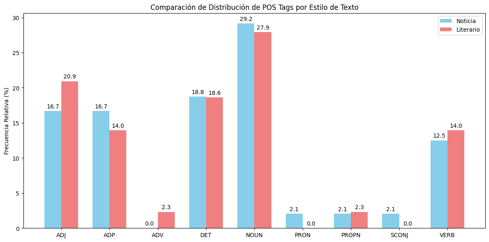
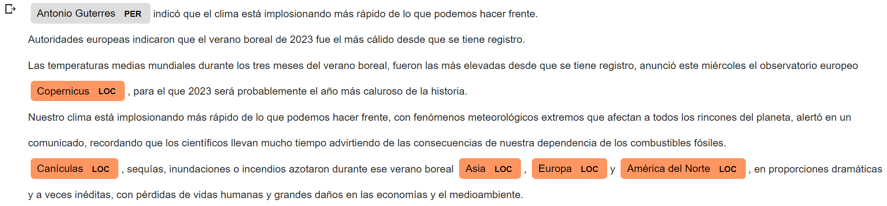
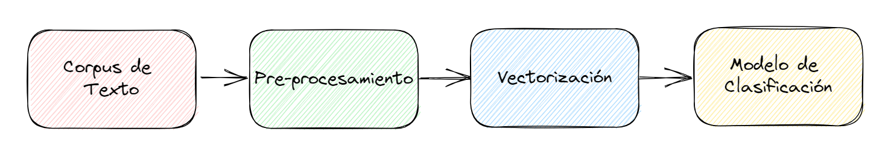
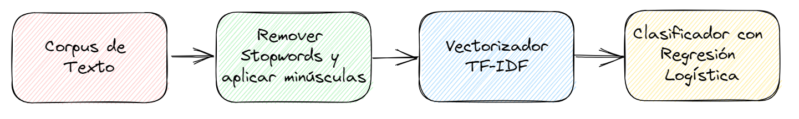
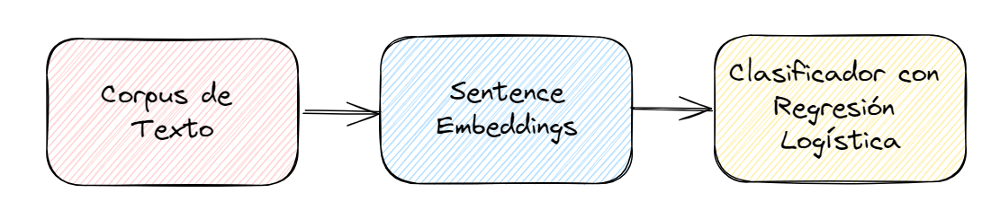
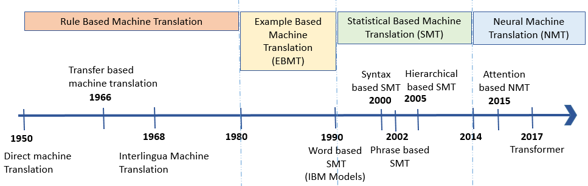
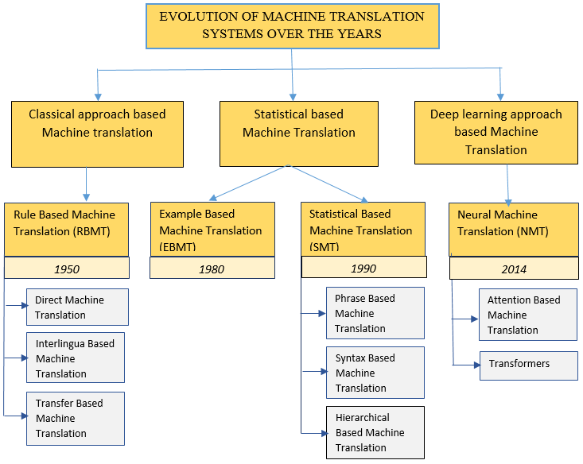

# Unidad 3 - Procesamiento del Lenguaje


> Fuente: [https://gentle-cress-e61.notion.site/Unidad-3-Procesamiento-del-Lenguaje-48b3f630e08a49e59bbcabfa39273e0c](https://gentle-cress-e61.notion.site/Unidad-3-Procesamiento-del-Lenguaje-48b3f630e08a49e59bbcabfa39273e0c)

**UNR - TUIA - Procesamiento de Lenguaje Natural**

Docente teoría: Juan Pablo Manson - [jpmanson@gmail.com](mailto:jpmanson@gmail.com) - [LinkedIN](https://www.linkedin.com/in/juanpablomanson/)

## Introducción

En la Unidad 1 el trabajo recae sobre el texto como secuencia: obtenerlo, limpiarlo y segmentarlo. Las operaciones son formales —caracteres, tokens, algoritmos, parseo y expresiones regulares— y no asignan todavía una interpretación lingüística.

Esta unidad presenta herramientas que sí operan con una cierta comprensión del lenguaje: producen una estructura o una decisión sobre el contenido (categoría gramatical, entidad, polaridad, idioma, traducción, resumen), no solo una transformación de la cadena. Comprensión, aquí, no significa que el sistema entienda como un hablante; significa que el resultado ya no es el mismo texto reformateado, sino una interpretación operacional de lo que el texto dice o hace.

## 1. Semejanza de texto (Text similarity)

La semejanza de texto, también conocida como "Text Similarity" en inglés, es una área de estudio en el procesamiento del lenguaje natural (NLP) que se centra en determinar el grado de similitud o equivalencia entre dos fragmentos de texto. Este concepto es fundamental para varias aplicaciones de NLP, como la búsqueda semántica, la agrupación de documentos, la detección de plagio, entre otros. Veamos cuáles son los aspectos clave sobre la semejanza de texto:

### Métricas de Semejanza

Existen varias métricas y técnicas para calcular la semejanza de texto, incluyendo:

1. [**Similitud del coseno**](https://es.wikipedia.org/wiki/Similitud_coseno): Utiliza el ángulo entre dos vectores en un espacio vectorial para determinar la similitud entre ellos. Es ampliamente utilizado con técnicas de vectorización de texto como TF-IDF y embeddings de palabras.
2. [**Distancia de Jaccard**](https://es.wikipedia.org/wiki/%C3%8Dndice_de_Jaccard): Calcula la semejanza entre dos conjuntos, generalmente se utiliza para comparar conjuntos de palabras o caracteres.
3. [**Distancia de Levenshtein**](https://es.wikipedia.org/wiki/Distancia_de_Levenshtein) (o distancia de edición): Mide el número mínimo de operaciones (inserciones, eliminaciones o sustituciones) requeridas para transformar una cadena de caracteres en otra.
4. [**Similitud de Dice**](https://es.wikipedia.org/wiki/Coeficiente_de_Sorensen-Dice): Es una métrica de semejanza que relaciona dos veces el número de elementos comunes dividido por el número total de elementos.
5. [**Similitud de Jaro-Winkler**](https://en.wikipedia.org/wiki/Jaro%E2%80%93Winkler_distance)**:** Una variante de la distancia de Jaro que da más peso a las coincidencias al inicio de las cadenas. Es particularmente útil para comparar cadenas cortas como nombres o códigos.

**Aplicaciones**

La semejanza de texto tiene aplicaciones en una variedad de campos, incluyendo:

1. **Sistemas de Recomendación**: Para recomendar contenido similar al que un usuario ha interactuado anteriormente.
2. **Detección de Plagio**: Para identificar casos de copia o plagio de texto.
3. **Respuesta Automática a Preguntas (QA)**: Para encontrar la mejor respuesta a una pregunta dada en una base de datos de conocimientos.
4. **Clasificación de Textos**: Para agrupar textos similares en las mismas categorías.

**Similitud del coseno**

Veamos un ejemplo concreto. Aquí usaremos la codificación **`TfidfVectorizer`**, y [**Similitud del coseno**](https://es.wikipedia.org/wiki/Similitud_coseno) que hemos visto en la unidad anterior :

```python
# Importar bibliotecas
from sklearn.feature_extraction.text import TfidfVectorizer
from sklearn.metrics.pairwise import cosine_similarity

# Lista de documentos (frases en español)
documents = [
    "El cielo es azul y despejado hoy.",
    "El firmamento se ve azulado y sin nubes a la vista.",
    "Me gusta salir a caminar bajo el cielo azul.",
    "Hoy el clima está muy agradable.",
    "Disfruto de un día soleado con el cielo despejado.",
    "Los días soleados me hacen sentir feliz."
]

# Calcular TF-IDF: ingeniería de características
tfidf_vectorizer = TfidfVectorizer()
tfidf_matrix = tfidf_vectorizer.fit_transform(documents)

# Mostrar las dimensiones de la matriz TF-IDF
print(tfidf_matrix.shape)

# Calcular la similitud del coseno para la primera oración con el resto de las oraciones
similarity_matrix = cosine_similarity(tfidf_matrix[0:1], tfidf_matrix)

# Encontrar el índice de la frase más semejante (excluyendo la primera frase)
most_similar_index = similarity_matrix.argsort()[0, -2]

# Imprimir la frase más semejante
print(f"La frase más semejante a '{documents[0]}' es: '{documents[most_similar_index]}'")

# Salida del script:
# (5, 27)
# La frase más semejante a 'El cielo es azul y despejado hoy.' es: 'Me gusta salir a caminar bajo el cielo azul.'
```

Después de calcular la matriz de similitud del coseno, utilizamos **`argsort`** para obtener los índices de las frases ordenadas por similitud del coseno. Utilizamos **`2`** para obtener el índice de la frase más semejante que no sea la primera frase (ya que la similitud del coseno de una frase consigo misma será siempre 1).

**Distancia de Coseno**:

Es una transformación de la similitud de coseno para representar una idea de "distancia" o "disimilitud". Se calcula como: **`Distancia de Coseno = 1 - Similitud de Coseno`**. Su valor oscila entre 0 y 2:

- Si los dos vectores son idénticos, su distancia de coseno es 0.
- Si son completamente opuestos, la distancia es 2.
- Si son ortogonales, la distancia es 1.

Es útil cuando se desea tener una métrica que represente la noción de cuán lejos están dos vectores entre sí. 

**Distancia de Jaccard**

La Similitud de Jaccard, también conocida como el coeficiente de Jaccard, es una métrica utilizada para comparar la similitud entre dos conjuntos midiendo la Distancia de Jaccard. Es especialmente útil en el campo del Procesamiento del Lenguaje Natural (NLP) para medir la similitud entre dos textos y se calcula utilizando la siguiente fórmula:

$$
J(A, B) = \frac{|A \cap B|}{|A \cup B|}
$$

Donde:

- *A* y *B* son los dos conjuntos que se están comparando.
- ∣*A*∩*B*∣ es el número de elementos en la **intersección** de *A* y *B* (elementos comunes entre *A* y *B*).
- ∣*A*∪*B*∣ es el número de elementos en la **unión** de *A* y *B* (elementos que aparecen en *A*, en *B*, o en ambos).

El valor de la distancia de Jaccard varía entre 0 y 1, donde 0 indica que los conjuntos son completamente diferentes (disjuntos) y 1 indica que son idénticos. 

En NLP, los conjuntos suelen ser conjuntos de palabras (tokens) o n-gramas extraídos de documentos o textos. Por ejemplo, para comparar las frases "El gato juega con la pelota" y "El perro corre tras la pelota" tendríamos los siguientes conjuntos:

- Conjunto *A*: {El, gato, juega, con, la, pelota}
- Conjunto *B*: {El, perro, corre, tras, la, pelota}

Podemos calcular la distancia en Python del siguiente modo:

```python
def jaccard_similarity(set_a, set_b):
    intersection = set_a.intersection(set_b)
    union = set_a.union(set_b)
    return len(intersection) / len(union)

# Ejemplo de uso:
frase_1 = "El gato juega con la pelota"
frase_2 = "El perro corre tras la pelota"

set_a = set(frase_1.split())
set_b = set(frase_2.split())

similarity = jaccard_similarity(set_a, set_b)
print(f"Jaccard Similarity: {similarity}")

intersection = set_a.intersection(set_b)
union = set_a.union(set_b)
print(f"Intersección: {intersection}")
print(f"Unión: {union}")

# Imprime:
# Jaccard Similarity: 0.3333333333333333
# Intersección: {'pelota.', 'El', 'la'}
# Unión: {'gato', 'la', 'pelota.', 'perro', 'El', 'juega', 'con', 'corre', 'tras'}
```

También podemos utilizar **`jaccard_score`** de **`sklearn`** como en el siguiente ejemplo. Con **`jaccard_score`** será necesario antes convertir el texto a vectores, por ejemplo con [**CountVectorizer**](http://scikit-learn.org/stable/modules/generated/sklearn.feature_extraction.text.CountVectorizer.html) o la técnica de One Hot encoding.

```javascript
# Importar las bibliotecas necesarias
from sklearn.metrics import jaccard_score
from sklearn.feature_extraction.text import CountVectorizer

# Lista de pares de frases a comparar
# Incluye ejemplos originales y nuevos ejemplos con las mismas palabras pero diferente orden/significado
frases = [
    ("El gato negro salta sobre el sofá.", "El gato negro salta encima del sofá."), # Significado similar
    ("Los niños juegan en el parque con una pelota.", "Los niños corren en el parque con un balón."), # Diferentes verbos/sustantivos, significado relacionado
    ("El sol brilla en el cielo azul durante el día.", "La luna ilumina la noche estrellada."), # Conceptos diferentes
    ("El elefante camina lentamente por la selva.", "La computadora procesa rápidamente los datos."), # Conceptos diferentes
    # Nuevos ejemplos con las mismas palabras, diferente orden/significado
    ("Juan ama a María.", "María ama a Juan."), # Mismas palabras, diferente sujeto/objeto
    ("Solo Juan come pescado.", "Juan solo come pescado.") # Mismas palabras, diferente énfasis/significado debido a la ubicación de 'solo'
]

# Iterar a través de cada par de frases
for frase_a, frase_b in frases:
    # Inicializar CountVectorizer para convertir texto a vectores de conteo de palabras
    # binary=True asegura presencia/ausencia (1/0) en lugar de conteos
    vectorizer = CountVectorizer(binary=True)

    # Ajustar el vectorizador a las frases y transformarlas en vectores
    X = vectorizer.fit_transform([frase_a, frase_b])

    # Extraer los arrays de vectores para cada frase
    vector_1 = X[0].toarray()[0]
    vector_2 = X[1].toarray()[0]

    # Calcular el puntaje de similitud de Jaccard
    # El promedio 'micro' es adecuado aquí ya que comparamos dos vectores directamente
    similarity = jaccard_score(vector_1, vector_2, average='micro')

    # Imprimir los resultados para el par actual
    print(f"Similitud Jaccard entre\n\"{frase_a}\"\ny\n\"{frase_b}\"\nes: {similarity}\n")
```

Y los resultados serán:

```text
Jaccard Similarity between
"El gato negro salta sobre el sofá."
and
"El gato negro salta encima del sofá."
is: 0.45454545454545453

Jaccard Similarity between
"Los niños juegan en el parque con una pelota."
and
"Los niños corren en el parque con un balón."
is: 0.3333333333333333

Jaccard Similarity between
"El sol brilla en el cielo azul durante el día."
and
"La luna ilumina la noche estrellada."
is: 0.0

Jaccard Similarity between
"El elefante camina lentamente por la selva."
and
"La computadora procesa rápidamente los datos."
is: 0.043478260869565216

Jaccard Similarity between
"Juan ama a María."
and
"María ama a Juan."
is: 1.0

Jaccard Similarity between
"Solo Juan come pescado."
and
"Juan solo come pescado."
is: 1.0
```

**Similitud de Dice**

La Similitud de Dice, también conocida como coeficiente de Sørensen-Dice, es una métrica utilizada para calcular la similitud entre dos conjuntos. Es especialmente útil en el campo del Procesamiento del Lenguaje Natural (NLP) para medir la similitud entre dos textos o documentos. La similitud de Dice se calcula utilizando la siguiente fórmula:

$$
D(A, B) = \frac{2 \cdot |A \cap B|}{|A| + |B|}
$$

Donde:

- *A* y *B* son los dos conjuntos que se están comparando.
- ∣*A*∩*B*∣ es el número de elementos en la intersección de *A* y *B* (elementos comunes entre *A* y *B*).
- ∣*A*∣ y ∣*B*∣ son el número de elementos en los conjuntos *A* y *B* respectivamente.

Podemos implementarlo en Python de este modo:

```python
def dice_similarity(set_a, set_b):
    intersection = set_a.intersection(set_b)
    return 2 * len(intersection) / (len(set_a) + len(set_b))

frase_1 = "El gato juega"
frase_2 = "El perro juega"

set_a = set(frase_1.split())
set_b = set(frase_2.split())

similarity = dice_similarity(set_a, set_b)
print(f"Dice Similarity: {similarity}")

# Imprime:
# 0.6666666666666
```

Este resultado indica una similitud del 66.6% entre las dos frases, ya que comparten algunos tokens, pero también tienen diferencias.

> 💡 La Similitud de Dice es generalmente más sensible a las coincidencias (elementos en común) que la Similitud de Jaccard, ya que el numerador en la fórmula de Dice se multiplica por 2. Esto significa que, para dos conjuntos con el mismo número de coincidencias y diferencias, la Similitud de Dice generalmente dará un valor más alto que la Similitud de Jaccard.

**Distancia de Levenshtein**

La Distancia de Levenshtein, también conocida como distancia de edición, es una métrica que mide cuánto se diferencian dos secuencias de caracteres (por ejemplo, dos cadenas de texto). La distancia entre dos cadenas es el número mínimo de operaciones de edición únicas requeridas para transformar una cadena en la otra. Las operaciones de edición permitidas son:

1. **Inserción**: Agregar un nuevo carácter a la cadena.
2. **Eliminación**: Quitar un carácter de la cadena.
3. **Sustitución**: Cambiar un carácter por otro.

En Python, la Distancia de Levenshtein se puede calcular utilizando la librería **`python-Levenshtein`** **(**[maxbachmann/python-Levenshtein](https://github.com/maxbachmann/python-Levenshtein)):

```python
# !pip install python-Levenshtein
import Levenshtein

s = "coseno"
t = "obsceno"

distance = Levenshtein.distance(s, t)
print(f"Levenshtein Distance: {distance}")

# Imprime 
# Levenshtein Distance: 3
```

Otra forma de aplicar Levenshtein es con la librería `thefuzz` ([seatgeek/thefuzz](https://github.com/seatgeek/thefuzz)). Aquí lo aplicaremos para hacer búsquedas flexibles en una columna de un Dataframe de Pandas:

```python
# !pip install thefuzz python-Levenshtein
import pandas as pd
from thefuzz import process

# Crear un DataFrame de ejemplo
df = pd.DataFrame({
    'Nombre': ['Juan Pérez', 'María García', 'Pedro Rodríguez', 'Ana Martínez', 
    'Luis González'],
    'Edad': [30, 25, 35, 28, 40]
})

# Función para realizar fuzzy search
def fuzzy_search(df, column, query, limit=2, threshold=80):
    return process.extractBests(query, df[column], limit=limit, score_cutoff=threshold)

# Ejemplo de uso
query = 'Juan Peres'
resultados = fuzzy_search(df, 'Nombre', query)

print(f"Resultados para '{query}':")
for resultado in resultados:
    nombre, score, _ = resultado
    print(f"Nombre: {nombre}, Puntuación: {score}")

# Ejemplo adicional con una búsqueda más amplia
query_amplio = 'Garcia'
resultados_amplios = fuzzy_search(df, 'Nombre', query_amplio, limit=3, threshold=60)

print(f"\nResultados para '{query_amplio}' (búsqueda más amplia):")
for resultado in resultados_amplios:
    nombre, score, _ = resultado
    print(f"Nombre: {nombre}, Puntuación: {score}")
```

La salida será:

```text
Resultados para 'Juan Peres':
Nombre: Juan Pérez, Puntuación: 84

Resultados para 'Garcia' (búsqueda más amplia):
Nombre: María García, Puntuación: 82
```

La función `fuzzy_search` realiza una búsqueda difusa en una columna específica de un DataFrame de Pandas. Vamos a desglosar sus componentes:

1. Parámetros de la función:

   - `df`: El DataFrame de Pandas en el que se realizará la búsqueda.
   - `column`: El nombre de la columna del DataFrame donde se buscará.
   - `query`: La cadena de texto que se quiere buscar.
   - `limit`: El número máximo de resultados a devolver (por defecto 2).
   - `threshold`: La puntuación mínima de similitud para considerar una coincidencia (por defecto 80).
2. Cuerpo de la función:  
   La función utiliza `process.extractBests` de la biblioteca `thefuzz`. Esta función realiza la búsqueda difusa y devuelve los mejores resultados.
3. `process.extractBests`:

   - Primer argumento `query`: Es la cadena que estamos buscando.
   - Segundo argumento `df[column]`: Es la serie de Pandas que contiene todos los valores de la columna especificada.
   - `limit`: Especifica cuántos resultados queremos obtener como máximo.
   - `score_cutoff`: Es el umbral mínimo de puntuación para considerar una coincidencia.
4. Funcionamiento:

   - La función compara la `query` con cada elemento en `df[column]`.
   - Utiliza algoritmos de comparación de cadenas (por defecto, la distancia de Levenshtein) para calcular una puntuación de similitud entre 0 y 100.
   - Devuelve una lista de tuplas. Cada tupla contiene:

     - El valor encontrado en la columna.
     - La puntuación de similitud.
     - El índice del elemento en el DataFrame original.
5. Resultado:

   - La función devuelve directamente el resultado de `process.extractBests`, que es una lista de las mejores coincidencias que cumplen con los criterios de `limit` y `threshold`.

Esta función es muy útil porque:

- Permite buscar coincidencias aproximadas, tolerando errores de escritura o variaciones en los nombres.
- Es flexible: puedes ajustar la precisión de la búsqueda cambiando el `threshold`.
- Puedes controlar cuántos resultados quieres obtener con el parámetro `limit`.

Por ejemplo, si buscamos "Juan Peres" en una columna que contiene "Juan Pérez", probablemente obtendremos una coincidencia con una puntuación alta, a pesar del error ortográfico en el apellido.

> 💡 Es importante destacar que este tipo de búsquedas flexibles (fuzzy search) se centran principalmente en la similitud ortográfica y estructural de las cadenas de texto, no en su significado semántico.

**Similitud de Jaro-Winkler**

La similitud de Jaro-Winkler es una métrica usada para medir la similitud entre dos cadenas de caracteres, que es útil en la corrección de errores de entrada, la comparación de nombres y otros tipos de coincidencia de texto donde las cadenas podrían tener errores tipográficos o ser variantes fonéticas de la misma palabra. La similitud de Jaro mide cuán similar es una cadena a otra basándose en la cantidad y el orden de los caracteres comunes, además de las transposiciones (caracteres en orden incorrecto) entre ellas. Se define como:

$$
J = \frac{1}{3} \left( \frac{m}{|s_1|} + \frac{m}{|s_2|} + \frac{m - t}{m} \right)
$$

$$
J_w = J + l \cdot p \cdot (1 - J)
$$

Donde:

- *J* es la puntuación de similitud de Jaro.
- *l* es la longitud del prefijo común en el inicio de las cadenas (hasta un máximo de 4 caracteres).
- *p* es un factor de escalamiento (típicamente *p*=0.1).
- ∣*s1*∣ y ∣*s2*∣ son las longitudes de las cadenas.
- *m* es el número de caracteres coincidentes.
- *t* es la mitad del número de transposiciones.

La similitud de Jaro-Winkler es ampliamente usada en sistemas de bases de datos y software de entrada de datos para reducir errores por mala digitación o mal entendido fonético.

La principal ventaja de la similitud de Jaro-Winkler es su capacidad para manejar errores pequeños en la entrada de datos, lo que la hace robusta en entornos donde los errores de entrada son comunes. Sin embargo, tiene algunas limitaciones, ya que no maneja bien las grandes diferencias en la longitud de las cadenas y puede ser computacionalmente intensiva en grandes bases de datos sin optimizaciones adecuadas.

Veamos un ejemplo para encontrar coincidencias de nombres:

```python
import jellyfish  # Biblioteca que implementa Jaro-Winkler
from typing import List, Tuple

def find_name_matches(name: str, name_list: List[str], threshold: float = 0.85) -> List[Tuple[str, float]]:
    """
    Encuentra coincidencias de nombres usando la similitud de Jaro-Winkler.
    
    :param name: El nombre a buscar
    :param name_list: Lista de nombres en la que buscar
    :param threshold: Umbral de similitud (por defecto 0.85)
    :return: Lista de tuplas con nombres coincidentes y sus puntuaciones de similitud
    """
    matches = []
    for candidate in name_list:
        similarity = jellyfish.jaro_winkler_similarity(name.lower(), candidate.lower())
        if similarity >= threshold:
            matches.append((candidate, similarity))
    
    return sorted(matches, key=lambda x: x[1], reverse=True)

# Lista de ejemplo de nombres
name_database = [
    "John Smith", "Jon Smith", "John Smyth", "Jane Smith",
    "Mary Johnson", "Marie Jonson", "Mark Johnson", "Roberto Sánchez Ocampo"
    "William Brown", "Bill Brown", "Will Brown",
    "Elizabeth Taylor", "Elisabeth Taylor", "Liz Taylor",
    "Michael Williams", "Mike Williams", "Micheal Williams",
    "Sarah Davis", "Sara Davies", "Sarah Davies"
]

# Ejemplos de uso
test_names = ["Jon Smyth", "Mary Jonson", "Bill Brwn", "Elisabeth Tylor"]

for test_name in test_names:
    print(f"\nBuscando coincidencias para: {test_name}")
    matches = find_name_matches(test_name, name_database)
    if matches:
        for match, score in matches:
            print(f"  - {match:<20} (Similitud: {score:.4f})")
    else:
        print("  No se encontraron coincidencias con suficiente similitud.")

# Ejemplo de cómo ajustar el umbral
print("\nBuscando 'Mike Williams' con un umbral más bajo:")
low_threshold_matches = find_name_matches("Mike Williams", name_database, threshold=0.75)
for match, score in low_threshold_matches:
    print(f"  - {match:<20} (Similitud: {score:.4f})")
```

La salida será:

```text
Buscando coincidencias para: Jon Smyth
  - John Smyth           (Similitud: 0.9733)
  - Jon Smith            (Similitud: 0.9556)
  - John Smith           (Similitud: 0.9170)

Buscando coincidencias para: Mary Jonson
  - Mary Johnson         (Similitud: 0.9833)
  - Marie Jonson         (Similitud: 0.9399)
  - Mark Johnson         (Similitud: 0.9399)

Buscando coincidencias para: Bill Brwn
  - Bill Brown           (Similitud: 0.9800)
  - Will Brown           (Similitud: 0.8963)

Buscando coincidencias para: Elisabeth Tylor
  - Elisabeth Taylor     (Similitud: 0.9875)
  - Elizabeth Taylor     (Similitud: 0.9553)

Buscando 'Mike Williams' con un umbral más bajo:
  - Mike Williams        (Similitud: 1.0000)
  - Micheal Williams     (Similitud: 0.8462)
  - Michael Williams     (Similitud: 0.8239)
```

## 2. POS, frases sustantivas y NER

### POS

La etiquetación de partes del discurso (POS, por sus siglas en inglés) es otra parte crucial del procesamiento del lenguaje natural que involucra etiquetar las palabras con una parte del discurso, como sustantivo, verbo, adjetivo, etc. El POS es la base para la resolución de NER, respuesta a preguntas y desambiguación del sentido de las palabras.

**Características y Funcionamiento**

1. **Granularidad**: Puede variar desde una categorización básica (como sustantivos, verbos, adjetivos, etc.) hasta categorías más detalladas que incluyen género, número, tiempo, etc.
2. **Dependencia del Contexto**: La categorización de una palabra puede depender del contexto en el que se encuentra.
3. **Riqueza Lingüística**: Ayuda a entender las complejidades lingüísticas del texto, proporcionando una rica anotación lingüística.
4. **Análisis Morfosintáctico**: Identifica la raíz de las palabras y sus afijos para determinar la parte del discurso.
5. **Desambiguación**: Utiliza el contexto para desambiguar palabras que pueden tener más de una categoría gramatical.
6. **Reglas Gramaticales y Estadísticas**: Utiliza reglas gramaticales predefinidas y modelos estadísticos para etiquetar las palabras correctamente.

**Aplicaciones**

1. [**Desambiguación del Sentido de las Palabras**](https://es.wikipedia.org/wiki/Desambiguaci%C3%B3n_ling%C3%BC%C3%ADstica) **(WSD)**: El etiquetado POS es fundamental para los sistemas WSD, que identifican el sentido correcto de una palabra en un contexto específico.
2. **Reconocimiento de Entidades Nombradas (NER)**: El etiquetado POS puede ser un paso previo al NER, ayudando a identificar sustantivos propios y otras entidades importantes en un texto.
3. [**Análisis Sintáctico**](https://es.wikipedia.org/wiki/An%C3%A1lisis_sint%C3%A1ctico_(ling%C3%BC%C3%ADstica)): El etiquetado POS es un paso esencial en el análisis sintáctico, que involucra la construcción de árboles sintácticos que representan la estructura gramatical de las oraciones.
4. **Traducción Automática**: Diversos sistemas de traducción automática utilizan el etiquetado POS para entender la estructura gramatical de las oraciones y traducirlas correctamente.
5. **Respuesta a Preguntas**: Los sistemas de respuesta a preguntas pueden aplicar el etiquetado POS para entender las preguntas formuladas por los usuarios y encontrar respuestas precisas.
6. **Análisis de Sentimientos**: El etiquetado POS puede ayudar a identificar adjetivos y adverbios que a menudo llevan una fuerte carga emocional, facilitando el análisis de sentimientos.

Veamos un ejemplo con **`spacy`**, para realizar POS de un texto en español:

```python
#!pip install spacy
#!python -m spacy download es_core_news_lg

import spacy
import pandas as pd

# Cargar el modelo preentrenado para español
nlp = spacy.load('es_core_news_lg')

# Texto de ejemplo en español
texto = "Juan y Pedro fueron al parque a jugar con sus amigos, mientras el perro buscaba un hueso."

# Procesar el texto con el modelo de spaCy
doc = nlp(texto)

# Crear una lista para almacenar las palabras, etiquetas POS y explicaciones
data = []

# Iterar sobre los tokens en el Doc y agregar los detalles a la lista de datos
for token in doc:
    data.append([token.text, token.pos_, spacy.explain(token.pos_)])

# Crear un DataFrame a partir de la lista de datos
df = pd.DataFrame(data, columns=['Palabra', 'Etiqueta POS', 'Explicación'])

# Imprimir el DataFrame
print(df)
```

Y obtendremos una tabla como la siguiente:

```text
     Palabra     Etiqueta POS           Explicación
0       Juan        PROPN               proper noun
1          y        CCONJ  coordinating conjunction
2      Pedro        PROPN               proper noun
3     fueron          AUX                 auxiliary
4         al          ADP                adposition
5     parque         NOUN                      noun
6          a          ADP                adposition
7      jugar         VERB                      verb
8        con          ADP                adposition
9        sus          DET                determiner
10    amigos         NOUN                      noun
11         ,        PUNCT               punctuation
12  mientras        CCONJ  coordinating conjunction
13        el          DET                determiner
14     perro        PROPN               proper noun
15   buscaba         VERB                      verb
16        un          DET                determiner
17     hueso         NOUN                      noun
18         .        PUNCT               punctuation
```

También podemos visualizar un gráfico con la estructura del texto etiquetado, usando **`displacy`**: 

```python
from spacy import displacy

# Muestra la gráfica en Jupyter o Colab
displacy.render(doc, style='dep', jupyter=True)

# Guarda la imagen en un archivo SVG
from pathlib import Path
svg = displacy.render(doc, style="dep")
output_path = Path("./dependency_plot.svg")
output_path.open("w", encoding="utf-8").write(svg)
```


La siguiente tabla describe las etiquetas POS que podemos identificar con **`spacy`**:

| **POS** | **DESCRIPCIÓN** | **EJEMPLOS** |
|---|---|---|
| **ADJ** | Adjetivo | grande, viejo, verde, incomprensible, primero |
| **ADP** | Adposición | en, para, durante |
| **ADV** | Adverbio | muy, mañana, abajo, dónde, ahí |
| **AUX** | Auxiliar | es, ha (hecho), será (hacer), debería (hacer) |
| **CONJ** | Conjunción | y, o, pero |
| **CCONJ** | Conjunción coordinante | y, o, pero |
| **DET** | Determinante | un, una, el, la |
| **INTJ** | Interjección | ¡eh!, ¡ay!, ¡bravo!, ¡hola! |
| **NOUN** | Sustantivo | chica, gato, árbol, aire, belleza |
| **NUM** | Numeral | 1, 2017, uno, setenta y siete, IV, MMXIV |
| **PART** | Partícula | del, al, se |
| **PRON** | Pronombre | yo, tú, él, ella, nosotros, alguien |
| **PROPN** | Sustantivo propio | María, Juan, Madrid, OTAN, HBO |
| **PUNCT** | Puntuación | ., (, ), ? |
| **SCONJ** | Conjunción subordinante | si, mientras, que |
| **SYM** | Símbolo | $, %, §, ©, +, −, ×, ÷, =, :), 😝 |
| **VERB** | Verbo | correr, corre, corriendo, comer, comió, comiendo |
| **X** | Otro | sfpksdpsxmsa |
| **SPACE** | Espacio |  |

Esta tabla incluye las etiquetas POS más comunes que podemos encontrar en un texto.

Otra librería que podemos usar para realizar POS, es [**`stanza`**](https://stanfordnlp.github.io/). Veamos un ejemplo de como hacerlo:

```python
# !pip install stanza
import stanza

# Descargamos el modelo español
stanza.download('es') 

# Inicializamos el pipeline de procesamiento español
nlp = stanza.Pipeline('es') 

# Texto para analizar
doc = nlp("El autobot de aspecto humanoide, llamado Apollo, está pensado para evitar que el ser humano tenga que afrontar tareas tediosas y agotadoras. El artefacto de la empresa de tecnología Apptronik, con sede en Austin, Texas, ya realiza sus primeras tareas en una empresa.")

# Navegamos cada oración de nuestro texto
for i, sent in enumerate(doc.sentences):
    print("[Sentence {}]".format(i+1))
    for word in sent.words:
        print("{:12s}\t{:12s}\t{:6s}\t{:d}\t{:12s}".format(\
              word.text, word.lemma, word.pos, word.head, word.deprel))
    print("")
```

Y el resultado será:

```text
[Sentence 1]
El          	el          	DET   	2	det         
autobot     	autobot     	NOUN  	11	nsubj       
de          	de          	ADP   	4	case        
aspecto     	aspecto     	NOUN  	2	nmod        
humanoide   	humanoide   	ADJ   	4	amod        
,           	,           	PUNCT 	7	punct       
llamado     	llamado     	ADJ   	2	amod        
Apollo      	Apollo      	PROPN 	7	obj         
,           	,           	PUNCT 	7	punct       
está        	estar       	AUX   	11	cop         
pensado     	pensado     	ADJ   	0	root        
para        	para        	ADP   	13	mark        
evitar      	evitar      	VERB  	11	advcl       
que         	que         	SCONJ 	20	mark        
el          	el          	DET   	16	det         
ser         	ser         	NOUN  	20	nsubj       
humano      	humano      	ADJ   	16	amod        
tenga       	tener       	VERB  	13	ccomp       
que         	que         	SCONJ 	20	cc          
afrontar    	afrontar    	VERB  	18	conj        
tareas      	tarea       	NOUN  	20	obj         
tediosas    	tedioso     	ADJ   	21	amod        
y           	y           	CCONJ 	24	cc          
agotadoras  	agotador    	ADJ   	22	conj        
.           	.           	PUNCT 	11	punct       

[Sentence 2]
El          	el          	DET   	2	det         
artefacto   	artefacto   	NOUN  	18	nsubj       
de          	de          	ADP   	5	case        
la          	el          	DET   	5	det         
empresa     	empresa     	NOUN  	2	nmod        
de          	de          	ADP   	7	case        
tecnología  	tecnología  	NOUN  	5	nmod        
Apptronik   	Apptronik   	PROPN 	5	appos       
,           	,           	PUNCT 	11	punct       
con         	con         	ADP   	11	case        
sede        	sede        	NOUN  	5	nmod        
en          	en          	ADP   	13	case        
Austin      	Austin      	PROPN 	11	nmod        
,           	,           	PUNCT 	15	punct       
Texas       	Texas       	PROPN 	13	flat        
,           	,           	PUNCT 	11	punct       
ya          	ya          	ADV   	18	advmod      
realiza     	realizar    	VERB  	0	root        
sus         	su          	DET   	21	det         
primeras    	primero     	ADJ   	21	amod        
tareas      	tarea       	NOUN  	18	obj         
en          	en          	ADP   	24	case        
una         	uno         	DET   	24	det         
empresa     	empresa     	NOUN  	18	obl         
.           	.           	PUNCT 	18	punct
```

Como podemos observar, en la tercer columna de nuestro ejemplo, tenemos las etiquetas POS. También, para cada palabra, imprimimos varios detalles:

- **`word.text`**: El texto de la palabra.
- **`word.lemma`**: El lema de la palabra, es decir, su forma canónica.
- **`word.pos`**: La etiqueta de parte del habla (part of speech, POS) de la palabra.
- **`word.head`**: El índice de la palabra "cabeza" en la relación de dependencia sintáctica de la palabra.
- **`word.deprel`**: La etiqueta que describe la relación de dependencia sintáctica de la palabra con su palabra "cabeza".

Las etiquetas de relaciones de dependencia según las especificaciones del proyecto [Universal Dependencies](https://universaldependencies.org/u/dep/index.html). Aquí vemos las Etiquetas de relaciones de dependencia (DepRel)**:**

- **nsubj**: (Nominal Subject) Sujeto nominal de un verbo. Por ejemplo, en "El autobot está pensado", "El autobot" es el sujeto nominal de "está pensado".
- **obj**: (Object) Objeto de un verbo. Por ejemplo, en "evitar tareas tediosas", "tareas tediosas" es el objeto de "evitar".
- **amod**: (Adjectival Modifier) Un adjetivo que modifica un sustantivo. Por ejemplo, en "aspecto humanoide", "humanoide" es el modificador adjetival de "aspecto".
- **nmod**: (Nominal Modifier) Un modificador nominal de un sustantivo. Por ejemplo, en "sede en Austin", "en Austin" es un modificador nominal de "sede".
- **advcl**: (Adverbial Clause Modifier) Un modificador que es una cláusula adverbial. Por ejemplo, en "pensado para evitar", "para evitar" es un modificador adverbial de cláusula de "pensado".
- **advmod**: (Adverbial Modifier) Un adverbio que modifica una palabra. Por ejemplo, en "ya realiza", "ya" es un modificador adverbial de "realiza".
- **cc**: (Coordinating Conjunction) Una conjunción coordinante. Por ejemplo, en "tediosas y agotadoras", "y" es una conjunción coordinante.
- **conj**: (Conjunct) Un conjunto que está vinculado a otro mediante una conjunción coordinante. Por ejemplo, en "tediosas y agotadoras", "agotadoras" es un conjunto con "tediosas".
- **appos**: (Appositional Modifier) Un modificador que está en aposición a otro. Por ejemplo, en "empresa Apptronik", "Apptronik" está en aposición a "empresa".
- **obl**: (Oblique) Un argumento no sujeto ni objeto de un verbo. Por ejemplo, en "realiza tareas en una empresa", "en una empresa" es un oblicuo de "realiza".
- **flat**: (Flat Multiword Expression) Una expresión de varias palabras que se agrupan en una sola unidad. Por ejemplo, en "Austin, Texas", "Texas" forma una expresión multi-palabra plana con "Austin".
- **mark**: (Marker) Un marcador de una cláusula subordinada. Por ejemplo, en "para evitar", "para" es un marcador.
- **case**: (Case Marking) Una palabra que marca el caso gramatical de otra palabra. Por ejemplo, en "de la empresa", "de" es una marca de caso para "empresa".
- **root**: (Root) La raíz del árbol de dependencia, generalmente el verbo principal de la oración.
- **cop**: (Copula) Una copula que funciona para vincular el sujeto con el predicado. Por ejemplo, en "está pensado", "está" es una copula.
- **det**: (Determiner) Un determinante que modifica un sustantivo. Por ejemplo, en "la empresa", "la" es el determinante de "empresa".
- **punct**: (Punctuation) Un token de puntuación.

**Análisis de contenido usando POS**

Otro ejemplo donde aplicar POS, es en el análisis de contenidos. Analicemos los siguientes textos, con estilos de escritura diferentes:

```text
Texto "Noticia":
El gobierno anunció nuevas medidas económicas para controlar la inflación.
Según el ministro de economía, se espera que estas regulaciones estabilicen el mercado 
cambiario. Los analistas financieros expresaron opiniones divididas sobre el impacto a 
corto plazo. La bolsa de valores reaccionó con leves caídas tras el comunicado oficial.

Texto "Literario":
La tarde caía lentamente sobre la ciudad dormida.
Viejas farolas parpadeaban, arrojando una luz tenue sobre el empedrado húmedo.
Un gato solitario cruzó la calle en silencio, buscando refugio del frío incipiente.
El viento susurraba secretos entre los árboles desnudos del parque cercano.
```

La siguiente aplicación de la herramienta POS, nos permite obtener algunas estadísticas:

🔗 [Google Colab](https://colab.research.google.com/drive/1guY9bIMZLSBDKGeqt7xx7pDnHvLef7ZP?usp=sharing)



Del análisis, se pueden sacar algunas conclusiones preliminares, aunque siempre con la **precaución de que los textos de ejemplo son muy cortos**:

1. **Mayor uso de adjetivos (ADJ) en texto literario:** La diferencia más notable es en los adjetivos. El texto literario usa un porcentaje considerablemente mayor (20.93%) en comparación con la noticia (16.67%). Esto es esperable, ya que la literatura a menudo se apoya más en la descripción y la evocación de sensaciones, roles que cumplen los adjetivos (ej. "ciudad *dormida*", "luz *tenue*", "empedrado *húmedo*", "gato *solitario*", "frío *incipiente*", "árboles *desnudos*").
2. **Presencia de adverbios (ADV) solo en texto literario:** El texto literario es el único que registra adverbios (2.33%), como "lentamente" y "silencio". Los adverbios también contribuyen a la cualidad descriptiva o narrativa, modificando verbos, adjetivos u otros adverbios.
3. **Uso similar de sustantivos (NOUN) y determinantes (DET):** Ambos textos tienen una alta proporción de sustantivos y determinantes, siendo las categorías más frecuentes en ambos casos. La noticia tiene una ligera predominancia de sustantivos, lo cual podría reflejar un enfoque más centrado en entidades, hechos y conceptos ("gobierno", "medidas", "inflación", "ministro", "mercado", "analistas", "bolsa").
4. **Ligeramente más preposiciones (ADP) en Noticias:** La noticia usa un poco más de preposiciones (16.67% vs 13.95%). Esto podría deberse a la necesidad de estructurar información y relaciones entre conceptos ("medidas *para* controlar", "según *el* ministro", "opiniones *sobre* el impacto", "caídas *tras* el comunicado").
5. **Uso similar de verbos (VERB):** La proporción de verbos es bastante parecida en ambos textos.

Basándose en estas muestras, el texto **literario muestra una tendencia hacia un lenguaje más descriptivo y matizado**, evidenciado por el mayor uso de adjetivos y la presencia de adverbios. El texto de **noticia parece ser ligeramente más denso en sustantivos y utiliza más elementos estructurales** como las preposiciones para conectar la información factual.

### Frases sustantivas

En el procesamiento del lenguaje natural (NLP), la extracción de frases sustantivas ("Extracting Noun Phrases") se refiere al proceso de identificar y extraer frases que funcionan como sustantivos en un texto. 

Una frase sustantiva, también conocida como [sintagma nominal](https://es.wikipedia.org/wiki/Sintagma_nominal), es una estructura gramatical que tiene un sustantivo como su núcleo o palabra principal. La función principal de una frase sustantiva es nombrar o identificar personas, lugares, cosas, ideas o eventos. Puede actuar como sujeto, objeto directo, objeto indirecto, complemento de preposición, entre otros, dentro de una oración.

**Estructura de una Frase Sustantiva**

Una frase sustantiva puede estar compuesta por:

1. **Núcleo:** Es el sustantivo principal de la frase y es el elemento obligatorio en la frase sustantiva.
2. **Determinante:** Palabras como artículos, posesivos, demostrativos, etc., que acompañan al sustantivo y aportan información sobre él.
3. **Modificadores:** Adjetivos, frases adjetivas, o frases preposicionales que describen o dan más información sobre el sustantivo.
4. **Complementos:** Palabras o frases que completan el sentido del sustantivo.

**Ejemplos de Frases Sustantivas**

1. **El perro grande** (Determinante + Núcleo + Modificador)

   - "El" es el determinante.
   - "perro" es el núcleo.
   - "grande" es el modificador.
2. **La casa de Juan** (Determinante + Núcleo + Complemento)

   - "La" es el determinante.
   - "casa" es el núcleo.
   - "de Juan" es el complemento.
3. **Un libro interesante** (Determinante + Núcleo + Modificador)

   - "Un" es el determinante.
   - "libro" es el núcleo.
   - "interesante" es el modificador.

**Cómo se detectan**

No hay un diccionario de frases sustantivas. El detector *etiqueta* cada palabra y *agrupa* las que forman un sintagma alrededor de un sustantivo. Tres capas, de más superficial a más estructural:

1. **Etiquetado POS** (parts of speech): cada token recibe una categoría gramatical — determinante (DET), adjetivo (ADJ), sustantivo (NOUN), verbo (VERB), etc. El núcleo de un NP es un sustantivo (o un nombre propio / pronombre). Sin esa etiqueta, no hay qué agrupar.
2. **Chunking** (análisis superficial): reglas o un modelo agrupan tokens *consecutivos* que encajan en un patrón. En español, el patrón típico es `DET? + ADJ* + NOUN + ADJ*`. «El veloz zorro marrón» es DET–ADJ–NOUN–ADJ; «salta» es VERB y corta el chunk.
3. **Árbol de dependencias** (lo que usa spaCy): el parser enlaza cada palabra con su cabeza sintáctica. `doc.noun_chunks` recorre ese árbol y junta el núcleo nominal con sus modificadores (`det`, `amod`, `nmod`). Por eso «el perro perezoso» sale entero y el verbo queda afuera: no modifica al sustantivo.

El ejemplo de abajo no adivina las frases: el modelo `es_core_news_lg` predice POS y dependencias (el apartado anterior); `noun_chunks` solo lee ese análisis.

Veamos un ejemplo usando **`spacy`**, que cuenta con [modelos para idioma español](https://spacy.io/models/es). Primero instalamos los paquetes necesarios:

```text
pip install spacy
python -m spacy download es_core_news_lg
```

Luego podemos correr el siguiente ejemplo:

```python
import spacy

# Carga el modelo de lenguaje preentrenado de Spacy
nlp = spacy.load('es_core_news_lg')

# Procesa una oración con el modelo de Spacy
doc = nlp("El veloz zorro marrón salta sobre el perro perezoso.")

# Extrae e imprime las frases nominales
for chunk in doc.noun_chunks:
    print(chunk.text)
```

Y el resultado será:

```text
El veloz zorro marrón
el perro perezoso
```

En la oración "El veloz zorro marrón salta sobre el perro perezoso", se pueden identificar dos frases sustantivas:

1. **El veloz zorro marrón**

   - "El" es el determinante.
   - "zorro" es el núcleo o sustantivo principal de la frase sustantiva.
   - "veloz" y "marrón" son modificadores, específicamente adjetivos que describen al zorro.
2. **El perro perezoso**

   - "El" es el determinante.
   - "perro" es el núcleo o sustantivo principal de la frase sustantiva.
   - "perezoso" es un modificador, específicamente un adjetivo que describe al perro.

### NER

El término "NER" se refiere a "Reconocimiento de Entidades Nombradas" (Named Entity Recognition en inglés). Es un subproceso del Procesamiento del Lenguaje Natural (NLP) que se centra en identificar y clasificar entidades nombradas presentes en un texto en categorías predefinidas como nombres de personas, organizaciones, lugares, expresiones de tiempo, cantidades, valores monetarios, porcentajes, etc.

Formalmente el concepto de «entidad nombrada» se deriva de la definición de “designador rígido” del filósofo estadounidense [Saul Kripke](https://es.wikipedia.org/wiki/Saul_Kripke) (Kripke, 1980) que forma parte de la lógica modal y filosofía del lenguaje.

**Características y Funcionamiento**

1. **Identificación de Entidades**: Localiza y delimita las entidades nombradas en un texto.
2. **Clasificación de Entidades**: Una vez identificadas las entidades, las clasifica en diversas categorías como persona, organización, lugar, etc.
3. **Contexto**: Utiliza el contexto y la estructura gramatical del texto para identificar y clasificar correctamente las entidades.

**Aplicaciones**

El NER tiene una amplia gama de aplicaciones, incluyendo:

- **Sistemas de Recomendación**: Para entender y analizar las preferencias del usuario basándose en las entidades mencionadas en los textos que consume.
- **Búsqueda Semántica**: Para mejorar los motores de búsqueda identificando entidades específicas en los documentos y relacionándolas con las consultas de búsqueda.
- **Análisis de Sentimientos**: Para identificar entidades específicas mencionadas en los textos y analizar los sentimientos asociados con ellas.

Veamos un ejemplo de como realizar NER en Python, usando spaCy:

```python
#!pip install spacy
#!python -m spacy download es_core_news_lg

import spacy

# Cargar el modelo de lenguaje preentrenado en español
nlp = spacy.load('es_core_news_lg')

#Texto a analizar
texto = """Antonio Guterres indicó que el clima está implosionando más rápido de lo que podemos hacer frente.
Autoridades europeas indicaron que el verano boreal de 2023 fue el más cálido desde que se tiene registro.
Las temperaturas medias mundiales durante los tres meses del verano boreal, fueron las más elevadas desde que se tiene registro, anunció este miércoles el observatorio europeo Copernicus, para el que 2023 será probablemente el año más caluroso de la historia.
Nuestro clima está implosionando más rápido de lo que podemos hacer frente, con fenómenos meteorológicos extremos que afectan a todos los rincones del planeta, alertó en un comunicado, recordando que los científicos llevan mucho tiempo advirtiendo de las consecuencias de nuestra dependencia de los combustibles fósiles.
Canículas, sequías, inundaciones o incendios azotaron durante ese verano boreal Asia, Europa y América del Norte, en proporciones dramáticas y a veces inéditas, con pérdidas de vidas humanas y grandes daños en las economías y el medioambiente.
"""

# Procesar el texto con el modelo de spaCy
doc = nlp(texto)

# Imprimir las entidades nombradas, etiquetas y explicaciones
for ent in doc.ents:
    print(f'Entidad: {ent.text}, Etiqueta: {ent.label_}, Explicación: {spacy.explain(ent.label_)}')
```

Y el resultado será:

```text
Entidad: Antonio Guterres, Etiqueta: PER, Explicación: Named person or family.
Entidad: Copernicus, Etiqueta: LOC, Explicación: Non-GPE locations, mountain ranges, bodies of water
Entidad: Nuestro, Etiqueta: PER, Explicación: Named person or family.
Entidad: Canículas, Etiqueta: LOC, Explicación: Non-GPE locations, mountain ranges, bodies of water
Entidad: Asia, Etiqueta: LOC, Explicación: Non-GPE locations, mountain ranges, bodies of water
Entidad: Europa, Etiqueta: LOC, Explicación: Non-GPE locations, mountain ranges, bodies of water
Entidad: América del Norte, Etiqueta: LOC, Explicación: Non-GPE locations, mountain ranges, bodies of water
```

Vemos como el modelo, detecta las entidades nombradas en el texto suministrado. Es importante mencionar que el modelo en español no es tan robusto como el modelo en inglés, y puede indicar falsas entidades, o bien puede no detectar algunas de ellas. El procesador de `spacy` permite detectar las siguientes entidades:

```python
PERSON: Personas, incluyendo ficticias.
NORP: Nacionalidades o grupos religiosos o políticos.
FAC: Edificios, aeropuertos, autopistas, puentes, etc.
ORG: Empresas, agencias, instituciones, etc.
GPE: Países, ciudades, estados.
LOC: Ubicaciones que no son GPE, cordilleras, cuerpos de agua.
PRODUCT: Objetos, vehículos, alimentos, etc. (No servicios.)
EVENT: Huracanes nombrados, batallas, guerras, eventos deportivos, etc.
WORK_OF_ART: Títulos de libros, canciones, etc.
LAW: Documentos nombrados convertidos en leyes.
LANGUAGE: Cualquier idioma nombrado.
DATE: Fechas o períodos absolutos o relativos.
TIME: Tiempos menores a un día.
PERCENT: Porcentaje, incluyendo ”%“.
MONEY: Valores monetarios, incluyendo unidad.
QUANTITY: Mediciones, como de peso o distancia.
ORDINAL: “primero”, “segundo”, etc.
CARDINAL: Numerales que no entran en otro tipo.
```

Podemos aprovechar el visualizador **`displacy`** que incluye la librería **`spacy`,** para ver los resultados de forma más atractiva en Colab:

```python
# Visualizador incluido en spacy
from spacy import displacy

for sent in doc.sents:
    displacy.render(nlp(sent.text),style='ent',jupyter=True)
```

Resultado:



En este ejemplo de código veremos como usar la librería **`gliner`** ([https://github.com/urchade/GLiNER](https://github.com/urchade/GLiNER)) para implementar una tarea de reconocimiento de entidades nombradas (NER) en un texto. La librería **`gliner`** es útil en el procesamiento de lenguaje natural y permite identificar y categorizar entidades específicas dentro de un texto, como nombres de personas, localizaciones, fechas, actores y personajes ficticios:

```python
# !pip install gliner 
# Importa la clase GLiNER desde la biblioteca gliner
from gliner import GLiNER

# Lista de modelos disponibles: https://huggingface.co/urchade

# Carga el modelo preentrenado 'gliner_multi-v2.1' desde Hugging Face
model = GLiNER.from_pretrained("urchade/gliner_multi-v2.1")

# Cambia el modelo a modo de evaluación, esto es útil para desactivar características específicas como dropout durante la inferencia
model.eval()

# Define el texto a procesar
text = """
"Leave the World Behind está aquí y es escalofriante. Protagonizada por Julia Roberts, Mahershala Ali y Ethan Hawke, este thriller apocalíptico creado por Sam Esmail, el creador de Mr. Robot, cuenta la historia de dos familias mientras luchan por sobrevivir en medio de un apagón inexplicable. Solo una cosa es segura: no hay vuelta a la normalidad. La tecnología está misteriosamente fallando, y los ciervos alrededor del escondite de las familias en Long Island están actuando de manera extraña. Puedes ver cuán extraño es en el tráiler arriba, y en un clip de la película a continuación.
"Siempre me había interesado hacer una película de desastres, y específicamente quería hacer una sobre un ataque cibernético porque creo que mucha gente no tiene una idea concreta de cómo sería esto o cuán perjudicial podría ser, no solo en América, sino globalmente", le dijo a Netflix el escritor y director Esmail. "El impacto de la tecnología en la sociedad es algo que siempre me ha fascinado porque realmente creo que ha cambiado dramáticamente la forma en que interactuamos y evolucionamos como personas".
La película está basada en la novela superventas de 2020 del mismo nombre de Rumaan Alam, quien también es productor ejecutivo de la película junto a Barack y Michelle Obama, Tonia Davis, Daniel M. Stillman y Nick Krishnamurthy. Descubre más a continuación, y mantente seguro."
"""

# Lista de etiquetas que el modelo intentará encontrar en el texto
labels = ["person", "book", "location", "date", "actor", "character"]

# Realiza la predicción de entidades en el texto dado, utilizando las etiquetas especificadas y un umbral de 0.4
entities = model.predict_entities(text, labels, threshold=0.4)

# Imprime cada entidad detectada junto con su etiqueta
for entity in entities:
    print(entity["text"], "=>", entity["label"])
```

Y el resultado será el siguiente:

```python
Julia Roberts => actor
Mahershala Ali => actor
Ethan Hawke => actor
Sam Esmail => person
Mr. Robot => character
Long Island => location
2020 => date
Rumaan Alam => book
Tonia Davis => person
Daniel M. Stillman => person
Nick Krishnamurthy => person
```

Más información de Gliner en:

🔗 [https://blog.knowledgator.com/meet-the-new-zero-shot-ner-architecture-30ffc2cb1ee0](https://blog.knowledgator.com/meet-the-new-zero-shot-ner-architecture-30ffc2cb1ee0)

## 3. Clasificación de texto (Text classification)

En este sección, veremos como clasificar texto, de modo que podamos asignar una categoría (etiqueta) a una frase o un documento. Nuestro “pipeline” para el entrenamiento de un modelo clasificador, será el siguiente: 



La clasificación de texto es una tarea de procesamiento del lenguaje natural (NLP) que involucra la asignación de una o más categorías o etiquetas predefinidas a fragmentos de texto. Estas etiquetas pueden representar diferentes temas, sentimientos, intenciones, etc. La clasificación de texto se utiliza en una amplia variedad de aplicaciones, incluyendo el filtrado de spam, análisis de sentimientos, etiquetado automático de contenido, y más.

El proceso general para construir un clasificador de texto incluye los siguientes pasos:

1. **Recolección de Datos**: Obtención de un conjunto de datos etiquetado que contenga ejemplos de cada clase que deseamos identificar.
2. **Preprocesamiento de Datos**: Limpiar y preparar los datos para el entrenamiento. Esto puede incluir la eliminación de ruido, normalización de texto, y otras técnicas para mejorar la calidad de los datos.
3. **Vectorización**: Transformar el texto en una representación numérica que pueda ser entendida y utilizada por un modelo de aprendizaje automático.
4. **Entrenamiento del Modelo**: Utilizar un algoritmo de aprendizaje automático para entrenar un modelo usando los datos pre-procesados y vectorizados.
5. **Evaluación del Modelo**: Evaluar el rendimiento del modelo utilizando métricas adecuadas (como precisión, recall, F1-score, etc.) y un conjunto de datos de prueba separado.
6. **Implementación**: Desplegar el modelo entrenado en una aplicación real para clasificar textos nuevos y no etiquetados.

**Ejemplo con TF-IDF y Regresión Logística**

En el ejemplo que veremos a continuación, utilizaremos **`TfidfVectorizer`** y **`LogisticRegression`** de Scikit-Learn:



- **TF-IDF como Vectorizador**: Usaremos el vectorizador TF-IDF (Frecuencia de Término - Frecuencia Inversa de Documento) para transformar los textos en una representación numérica. COmo ya hemos visto, TF-IDF es una técnica que refleja la importancia de una palabra en un documento en relación con un conjunto de documentos (corpus). El vectorizador de Scikit-Learn también elimina las palabras vacías ("stop words") en español para reducir el ruido y centrarse en las palabras más significativas.
- [**Regresión Logística**](https://es.wikipedia.org/wiki/Regresi%C3%B3n_log%C3%ADstica) **como Clasificador**: Hemos elegido la regresión logística como nuestro algoritmo de clasificación. Este algoritmo modela la relación entre características (las palabras en nuestro caso) y una variable categórica dependiente (las etiquetas de clase) utilizando una función logística.

```python
from sklearn.model_selection import train_test_split
from sklearn.feature_extraction.text import TfidfVectorizer
from sklearn.linear_model import LogisticRegression
from sklearn.metrics import accuracy_score, classification_report
import nltk

# Descargamos los stopwords que necesitaremos luego
nltk.download('stopwords')
from nltk.corpus import stopwords

# Obtenemos las stopwords para español
spanish_stop_words = stopwords.words('spanish')

labels = [(0, "desarrollo de software"), (1, "videojuegos"), (2, "inteligencia artificial"),
          (3, "ciberseguridad")]

dataset = []
# textos de "desarrollo de software"
dataset.append((0, "Me encanta programar en Python."))
dataset.append((0, "Python es un lenguaje versátil."))
dataset.append((0, "La programación en Java también es popular."))
dataset.append((0, "Ruby es otro lenguaje de programación interesante."))
dataset.append((0, "El desarrollo web es muy demandado actualmente."))
dataset.append((0, "JavaScript es esencial para el desarrollo web."))
dataset.append((0, "HTML y CSS son la base del desarrollo web."))
dataset.append((0, "El desarrollo frontend se complementa con el backend."))
dataset.append((0, "Los frameworks facilitan el desarrollo de software."))
dataset.append((0, "Git es una herramienta esencial para el control de versiones en el desarrollo de software."))
dataset.append((0, "La documentación es una parte crucial del desarrollo de software."))
dataset.append((0, "El testing es necesario para asegurar la calidad del software."))
dataset.append((0, "Los lenguajes más usados son Python, Java, JavaScript, C# y PHP."))
dataset.append((0, "Estos son ejemplos de lenguajes de bajo nivel: C, C++ y ensamblador."))

# textos de "videojuegos"
dataset.append((1, "Disfruto jugando videojuegos."))
dataset.append((1, "La realidad virtual es el futuro de los videojuegos."))
dataset.append((1, "Los videojuegos para móviles está en auge."))
dataset.append((1, "Los videojuegos indie han ganado mucha popularidad."))
dataset.append((1, "Las consolas de videojuegos son muy populares."))
dataset.append((1, "Los videojuegos 3D requieren una buena tarjeta gráfica."))
dataset.append((1, "Los videojuegos de estrategia son muy divertidos."))
dataset.append((1, "Una GPU potente es esencial para jugar algunos videojuegos."))
dataset.append((1, "Un buen joystick es esencial para jugar videojuegos."))
dataset.append((1, "Las aventuras gráficas son un género de videojuegos."))
dataset.append((1, "Un buen simulator de vuelo requiere un buen joystick."))

# textos de "inteligencia artificial"
dataset.append((2, "La inteligencia artificial transformará muchas industrias."))
dataset.append((2, "La robótica es una aplicación de la inteligencia artificial."))
dataset.append((2, "Las redes neuronales son un concepto clave en IA."))
dataset.append((2, "El aprendizaje profundo es una rama del aprendizaje automático."))
dataset.append((2, "El aprendizaje supervisado es un tipo de aprendizaje automático."))
dataset.append((2, "Las redes neuronales profundas son utilizadas en el aprendizaje profundo."))
dataset.append((2, "El aprendizaje por refuerzo es una técnica de aprendizaje automático."))
dataset.append((2, "El aprendizaje automático es fascinante."))
dataset.append((2, "El aprendizaje automático es una rama de la inteligencia artificial."))
dataset.append((2, "Los perceptrones son un concepto clave en las redes neuronales."))
dataset.append((2, "Una red convolucional es un tipo de red neuronal."))
dataset.append((2, "Las redes neuronales recurrentes son un tipo de red neuronal."))
dataset.append((2, "Las redes profundas son buenas para el reconocimiento de imágenes."))

# textos de "ciberseguridad"
dataset.append((3, "La ciberseguridad es crucial en el mundo digital."))
dataset.append((3, "La protección de datos personales es una parte importante de la ciberseguridad."))
dataset.append((3, "Los firewalls ayudan a proteger las redes corporativas."))
dataset.append((3, "La criptografía es una herramienta esencial en ciberseguridad."))
dataset.append((3, "La autenticación de dos factores es una técnica de ciberseguridad."))
dataset.append((3, "La ingeniería social es una técnica de hacking."))
dataset.append((3, "El phishing es una técnica de hacking."))
dataset.append((3, "El malware es un tipo de software malicioso."))
dataset.append((3, "El ransomware es un tipo de malware."))
dataset.append((3, "El spyware es un tipo de malware."))
dataset.append((3, "El adware es un tipo de malware."))
dataset.append((3, "El phishing es un tipo de ataque de ingeniería social."))
dataset.append((3, "El hacking ético es una profesión muy demandada."))
dataset.append((3, "Los hackers éticos ayudan a proteger los sistemas informáticos."))

# Preparar X e y
X = [text.lower() for label, text in dataset]
y = [label for label, text in dataset]

# División del dataset
X_train, X_test, y_train, y_test = train_test_split(X, y, test_size=0.2, random_state=42)

# Vectorización de los textos con eliminación de palabras vacías
vectorizer = TfidfVectorizer(stop_words=spanish_stop_words)
X_train_vectorized = vectorizer.fit_transform(X_train)
X_test_vectorized = vectorizer.transform(X_test)

# Creación y entrenamiento del modelo de Regresión Logística multinomial
modelo_LR = LogisticRegression(max_iter=1000, multi_class='multinomial', solver='lbfgs')
modelo_LR.fit(X_train_vectorized, y_train)

# Evaluación del modelo de Regresión Logística
y_pred_LR = modelo_LR.predict(X_test_vectorized)
acc_LR = accuracy_score(y_test, y_pred_LR)
report_LR = classification_report(y_test, y_pred_LR, zero_division=1)

print("Precisión Regresión Logística:", acc_LR)
print("Reporte de clasificación Regresión Logística:\n", report_LR)
```

Y obtendremos como resultado, las métricas sobre la precisión de nuestro modelo:

```text
Precisión Regresión Logística: 0.9090909090909091
Reporte de clasificación Regresión Logística:
               precision    recall  f1-score   support

           0       1.00      0.75      0.86         4
           1       1.00      1.00      1.00         2
           2       0.50      1.00      0.67         1
           3       1.00      1.00      1.00         4

    accuracy                           0.91        11
   macro avg       0.88      0.94      0.88        11
weighted avg       0.95      0.91      0.92        11
```

Una vez que tenemos nuestro modelo entrenado, podemos realizar inferencia, de modo que podamos clasificar nuevo texto:

```python
# Definimos una lista de frases para clasificar
nuevas_frases = [
    "Los domingos suelo jugar videojuegos.",
    "La inteligencia artificial es fascinante.",
    "Los delitos informáticos son un flagelo cada vez más preocupante.",
    "Me gusta programar en Rust.",
    "La robótica suele utilizar inteligencia artificial.",
]

# Convertimos las frases a minúsculas
nuevas_frases = [frase.lower() for frase in nuevas_frases]

# Transformamos las nuevas frases usando el vectorizador que usamos para entrenar el modelo
nuevas_frases_vectorizadas = vectorizer.transform(nuevas_frases)

# Usamos el modelo entrenado para predecir las etiquetas de las nuevas frases
etiquetas_predichas = modelo_LR.predict(nuevas_frases_vectorizadas)

# Imprimimos las etiquetas predichas
for i, etiqueta in enumerate(etiquetas_predichas):
    print(f"La frase '{nuevas_frases[i]}' pertenece a la categoría: {labels[etiqueta][1]}")
```

**Ejemplo con modelo de vectorización semántico**

Anteriormente usamos TF-IDF como método de vectorización. Pero también podemos utilizar modelos de embeddings para convertir nuestro texto en vectores.



Adaptaremos nuestro ejemplo anterior, para incorporar `all-mpnet-base-v2` en reemplazo de TF-IDF. Además hemos quitado la eliminación de Stopwords, ya que prácticamente no nos afectará a la hora de hacer Sentence Embeddings. Nuestro nuevo código, aplicando el modelo semántico será el siguiente:

```python
# !pip install transformers sentence_transformers

from sklearn.model_selection import train_test_split
from sklearn.linear_model import LogisticRegression
from sklearn.metrics import accuracy_score, classification_report
import nltk
from transformers import BertTokenizer, BertModel
import torch
import numpy as np
from sentence_transformers import SentenceTransformer

# Cargamos el modelo desde HuggingFace https://huggingface.co/sentence-transformers/all-mpnet-base-v2
model = SentenceTransformer('sentence-transformers/all-mpnet-base-v2')

labels = [(0, "desarrollo de software"), (1, "videojuegos"), (2, "inteligencia artificial"),
          (3, "ciberseguridad")]

dataset = []
# textos de "desarrollo de software"
dataset.append((0, "Me encanta programar en Python."))
dataset.append((0, "Python es un lenguaje versátil."))
dataset.append((0, "La programación en Java también es popular."))
dataset.append((0, "Ruby es otro lenguaje de programación interesante."))
dataset.append((0, "El desarrollo web es muy demandado actualmente."))
dataset.append((0, "JavaScript es esencial para el desarrollo web."))
dataset.append((0, "HTML y CSS son la base del desarrollo web."))
dataset.append((0, "El desarrollo frontend se complementa con el backend."))
dataset.append((0, "Los frameworks facilitan el desarrollo de software."))
dataset.append((0, "Git es una herramienta esencial para el control de versiones en el desarrollo de software."))
dataset.append((0, "La documentación es una parte crucial del desarrollo de software."))
dataset.append((0, "El testing es necesario para asegurar la calidad del software."))

# textos de "videojuegos"
dataset.append((1, "Disfruto jugando videojuegos."))
dataset.append((1, "La realidad virtual es el futuro de los videojuegos."))
dataset.append((1, "Los videojuegos para móviles está en auge."))
dataset.append((1, "Los videojuegos indie han ganado mucha popularidad."))
dataset.append((1, "Las consolas de videojuegos son muy populares."))
dataset.append((1, "Los videojuegos 3D requieren una buena tarjeta gráfica."))
dataset.append((1, "Los videojuegos de estrategia son muy divertidos."))
dataset.append((1, "Una GPU potente es esencial para jugar algunos videojuegos."))
dataset.append((1, "Un buen joystick es esencial para jugar videojuegos."))
dataset.append((1, "Las aventuras gráficas son un género de videojuegos."))
dataset.append((1, "Un buen simulator de vuelo requiere un buen joystick."))

# textos de "inteligencia artificial"
dataset.append((2, "La inteligencia artificial transformará muchas industrias."))
dataset.append((2, "La robótica es una aplicación de la inteligencia artificial."))
dataset.append((2, "Las redes neuronales son un concepto clave en IA."))
dataset.append((2, "El aprendizaje profundo es una rama del aprendizaje automático."))
dataset.append((2, "El aprendizaje supervisado es un tipo de aprendizaje automático."))
dataset.append((2, "Las redes neuronales profundas son utilizadas en el aprendizaje profundo."))
dataset.append((2, "El aprendizaje por refuerzo es una técnica de aprendizaje automático."))
dataset.append((2, "El aprendizaje automático es fascinante."))
dataset.append((2, "El aprendizaje automático es una rama de la inteligencia artificial."))
dataset.append((2, "Los perceptrones son un concepto clave en las redes neuronales."))
dataset.append((2, "Una red convolucional es un tipo de red neuronal."))
dataset.append((2, "Las redes neuronales recurrentes son un tipo de red neuronal."))
dataset.append((2, "Las redes profundas son buenas para el reconocimiento de imágenes."))

# textos de "ciberseguridad"
dataset.append((3, "La ciberseguridad es crucial en el mundo digital."))
dataset.append((3, "La protección de datos personales es una parte importante de la ciberseguridad."))
dataset.append((3, "Los firewalls ayudan a proteger las redes corporativas."))
dataset.append((3, "La criptografía es una herramienta esencial en ciberseguridad."))
dataset.append((3, "La autenticación de dos factores es una técnica de ciberseguridad."))
dataset.append((3, "La ingeniería social es una técnica de hacking."))
dataset.append((3, "El phishing es una técnica de hacking."))
dataset.append((3, "El malware es un tipo de software malicioso."))
dataset.append((3, "El ransomware es un tipo de malware."))
dataset.append((3, "El spyware es un tipo de malware."))
dataset.append((3, "El adware es un tipo de malware."))
dataset.append((3, "El phishing es un tipo de ataque de ingeniería social."))
dataset.append((3, "El hacking ético es una profesión muy demandada."))
dataset.append((3, "Los hackers éticos ayudan a proteger los sistemas informáticos."))

# Preparar X e y
X = [text.lower() for label, text in dataset]
y = [label for label, text in dataset]

# División del dataset
X_train, X_test, y_train, y_test = train_test_split(X, y, test_size=0.2, random_state=42)

# Obtenemos los embeddings de BERT para los conjuntos de entrenamiento y prueba
X_train_vectorized = model.encode(X_train)
X_test_vectorized = model.encode(X_test)

# Creación y entrenamiento del modelo de Regresión Logística Multinomial
modelo_LR = LogisticRegression(max_iter=1000, multi_class='multinomial', solver='lbfgs')
modelo_LR.fit(X_train_vectorized, y_train)

# Evaluación del modelo de Regresión Logística
y_pred_LR = modelo_LR.predict(X_test_vectorized)
acc_LR = accuracy_score(y_test, y_pred_LR)
report_LR = classification_report(y_test, y_pred_LR, zero_division=1)

print("Precisión Regresión Logística:", acc_LR)
print("Reporte de clasificación Regresión Logística:\n", report_LR)

# Nuevas frases para clasificar
new_phrases = [
    "Quisiera aprender a programar en Rust.",
    "Los videojuegos de realidad virtual son increíbles.",
    "La inteligencia artificial está avanzando rápidamente.",
]

# Preprocesamiento y vectorización de las nuevas frases
new_phrases_lower = [text.lower() for text in new_phrases]
new_phrases_vectorized = model.encode(new_phrases_lower)

# Haciendo predicciones con el modelo entrenado
new_predictions = modelo_LR.predict(new_phrases_vectorized)

# Mostrando las predicciones junto con las frases
for text, label in zip(new_phrases, new_predictions):
    print(f"Texto: '{text}'")
    print(f"Clasificación predicha: {labels[label][1]}\n")
```

Como vemos en el resultado, nuestras métricas con este modelo y este dataset, son inmejorables:

```python
Precisión Regresión Logística: 1.0
Reporte de clasificación Regresión Logística:
               precision    recall  f1-score   support

           1       1.00      1.00      1.00         3
           2       1.00      1.00      1.00         4
           3       1.00      1.00      1.00         3

    accuracy                           1.00        10
   macro avg       1.00      1.00      1.00        10
weighted avg       1.00      1.00      1.00        10

Texto: 'Quisiera aprender a programar en Rust.'
Clasificación predicha: desarrollo de software

Texto: 'Los videojuegos de realidad virtual son increíbles.'
Clasificación predicha: videojuegos

Texto: 'La inteligencia artificial está avanzando rápidamente.'
Clasificación predicha: inteligencia artificial
```

Aquí vemos una comparación resumida de los métodos de clasificación que acabamos de crear, de acuerdo a la forma de vectorizar el texto en cada caso:

| Característica | TF-IDF | Sentence Embeddings |
|---|---|---|
| Representación del texto | Vector disperso basado en frecuencia de palabras | Vector denso que captura significado semántico |
| Contexto y semántica | No captura contexto o significado semántico | Captura contexto y relaciones semánticas entre palabras |
| Manejo de sinónimos | No reconoce sinónimos a menos que aparezcan explícitamente | Puede reconocer y relacionar palabras semánticamente similares |
| Dimensionalidad | Depende del tamaño del vocabulario. Con varios documentos sería muy Alta | Fija (768 para BERT) |
| Palabras fuera del vocabulario | No puede manejarlas | Puede generar representaciones basadas en contexto y subpalabras |
| Complejidad computacional | Simple y rápido de calcular | Requiere más recursos para entrenamiento e inferencia |
| Rendimiento en clasificación | Bueno en tareas simples o datasets pequeños | Mejor en tareas complejas y datasets grandes |
| Interpretabilidad | Más interpretable, cada dimensión es una palabra | Menos interpretable directamente |
| Pre-entrenamiento | No requiere | Utiliza modelos de lenguaje pre-entrenados |

## 4. Análisis de sentimientos (Sentiment analysis)

El análisis de sentimiento, también conocido como minería de opiniones, es un subcampo del procesamiento del lenguaje natural (NLP, por sus siglas en inglés) que se centra en analizar, entender y obtener información sobre los sentimientos, opiniones o emociones expresadas en un texto. Esencialmente, el objetivo es determinar la actitud, el tono u otras características emocionales del texto.

**Aspectos clave del análisis de sentimiento:**

1. **Polaridad**:

   - **Positivo**: El texto expresa una opinión favorable o un sentimiento positivo hacia el tema en cuestión.
   - **Negativo**: El texto expresa una opinión desfavorable o un sentimiento negativo hacia el tema en cuestión.
   - **Neutral**: El texto no expresa una opinión clara o tiene un sentimiento neutral hacia el tema.
2. **Intensidad**:

   - La fuerza del sentimiento expresado, que a menudo se cuantifica en una escala (por ejemplo, de 1 a 5).
3. **Aspecto**:

   - **Basado en aspectos**: El análisis de sentimientos que se centra en los diferentes aspectos o características de un producto o servicio.

**Técnicas comunes para el análisis de sentimiento:**

1. **Basado en** [**lexicones**](https://dle.rae.es/lexic%C3%B3n):

   - Utilizar un diccionario predefinido de palabras, cada una con una puntuación de sentimiento asignada.
2. **Machine learning**:

   - Utilizar técnicas de aprendizaje automático (como regresión logística, máquinas de vectores de soporte, redes neuronales, etc.) para aprender patrones de sentimiento a partir de datos etiquetados.
3. **Deep learning**:

   - Utilizar modelos de aprendizaje profundo o transformers (como BERT, GPT, etc.) que son capaces de capturar relaciones semánticas complejas y entender el contexto para un análisis más preciso.
4. Modelos de lenguaje de propósito general (LLM):

   - La polaridad, la intensidad y el aspecto se piden en la instrucción; no hay un inventario de etiquetas fijo como en un clasificador dedicado.

### Aplicaciones

- **Análisis de productos**: Para entender la percepción del consumidor hacia productos o servicios.
- **Análisis de redes sociales**: Para monitorizar el sentimiento hacia una marca o tema en las redes sociales.
- **Servicio al cliente**: Para analizar los comentarios de los clientes y mejorar el servicio.
- **Análisis de mercado**: Para realizar análisis de mercado y de la competencia.

### Desafíos

- **Sarcasmo e ironía**: Dificultad para detectar el sarcasmo y la ironía, ya que requiere un entendimiento profundo del lenguaje.
- **Ambigüedad**: Los textos pueden ser ambiguos y pueden tener más de un significado, lo que complica el análisis.

Veamos un ejemplo utilizando una librería [**`sentiment-spanish`**](https://github.com/sentiment-analysis-spanish/sentiment-spanish)**.** El modelo se basa en Machine Learning y utiliza el método **`CountVectorizer`** de scikit-learn para la vectorización de las características de los textos. Este vectorizador convierte la colección de documentos de texto en una matriz de conteos de tokens. Posteriormente, el modelo utiliza un clasificador **`MultinomialNB`**, que es un [clasificador Naive Bayes](https://es.wikipedia.org/wiki/Clasificador_bayesiano_ingenuo) multinomial de scikit-learn, para llevar a cabo la clasificación de los textos según su sentimiento. Este clasificador se entrena utilizando los vectores de características obtenidos mediante **`CountVectorizer`**.

```python
# !pip install sentiment-analysis-spanish

from sentiment_analysis_spanish import sentiment_analysis

sentiment = sentiment_analysis.SentimentAnalysisSpanish()

print(sentiment.sentiment("me gusta la fiesta, es fabulosa"))

# Imprime: 0.8322652664199587
```

El modelo predice una puntuación de sentimiento que va de 0 a 1, donde valores cercanos a 0 representan un sentimiento negativo y valores cercanos a 1 representan un sentimiento positivo. Fue entrenado utilizando más de 800,000 reseñas de usuarios de las páginas eltenedor, decathlon, tripadvisor, filmaffinity y ebay, recopiladas a través de web scraping.

Veamos otro ejemplo, utilizando un [modelo basado en BERT](https://huggingface.co/nlptown/bert-base-multilingual-uncased-sentiment), el cual es multilingüe (Inglés, Holandés, Alemán, Francés, Español):

```python
# !pip install transformers

from transformers import BertTokenizer, BertForSequenceClassification
from transformers import pipeline

# Cargamos el tokenizador y el modelo
model_name = "nlptown/bert-base-multilingual-uncased-sentiment"
tokenizer = BertTokenizer.from_pretrained(model_name)
model = BertForSequenceClassification.from_pretrained(model_name)

# Creamos un pipeline de clasificación
nlp = pipeline("sentiment-analysis", model=model, tokenizer=tokenizer)

# Lista de frases para analizar
frases = [
    "Me gusta mucho este producto.",
    "El servicio fue terrible, no estoy nada contento.",
    "The food was delicious, I will definitely come back again.",
    "El lugar está un poco descuidado y sucio."
]

# Obtenemos las predicciones de sentimiento para cada frase
for frase in frases:
    result = nlp(frase)
    print(f"Frase: '{frase}'")
    print(f"  Sentimiento: {result[0]['label']}, Score: {result[0]['score']:.3f}")
    print()
```

Y el resultado será:

```text
Frase: 'Me gusta mucho este producto.'
  Sentimiento: 5 stars, Score: 0.493

Frase: 'El servicio fue terrible, no estoy nada contento.'
  Sentimiento: 1 star, Score: 0.825

Frase: 'The food was delicious, I will definitely come back again.'
  Sentimiento: 5 stars, Score: 0.525

Frase: 'El lugar está un poco descuidado y sucio.'
  Sentimiento: 3 stars, Score: 0.627
```

### Análisis de sentimientos con un modelo de lenguaje de propósito general (LLM)

Un clasificador dedicado —el Naive Bayes de sentiment-spanish o el BERT de estrellas— emite una etiqueta o un puntaje sobre el texto completo; la taxonomía queda fija en el entrenamiento. Un LLM no es un clasificador de polaridad: la tarea se formula en la instrucción. Pueden pedirse a la vez polaridad, intensidad y aspecto (qué se valora), o un esquema JSON. El sarcasmo y la ironía, enumerados como desafíos de esta sección, a menudo se mitigan con contexto en el prompt; a cambio, la salida no está acotada: el modelo puede explicar de más, negarse o cambiar el inventario de etiquetas si la instrucción es ambigua.

El salto respecto de los dos ejemplos anteriores se ve en oraciones mixtas. El clasificador dedicado resume «El café estaba excelente, pero tardaron media hora en atender» en un único número; la instrucción puede descomponer aspectos. El entrenamiento de los LLM se trata más adelante; aquí importa que esta tarea también se resuelve por instrucción (prompt).

```text
# Sentimiento por instrucción (no es un clasificador dedicado)

Instrucción:
  Analizá el texto. Devolvé solo JSON, sin texto adicional.
  Por cada aspecto mencionado, un objeto con:
    aspecto, polaridad (positiva | negativa | neutra), intensidad (baja | media | alta).

Texto:
  El café estaba excelente, pero tardaron media hora en atender.

----------------------------------
# Ejemplo de salida esperada

  [
    {"aspecto": "café", "polaridad": "positiva", "intensidad": "alta"},
    {"aspecto": "tiempo de espera", "polaridad": "negativa", "intensidad": "media"}
  ]
```

## 5. Detección de idioma (Language Detection)

En el procesamiento de lenguaje natural (PNL), la detección de idioma consiste en identificar automáticamente el idioma en el que está escrito un texto. Este proceso es fundamental en aplicaciones de PNL, especialmente en sistemas multilingües y plataformas globales donde los textos pueden estar en diversos idiomas. Para realizar esta tarea, se emplean varios métodos, cada uno con enfoques y herramientas específicas:

1. **Frecuencia de Caracteres y Palabras:**

   - Estos métodos analizan la frecuencia de caracteres o palabras en un texto y la comparan con patrones característicos de diferentes idiomas. Un ejemplo destacado es el modelo n-grama, que utiliza secuencias de caracteres o palabras para determinar el idioma. Por ejemplo, el modelo [n-grama de Cavnar y Trenkle (1994)](https://www.researchgate.net/publication/2375544_N-Gram-Based_Text_Categorization) es ampliamente utilizado y está implementado en bibliotecas como [Mimino666/langdetect](https://github.com/Mimino666/langdetect), que emplea un clasificador Naive Bayes con n-gramas de caracteres para distinguir entre múltiples idiomas (Language Detection).
2. **Modelos Estadísticos:**

   - Los modelos estadísticos o de aprendizaje automático se entrenan para reconocer estructuras lingüísticas y peculiaridades de distintos idiomas. Un ejemplo común es el clasificador Multinomial Naive Bayes con Bag of Words, que clasifica textos según la frecuencia de palabras. Este enfoque se ha implementado en proyectos como el de Analytics Vidhya, donde se alcanzó una precisión del 97.7% en la detección de idioma para 17 idiomas, utilizando técnicas como CountVectorizer para la extracción de características ([Language Detection using NLP](https://www.analyticsvidhya.com/blog/2021/03/language-detection-using-natural-language-processing/)).
3. **Modelos de Aprendizaje Profundo:**

   - Los métodos más avanzados emplean modelos de aprendizaje profundo para detectar idiomas, incluso en textos que mezclan varios idiomas. [FastText](https://fasttext.cc/docs/en/language-identification.html), desarrollado por Facebook AI Research, es un ejemplo sobresaliente. Este modelo utiliza redes neuronales para la clasificación de texto y es altamente eficiente, capaz de identificar hasta 176 idiomas. Está disponible como una biblioteca de código abierto y se utiliza en aplicaciones prácticas de detección de idioma ([FastText](https://fasttext.cc/docs/en/language-identification.html)).

**Desafíos en la Detección de Idioma**

A pesar de los avances, la detección de idioma enfrenta varios desafíos. Los textos muy cortos, como frases de pocas palabras o publicaciones en redes sociales, pueden carecer de suficientes características lingüísticas para una identificación precisa, lo que reduce la efectividad de los modelos. Asimismo, los dialectos o idiomas muy similares, como el serbio y el croata o el noruego y el danés, presentan dificultades debido a su alta similitud en vocabulario y gramática. Además, los textos multilingües o con alternancia de códigos (code-switching) pueden confundir a los modelos, especialmente si no están diseñados para manejar mezclas de idiomas. Estos desafíos requieren enfoques avanzados, como modelos preentrenados robustos o técnicas específicas para textos cortos.

**Ejemplos en Python**

El algoritmo subyacente en **`langdetect`** construye perfiles de idiomas basados en n-gramas de caracteres y un modelo de tipo Naive Bayes ([https://www.slideshare.net/shuyo/language-detection-library-for-java](https://www.slideshare.net/shuyo/language-detection-library-for-java)) 

Veamos un ejemplo utilizando **`langdetect`** (), que resulta muy sencilla de utilizar:

```python
# !pip install langdetect
from langdetect import detect

texto = "Escribe el texto del cual quieres detectar el idioma."
idioma = detect(texto)
print(idioma)  # Imprime el código ISO 639-1 del idioma detectado, por ejemplo, 'es' para español.

texto = "J'aime lire des livres et écouter de la musique."
idioma = detect(texto)
print(idioma)

#Imprime:
# es
# fr
```

Algunas consideraciones**:**

- **`langdetect`** puede no ser siempre preciso, especialmente con textos cortos o textos que contienen múltiples idiomas.
- Puede haber variabilidad en los resultados; ejecutar la detección varias veces en el mismo texto puede dar diferentes resultados. Para reducir esta variabilidad, se puede usar el método **`detect_langs()`**, que devuelve una lista de probabilidades de idiomas posibles.
- Para mejorar la precisión, es útil limpiar y pre-procesar el texto, eliminando caracteres especiales y números y asegurándose de que el texto contenga suficientes palabras o caracteres.

Ejemplo de **`detect_langs()`:**

```python
from langdetect import detect_langs

texto = "Nunca más, brother"
idiomas = detect_langs(texto)
print(idiomas)  # Imprime una lista de objetos Language con la probabilidad de cada idioma.

# Imprime por ejemplo:
# [es:0.8571413510438524, en:0.14285747221775852]
```

Otra opción es usar **`fasttext-langdetect`**([zafercavdar/fasttext-langdetect](https://github.com/zafercavdar/fasttext-langdetect)) que es una herramienta basada en [FastText](https://fasttext.cc/), librería desarrollada por Facebook AI Research, para la detección eficiente de idiomas. Recordemos que FastText es particularmente útil para tareas de procesamiento de lenguaje natural y es capaz de generar representaciones vectoriales (embeddings) de palabras y frases.

FastText utiliza modelos de aprendizaje profundo para aprender representaciones de palabras y documentos como vectores. Para la detección de idiomas, se entrena un modelo de clasificación supervisada utilizando textos etiquetados con su respectivo idioma. FastText es conocido por su capacidad para generar representaciones de subpalabras. Esto permite que **`fasttext-langdetect`** sea efectivo incluso con palabras que no se vieron durante el entrenamiento y es especialmente útil para idiomas con mucha morfología, como el turco o el finlandés. Cuando se le presenta un texto para detectar su idioma, **`fasttext-langdetect`** transforma el texto en un vector utilizando el modelo FastText y luego clasifica este vector en uno de los idiomas que el modelo ha aprendido.

```python
# !pip install fasttext-langdetect

from ftlangdetect import detect

# Ejemplo en Alemán
result = detect(text="Ich liebe die Natur und das Reisen.", low_memory=False)
print(result)

# Ejemplo en Francés
result = detect(text="J'aime lire des livres et écouter de la musique.", low_memory=True)
print(result)

# Imprime:
# {'lang': 'de', 'score': 0.9996129870414734}
# {'lang': 'fr', 'score': 0.992135226726532}
```

FastText generalmente proporciona resultados precisos y robustos, incluso con textos cortos y en diferentes dialectos y formas morfológicas. Además es rápido y eficiente en comparación con otros métodos de detección de idiomas, lo que lo hace útil para aplicaciones en tiempo real.

Otras opciones para detección de lenguajes, son las librerías  [saffsd/langid.py](https://github.com/saffsd/langid.py) o [CLD2Owners/cld2](https://github.com/CLD2Owners/cld2) (C++). También existen muchas opciones en [Hugging Face](https://huggingface.co/models?search=language%20detection).

## 6. Traducción de texto (Language Translation)

La traducción automática es un subcampo del procesamiento de lenguaje natural que tiene como objetivo realizar la traducción automatizada de un lenguaje natural a otro. La necesidad de entender, compartir e intercambiar ideas de personas multilingües relacionadas con un tema de interés dio origen al campo de la "Traducción Automática". El concepto de automatizar la traducción de idiomas fue concebido por primera vez en 1933 por Peter Petrovich Troyanskii quien propuso su visión en la Academia de Ciencias; su trabajo se limitó solo a discusiones preliminares. Más tarde, A.D Booth y Warren Weaver en el año 1946 en la Fundación Rockefeller revivieron la idea de automatizar la tarea de traducción. Desde entonces, se han producido muchos avances en términos de poder de cómputo y metodologías que han mejorado la calidad de la traducción. La evolución de los sistemas de traducción automática a lo largo de los años se puede ver en forma de una línea de tiempo:



*Fuente: [https://www.mdpi.com/2079-9292/12/7/1716](https://www.mdpi.com/2079-9292/12/7/1716)*

Se han adoptado varios enfoques hasta ahora para la tarea de traducción automática, los cuales se categorizan en tres categorías principales como se muestra en la siguiente figura:



Se distinguen cuatro enfoques históricos. No todos ocuparon el lugar de método predominante: RBMT constituyó el paradigma clásico; EBMT (Nagao, 1984) fue influyente como propuesta —traducción por analogía y recombinación de fragmentos— sin llegar a ser el estándar industrial; SMT fue el método predominante aproximadamente entre 1990 y 2016; NMT lo reemplazó en sistemas de producción hacia 2016 (Google GNMT) y, con la arquitectura Transformer (2017), es el enfoque vigente.

### [RBMT](https://en.wikipedia.org/wiki/Rule-based_machine_translation) (Traducción Automática Basada en Reglas):

Los sistemas de traducción automática basada en reglas (RBMT; enfoque clásico) combinan dos fuentes de conocimiento, ambas escritas a mano: un diccionario bilingüe (correspondencias léxicas: cat → gato, car → coche) y gramáticas de los idiomas origen y destino (morfología, sintaxis y, en algunos sistemas, semántica). Dada una oración en el idioma origen, el sistema analiza, consulta el diccionario, aplica reglas de transferencia estructural y genera la oración en el idioma destino. Sin diccionario no hay equivalencias de palabras; sin reglas no hay reordenamiento ni concordancia.

El procedimiento distintivo respecto de un diccionario suelto es la transferencia estructural: las reglas no se limitan a sustituir palabras; modifican el orden y la concordancia. En inglés el adjetivo antecede al sustantivo; en español, en el caso no marcado, va pospuesto y concuerda en género y número. Sintagma nominal (en inglés, noun phrase) es el grupo de palabras encabezado por un sustantivo —determinante, eventuales adjetivos y el núcleo—. En esta unidad es el mismo objeto que las frases sustantivas del apartado de POS.

```text
# RBMT por transferencia
# Recursos: diccionario bilingüe + reglas gramaticales (ambos escritos a mano)

Entrada (inglés): "The red car"

1. Análisis morfológico:
   the   determinante
   red   adjetivo
   car   sustantivo

2. Análisis sintáctico:
   # Sintagma nominal: grupo del sustantivo (frase sustantiva).
   # En inglés: determinante + adjetivo + sustantivo.
   sintagma nominal = determinante + adjetivo + sustantivo

3. Consulta al diccionario bilingüe (transferencia léxica):
   the  → el / la / los / las    (la forma se decide después, por concordancia)
   red  → rojo
   car  → coche                  (masculino)

4. Reglas de transferencia estructural (no están en el diccionario):
   - En español el sintagma nominal es determinante + sustantivo + adjetivo
     (el adjetivo va pospuesto)
   - El artículo y el adjetivo concuerdan en género y número con el núcleo
     → the + coche (masc. sg.) → el;  rojo → rojo

5. Generación:
   "El coche rojo"
```

### [EBMT](https://en.wikipedia.org/wiki/Example-based_machine_translation) (Traducción Automática Basada en Ejemplos)

La traducción automática basada en ejemplos (EBMT; Nagao, 1984) emplea un corpus bilingüe alineado como base de conocimiento en tiempo de ejecución. El supuesto es que la traducción no procede de un análisis lingüístico profundo, sino de analogía: la oración se descompone en fragmentos, se recuperan fragmentos ya traducidos y se recombinan. Lo distintivo no es recuperar una oración completa —eso corresponde a una memoria de traducción—, sino combinar piezas provenientes de varios ejemplos cuando ninguno cubre por sí solo la entrada. EBMT no llegó a ser el estándar industrial; sí anticipó la noción de unidades frasales que más tarde formalizó el SMT en términos probabilísticos.

```text
# EBMT: analogía y recombinación de fragmentos (Nagao, 1984)

Pares alineados disponibles:
- "He buys a book"  → "Él compra un libro"
- "a thick book"    → "un libro grueso"

Entrada nueva: "He buys a thick book"

1. Ningún par cubre la oración completa
   (no se trata de una memoria de traducción oracional).
2. Se recuperan fragmentos por analogía:
   "He buys …"    ≈  "Él compra …"
   "a thick book"  =  "un libro grueso"
3. Se recombinan los fragmentos.

Salida: "Él compra un libro grueso"
```

### [SMT](https://en.wikipedia.org/wiki/Statistical_machine_translation) (Traducción Automática Estadística)

La traducción automática estadística (SMT) prescinde de reglas lingüísticas explícitas: las correspondencias se estiman a partir de un corpus paralelo. Los modelos IBM (década de 1990) alinean palabras; el SMT basado en frases (Koehn, hacia 2003; sistema Moses; Google Translate hasta 2016) induce una tabla de frases y un decodificador construye la oración en el idioma destino. Lo que se busca es la hipótesis en el idioma destino más probable dado el texto origen. En lugar de estimar esa cantidad de un solo golpe, el modelo de canal ruidoso la descompone en dos factores que sí se pueden aprender por separado: uno mide si la hipótesis explica el origen; el otro, si es una oración fluida en el destino. El NMT desplazó al SMT en producción hacia 2016; 2003 es, en cambio, el momento en que el SMT por frases se consolidó como método predominante.

```text
# SMT basado en frases: tabla de frases y modelo de lenguaje

A partir de un corpus paralelo se obtienen alineaciones y una tabla de frases, por ejemplo:
  the        → el
  red        → rojo
  car        → coche
  red car    → coche rojo     # la unidad frasal ya incorpora el reordenamiento

Entrada (origen, inglés): "the red car"

1. El decodificador genera hipótesis en español combinando frases
   (no traduce la oración como un único bloque):
   - H1: "el rojo coche"
   - H2: "el coche rojo"

2. Modelo de traducción — P(origen | destino)
   Se lee: probabilidad del inglés dado el español.
   Pregunta: si la traducción correcta fuera esta hipótesis,
   ¿qué tan verosímil sería haber observado "the red car"?
   H2 cubre el origen con la frase "red car" → "coche rojo".
   H1 arma "rojo" y "coche" por separado y no respeta esa unidad.

3. Modelo de lenguaje — P(destino)
   Se lee: probabilidad de la hipótesis como oración española,
   sin mirar el inglés. Se estima en un corpus solo de español.
   "el coche rojo" es una secuencia habitual; "el rojo coche", no.

4. Decisión: se elige la hipótesis que maximiza el producto de (2) y (3).
   Gana H2: explica el origen y es español fluido.
```

Lectura de la notación. P(A | B) es la probabilidad de A dado B: la probabilidad de A condicionada a que B ya se observó. La barra vertical no indica división. El sistema maximiza P(destino | origen): de las hipótesis en español, cuál es la más probable ahora que se vio el inglés. Por la regla de Bayes —el llamado canal ruidoso— esa cantidad es proporcional al producto P(origen | destino) × P(destino). El primer factor es el modelo de traducción (¿el inglés es verosímil si el español fuera este?); el segundo, el modelo de lenguaje (¿esto parece español, aunque no hubiera inglés?). El símbolo ∝ se lee «proporcional a»: el denominador de Bayes es el mismo para todas las hipótesis, así que no hace falta calcularlo para compararlas. argmax significa quedarse con el candidato que da el valor más alto, no con el número en sí. En notación compacta: elegir el destino que maximiza P(destino | origen)  ∝  P(origen | destino) × P(destino).

### [NMT](https://es.wikipedia.org/wiki/Traducci%C3%B3n_autom%C3%A1tica_neuronal) (Traducción Automática Neuronal)

La traducción automática neuronal (NMT, neural machine translation) usa redes neuronales —en general, modelos de aprendizaje profundo— para generar el texto destino. Las primeras arquitecturas de producción fueron redes recurrentes (RNN, LSTM) con atención; desde 2017 predominan los Transformers. Bajo esta familia conviene distinguir dos regímenes: el modelo dedicado, entrenado para traducir un par de idiomas (el ejemplo de Marian más abajo), y el modelo de lenguaje de propósito general (LLM), al que se le pide la traducción mediante una instrucción.

A diferencia de RBMT y de SMT, no se emplean reglas ni una tabla de frases explícita. Un codificador (encoder) representa la oración en el idioma origen; un decodificador (decoder) genera el texto destino, token a token; el mecanismo de atención determina, en cada paso, qué regiones del origen resultan relevantes. El ejemplo siguiente utiliza un modelo Transformer ya entrenado (Marian / OPUS-MT):

```python
from transformers import MarianMTModel, MarianTokenizer

modelo = "Helsinki-NLP/opus-mt-es-en"
tokenizer = MarianTokenizer.from_pretrained(modelo)
model = MarianMTModel.from_pretrained(modelo)

texto_español = "Me gusta aprender procesamiento de lenguaje natural."
inputs = tokenizer(texto_español, return_tensors="pt")
outputs = model.generate(**inputs)
print(tokenizer.decode(outputs[0], skip_special_tokens=True))
# Salida esperada: I like to learn natural language processing.
```

Del mismo modo, tenemos disponible el modelo `Helsinki-NLP/opus-mt-en-es` para la traducción inversa, de inglés a español.

### Traducción con un modelo de lenguaje de propósito general (LLM)

Un sistema NMT dedicado (Marian, Google GNMT, OPUS-MT) se entrena con corpus paralelos y, en uso, hace una sola cosa: recibe el origen y emite el destino. Un LLM no es un traductor; es un modelo de lenguaje al que la traducción se le formula como tarea. El par de idiomas, el registro y las restricciones van en el prompt, no en la arquitectura. La generación sigue siendo neuronal y token a token —por eso pertenece a esta sección—, pero el sistema ya no es un motor de un par fijo.

La diferencia no es menor en un pipeline. El modelo dedicado tiende a devolver solo la traducción; el LLM puede añadir comentarios, negarse, resumir o alterar el registro si la instrucción es ambigua. A cambio, admite restricciones que en NMT clásico exigirían posprocesamiento (conservar nombres propios, no traducir código, tono formal). En pares con muchos datos el resultado suele ser competitivo; no reemplaza, sin evaluación, a un motor NMT cuando se necesita una salida estable y acotada. El entrenamiento de los LLM se trata más adelante; aquí importa que la misma tarea de esta unidad puede resolverse por instrucción.

```text
# Traducción por instrucción a un LLM (no es un modelo NMT dedicado)

Instrucción:
  Traducí al español, en registro formal. Conservá nombres propios.
  No agregues notas ni explicaciones.

Texto:
  The committee postponed the hearing.

-----------------------------------------
# Salida esperada del LLM:

  El comité pospuso la audiencia.
```

### Librerías para acceder a servicios

Existen diversos servicios con modelos de traducción, que están disponibles por medio de APIs. Una opción para acceder a ellos, es utilizar la librería **`deep-translator`** **(**[nidhaloff/deep-translator](https://github.com/nidhaloff/deep-translator)**)**, que soporta diversas APIs de libre acceso para la traducción de texto. Vamos algunos ejemplos:

**Google Translator**

El famoso traductor de Google, es uno de los servicios que se encuentra disponible para ser utilizado desde la librería:

```python
from deep_translator import GoogleTranslator
translated = GoogleTranslator(source='auto', target='de').translate('I want to translate this text')
print(translated)
```

**PONS**

Es uno de los principales editores de idiomas de Alemania y es famoso por traducir palabras individuales o frases pequeñas. Puede proporcionar sinónimos y sugerencias también:

```python
from deep_translator import PonsTranslator
translated_word = PonsTranslator(source='english', target='spanish').translate('good', return_all=False)
print(translated_word)

translated_word = PonsTranslator(source='english', target='spanish').translate('good', return_all=True)
print(translated_word)
```

**Linguee**

Linguee es un servicio web que proporciona un diccionario en línea multilingüe gratuito. A diferencia de servicios similares, Linguee incorpora un motor de búsqueda que proporciona acceso a grandes cantidades de pares de oraciones similares, procedentes de documentos publicados en internet.

```python
from deep_translator import LingueeTranslator
translated_word = LingueeTranslator(source='english', target='french').translate('good')
print(translated_word)
```

**MyMemory**

El traductor mymemory es la Memoria de Traducción más grande del mundo y es 100% gratuito para usar. Ha sido creado recopilando Memorias de Traducción de la Unión Europea, las Naciones Unidas y alineando los mejores sitios web multilingües específicos de dominio.

```python
from deep_translator import MyMemoryTranslator
translated = MyMemoryTranslator(source='en', target='zh').translate(text='cute')
print(translated)
```

Otra librería que soporta múltiples traductores es **`translators`** **(**[uliontse/translators](https://github.com/uliontse/translators)**)**. Tiene implementado [más de 30 servicios](https://github.com/uliontse/translators#supported-translation-services) de traducción y una [cobertura de idiomas](https://github.com/uliontse/translators#supported-languages) enorme. Ejemplo:

```python
import translators as ts

q_text = '最长的路是从迈出第一步开始的。'

print(ts.translate_text(q_text, translator='google', to_language='es'))
```

## 7. Resumen automático (Text summarization)

El resumen automático produce una versión breve de un documento que conserva la información esencial. No es clasificación (no asigna una etiqueta) ni búsqueda (no recupera otro documento): comprime el mismo texto. Se distinguen dos familias, según el origen de las palabras del resumen.

### Resumen extractivo

El resumen extractivo selecciona oraciones —o, a veces, frases— que ya aparecen en el documento y las concatena. La fidelidad léxica es alta: cada fragmento es una cita. El costo es la cohesión: el resultado puede ser una sucesión de oraciones que no fueron escritas para ir juntas, con repeticiones o saltos. Los métodos clásicos puntúan oraciones (posición, frecuencia, palabras clave). [TextRank (Mihalcea y Tarau, 2004)](https://aclanthology.org/W04-3252/) las trata como nodos de un grafo: la arista es la semejanza entre oraciones y la puntuación es una centralidad del tipo PageRank. Lo distintivo no es reescribir; es decidir qué se queda y qué se descarta.

```text
# Resumen extractivo (idea de TextRank)

Documento (cuatro oraciones):
  s1. El congreso aprobó el presupuesto.
  s2. La votación fue estrecha.
  s3. El presupuesto contempla obras de infraestructura.
  s4. Mañana hay feriado en la ciudad.

1. Cada oración es un nodo de un grafo.
2. La arista entre dos nodos pesa la semejanza (p. ej. solapamiento o coseno TF-IDF).
   s1 y s3 comparten presupuesto → arista fuerte.
   s4 casi no se parece al resto → arista débil.
3. Se puntúa cada nodo por centralidad (PageRank sobre ese grafo):
   una oración importante está ligada a otras oraciones importantes.
4. Se eligen las k oraciones de mayor puntaje y se las devuelve
   en el orden original del documento.

Salida con k = 2: s1 y s3.
s4 queda afuera: es original, pero no es central.
El texto de cada oración no se reescribe: se extrae.
```

El ejemplo siguiente no itera PageRank: construye el mismo grafo de semejanza con TF-IDF y coseno —vectores que ya se usaron en esta unidad— y se queda con las oraciones de mayor semejanza media al resto. Es la idea de centralidad, en una sola pasada.

```python
from sklearn.feature_extraction.text import TfidfVectorizer
from sklearn.metrics.pairwise import cosine_similarity
import numpy as np
import re

texto = (
    "El congreso aprobó el presupuesto. "
    "La votación fue estrecha. "
    "El presupuesto contempla obras de infraestructura. "
    "Mañana hay feriado en la ciudad."
)
oraciones = [s.strip() for s in re.split(r"(?<=[.!?])\s+", texto) if s.strip()]

X = TfidfVectorizer().fit_transform(oraciones)
sim = cosine_similarity(X)
np.fill_diagonal(sim, 0)
puntuacion = sim.mean(axis=1)

k = 2
elegidas = np.sort(np.argsort(puntuacion)[-k:])
print(" ".join(oraciones[i] for i in elegidas))
# El congreso aprobó el presupuesto. El presupuesto contempla obras de infraestructura.
```

### Resumen abstractivo

El resumen abstractivo genera texto nuevo: parafrasea, fusiona y omite. Puede ser más fluido y más corto; también puede introducir información que el documento no contiene (alucinación) o dejar fuera un dato central. En la línea neuronal es un problema de secuencia a secuencia, de la misma familia que la NMT: un documento entra, un resumen sale. Los modelos dedicados (p. ej. [BART (Lewis et al., 2020)](https://aclanthology.org/2020.acl-main.703/), [PEGASUS (Zhang et al., 2020)](https://proceedings.mlr.press/v119/zhang20ae.html)) se entrenan con pares documento–resumen. Un gran modelo de lenguaje de propósito general (LLM) resuelve la misma tarea por instrucción, con las mismas precauciones que en traducción: el prompt debe acotar longitud, registro y la prohibición de inventar. El detalle de esas arquitecturas se trata más adelante; aquí importa el contraste con lo extractivo.

```text
# Resumen abstractivo por instrucción

Instrucción:
  Reducí el texto a dos oraciones en español, registro formal.
  No inventes cifras ni nombres que no estén en el origen.

Texto:
  El congreso aprobó el presupuesto. La votación fue estrecha.
  El presupuesto contempla obras de infraestructura. Mañana hay feriado en la ciudad.

-----------------------------------------
# Ejemplo de salida esperada (parafraseo; no es una cita de oraciones):

  El congreso aprobó, por un margen estrecho, un presupuesto
  que incluye obras de infraestructura.
```

La evaluación habitual frente a un resumen de referencia es [ROUGE (Lin, 2004)](https://aclanthology.org/W04-1013/) (Recall-Oriented Understudy for Gisting Evaluation): mide el solapamiento de n-gramas o de la oración más larga en común. Un ROUGE alto no garantiza que el resumen sea fiel en sentido; en lo abstractivo conviene inspeccionar a mano omisiones y datos inventados.
