# Unidad 4 - Arquitecturas de Modelos de Lenguaje


> Fuente: [https://gentle-cress-e61.notion.site/Unidad-4-Arquitecturas-de-Modelos-de-Lenguaje-3ef158ac896f814aaadbc668e4a2b376](https://gentle-cress-e61.notion.site/Unidad-4-Arquitecturas-de-Modelos-de-Lenguaje-3ef158ac896f814aaadbc668e4a2b376)

**UNR - TUIA - Procesamiento de Lenguaje Natural**

Docente teoría: Juan Pablo Manson - [jpmanson@gmail.com](mailto:jpmanson@gmail.com) - [LinkedIN](https://www.linkedin.com/in/juanpablomanson/)

## Introducción

Esta unidad recorre el motor de los modelos de lenguaje: memoria de secuencia en las redes recurrentes, el cuello de botella del vector único en los modelos secuencia a secuencia, el mecanismo de atención y la arquitectura Transformer. El cierre distingue las familias de modelos: solo codificador, solo decodificador y codificador-decodificador.

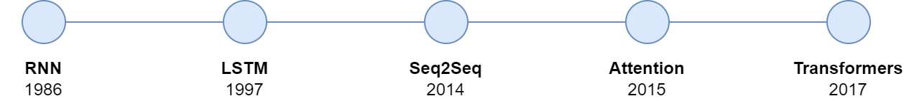

## 1. Redes recurrentes

Las [RNNs](https://es.wikipedia.org/wiki/Red_neuronal_recurrente) fueron introducidas por primera vez en la década de 1980 con la invención de la red Hopfield. Estas son un tipo de red neuronal diseñadas específicamente para procesar secuencias de datos. A diferencia de las redes neuronales tradicionales, las RNN son capaces de recordar información sobre entradas anteriores en la secuencia debido a su estructura recurrente. Este tipo de red es muy útil en tareas como el reconocimiento de voz, la traducción de idiomas, o cualquier otro problema donde los datos tengan un orden o contexto secuencial importante.

Las RNN se componen de una celda (o conjunto de celdas) que procesa un paso temporal a la vez y tiene la capacidad de "recordar" los resultados de los pasos anteriores. Esta característica permite que las RNN manejen secuencias de largo variable, lo cual es fundamental en tareas de lenguaje natural.  
En NLP, con una capa de *embeddings,* convertimos las palabras de entrada (en este caso, "Muy", "buenos", "días", "mis") en vectores numéricos densos. Este paso es esencial porque las redes neuronales no pueden trabajar directamente con texto; necesitan números.

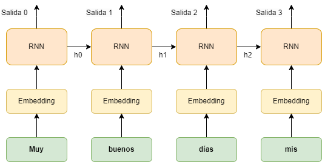

Los vectores de *embedding* se alimentan a través de una serie de celdas RNN. En el gráfico, vemos cuatro celdas RNN conectadas en secuencia. Cada celda toma dos entradas:

- El *embedding* de la palabra actual.
- El estado oculto (h) de la celda anterior, que contiene la información acumulada de todas las palabras procesadas hasta ese momento.

Esto significa que la primera celda recibe el embedding de la palabra "Muy" y un estado oculto inicial (h0), que suele estar inicializado a ceros. Luego, genera una salida (Salida 0) y un nuevo estado oculto (h1), que se pasa a la siguiente celda. El proceso se repite para las siguientes palabras: "buenos", "días" y "mis", donde cada celda RNN actualiza su estado oculto (h1, h2, h3, etc.) basado en la información previa y la palabra actual. Los estados ocultos son la clave de la capacidad de "memoria" de las RNN. Cada estado oculto (h) transporta la información sobre todas las palabras anteriores en la secuencia, permitiendo que la red recuerde el contexto de la oración.

Podemos ver cómo con este método nuestras predicciones dependen no solo de la entrada actual, sino también de los datos anteriores. Esta es la razón por la que las RNNs son un modelo adecuado para tratar con secuencias. Algunos problemas ampliamente conocidos resueltos por las RNNs:

- **Dependencias Temporales**: Algunos puntos de datos están relacionados entre sí según su orden. Por ejemplo, en el lenguaje, el significado de una oración puede cambiar drásticamente al reordenar sus palabras. Las RNNs están diseñadas para capturar estas dependencias, lo que las hace perfectas para tareas donde la secuencia de datos importa.
- **Entrada de Longitud Variable**: Las redes neuronales tradicionales funcionan bien cuando las entradas tienen un tamaño fijo, pero ¿qué pasa con oraciones de diferentes longitudes o datos de series temporales con diferentes pasos de tiempo? Las RNNs pueden manejar estos casos, ajustando su memoria interna para cada paso en la secuencia.
- **Procesamiento de Lenguaje Natural (NLP)**: Los idiomas son secuencias de palabras. Las RNNs destacan en tareas de NLP como traducción de idiomas, análisis de sentimientos y generación de texto. Entienden el contexto y el flujo de palabras, lo que les permite generar oraciones coherentes.

**Concepto Básico de las RNNs**  
Una RNN es como una red neuronal con memoria. Está diseñada para recordar y utilizar la información de los pasos anteriores mientras maneja el paso actual. Esta memoria es lo que hace especiales a las RNNs. 

En las redes neuronales tradicionales (redes feedforward), cada entrada se procesa de forma independiente, sin ningún conocimiento del pasado. Pero en las RNNs, la salida en cada paso no solo depende de la entrada actual, sino también de la información de los pasos anteriores. Esto permite que las RNNs encuentren patrones y comprendan el orden de las cosas en los datos que llegan en una secuencia.

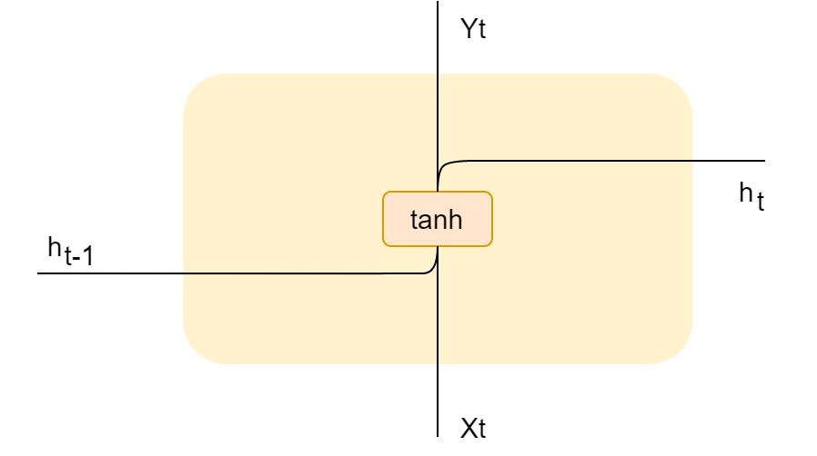

*Representación simplificada de una RNN*

En una celda RNN básica, la entrada actual y la salida anterior (o estado oculto anterior) se combinan y se pasan a través de una función de activación, generalmente la [tangente hiperbólica (tanh)](https://es.wikipedia.org/wiki/Tangente_hiperb%C3%B3lica), para producir el nuevo estado oculto (y la salida de la celda).

Matemáticamente, esto se puede expresar como:

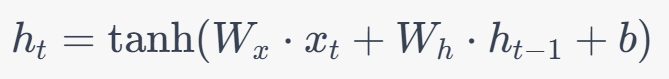

Donde:

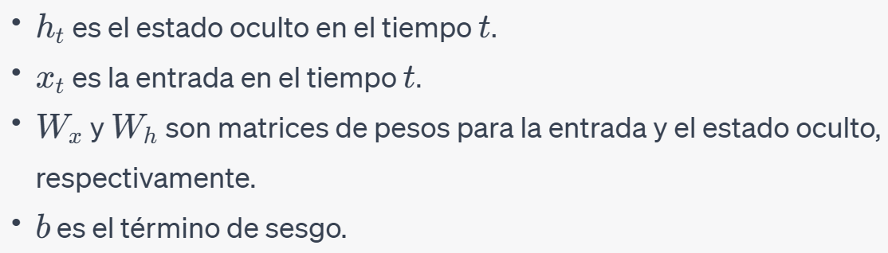

Diferencia con las Redes Neuronales Feedforward: Aquí hay una forma simple de entender la diferencia:

- Red Neuronal Feedforward: Imaginemos mirar cada palabra en una oración sin recordar las anteriores. Es como leer palabras en un orden aleatorio, sin entender el significado general.
- Red Neuronal Recurrente: Pensemos en leer una oración donde recordamos lo que hemos leído anteriormente. Esto nos ayuda a entender cómo se conectan las palabras y forman una oración coherente.

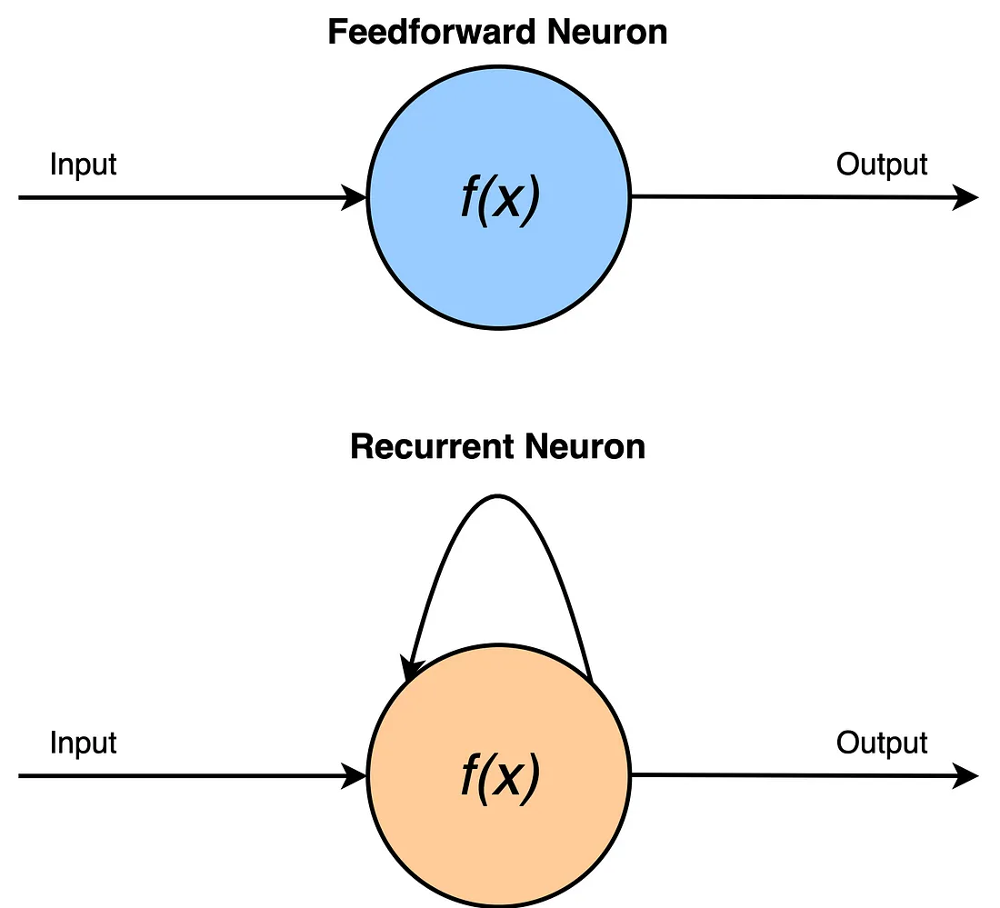

El "unfolding" (despliegue en español) es un concepto utilizado principalmente en el contexto de las Redes Neuronales Recurrentes (RNNs). Se refiere al proceso de representar y visualizar las operaciones temporales de una RNN a lo largo de varios pasos de tiempo:

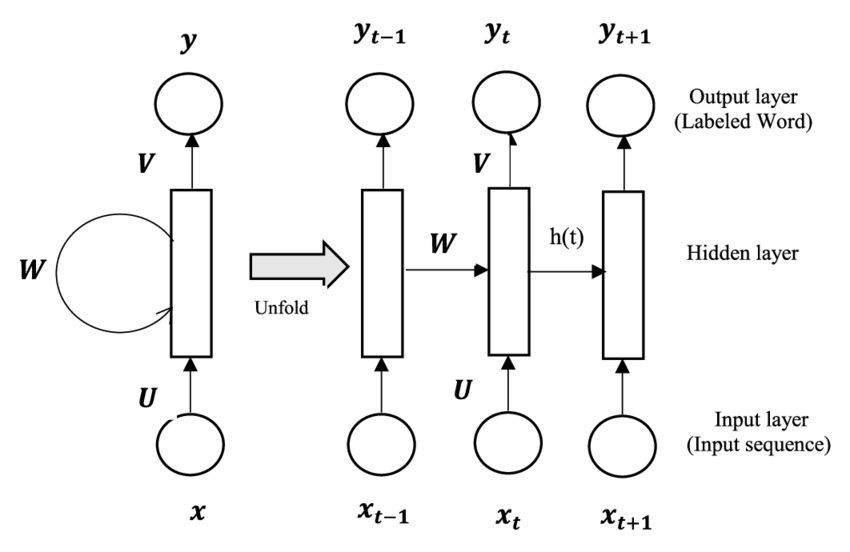

En el ejemplo que veremos a continuación, primero se realiza un preprocesamiento básico del texto, que incluye la tokenización y el padding de las secuencias. 

> 💡 El "padding" es una técnica utilizada en el procesamiento de secuencias para asegurar que todas las secuencias tengan la misma longitud. Esto se logra añadiendo valores adicionales (generalmente ceros) al principio o al final de las secuencias más cortas hasta que alcancen la longitud deseada.

Para que una RNN nos pueda predecir la siguiente palabra, añadiremos una capa densa, que con [softmax](https://es.wikipedia.org/wiki/Funci%C3%B3n_SoftMax), nos permite predecir la siguiente palabra. Esta capa de salida depende del vocabulario definido según nuestro conjunto de datos.  

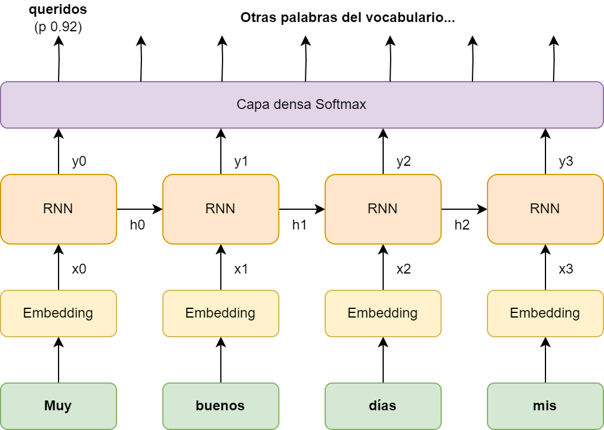

Luego, se define un modelo secuencial usando TensorFlow, con una capa de embedding, una capa RNN simple y una capa densa. Finalmente, se compila y se entrena el modelo:

```python
import tensorflow as tf
from tensorflow.keras.models import Sequential
from tensorflow.keras.layers import Embedding, SimpleRNN, Dense
from tensorflow.keras.preprocessing.text import Tokenizer
from tensorflow.keras.preprocessing.sequence import pad_sequences

# Supongamos que tenemos el siguiente conjunto de datos de texto
data = ["hola cómo estas", "bien y vos", "muy bien gracias", "buen día"]

# Preprocesamiento
tokenizer = Tokenizer()
tokenizer.fit_on_texts(data)
sequences = tokenizer.texts_to_sequences(data)
print('\nsequences:', sequences)
vocab_size = len(tokenizer.word_index) + 1  # Agregamos 1 por el token de cero padding
max_length = max([len(seq) for seq in sequences])
padded_sequences = pad_sequences(sequences, maxlen=max_length, padding='post')
print('\nvocab_size:', vocab_size)
print('\npadded_sequences', padded_sequences)
print('\ninput_length', max_length)

# Separamos las secuencias en entradas y salidas
X = padded_sequences[:, :-1]
y = padded_sequences[:, -1]
print(f'\nX={X}, y={y}')

# Modelo RNN
model = Sequential([
    Embedding(input_dim=vocab_size, output_dim=10, input_length=max_length-1),
    SimpleRNN(32),
    Dense(units=vocab_size, activation='softmax')
])

# Compilación y entrenamiento
model.compile(optimizer='adam', loss='sparse_categorical_crossentropy', metrics=['accuracy'])
model.summary()
model.fit(X, y, epochs=200)

# Guardar el modelo en un archivo
model.save("mi_modelo.h5")
```

Y la salida será como la siguiente:

```python
sequences: [[2, 3, 4], [1, 5, 6], [7, 1, 8], [9, 10]]

vocab_size: 11

padded_sequences [[ 2  3  4]
 [ 1  5  6]
 [ 7  1  8]
 [ 9 10  0]]
 
input_length 3

X=[[ 2  3]
 [ 1  5]
 [ 7  1]
 [ 9 10]], y=[4 6 8 0]
 
Model: "sequential_1"
_________________________________________________________________
 Layer (type)                Output Shape              Param #   
=================================================================
 embedding_1 (Embedding)     (None, 2, 10)             110       
                                                                 
 simple_rnn_1 (SimpleRNN)    (None, 32)                1376      
                                                                 
 dense_1 (Dense)             (None, 11)                363       
                                                                 
=================================================================
Total params: 1849 (7.22 KB)
Trainable params: 1849 (7.22 KB)
Non-trainable params: 0 (0.00 Byte)
_________________________________________________________________
Epoch 1/200
1/1 ━━━━━━━━━━━━━━━━━━━━ 2s 2s/step - accuracy: 0.0000e+00 - loss: 2.3912
........
Epoch 200/200
1/1 ━━━━━━━━━━━━━━━━━━━━ 0s 57ms/step - accuracy: 1.0000 - loss: 0.0207
```

El resumen del modelo muestra las tres capas: embedding, RNN simple y capa densa. La capa densa usa softmax, como se ve en el código. En este ejemplo la capa de embedding se aprende desde cero sobre cuatro frases, aunque en la práctica suele inicializarse con vectores preentrenados estáticos, como Word2Vec o FastText (Unidad 2).

Una vez que tenemos nuestro modelo de RNN entrenado, podemos probar como funciona para predecir la siguiente palabra:

```python
import numpy as np

def predict_next_word(model, tokenizer, text, max_length):
    # Convertir el texto a secuencia de números enteros
    sequence = tokenizer.texts_to_sequences([text])[0]
    
    # Aplicar padding
    sequence = pad_sequences([sequence], maxlen=max_length-1, padding='post')
    
    # Realizar la predicción
    probabilities = model.predict(sequence)[0]
    predicted_index = np.argmax(probabilities)
    
    # Mapear el índice predicho a la palabra
    for word, index in tokenizer.word_index.items():
        if index == predicted_index:
            return word
    return None

# Ejemplo de uso
text = "hola cómo"
predicted_word = predict_next_word(model, tokenizer, text, max_length)
print(f"La siguiente palabra predicha después de '{text}' es: {predicted_word}")
```

Las Redes Neuronales Recurrentes (RNN) son una herramienta valiosa en el procesamiento de secuencias, pero presentan varios problemas y limitaciones:

1. **Problema de las Dependencias a Largo Plazo**: Las RNN tradicionales tienen dificultades para aprender y mantener información de pasos de tiempo muy anteriores en la secuencia. Esto se conoce como el problema de las dependencias a largo plazo. Esencialmente, a medida que la secuencia crece, la influencia de un dato en particular tiende a desaparecer, lo que hace que las RNN sean ineficientes para capturar relaciones en secuencias largas.
2. [**Desvanecimiento**](https://es.wikipedia.org/wiki/Problema_de_desvanecimiento_de_gradiente) **y** [**Explosión del Gradiente**](https://machinelearningmastery.com/exploding-gradients-in-neural-networks/): Durante el entrenamiento, las RNN pueden enfrentar problemas de desvanecimiento o explosión del gradiente. Esto significa que los gradientes, que se utilizan para actualizar los pesos en la retropropagación, pueden volverse extremadamente pequeños (desvanecimiento) o extremadamente grandes (explosión). El desvanecimiento del gradiente puede hacer que el entrenamiento sea muy lento o se estanque, mientras que la explosión del gradiente puede hacer que el entrenamiento sea inestable.

   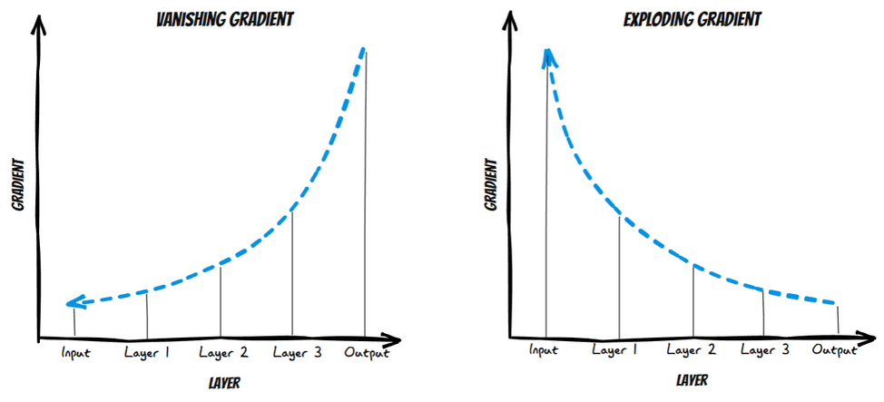
3. **Ineficiencia Computacional**: Las RNN necesitan procesar secuencias paso a paso, lo que las hace inherentemente más lentas para entrenar en comparación con las redes feedforward o las redes convolucionales que pueden realizar operaciones en paralelo.
4. **Problema de Sobreajuste**: Al igual que otras redes neuronales, las RNN pueden sobreajustarse, especialmente cuando se tiene un número limitado de datos de entrenamiento. Esto significa que el modelo puede funcionar bien en los datos de entrenamiento pero no generalizar bien a datos no vistos.
5. **Dificultad en la Interpretación**: Las RNN, al igual que otros modelos de aprendizaje profundo, pueden ser consideradas como "cajas negras", lo que significa que puede ser difícil interpretar y entender cómo están tomando decisiones específicas.

Las mismas celdas se combinan como secuencia a secuencia, secuencia a vector o vector a secuencia. El caso secuencia a secuencia se desarrolla en la sección de codificador y decodificador.

### LSTM

Las [LSTM (Long Short-Term Memory)](https://en.wikipedia.org/wiki/Long_short-term_memory) son una variante especializada de las Redes Neuronales Recurrentes (RNN) diseñadas para abordar el problema del desvanecimiento del gradiente, que es común en las RNN tradicionales. Las LSTM fueron introducidas por [Sepp Hochreiter y Jürgen Schmidhuber en 1997](https://www.researchgate.net/profile/Sepp-Hochreiter/publication/13853244_Long_Short-term_Memory/links/5700e75608aea6b7746a0624/Long-Short-term-Memory.pdf?_tp=eyJjb250ZXh0Ijp7ImZpcnN0UGFnZSI6InB1YmxpY2F0aW9uIiwicGFnZSI6InB1YmxpY2F0aW9uIn19) y han demostrado ser eficaces en una variedad de tareas de procesamiento de secuencias.

**Características clave de las LSTM**:

1. **Memoria a Largo Plazo**: A diferencia de las RNN tradicionales, que tienden a olvidar la información después de un cierto número de pasos de tiempo, las LSTM están diseñadas para recordar información a lo largo de largas secuencias, lo que les permite capturar dependencias a largo plazo en los datos.
2. **Estructura de Puertas**: Las LSTM introducen el concepto de "puertas" para regular el flujo de información. Estas puertas determinan qué información se debe mantener o descartar en cada paso de tiempo. Hay tres puertas principales en una LSTM:

   - **Puerta de Entrada (Input Gate)**: Decide cuánta información nueva se añadirá a la celda de memoria.
   - **Puerta de Olvido (Forget Gate)**: Decide cuánta información de la celda de memoria se descartará.
   - **Puerta de Salida (Output Gate)**: Decide cuánta información de la celda de memoria se utilizará para calcular la salida en el paso de tiempo actual.
3. **Celda de Memoria**: Es el componente central de la LSTM que almacena información a lo largo de los pasos de tiempo. La información en la celda de memoria se actualiza en cada paso de tiempo basándose en las decisiones tomadas por las puertas.
4. **Resistencia al Desvanecimiento del Gradiente**: Gracias a su estructura única, las LSTM pueden aprender dependencias a largo plazo sin sufrir significativamente del problema del desvanecimiento del gradiente, que afecta a las RNN tradicionales. Sin embargo, aunque las LSTM son menos susceptibles al desvanecimiento del gradiente en comparación con las RNN tradicionales, todavía pueden ser propensas al problema del gradiente explosivo. La explosión del gradiente puede ocurrir cuando los valores del gradiente se vuelven extremadamente grandes, lo que puede llevar a actualizaciones de peso inestables y, en última instancia, a un modelo que no converge.

La siguientes, es la arquitectura de cada unidad de una red recurrente. La celda se vale de los siguientes elementos, para lograr las capacidades de memoria de corto y largo plazo:

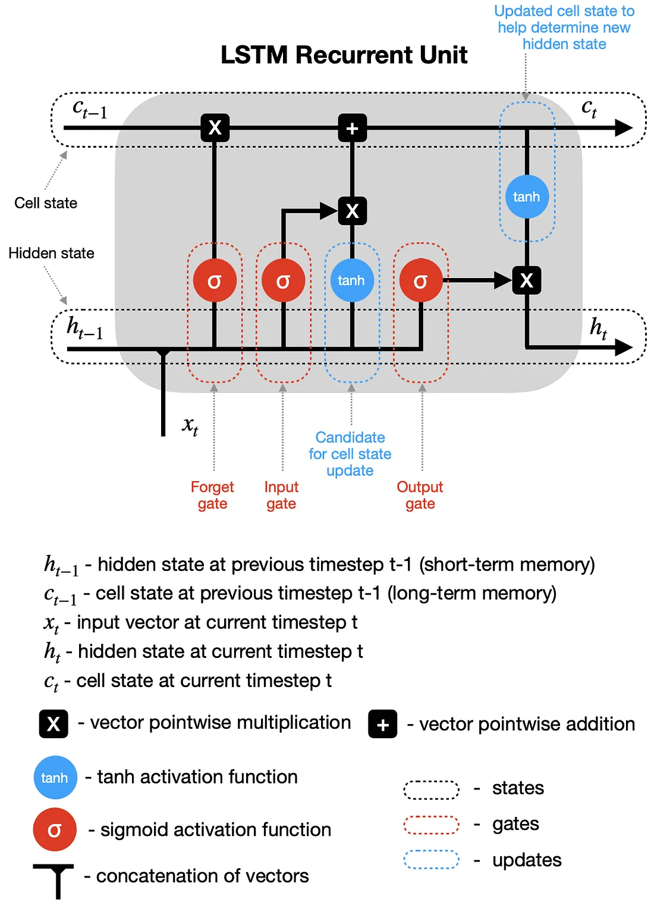

1. **Estado de Celda (𝐶𝑡)**: Representa la memoria a largo plazo de la unidad. Es un camino por el cual la información puede viajar sin alteraciones.
2. **Estado Oculto (ℎ𝑡)**: Representa la memoria a corto plazo o la salida actual de la unidad.
3. **Puerta de Olvido**: Decide qué información del estado de celda debe descartarse o conservarse. Utiliza la función sigmoide para tomar esta decisión, produciendo valores entre 0 (olvidar) y 1 (conservar).
4. **Puerta de Entrada**: Actualiza el estado de la celda con nueva información. Primero, decide qué valores se actualizarán utilizando una función sigmoide. Luego, una capa tanh crea un vector de nuevos valores candidatos. Estos dos resultados se multiplican para actualizar el estado de la celda de largo plazo 𝐶𝑡
5. **Puerta de Salida**: Decide cuál debería ser el próximo estado oculto (salida). Toma la entrada actual y el estado oculto anterior, y después de pasarlos por una función sigmoide, multiplica el resultado con el tanh del estado de la celda para producir el estado oculto de este instante.
6. **Función de Activación tanh**: Produce valores entre -1 y 1 y se utiliza para regular la red.
7. **Función de Activación Sigmoide**: Produce valores entre 0 y 1 y se utiliza principalmente para las puertas en el LSTM, ya que puede producir valores cercanos a 0 o 1, tomando decisiones prácticamente binarias.

Una LSTM bidireccional lee la secuencia en ambos sentidos y combina las dos representaciones. Se utiliza cuando la tarea dispone de la oración completa, como en clasificación o etiquetado. No se utiliza para generar el token siguiente, porque el contexto futuro aún no está disponible. Podría utilizarse para un análisis de sentimientos.

Si la salida es una etiqueta de la secuencia entera, se toma el último estado oculto y se lo pasa a una capa densa.

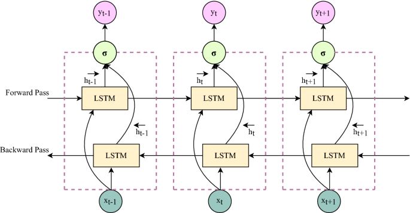

### GRU

Las Unidades Recurrentes Gated (GRU, por sus siglas en inglés de Gated Recurrent Units) son una variante de las Redes Neuronales Recurrentes (RNN) diseñada para abordar el problema de la desaparición del gradiente, al igual que las Redes Neuronales Recurrentes de Memoria a Largo Plazo (LSTM). Sin embargo, **las GRU ofrecen una estructura más simplificada comparada con las LSTM**, lo que las hace computacionalmente más eficientes en ciertos casos.

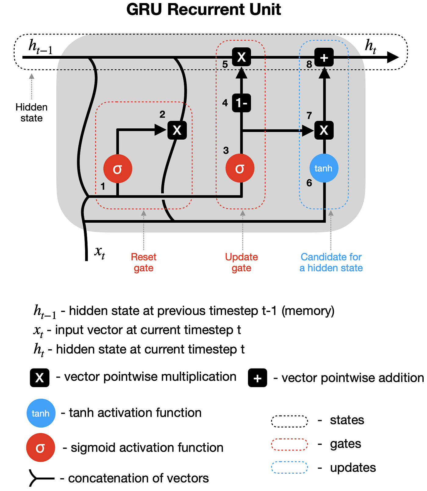

Aquí se explica cómo funcionan las GRU:

1. **Mecanismo de Puertas**:

   - Las GRU utilizan el concepto de puertas para controlar el flujo de información. En particular, tienen dos puertas: una puerta de actualización (update) y una puerta de reinicio (reset).
2. **Puerta de Actualización**:

   - Esta puerta decide qué información del estado anterior se va a mantener y qué información nueva se va a incorporar. Esto ayuda a determinar la importancia de la información pasada en el contexto actual.
3. **Puerta de Reinicio**:

   - La puerta de reinicio decide qué cantidad de información pasada se va a descartar. Esto es útil para deshacerse de la información irrelevante y hacer espacio para la nueva información relevante.
4. **Actualización del Estado**:

   - Utilizando las decisiones tomadas por las puertas de actualización y reinicio, las GRU calculan un nuevo estado oculto que se transmite a lo largo de la secuencia y se utiliza para la salida del modelo.
5. **Eficiencia y Simplificación**:

   - Las GRU reducen la complejidad de las LSTM fusionando las puertas de entrada y de olvido en una sola puerta de actualización, y eliminando la celda de memoria, lo que resulta en un modelo más simple y más rápido, pero con una capacidad similar para capturar dependencias a largo plazo en los datos secuenciales.

> Más información:  
> [https://towardsdatascience.com/animated-rnn-lstm-and-gru-ef124d06cf45](https://towardsdatascience.com/animated-rnn-lstm-and-gru-ef124d06cf45)

## 2. Seq2Seq y atención

La arquitectura Seq2Seq consta de dos componentes principales: el codificador y el decodificador. El codificador procesa la secuencia de entrada y genera una representación vectorial compacta, mientras que el decodificador toma esta representación y genera una secuencia de salida. Esta estructura bifásica permite que los modelos Seq2Seq manejen eficazmente tareas complejas de mapeo secuencial.

La arquitectura de este modelo, surge del paper [Sequence to Sequence Learning with Neural Networks (Ilya Sutskever](https://arxiv.org/abs/1409.3215)). Este fue uno de los primeros artículos en presentar el modelo codificador-decodificador (encoder-decoder) para traducción automática y, en general, modelos de secuencia a secuencia. El modelo se aplicó a la traducción del inglés al francés.

Para comprender completamente la lógica subyacente del modelo, repasaremos la siguiente figura:

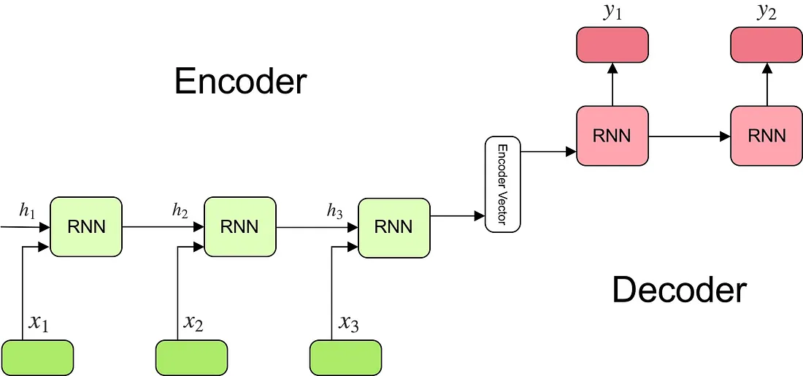

El modelo consta de 3 partes: codificador, vector intermedio codificador y decodificador.

**Codificador (Encoder)**  
Una pila de varias unidades recurrentes (células LSTM o GRU para un mejor rendimiento) donde cada una acepta un único elemento de la secuencia de entrada, recopila información para ese elemento y la propaga hacia adelante. En un problema de respuesta a preguntas, la secuencia de entrada es una colección de todas las palabras de la pregunta. Cada palabra se representa como x_i donde i es el orden de esa palabra.  
Los estados ocultos h_i se calculan mediante la fórmula:


Esta sencilla fórmula representa el resultado de una red neuronal recurrente ordinaria. Como podemos ver, simplemente aplicamos los pesos apropiados al estado oculto anterior h\_(t-1) y al vector de entrada x_t.

**Vector codificador**  
Este es el estado oculto final producido a partir de la parte codificadora del modelo. Se calcula utilizando la fórmula anterior. Este vector tiene como objetivo encapsular la información de todos los elementos de entrada para ayudar al decodificador a realizar predicciones precisas.  
Actúa como el estado oculto inicial de la parte decodificadora del modelo.

**Decodificador (Decoder)**  
Una pila de varias unidades recurrentes donde cada una predice una salida y_t en un paso de tiempo t. Cada unidad recurrente acepta un estado oculto de la unidad anterior y produce una salida así como su propio estado oculto.  
En el problema de preguntas y respuestas, la secuencia de salida es una colección de todas las palabras de la respuesta. Cada palabra se representa como y_i donde i es el orden de esa palabra. Cualquier estado oculto h_i se calcula mediante la fórmula:


Como se puede ver, solo estamos usando el estado oculto anterior para calcular el siguiente.

La salida y_t en el paso de tiempo t se calcula usando la fórmula:


Calculamos las salidas utilizando el estado oculto en el paso de tiempo actual junto con el peso respectivo W(S). [Softmax](https://es.wikipedia.org/wiki/Funci%C3%B3n_SoftMax) se utiliza para crear un vector de probabilidad que nos ayudará a determinar el resultado final (por ejemplo, la palabra en el problema de preguntas y respuestas).

El poder de este modelo radica en el hecho de que puede asignar secuencias de diferentes longitudes entre sí. Como podemos ver, las entradas y salidas no están correlacionadas y sus longitudes pueden diferir. Esto abre una gama completamente nueva de problemas que ahora pueden resolverse utilizando dicha arquitectura. 

La explicación anterior solo cubre el modelo de secuencia a secuencia más simple y, por lo tanto, no podemos esperar que funcione bien en tareas complejas. La razón es que utilizar un único vector para codificar toda la secuencia de entrada no es capaz de capturar toda la información.

Los modelos Seq2Seq se utilizan principalmente para estas aplicaciones:

1. **Traducción Automática**: Convertir texto de un idioma a otro.
2. **Resumen Automático**: Generar resúmenes concisos de textos largos.
3. **Respuesta a Preguntas**: Generar respuestas a preguntas basadas en un conjunto de datos dado.
4. **Generación de Texto**: Crear texto coherente basado en alguna entrada dada.

El mecanismo de atención se popularizó en traducción neuronal con Bahdanau, Cho y Bengio (2014). El decodificador no depende de un único vector de la oración fuente: en cada paso combina, con pesos, los estados del codificador. Vaswani y otros (2017), en Attention Is All You Need, toman esa idea y eliminan la recurrencia. Esa arquitectura se ve en la sección siguiente.

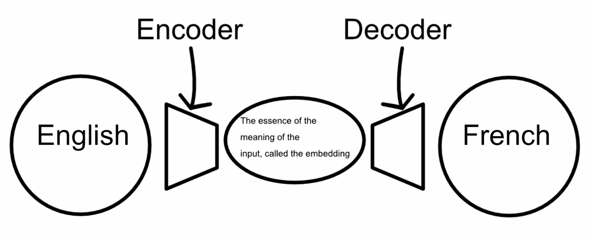

Esta es una arquitectura muy común, pero los detalles exactos pueden cambiar drásticamente de una implementación a otra. Como vimos anteriormente, las Seq2Seq (codificadores-decodificadores de secuencia a secuencia) eran redes recurrentes que podrían incrementalmente "construir" y luego "desconstruir" los embeddings.

![Conceptualización del flujo de información de una secuencia simple a una secuencia codificador-decodificador recurrente. El codificador incrusta gradualmente las palabras en inglés, palabra por palabra, en el espacio de incrustación, que luego el decodificador deconstruye. En este diagrama, los círculos representan las incrustaciones en todo el codificador (rojo), el espacio de incrustación intermedio (blanco) y en todo el decodificador (azul). En este caso, esos embeddings son vectores largos y complejos con contenido abstracto que no es fácilmente interpretable por humanos.](imagenes/img-18.png)

*Conceptualización del flujo de información de una secuencia simple a una secuencia codificador-decodificador recurrente. El codificador incrusta gradualmente las palabras en inglés, palabra por palabra, en el espacio de incrustación, que luego el decodificador deconstruye. En este diagrama, los círculos representan las incrustaciones en todo el codificador (rojo), el espacio de incrustación intermedio (blanco) y en todo el decodificador (azul). En este caso, esos embeddings son vectores largos y complejos con contenido abstracto que no es fácilmente interpretable por humanos.*

Esta idea general, fue lo último en tecnología durante varios años. Sin embargo, un problema con este enfoque es que toda la secuencia de entrada debe incrustarse en el espacio de embeddings, que generalmente es un vector de tamaño fijo. Como resultado, estos modelos pueden olvidar fácilmente el contenido de secuencias demasiado largas. 

El mecanismo de atención fue diseñado para aliviar el problema de tener que encajar toda la secuencia de entrada en el espacio de incrustación. Lo hace diciéndole al modelo qué entradas están relacionadas con qué salidas. O, en otras palabras, el mecanismo de atención permite que un modelo se centre en partes relevantes de la entrada e ignore el resto.

![Un ejemplo de cómo sería un proceso de pensamiento basado en la atención. En francés, “je” es exactamente idéntica a la palabra “yo”. “Suis” es una conjugación del verbo “etre” que es “to be” y se conjuga como “suis” basándose en el sujeto “yo” y el verbo “soy”. La elección de “director” está relacionada principalmente con la palabra “gerente”, pero también con el contexto en el que se utiliza esa palabra. La elección de qué entradas se relacionan con qué salidas es tarea del mecanismo de atención.](imagenes/img-19.png)

*Un ejemplo de cómo sería un proceso de pensamiento basado en la atención. En francés, “je” es exactamente idéntica a la palabra “yo”. “Suis” es una conjugación del verbo “etre” que es “to be” y se conjuga como “suis” basándose en el sujeto “yo” y el verbo “soy”. La elección de “director” está relacionada principalmente con la palabra “gerente”, pero también con el contexto en el que se utiliza esa palabra. La elección de qué entradas se relacionan con qué salidas es tarea del mecanismo de atención.*

**¿Cómo funciona la atención?**

🔗 YouTube: [¿Qué es un TRANSFORMER? La Red Neuronal que lo cambió TODO!](https://www.youtube.com/embed/aL-EmKuB078?start=6m44s&end=16m14s)

En la práctica, el mecanismo de atención que analizaremos termina siendo una matriz de puntuaciones, denominada puntuaciones de “alineación”. Éstas, codifican el grado en que una palabra en una secuencia de entrada se relaciona con una palabra en la secuencia de salida.


*Dos ejemplos de matrices de atención para dos ejemplos diferentes del inglés al francés, de Neural Machine Translation de Jointly Learning to Align and Translate (2014). Este artículo sólo menciona tangencialmente el término "atención" y, de hecho, lo llama "modelo de alineación". El término "atención" parece haberse popularizado más tarde.*

El [paper](https://arxiv.org/pdf/1409.0473) presenta la siguiente función para calcular el puntaje de alineamiento:

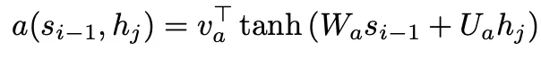

Esta función calcula una puntuación entre la siguiente palabra de salida y una única palabra de entrada, lo que indica qué tan relevante es una palabra de entrada para la salida actual. Esta función se ejecuta en todas las palabras de entrada (h_j) para calcular una puntuación de alineación para todas las palabras de entrada dada la salida actual.


*Un diagrama conceptual de cómo se calculan las alineaciones para una predicción determinada (palabra 8). La función de alineación se calcula entre la incorporación de salida anterior del decodificador y todas las entradas, para calcular la atención a la salida actual. *

Se aplica una función softmax en todas las alineaciones calculadas, convirtiéndolas en una probabilidad. Esto se denomina en la literatura “búsqueda suave” o “alineación suave”.

La forma exacta en que se utiliza la atención puede variar de una implementación a otra. En [Neural Machine Translation by Jointly Learning to Align and Translate (2014)](https://arxiv.org/abs/1409.0473), el mecanismo de atención decide qué embeddings de entrada proporcionar al decodificador.

🔗 [Atención de Bahdanau, paso a paso](https://claude.ai/artifact/LCS91ojV9XiSwFG5uCjueH)  
Try out Artifacts created by Claude users

## 3. Transformers

En el mundo del procesamiento del lenguaje natural (NLP), la arquitectura de los Transformers ha emergido como un pilar revolucionario. Esta innovadora estructura, introducida en el influyente [artículo de 2017 titulado "Attention Is All You Need" por Vaswani et al.](https://arxiv.org/abs/1706.03762), cambió el paradigma de cómo las máquinas comprenden y generan lenguaje. A diferencia de las técnicas anteriores que se basaban en redes neuronales recurrentes o convolucionales, los Transformers aprovechan el mecanismo conocido como "self-attention" para capturar interacciones en toda una secuencia, independientemente de la distancia entre los elementos. Esta capacidad de capturar relaciones contextuales a largo plazo ha catapultado a los Transformers al centro de NLP, siendo la base de modelos destacados como BERT y GPT. La influencia de este trabajo no puede ser subestimada; ha redefinido las mejores prácticas en NLP, impulsando avances significativos y permitiendo aplicaciones antes consideradas inalcanzables.

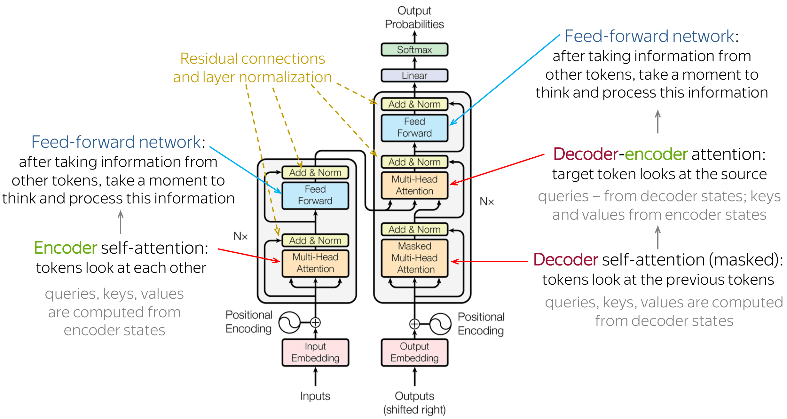

*Arquitectura de un Transformer, según el paper “Attention is all you need”*

**¿Qué son los Transformers?**

Un transformer es un tipo de arquitectura de red neuronal que está bien adaptado para tareas que involucran procesar secuencias como entradas. Quizás el ejemplo más común de una secuencia en este contexto es una oración, a la que podemos considerar como un conjunto ordenado de palabras.

El objetivo de estos modelos es crear una representación numérica para cada elemento dentro de una secuencia; encapsulando información esencial sobre el elemento y su contexto vecino. Las representaciones numéricas resultantes pueden ser transmitidas a redes subsecuentes, las cuales pueden aprovechar esta información para realizar diversas tareas, incluyendo generación y clasificación.

Al crear representaciones tan enriquecidas, estos modelos permiten que las redes subsecuentes comprendan mejor los patrones y relaciones subyacentes en la secuencia de entrada, mejorando su habilidad para generar salidas coherentes y contextualmente relevantes.

La principal ventaja de los transformers radica en su capacidad para manejar dependencias de largo alcance dentro de las secuencias, así como en ser altamente eficientes; capaces de procesar secuencias en paralelo. Esto es particularmente útil para tareas como la traducción automática, análisis de sentimientos y generación de texto.

El **Transformer** se compone principalmente de dos bloques fundamentales: el **bloque encoder** y el **bloque decoder**, los cuales trabajan en conjunto para procesar y transformar secuencias de datos, especialmente en tareas de traducción y generación de lenguaje. A continuación, un resumen del funcionamiento de ambos bloques.

1. **Bloque Encoder:** El bloque **encoder** es responsable de procesar la secuencia de entrada y generar una representación rica que captura la información clave de dicha secuencia. Su estructura básica incluye varios mecanismos clave:

   1. **Capa de Auto-Atención (Self-Attention)**: Esta es la parte central del encoder. La auto-atención permite que cada palabra en la secuencia de entrada se relacione con todas las demás palabras de esa secuencia. Esto significa que el modelo puede captar dependencias largas entre palabras. La auto-atención funciona calculando un conjunto de vectores de **consulta (query)**, **clave (key)** y **valor (value)**, y utilizando estos vectores para calcular una "atención ponderada" entre las palabras.
   2. **Multi-Head Attention**: En lugar de usar una sola atención, el transformer utiliza múltiples "cabezas de atención" para capturar diferentes aspectos o relaciones en la secuencia. Cada cabeza de atención puede enfocarse en diferentes partes de la secuencia, lo que permite una mejor comprensión de las interdependencias entre las palabras.
   3. **Feed-Forward Layer**: Después de la capa de auto-atención, se pasa por una capa completamente conectada (feed-forward), que aplica transformaciones no lineales a cada posición de la secuencia de forma independiente.
   4. **Normalización y Residuos (Layer Normalization and Residual Connections)**: Cada subcapa en el encoder (auto-atención y feed-forward) está acompañada de una capa de normalización y conexiones residuales. Esto ayuda a estabilizar el entrenamiento y mejorar la eficiencia del modelo.

   > 💡 La salida del encoder de un transformer codifica una representación rica y densa de la secuencia de entrada, donde cada token se representa no solo en función de sí mismo, sino también de su relación con todos los demás tokens de la secuencia. Esta representación incluye información semántica, sintáctica y de contexto posicional, permitiendo al modelo capturar dependencias de largo y corto alcance dentro del texto.

   El encoder, al final de su proceso, genera una secuencia de vectores de representación que encapsulan la información de entrada, y esta secuencia es pasada al decoder.

   🔗 [Transformer Encoder Pipeline: Text to Vector Visualization](https://claude.ai/public/artifacts/cf3bdb51-d48f-4214-b212-bdac411b0ba3)  
   Interactive visual guide showing how transformers convert Spanish text into contextual numerical vectors through tokenization, embeddings, attention, and positional encoding.
2. **Bloque Decoder**: El bloque decoder toma la salida del encoder (es decir, la representación generada) y genera la secuencia de salida. Está compuesto por las siguientes capas clave:

   1. **Masked Multi-Head Self-Attention**: Similar a la capa de auto-atención en el encoder, pero en este caso se aplica un enmascaramiento para evitar que el decoder mire palabras futuras durante la generación de la secuencia. Este enmascaramiento asegura que el modelo genere las palabras una a una en el orden correcto.
   2. **Multi-Head Attention sobre la Salida del Encoder**: El decoder también tiene una capa de atención que se aplica sobre la salida del encoder. Esto permite que el decoder se "enfoque" en diferentes partes de la secuencia de entrada mientras genera cada palabra en la secuencia de salida.
   3. **Feed-Forward Layer**: Al igual que en el encoder, el decoder también tiene capas feed-forward que aplican transformaciones no lineales a las representaciones intermedias.
   4. **Normalización y Conexiones Residuales**: También utiliza normalización y conexiones residuales, de forma similar al encoder, para mejorar la estabilidad y la eficiencia.

Flujo general:

- El encoder procesa la secuencia de entrada en paralelo, generando representaciones vectoriales que capturan relaciones entre las palabras.
- El decoder utiliza estas representaciones junto con la secuencia generada previamente para producir la secuencia de salida de manera autoregresiva, es decir, una palabra a la vez.

🔗 [Transformer Decoder Pipeline: Interactive Visual Guide](https://claude.ai/public/artifacts/246ec564-8007-4fa3-8116-abcf10f9d6c7)  
Learn how transformer decoders generate text word-by-word with interactive visualizations of masked attention, cross-attention, and prediction mechanisms.

**Recursos audiovisuales**

🔗 [LLM Visualization](https://bbycroft.net/llm)  
A 3D animated visualization of an LLM with a walkthrough.

🔗 [Transformer Explainer: LLM Transformer Model Visually Explained](https://poloclub.github.io/transformer-explainer/)  
An interactive visualization tool showing you how transformer models work in large language models (LLM) like GPT.

🔗 [How LLMs Process Text?](https://vizlearn.in/gen_ai/how_llms_process_text.html)  
Interactive walkthrough of the LLM text pipeline - tokenization, token IDs, embeddings, positional encoding, self-attention and logits, with live computed values.

En el video a continuación, podemos ver conceptualmente cómo funcionan los Transformers:

🔗 YouTube: [Transformers, the tech behind LLMs | Deep Learning Chapter 5](https://www.youtube.com/watch?v=wjZofJX0v4M)

**Tokenización**

Antes de que un Transformer procese cualquier frase o texto, este debe ser convertido a una forma que la máquina pueda entender. Este proceso se conoce como tokenización.

La tokenización divide el texto en unidades más pequeñas, llamadas tokens. Estos tokens pueden ser tan pequeños como caracteres o tan grandes como palabras. Sin embargo, simplemente dividir el texto en palabras individuales no es suficiente para muchos idiomas y tareas, especialmente cuando enfrentamos desafíos como palabras fuera del vocabulario.

Para abordar este problema, se emplean métodos avanzados de tokenización. Uno de los métodos más populares es el ["Byte Pair Encoding" (BPE). BPE](https://huggingface.co/learn/nlp-course/chapter6/5?fw=pt) funciona combinando iterativamente los pares de caracteres o tokens más frecuentes en un corpus de texto, permitiendo manejar palabras raras o desconocidas y generar un vocabulario dinámico. Al utilizar BPE, es posible descomponer palabras en subpalabras o subtokens, lo que facilita que el modelo maneje una amplia gama de vocabulario sin aumentar excesivamente su tamaño.

Veamos un ejemplo de tokenización:

```python
from transformers import BertTokenizer

tokenizer = BertTokenizer.from_pretrained("bert-base-multilingual-uncased")
text = "Estamos tratando de entender como funcionan los transformers."
token_ids = tokenizer(text)["input_ids"]
print("Token IDs:")
print(token_ids)
print("Subpalabras:", tokenizer.tokenize(text))
```

No se carga el modelo: el laboratorio muestra solo la partición en subpalabras. La salida de abajo corresponde a este tokenizador.

Donde se imprime:

```text
Token IDs:
[101, 10602, 14000, 21139, 10622, 10102, 66325, 10245, 61562, 10115, 10175, 58263, 119, 102]

Decodificamos los IDs completos:
[CLS] estamos tratando de entender como funcionan los transformers. [SEP]

Tokens individuales y sus IDs:
ID: 101, Token: '[CLS]'
ID: 10602, Token: 'esta'
ID: 14000, Token: '##mos'
ID: 21139, Token: 'trata'
ID: 10622, Token: '##ndo'
ID: 10102, Token: 'de'
ID: 66325, Token: 'entender'
ID: 10245, Token: 'como'
ID: 61562, Token: 'funciona'
ID: 10115, Token: '##n'
ID: 10175, Token: 'los'
ID: 58263, Token: 'transformers'
ID: 119, Token: '.'
ID: 102, Token: '[SEP]'

Subpalabras (tokens) usando tokenize():
['esta', '##mos', 'trata', '##ndo', 'de', 'entender', 'como', 'funciona', '##n', 'los', 'transformers', '.']

Subpalabras con sus IDs correspondientes:
Token: 'esta', ID: 10602
Token: '##mos', ID: 14000
Token: 'trata', ID: 21139
Token: '##ndo', ID: 10622
Token: 'de', ID: 10102
Token: 'entender', ID: 66325
Token: 'como', ID: 10245
Token: 'funciona', ID: 61562
Token: '##n', ID: 10115
Token: 'los', ID: 10175
Token: 'transformers', ID: 58263
Token: '.', ID: 119
```

Los tokens especiales **\[CLS\]** y **\[SEP\]** juegan un papel importante en la arquitectura de modelos de lenguaje basados en transformadores, como BERT, para ayudar en el procesamiento y entendimiento de secuencias de texto. El token **\[CLS\]** (abreviatura de "classification") es un token especial que se inserta al principio de cada secuencia de entrada en modelos como BERT. Sirve como un marcador que el modelo utiliza para generar una representación global o resumida de la secuencia completa. El token **\[SEP\]** (abreviatura de "separator") es un token especial que se utiliza para indicar el final de una secuencia o para separar dos secuencias de texto diferentes.

**Embeddings y codificación posicional**

Una vez que tenemos una secuencia de enteros que representa nuestra entrada, podemos convertirla en embeddings, que son una forma de representar información que puede ser fácilmente procesada por algoritmos de aprendizaje automático; su objetivo es capturar el significado del token que se está codificando en un formato comprimido, representando la información como una secuencia de números, y además captura relaciones semánticas entre las frases o palabras. 

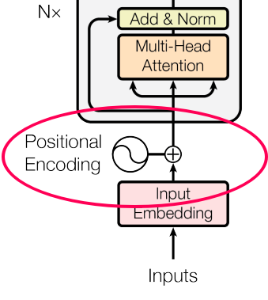

Los Transformers proponen un mecanismo novedoso para procesar los embeddings, que es la codificación posicional (Positional Encoding). Esto resulta muy útil para preservar el orden de nuestros tokens.

El codificado posicional, o "[positional encoding](https://machinelearningmastery.com/a-gentle-introduction-to-positional-encoding-in-transformer-models-part-1/)", es una técnica utilizada en modelos de transformers para dotar a la arquitectura de la capacidad de tener en cuenta el orden o la posición de los tokens en una secuencia. El codificado posicional proporciona la información necesaria sobre la posición de cada token en una secuencia, permitiendo que el modelo distinga el orden en el que los tokens aparecen.

Para implementar el codificado posicional, se generan valores numéricos para cada posición en la secuencia y se suman a las incrustaciones (embeddings) originales de los tokens. Estos valores son calculados de tal manera que cada posición en la secuencia tiene un codificado posicional único. 

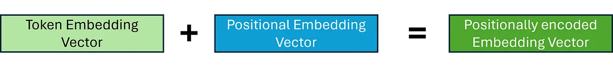

Una forma común de hacer esto es mediante funciones sinusoidales, que generan valores que varían de manera periódica. De esta manera, incluso si las secuencias tienen longitudes diferentes, el modelo puede inferir la relación posicional entre los tokens y, por lo tanto, comprender el orden y la estructura de la secuencia.

El mismo vector, sumado a la codificación de dos posiciones distintas, deja de ser idéntico. No hace falta un modelo de embeddings: el vector es fijo.

```python
import math

token = [0.37, -0.82, 0.15, 0.64, -0.21, 0.93, -0.48, 0.11]

def positional_encoding(n, d_model):
    pe = []
    for pos in range(n):
        row = []
        for i in range(d_model):
            angle = pos / (10000 ** ((2 * (i // 2)) / d_model))
            row.append(math.sin(angle) if i % 2 == 0 else math.cos(angle))
        pe.append(row)
    return pe

def cos(x, y):
    dot = sum(a * b for a, b in zip(x, y))
    nx = math.sqrt(sum(a * a for a in x))
    ny = math.sqrt(sum(b * b for b in y))
    return dot / (nx * ny)

pe = positional_encoding(6, 8)
a = [t + p for t, p in zip(token, pe[1])]
b = [t + p for t, p in zip(token, pe[4])]
print(f"sin codificación posicional: {cos(token, token):.4f}")
print(f"con codificación posicional (posición 1 vs 4): {cos(a, b):.4f}")
```

Al correrlo:

```text
sin codificación posicional: 1.0000
con codificación posicional (posición 1 vs 4): 0.7947
```

Sin codificación posicional la similitud es 1.0000: es el mismo vector. Con la suma de senos y cosenos, la posición 1 y la posición 4 quedan en 0.7947. La atención puede distinguir las dos apariciones.

Ventajas:

- Extrapolación a secuencias largas: A diferencia de encodings aprendidos (que se entrenan y pueden fallar en longitudes no vistas), el sinusoidal se generaliza bien.
- Relaciones relativas: El modelo puede inferir distancias posicionales (e.g., posición 5 está "cerca" de 4) gracias a las propiedades matemáticas de senos y cosenos.
- Eficiencia: No añade parámetros entrenables, reduciendo el costo computacional.

El codificado posicional resuelve un problema clave en los transformers: la falta de sensibilidad al orden inherente en mecanismos como la atención. Al sumar vectores únicos basados en funciones sinusoidales a los embeddings, se preserva la información secuencial de manera eficiente. Este mecanismo no solo mejora el rendimiento en tareas de NLP, sino que también inspira innovaciones en visión por computadora y otros dominios.

🔗 [Google Colab](https://colab.research.google.com/drive/17gRrUxBNFAHsh5ZZugDR_9l515PbS1Xp?usp=sharing#scrollTo=5fV_g4yCmQ-7)

**Mecanismo de Atención**

Quizás el mecanismo más importante utilizado por la arquitectura del transformer es conocido como atención, que permite a la red entender qué partes de la secuencia de entrada son las más relevantes para la tarea dada. Para cada token en la secuencia, el mecanismo de atención identifica qué otros tokens son importantes para comprender el token actual en el contexto dado. Antes de explorar cómo se implementa esto dentro de un transformer, comencemos de manera simple e intentemos entender conceptualmente qué intenta lograr el mecanismo de atención, para construir nuestra intuición.

Una forma de entender la atención es pensar en ella como un método que reemplaza cada embedding de token con un embedding que incluye información sobre sus tokens vecinos; en lugar de usar la misma incrustación para cada token independientemente de su contexto. Si supiéramos qué tokens son relevantes para el token actual, una forma de capturar este contexto sería crear un promedio ponderado —o, más generalmente, una combinación lineal— de estas incrustaciones.

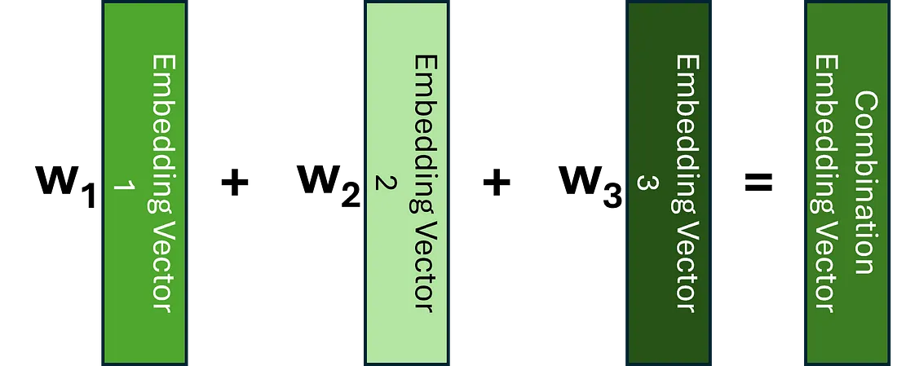

Mientras procesa una palabra, la Atención permite al modelo concentrarse en otras palabras de la entrada que están estrechamente relacionadas con esa palabra.

Por ejemplo, veamos los siguientes ejemplos:

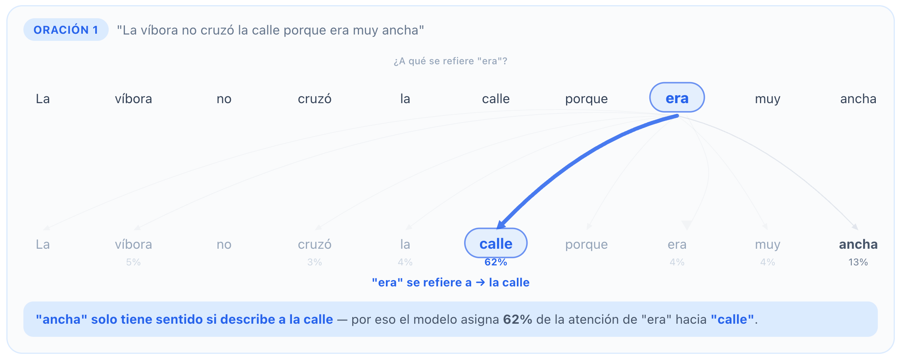

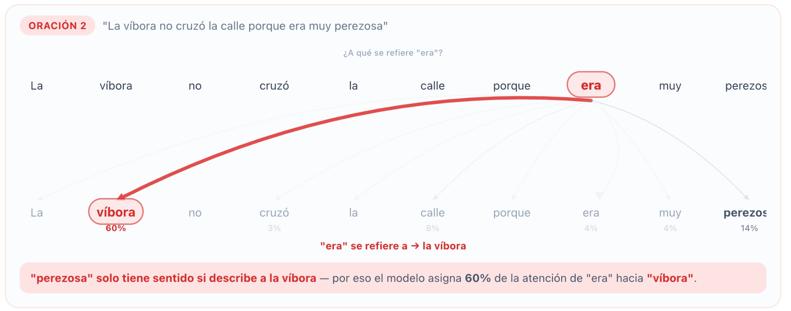

Las mismas 8 palabras iniciales son idénticas en ambas oraciones. Solo cambia la última palabra (”ancha” vs “perezosa”), y eso es suficiente para que el modelo redistribuya completamente sus conexiones de atención y entienda a qué se refiere “era”

La arquitectura Transformer utiliza auto-atención (self-attention) relacionando cada palabra en la secuencia de entrada con cada otra palabra.

Por ejemplo, consideremos estas dos frases:

- The cat drank the milk because **it** was hungry.
- The cat drank the milk because **it** was sweet.

En la primera frase, la palabra ‘it’ se refiere a ‘cat’, mientras que en la segunda se refiere a ‘milk’. Cuando el modelo procesa la palabra ‘it’, la auto-atención proporciona al modelo más información sobre su significado para que pueda asociar ‘it’ con la palabra correcta.

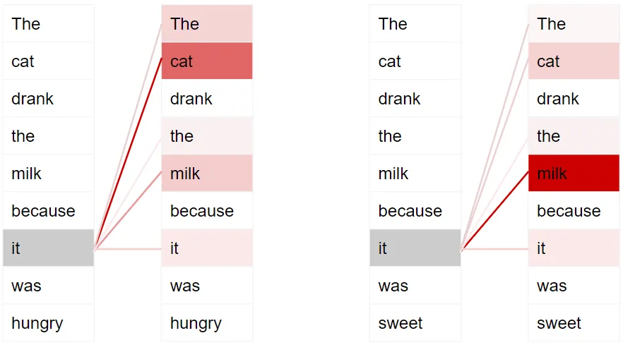

Para permitirle manejar más matices sobre la intención y semántica de la oración, los Transformers incluyen múltiples puntajes (score) de atención para cada palabra. Esto se logra gracias a "Múltiples Cabezas de Atención" (o multi-head attention en inglés). Las múltiples cabezas de atención actúan como diferentes "lentes" o "filtros" que permiten al Transformer ver y capturar diferentes aspectos de los datos simultáneamente.

Por ejemplo, al procesar la palabra "it", el primer puntaje resalta "cat", mientras que el segundo puntaje resalta "hungry". Así que cuando decodifica la palabra "it", por ejemplo, al traducirla a otro idioma, incorporará algún aspecto tanto de "cat" como de "hungry" en la palabra traducida.

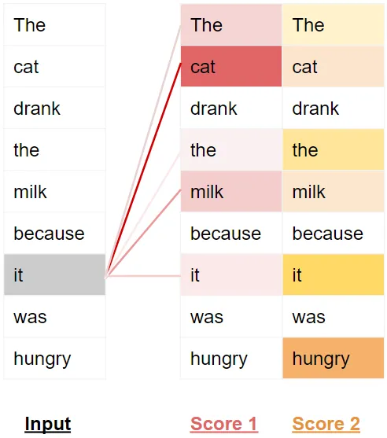

En el siguiente cuaderno Colab, podemos profundizar el concepto de multi-atención:

🔗 [Google Colab](https://colab.research.google.com/drive/17gRrUxBNFAHsh5ZZugDR_9l515PbS1Xp?usp=sharing)

## 4. Familias de modelos de lenguaje

El Transformer presentado en la sección anterior combinaba codificador y decodificador. Esa combinación no es obligatoria: se puede conservar solo el codificador, solo el decodificador o ambos. La diferencia no se reduce al tamaño del modelo; determina qué posiciones puede consultar cada token y qué predicción se usa para aprender a partir de texto. BERT, GPT y T5 son ejemplos representativos de esos tres diseños, respectivamente.

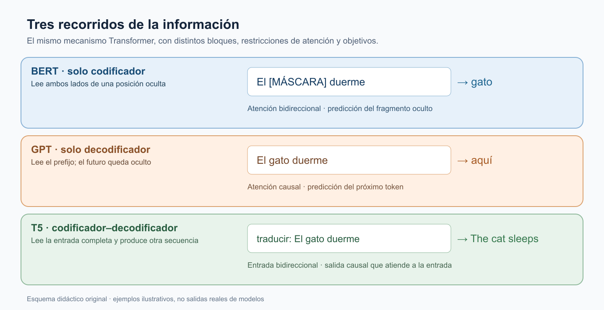

*Figura original: la dirección de la información y el objetivo de preentrenamiento distinguen las tres familias. Ejemplos esquemáticos, no predicciones medidas.*

La figura sigue un mismo recorrido: qué texto entra, qué información queda disponible y qué se predice. «Token» designa cada unidad producida por la tokenización descrita antes; las palabras del esquema simplifican esa representación, pues un token real también puede ser una subpalabra.

### Solo codificador: BERT y el contexto completo

Un codificador Transformer procesa simultáneamente los tokens de la entrada. En su autoatención bidireccional, cada posición puede consultar tokens anteriores y posteriores. BERT (Devlin et al., 2019) aprende, entre otros objetivos de preentrenamiento, mediante el modelo de lenguaje enmascarado: se ocultan algunas posiciones y se predicen a partir del contexto restante. En «El \[MÁSCARA\] duerme», tanto «El» como «duerme» ayudan a representar el espacio oculto. No se trata de generar de izquierda a derecha una respuesta extensa, sino de construir representaciones de la entrada útiles, por ejemplo, para clasificación o extracción de respuestas.

### Solo decodificador: GPT y la continuación

Un decodificador sin codificador de entrada usa atención causal: en cada posición puede mirar el prefijo disponible, pero no los tokens futuros. GPT (Radford et al., 2018; Radford et al., 2019) se preentrena prediciendo el siguiente token; al generar, añade uno, incorpora ese token al prefijo y repite. En «El gato duerme → aquí», «aquí» es solo una continuación ilustrativa: el modelo selecciona entre alternativas según sus probabilidades. Esta restricción causal lo hace adecuado para generar texto, aunque los modelos de esta familia también pueden resolver otras tareas formuladas como texto de entrada y continuación.

### Codificador–decodificador: T5 y la transformación de texto

Esta familia combina las dos rutas: el codificador lee la entrada completa y el decodificador genera la salida paso a paso, consultando tanto los tokens ya generados como las representaciones de la entrada mediante atención cruzada. T5 (Raffel et al., 2020) formula las tareas como texto de entrada → texto de salida: «traducir: El gato duerme» puede producir «The cat sleeps». En su preentrenamiento se reemplazan tramos de texto por marcadores y el modelo aprende a reconstruir los tramos faltantes; no debe confundirse ese objetivo con el enmascaramiento de tokens individuales de BERT.

La tabla resume los tres casos. «Uso típico» no significa uso exclusivo: una arquitectura puede adaptarse a otras tareas. La distinción principal es el flujo de información durante el preentrenamiento y la forma en que se obtiene una salida.

| Familia | Ejemplo | Preentrenamiento | Uso típico |
|---|---|---|---|
| Solo codificador | BERT | Modelo de lenguaje enmascarado: predecir tokens ocultos con contexto a ambos lados | Clasificación, extracción, representaciones contextuales |
| Solo decodificador | GPT | Modelo autorregresivo: predecir el token siguiente | Generación |
| Codificador-decodificador | T5 | Texto a texto: reconstruir tramos ocultos de la entrada | Traducción, resumen |

### Modelos con pasos intermedios de razonamiento

Algunos modelos generativos producen texto intermedio antes de entregar una respuesta final. Ese texto consiste en tokens adicionales generados durante la inferencia: no es un cuarto bloque de la arquitectura ni debe confundirse con la ventana de contexto, que limita cuántos tokens pueden estar disponibles en una interacción. OpenAI (2024) describe para o1 una mejora en determinadas tareas al dedicar más cómputo a esos pasos intermedios. «Modelo de razonamiento» nombra aquí una forma de entrenamiento y de uso de un modelo generativo; no reemplaza la clasificación por codificador, decodificador o combinación de ambos. La implementación interna de un sistema comercial no siempre es pública, por lo que no corresponde inferir su arquitectura completa a partir de su interfaz.

### Ajuste fino: especializar un modelo preentrenado

El preentrenamiento enseña una tarea general, como reconstruir partes ocultas o anticipar el siguiente token. El ajuste fino (fine-tuning) continúa el entrenamiento con ejemplos de una tarea concreta y actualiza parámetros del modelo. BERT puede incorporar una capa de salida para clasificar textos; T5 puede entrenarse con pares de entrada y respuesta. En cambio, escribir una instrucción para un modelo ya entrenado condiciona la respuesta, pero por sí solo no modifica sus parámetros. Por ello, arquitectura, objetivo de preentrenamiento y método de adaptación son decisiones relacionadas, no sinónimos.

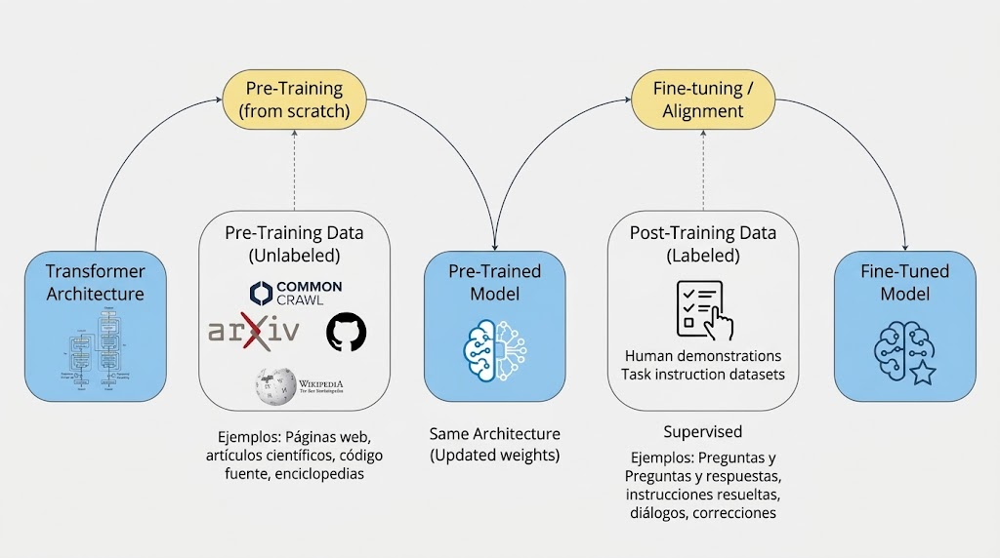

*Figura recuperada: arquitectura → preentrenamiento con texto → modelo preentrenado → ajuste fino con ejemplos → modelo especializado. La consigna escrita durante el uso no modifica los parámetros.*

Referencias primarias

- [Vaswani et al. (2017), Attention Is All You Need — arquitectura Transformer.](https://arxiv.org/abs/1706.03762)
- [Devlin et al. (2019), BERT: Pre-training of Deep Bidirectional Transformers for Language Understanding.](https://arxiv.org/abs/1810.04805)
- [Radford et al. (2018), Improving Language Understanding by Generative Pre-Training.](https://cdn.openai.com/research-covers/language-unsupervised/language_understanding_paper.pdf)
- [Radford et al. (2019), Language Models are Unsupervised Multitask Learners.](https://cdn.openai.com/better-language-models/language_models_are_unsupervised_multitask_learners.pdf)
- [Raffel et al. (2020), Exploring the Limits of Transfer Learning with a Unified Text-to-Text Transformer, JMLR.](https://jmlr.org/papers/v21/20-074.html)
- [OpenAI (2024), Learning to reason with LLMs — comportamiento de o1 y cómputo durante la inferencia.](https://openai.com/index/learning-to-reason-with-llms/)
